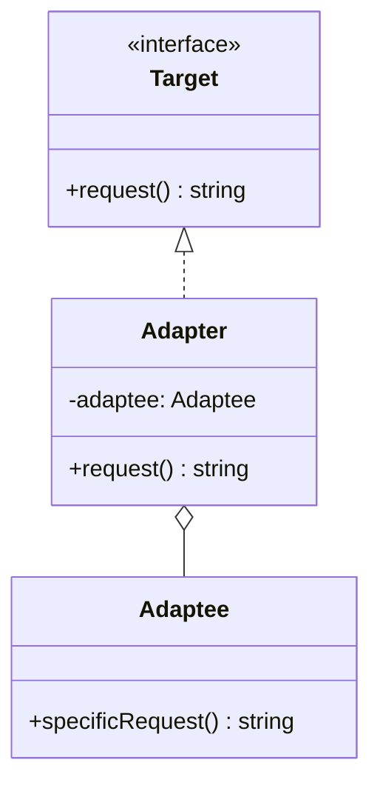

<Hero title="Adapter Pattern" subtitle="Convert one interface to another—make incompatible objects work together seamlessly" imageAlt="Adapter pattern illustration" size="large" />

## TL;DR

Adapter converts an incompatible interface into one your code expects. It's the electrical outlet adapter of design patterns—plug in a legacy system, third-party library, or mismatched API without rewriting everything. Use Adapter when you need to integrate incompatible code without modifying either the existing code or the external dependency.

## Learning Objectives

- You will be able to identify situations where Adapter solves integration problems.
- You will be able to implement both class-based and object composition adapters.
- You will be able to decide between Adapter and modifying the original interface.
- You will be able to recognize when Adapter masks a deeper architectural mismatch.

## Motivating Scenario

Your backend uses a `Logger` interface with methods like `log(level, message)`. You need to integrate a third-party library that provides `PrintWriter` with completely different methods (`write(text)`, `flush()`). Rather than modifying the third-party code (impossible) or rewriting your logger (wasteful), you create an Adapter that wraps `PrintWriter` and presents it as your `Logger` interface.

## Core Concepts

**Adapter** converts an incompatible interface into one your code expects. It acts as a bridge between two incompatible interfaces.

Key elements:
- **Target Interface**: the interface your code expects
- **Adaptee**: the existing object with an incompatible interface
- **Adapter**: wraps the Adaptee and implements the Target interface

Two implementation approaches:
- **Class Adapter** (inheritance): inherits from both the Adaptee and implements the Target
- **Object Adapter** (composition): wraps the Adaptee and delegates calls to it

<Figure caption="Adapter structure (Object Composition approach)">

</Figure>

## Practical Example

<Tabs>
<TabItem value="python" label="Python" default>

```python
# Existing interface your code expects
class PaymentProcessor:
    def process(self, amount: float) -> str:
        raise NotImplementedError

# Third-party library with incompatible interface
class LegacyPaymentGateway:
    def charge(self, cents: int, card_token: str) -> dict:
        """Charges amount in cents, returns response dict"""
        return {"status": "success", "transaction_id": "tx_123"}

# Adapter bridges the gap
class LegacyPaymentAdapter(PaymentProcessor):
    def __init__(self, gateway: LegacyPaymentGateway, card_token: str):
        self.gateway = gateway
        self.card_token = card_token

    def process(self, amount: float) -> str:
        """Convert modern interface to legacy interface"""
        cents = int(amount * 100)
        response = self.gateway.charge(cents, self.card_token)
        return f"Transaction {response['transaction_id']}: {response['status']}"

# Usage: code works with modern interface
gateway = LegacyPaymentGateway()
processor = LegacyPaymentAdapter(gateway, "tok_abc123")
result = processor.process(29.99)  # Works seamlessly
print(result)  # "Transaction tx_123: success"
```

</TabItem>
<TabItem value="go" label="Go">

```go
package main

import "fmt"

// Target interface: what your code expects
type PaymentProcessor interface {
    Process(amount float64) string
}

// Adaptee: incompatible third-party interface
type LegacyPaymentGateway struct {
    Name string
}

func (g *LegacyPaymentGateway) Charge(cents int, cardToken string) map[string]string {
    return map[string]string{
        "status":          "success",
        "transaction_id":  "tx_456",
    }
}

// Adapter: implements PaymentProcessor but wraps LegacyPaymentGateway
type LegacyPaymentAdapter struct {
    gateway   *LegacyPaymentGateway
    cardToken string
}

func NewLegacyPaymentAdapter(gateway *LegacyPaymentGateway, token string) *LegacyPaymentAdapter {
    return &LegacyPaymentAdapter{gateway: gateway, cardToken: token}
}

func (a *LegacyPaymentAdapter) Process(amount float64) string {
    cents := int(amount * 100)
    response := a.gateway.Charge(cents, a.cardToken)
    return fmt.Sprintf("Transaction %s: %s", response["transaction_id"], response["status"])
}

func main() {
    gateway := &LegacyPaymentGateway{Name: "Old Gateway"}
    processor := NewLegacyPaymentAdapter(gateway, "tok_xyz789")
    result := processor.Process(49.99)
    fmt.Println(result)  // "Transaction tx_456: success"
}
```

</TabItem>
<TabItem value="nodejs" label="Node.js">

```javascript
// Target interface: what your code expects
class PaymentProcessor {
    process(amount) {
        throw new Error("Not implemented");
    }
}

// Adaptee: third-party with incompatible interface
class LegacyPaymentGateway {
    charge(cents, cardToken) {
        // Incompatible: takes cents not dollars, different method name
        return {
            status: "success",
            transaction_id: "tx_789"
        };
    }
}

// Adapter: implements PaymentProcessor, wraps LegacyPaymentGateway
class LegacyPaymentAdapter extends PaymentProcessor {
    constructor(gateway, cardToken) {
        super();
        this.gateway = gateway;
        this.cardToken = cardToken;
    }

    process(amount) {
        // Convert modern interface to legacy interface
        const cents = Math.round(amount * 100);
        const response = this.gateway.charge(cents, this.cardToken);
        return `Transaction ${response.transaction_id}: ${response.status}`;
    }
}

// Usage: seamless integration
const gateway = new LegacyPaymentGateway();
const processor = new LegacyPaymentAdapter(gateway, "tok_abc123");
const result = processor.process(59.99);
console.log(result);  // "Transaction tx_789: success"
```

</TabItem>
</Tabs>

## When to Use / When NOT to Use

<Vs highlight={[1]} items={[
{
    label: "Use Adapter when:",
    points: [
      "Integrating third-party libraries with incompatible interfaces",
      "Working with legacy code that cannot be modified",
      "Connecting new code to external APIs with different contracts",
      "Multiple incompatible components need to work together",
      "You want to isolate clients from interface changes"
    ],
    highlightTone: "positive"
  },
{
    label: "Don't use Adapter when:",
    points: [
      "The interface mismatch is fundamental—redesign instead",
      "You control both sides of the interface (refactor instead)",
      "Adding an Adapter introduces unnecessary complexity",
      "The Adapter becomes thicker than the Adaptee itself",
      "You're avoiding fixing a real architectural problem"
    ],
    highlightTone: "positive"
  }
]} />

## Detailed Patterns and Anti-Patterns

### Pattern: Use Composition Over Inheritance

Composition is more flexible:

```python
# BAD: Class Adapter (multiple inheritance)
class LegacyPaymentAdapter(PaymentProcessor, LegacyPaymentGateway):
    def process(self, amount):
        # Multiple inheritance is fragile
        pass

# GOOD: Object Adapter (composition)
class LegacyPaymentAdapter(PaymentProcessor):
    def __init__(self, gateway):
        self.gateway = gateway  # Wrap, don't inherit

    def process(self, amount):
        return self.gateway.charge(int(amount * 100))
```

Composition benefits:
- Flexibility: can swap adaptee at runtime
- Clarity: adapter's role is explicit
- Avoids multiple inheritance issues

### Pattern: Hide Adapter Behind a Factory

Clients shouldn't know about adapters:

```python
# BAD: Client knows about adapter
class PaymentFactory:
    def create(self, gateway_type):
        if gateway_type == "legacy":
            return LegacyPaymentAdapter(LegacyGateway())
        elif gateway_type == "modern":
            return ModernPaymentProcessor()

# GOOD: Factory hides adapter
class PaymentProcessor:
    @staticmethod
    def create(gateway_type):
        if gateway_type == "legacy":
            legacy_gateway = LegacyPaymentGateway()
            # Client doesn't know adapter exists
            return LegacyPaymentAdapter(legacy_gateway)
        elif gateway_type == "modern":
            return ModernPaymentProcessor()

# Client code:
processor = PaymentProcessor.create("legacy")
processor.process(99.99)  # Doesn't know it's an adapter
```

### Pitfall: Adapter Becomes Too Thick

If adapter does heavy translation or transformation, it's masking a deeper mismatch:

```python
# BAD: Adapter doing heavy lifting
class ThickAdapter:
    def __init__(self, old_system):
        self.old_system = old_system

    def modern_method(self):
        # Heavy transformation
        result = self.old_system.get_data()
        data = parse(result)
        data = transform(data)
        data = validate(data)
        data = enrich(data)
        return data

# BETTER: If translation is this complex, maybe you need:
# 1. A different abstraction
# 2. A step-by-step migration instead of an adapter
# 3. To revisit the architectural mismatch
```

### Anti-Pattern: Adapter as a Permanent Crutch

Adapters solve integration problems, not design problems. If you're still using an adapter 3 years later, something is wrong.

```python
# BAD: Legacy system wrapped in adapter for years
class LegacyDatabaseAdapter:
    """Wraps the legacy DB from 2008"""
    def __init__(self):
        self.db = LegacyDatabase()

    def query(self, sql):
        return self.db.execute_legacy_sql(sql)

# Better: Plan to migrate off legacy system, set timeline
```

### Pattern: Versioned Adapters

As systems evolve, create new adapters rather than modifying old ones:

```python
class PaymentAdapterV1:
    """Wraps legacy gateway from 2020"""
    pass

class PaymentAdapterV2:
    """Wraps improved gateway from 2023"""
    pass

# Both can coexist during migration
```

<Showcase title="Patterns and Pitfalls" sections={[
  {
    label: "Pattern: Use composition over inheritance (Object Adapter)",
    body: "Composition is more flexible and avoids multiple inheritance problems. Wrap adaptee and delegate calls.",
    tone: "positive"
  },
  {
    label: "Pitfall: Adapter becomes too thick",
    body: "If Adapter implements many methods or does heavy translation, it might be masking a deeper mismatch. Consider whether you need the adapter at all.",
    tone: "warning"
  },
  {
    label: "Pattern: Hide Adapter behind a factory",
    body: "Clients should not know about the Adapter; construction should be transparent. Use a factory to create adapters.",
    tone: "positive"
  },
  {
    label: "Pitfall: Permanent adapters",
    body: "Adapters are for temporary integration. If you're using one 3 years later, plan a real migration instead of accepting the adapter as permanent.",
    tone: "warning"
  },
  {
    label: "Pattern: Adapt in layers",
    body: "Complex interfaces may need multiple adapters. One adapter handles interface conversion; another handles behavior. Easier to understand.",
    tone: "positive"
  }
]} />

## Design Review Checklist

<Checklist items={[
  "The Adaptee interface is truly incompatible, not just different",
  "You cannot modify the Adaptee (e.g., it's from a third party)",
  "The Adapter uses composition rather than brittle multiple inheritance",
  "The Adapter logic is straightforward and not a 'thick' translation layer",
  "Clients work with the Target interface, not the Adapter directly",
  "The Adapter is transparent to clients (hidden behind a factory if needed)",
  "Tests cover both the adaptation logic and integration with the Adaptee",
  "Performance impact of the Adapter is acceptable"
]} />

## Self-Check

1. **Identify**: Find a place in your code where you're using `if-else` chains or `try-catch` to handle API differences.
2. **Extract**: Create an Adapter to encapsulate that logic cleanly.
3. **Refactor**: Update calling code to use the Target interface and remove the conditional logic.

:::info
**One Takeaway**: Adapter solves integration problems by converting incompatible interfaces without modifying existing code. Use composition over inheritance, keep the Adapter thin, and hide it behind a factory so clients don't know they're using an Adapter. If the Adapter becomes too thick, you may have a deeper architectural mismatch to address.

:::

## Next Steps

- Learn **Facade** for simplifying complex subsystems (often uses Adapters).
- Study **Bridge** for decoupling abstraction from implementation.
- Explore **Decorator** for adding responsibilities to objects dynamically.

## Advanced Adapter Patterns

### Pattern: Facade vs Adapter

**Facade** simplifies a complex subsystem. **Adapter** integrates incompatible interfaces.

```python
# Facade: simplify complexity
class ShoppingFacade:
    def __init__(self, payment, shipping, inventory):
        self.payment = payment
        self.shipping = shipping
        self.inventory = inventory

    def checkout(self, cart):
        # Simplifies complex interaction
        self.inventory.reserve(cart.items)
        self.payment.process(cart.total)
        self.shipping.arrange(cart.address)
        return "Order placed"

# Adapter: integrate incompatibility
class LegacyPaymentAdapter(PaymentInterface):
    def __init__(self, legacy_gateway):
        self.legacy = legacy_gateway

    def charge(self, amount):
        # Converts to legacy API
        return self.legacy.sendChargeRequest(amount * 100)
```

Facade has many objects; Adapter wraps one incompatible object.

### Pattern: Two-Way Adapter

Sometimes you need to adapt in both directions:

```python
class PaymentAdapterBidirectional:
    """Allows modern code to call legacy, and legacy to call modern"""

    def __init__(self, legacy_gateway, modern_interface):
        self.legacy = legacy_gateway
        self.modern = modern_interface

    # Modern → Legacy
    def process_modern(self, amount: float) -> str:
        cents = int(amount * 100)
        return self.legacy.charge(cents)

    # Legacy → Modern
    def process_legacy(self, cents: int) -> dict:
        amount = cents / 100.0
        return {
            "status": "success",
            "amount": amount,
            "transaction_id": self.modern.process(amount)
        }
```

### Pattern: Adapter Registry

For multiple adapters, use a registry:

```python
class AdapterRegistry:
    def __init__(self):
        self._adapters = {}

    def register(self, source_type: str, target_type: str, adapter):
        key = (source_type, target_type)
        self._adapters[key] = adapter

    def adapt(self, obj, target_type: str):
        source_type = type(obj).__name__
        key = (source_type, target_type)
        if key in self._adapters:
            return self._adapters[key](obj)
        raise ValueError(f"No adapter found for {source_type} → {target_type}")

# Usage
registry = AdapterRegistry()
registry.register("LegacyPaymentGateway", "PaymentProcessor", LegacyPaymentAdapter)

gateway = LegacyPaymentGateway()
processor = registry.adapt(gateway, "PaymentProcessor")
```

### Real-World Example: Database Driver Adapters

Different databases have incompatible APIs. Adapters unify them:

```python
# Different databases, different interfaces
class MySQLConnector:
    def connect(self, host, port):
        pass

class PostgreSQLConnector:
    def open_connection(self, host, port):
        pass

class MongoDBConnector:
    def establish_link(self, host, port):
        pass

# Unified interface
class DatabaseConnection:
    def connect(self, config):
        raise NotImplementedError

# Adapters
class MySQLAdapter(DatabaseConnection):
    def __init__(self, connector):
        self.mysql = connector

    def connect(self, config):
        return self.mysql.connect(config['host'], config['port'])

class PostgreSQLAdapter(DatabaseConnection):
    def __init__(self, connector):
        self.postgres = connector

    def connect(self, config):
        return self.postgres.open_connection(config['host'], config['port'])

class MongoDBAdapter(DatabaseConnection):
    def __init__(self, connector):
        self.mongo = connector

    def connect(self, config):
        return self.mongo.establish_link(config['host'], config['port'])

# Client code uses single interface
def connect_to_database(db_type, config):
    if db_type == 'mysql':
        adapter = MySQLAdapter(MySQLConnector())
    elif db_type == 'postgres':
        adapter = PostgreSQLAdapter(PostgreSQLConnector())
    elif db_type == 'mongodb':
        adapter = MongoDBAdapter(MongoDBConnector())

    return adapter.connect(config)
```

## References

- Gang of Four: *Design Patterns* (Adapter)
- *Head First Design Patterns* (Adapter chapter)
- Martin Fowler: *Refactoring* (Introduce Adapter)
- *Refactoring to Patterns* by Joshua Kerievsky (Adapter patterns)