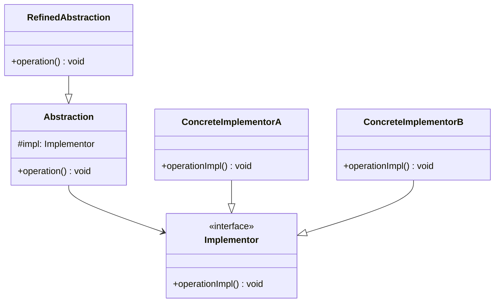

<Hero title="Bridge Pattern" subtitle="Decouple abstraction from implementation—vary them independently without explosion of subclasses" imageAlt="Bridge pattern illustration" size="large" />

## TL;DR

Bridge decouples abstraction from implementation so they can vary independently. Instead of creating a subclass for every combination of abstraction and implementation (Shape-Circle-Windows, Shape-Circle-Linux, etc.), Bridge separates the hierarchy: one for Shape and another for Renderer. Each Shape holds a Renderer, avoiding exponential class explosion and enabling runtime implementation switching.

## Learning Objectives

- You will be able to identify when Bridge prevents class explosion.
- You will be able to distinguish Bridge from Adapter and Decorator.
- You will be able to implement Bridge using composition and delegation.
- You will be able to design systems where abstraction and implementation vary independently.

## Motivating Scenario

You're building a graphics library. You start with `Shape` (Circle, Rectangle) and support two rendering engines (Windows, Linux). Initially: `CircleWindows`, `CircleLinux`, `RectangleWindows`, `RectangleLinux` (4 classes). Add macOS and you have 6. Add a third shape and you have 9. The combination explodes. Bridge separates `Shape` hierarchy from `Renderer` hierarchy, eliminating the explosion.

## Core Concepts

**Bridge** decouples an abstraction from its implementation by using composition instead of inheritance. Two dimensions of variation become two separate hierarchies.

Key elements:
- **Abstraction**: high-level interface (e.g., Shape)
- **RefinedAbstraction**: concrete abstractions (e.g., Circle, Rectangle)
- **Implementor**: interface for implementation (e.g., Renderer)
- **ConcreteImplementor**: concrete implementations (e.g., WindowsRenderer, LinuxRenderer)

<Figure caption="Bridge structure">

</Figure>

## Practical Example

<Tabs>
<TabItem value="python" label="Python" default>

```python
from abc import ABC, abstractmethod

# Implementor: abstraction for rendering
class Renderer(ABC):
    @abstractmethod
    def render_circle(self, radius: int) -> str:
        pass

    @abstractmethod
    def render_rectangle(self, width: int, height: int) -> str:
        pass

# Concrete Implementors
class WindowsRenderer(Renderer):
    def render_circle(self, radius: int) -> str:
        return f"DrawCircleWin32({radius})"

    def render_rectangle(self, width: int, height: int) -> str:
        return f"DrawRectWin32({width}x{height})"

class LinuxRenderer(Renderer):
    def render_circle(self, radius: int) -> str:
        return f"cairo_arc({radius})"

    def render_rectangle(self, width: int, height: int) -> str:
        return f"cairo_rectangle({width}x{height})"

# Abstraction: Shape hierarchy
class Shape(ABC):
    def __init__(self, renderer: Renderer):
        self.renderer = renderer

    @abstractmethod
    def draw(self) -> str:
        pass

# Refined Abstractions
class Circle(Shape):
    def __init__(self, renderer: Renderer, radius: int):
        super().__init__(renderer)
        self.radius = radius

    def draw(self) -> str:
        return self.renderer.render_circle(self.radius)

class Rectangle(Shape):
    def __init__(self, renderer: Renderer, width: int, height: int):
        super().__init__(renderer)
        self.width = width
        self.height = height

    def draw(self) -> str:
        return self.renderer.render_rectangle(self.width, self.height)

# Usage: No class explosion!
windows_renderer = WindowsRenderer()
linux_renderer = LinuxRenderer()

circle = Circle(windows_renderer, 5)
print(circle.draw())  # "DrawCircleWin32(5)"

rect = Rectangle(linux_renderer, 10, 20)
print(rect.draw())  # "cairo_rectangle(10x20)"

# Can even switch renderers at runtime!
circle.renderer = linux_renderer
print(circle.draw())  # "cairo_arc(5)"
```

</TabItem>
<TabItem value="go" label="Go">

```go
package main

import "fmt"

// Implementor: abstraction for rendering
type Renderer interface {
    RenderCircle(radius int) string
    RenderRectangle(width, height int) string
}

// Concrete Implementors
type WindowsRenderer struct{}

func (w *WindowsRenderer) RenderCircle(radius int) string {
    return fmt.Sprintf("DrawCircleWin32(%d)", radius)
}

func (w *WindowsRenderer) RenderRectangle(width, height int) string {
    return fmt.Sprintf("DrawRectWin32(%dx%d)", width, height)
}

type LinuxRenderer struct{}

func (l *LinuxRenderer) RenderCircle(radius int) string {
    return fmt.Sprintf("cairo_arc(%d)", radius)
}

func (l *LinuxRenderer) RenderRectangle(width, height int) string {
    return fmt.Sprintf("cairo_rectangle(%dx%d)", width, height)
}

// Abstraction: Shape
type Shape interface {
    Draw() string
}

// Refined Abstractions
type Circle struct {
    Renderer Renderer
    Radius   int
}

func (c *Circle) Draw() string {
    return c.Renderer.RenderCircle(c.Radius)
}

type Rectangle struct {
    Renderer Renderer
    Width    int
    Height   int
}

func (r *Rectangle) Draw() string {
    return r.Renderer.RenderRectangle(r.Width, r.Height)
}

func main() {
    winRenderer := &WindowsRenderer{}
    linRenderer := &LinuxRenderer{}

    circle := &Circle{Renderer: winRenderer, Radius: 5}
    fmt.Println(circle.Draw())  // "DrawCircleWin32(5)"

    rect := &Rectangle{Renderer: linRenderer, Width: 10, Height: 20}
    fmt.Println(rect.Draw())  // "cairo_rectangle(10x20)"

    // Switch renderers at runtime
    circle.Renderer = linRenderer
    fmt.Println(circle.Draw())  // "cairo_arc(5)"
}
```

</TabItem>
<TabItem value="nodejs" label="Node.js">

```javascript
// Implementor: abstraction for rendering
class Renderer {
    renderCircle(radius) {
        throw new Error("Not implemented");
    }
    renderRectangle(width, height) {
        throw new Error("Not implemented");
    }
}

// Concrete Implementors
class WindowsRenderer extends Renderer {
    renderCircle(radius) {
        return `DrawCircleWin32(${radius})`;
    }
    renderRectangle(width, height) {
        return `DrawRectWin32(${width}x${height})`;
    }
}

class LinuxRenderer extends Renderer {
    renderCircle(radius) {
        return `cairo_arc(${radius})`;
    }
    renderRectangle(width, height) {
        return `cairo_rectangle(${width}x${height})`;
    }
}

// Abstraction: Shape
class Shape {
    constructor(renderer) {
        this.renderer = renderer;
    }
    draw() {
        throw new Error("Not implemented");
    }
}

// Refined Abstractions
class Circle extends Shape {
    constructor(renderer, radius) {
        super(renderer);
        this.radius = radius;
    }
    draw() {
        return this.renderer.renderCircle(this.radius);
    }
}

class Rectangle extends Shape {
    constructor(renderer, width, height) {
        super(renderer);
        this.width = width;
        this.height = height;
    }
    draw() {
        return this.renderer.renderRectangle(this.width, this.height);
    }
}

// Usage: No class explosion!
const winRenderer = new WindowsRenderer();
const linRenderer = new LinuxRenderer();

const circle = new Circle(winRenderer, 5);
console.log(circle.draw());  // "DrawCircleWin32(5)"

const rect = new Rectangle(linRenderer, 10, 20);
console.log(rect.draw());  // "cairo_rectangle(10x20)"

// Switch renderers at runtime
circle.renderer = linRenderer;
console.log(circle.draw());  // "cairo_arc(5)"
```

</TabItem>
</Tabs>

## When to Use / When NOT to Use

<Vs highlight={[1]} items={[
{
    label: "Use Bridge when:",
    points: [
      "You have two dimensions of variation (abstraction and implementation)",
      "You want to avoid class explosion from inheritance combinations",
      "Implementation details should be independent of the abstraction",
      "You need to switch implementations at runtime",
      "Abstraction and implementation should be developed independently"
    ],
    highlightTone: "positive"
  },
{
    label: "Don't use Bridge when:",
    points: [
      "You only have one dimension of variation (use inheritance)",
      "Bridge adds unnecessary complexity to a simple problem",
      "Your abstraction and implementation are tightly coupled by nature",
      "The implementation will never change or be switched",
      "A simpler pattern (Adapter, Decorator) solves the problem"
    ],
    highlightTone: "positive"
  }
]} />

## Patterns and Pitfalls

<Showcase title="Patterns and Pitfalls" sections={[
  {
    label: "Pitfall: Creating too many implementation classes",
    body: "Don't create an implementation for every shape-renderer combination."
  },
  {
    label: "Pattern: Bridge enables runtime switching",
    body: "Change implementations without changing the abstraction."
  },
  {
    label: "Pattern: Combine Bridge with Factory for clean construction",
    body: "Use Factory to hide Bridge complexity from clients."
  ,
    body: "Use Factory to hide Bridge complexity from clients.",
    tone: "warning"
  }
]} />

## Design Review Checklist

<Checklist items={[
  "You have identified two separate dimensions of variation",
  "The abstraction and implementation hierarchies are truly independent",
  "Creating a Bridge doesn't add unnecessary complexity",
  "Abstraction depends on Implementor, not on concrete implementations",
  "Concrete implementations don't bleed into the abstraction",
  "Tests cover varying both abstraction and implementation independently",
  "Runtime switching of implementations is tested if needed",
  "Documentation clearly explains what varies independently"
]} />

## Self-Check

1. **Analyze**: Find a class hierarchy where subclasses vary in multiple dimensions (e.g., shape and rendering).
2. **Design**: Separate the hierarchies into Abstraction and Implementor.
3. **Implement**: Verify you eliminated the combinatorial explosion of subclasses.

:::info
**One Takeaway**: Bridge prevents class explosion by separating two dimensions of variation—abstraction and implementation—into independent hierarchies. Use composition where each abstraction holds an implementor, allowing independent evolution and runtime switching. Apply Bridge only when you genuinely have two independent axes of change.

:::

## Next Steps

- Learn **Composite** for building tree structures of objects.
- Study **Decorator** for adding responsibilities dynamically.
- Explore **Strategy** pattern (similar structure, different intent).

## Bridge vs. Other Patterns

**Bridge vs. Adapter:**
- **Adapter:** Makes incompatible interfaces work together (fixes past design)
- **Bridge:** Separates abstraction from implementation (prevents future explosion)

**Bridge vs. Decorator:**
- **Decorator:** Adds responsibilities dynamically
- **Bridge:** Separates dimensions of variation

**Bridge vs. Strategy:**
- **Strategy:** Encapsulates algorithms and makes them interchangeable
- **Bridge:** Encapsulates implementation and makes abstractions independent

## Bridge Pattern vs. Code Explosion

### Without Bridge (Class Explosion)

You need shapes (Circle, Rectangle) and renderers (Windows, Linux, Mac).

Without Bridge, you need 6 classes:

```
CircleWindows
CircleLinux
CircleMac
RectangleWindows
RectangleLinux
RectangleMac
```

Add a Triangle shape? 9 classes.
Add a Web renderer? 12 classes.

The number of classes grows as Shape × Renderer. This is **class explosion**.

### With Bridge (Linear Growth)

```
Shapes:       Circle, Rectangle, Triangle (3 classes)
Renderers:    Windows, Linux, Mac, Web (4 classes)
Total:        3 + 4 = 7 classes

Without Bridge would need: 3 × 4 = 12 classes
Bridge saves:             12 - 7 = 5 classes
```

As you add more shapes and renderers, the savings grow exponentially.

## Real-World Examples

### Example: Database Drivers

```python
# Abstraction: Database interface
class Database(ABC):
    def __init__(self, driver):
        self.driver = driver

    def execute(self, query):
        return self.driver.execute(query)

# Refined Abstractions
class MySQLDatabase(Database):
    def execute(self, query):
        self.driver.validate_mysql_syntax(query)
        return self.driver.execute(query)

class PostgreSQLDatabase(Database):
    def execute(self, query):
        self.driver.validate_postgresql_syntax(query)
        return self.driver.execute(query)

# Implementors (drivers)
class MySQLDriver:
    def execute(self, query):
        # MySQL-specific execution
        pass

class PostgreSQLDriver:
    def execute(self, query):
        # PostgreSQL-specific execution
        pass

# Client code
db = MySQLDatabase(MySQLDriver())
results = db.execute("SELECT * FROM users")

# Switch databases without changing application code
db = PostgreSQLDatabase(PostgreSQLDriver())
results = db.execute("SELECT * FROM users")
```

### Example: Logging Levels with Formatters

```python
# Implementor: Formatters define HOW to format
class LogFormatter(ABC):
    @abstractmethod
    def format(self, level, message, context):
        pass

class JSONFormatter(LogFormatter):
    def format(self, level, message, context):
        return json.dumps({
            'timestamp': datetime.utcnow().isoformat(),
            'level': level,
            'message': message,
            **context  # Include request_id, user_id, etc.
        })

class PlainTextFormatter(LogFormatter):
    def format(self, level, message, context):
        ctx_str = ' '.join(f"{k}={v}" for k, v in context.items())
        return f"[{datetime.utcnow()}] {level}: {message} {ctx_str}"

class StructuredFormatter(LogFormatter):
    """Datadog-compatible structured logs"""
    def format(self, level, message, context):
        return f"{level} {message} {context}"

# Abstraction: Logger defines WHAT to log at different levels
class Logger(ABC):
    def __init__(self, formatter, destinations):
        self.formatter = formatter
        self.destinations = destinations  # Where to send logs

    def log(self, level, message, **context):
        formatted = self.formatter.format(level, message, context)
        for destination in self.destinations:
            destination.write(formatted)

    @abstractmethod
    def error(self, message, **context):
        pass

    @abstractmethod
    def warning(self, message, **context):
        pass

    @abstractmethod
    def info(self, message, **context):
        pass

# Refined Abstractions: Different log levels
class ApplicationLogger(Logger):
    def error(self, message, **context):
        self.log('ERROR', message, **context)
        self._alert_on_call()  # Page on-call engineer

    def warning(self, message, **context):
        self.log('WARNING', message, **context)

    def info(self, message, **context):
        self.log('INFO', message, **context)

class AuditLogger(Logger):
    """For security and compliance auditing"""
    def error(self, message, **context):
        context['audit'] = 'security_event'
        self.log('ERROR', message, **context)

    def warning(self, message, **context):
        context['audit'] = 'anomaly'
        self.log('WARNING', message, **context)

    def info(self, message, **context):
        context['audit'] = 'activity'
        self.log('INFO', message, **context)

# Destinations (where logs go)
class FileDestination:
    def write(self, message):
        with open('app.log', 'a') as f:
            f.write(message + '\n')

class ElasticsearchDestination:
    def write(self, message):
        # Send to Elasticsearch for indexing
        es.index(index='logs', body=json.loads(message))

class StdoutDestination:
    def write(self, message):
        print(message)

# Usage: Bridge connects Abstractions (what to log) with Implementations (how and where)
destinations = [FileDestination(), ElasticsearchDestination(), StdoutDestination()]

app_logger = ApplicationLogger(JSONFormatter(), destinations)
app_logger.error("Payment failed", order_id=123, reason="Card declined")
# Outputs to all destinations in JSON format
# File:          {"timestamp": "...", "level": "ERROR", "message": "Payment failed", "order_id": 123, ...}
# Elasticsearch: Same JSON, indexed and searchable
# Stdout:        Same JSON, visible in console

audit_logger = AuditLogger(StructuredFormatter(), [ElasticsearchDestination()])
audit_logger.warning("Suspicious login attempt", user_id=456, ip="192.168.1.1")
# Only to Elasticsearch with audit context
```

**Key insight:** Without Bridge, you'd need to create:
- ApplicationLogger + JSONFormatter
- ApplicationLogger + PlainTextFormatter
- AuditLogger + JSONFormatter
- AuditLogger + StructuredFormatter
- Error + JSON, Warning + JSON, Info + JSON (explosion!)

With Bridge, you have 2 Abstractions + 3 Formatters = 5 classes instead of 12+.

## Common Pitfalls

**Pitfall 1: Creating Bridge When Hierarchy is Linear**

If you only have one dimension of variation, don't use Bridge.

```python
# BAD: Bridge for a single abstraction
class Shape(ABC):
    def __init__(self, renderer):
        self.renderer = renderer

class Circle(Shape):
    def draw(self):
        self.renderer.render_circle()

# GOOD: Just use inheritance if that's enough
class Shape(ABC):
    @abstractmethod
    def draw(self):
        pass

class Circle(Shape):
    def draw(self):
        # Just draw a circle
        pass
```

**Pitfall 2: Over-Abstraction**

Making the Implementor interface too generic causes complexity.

```python
# BAD: Too generic
class Renderer:
    def render(self, instructions):  # What format?
        pass

# GOOD: Specific methods per abstraction
class Renderer:
    def render_circle(self, radius):
        pass
    def render_rectangle(self, width, height):
        pass
```

## Self-Check

1. **Identify:** Does your codebase have two independent dimensions of variation?
2. **Refactor:** Can you separate one from the other using Bridge?
3. **Verify:** After Bridge, can you add a new variant in each dimension without modifying existing code?

:::info
**One Takeaway**: Bridge prevents class explosion by separating two independent dimensions of variation. Use it only when you genuinely have two axes of change that vary independently. The payoff: clean architecture that scales as you add new abstractions and implementations.

:::

## Next Steps

- Learn **Composite** for building tree structures
- Study **Decorator** for adding responsibilities dynamically
- Explore **Strategy** pattern (similar structure, different intent)
- Review other **Structural Patterns** for larger design decisions

## References

- Gang of Four: *Design Patterns* (Bridge)
- *Head First Design Patterns* (Bridge chapter)
- Robert C. Martin: *Clean Architecture* (Decoupling)
- Refactoring.guru: Bridge Pattern
- Joshua Bloch: *Effective Java* (Item 47: Return optionally present values)