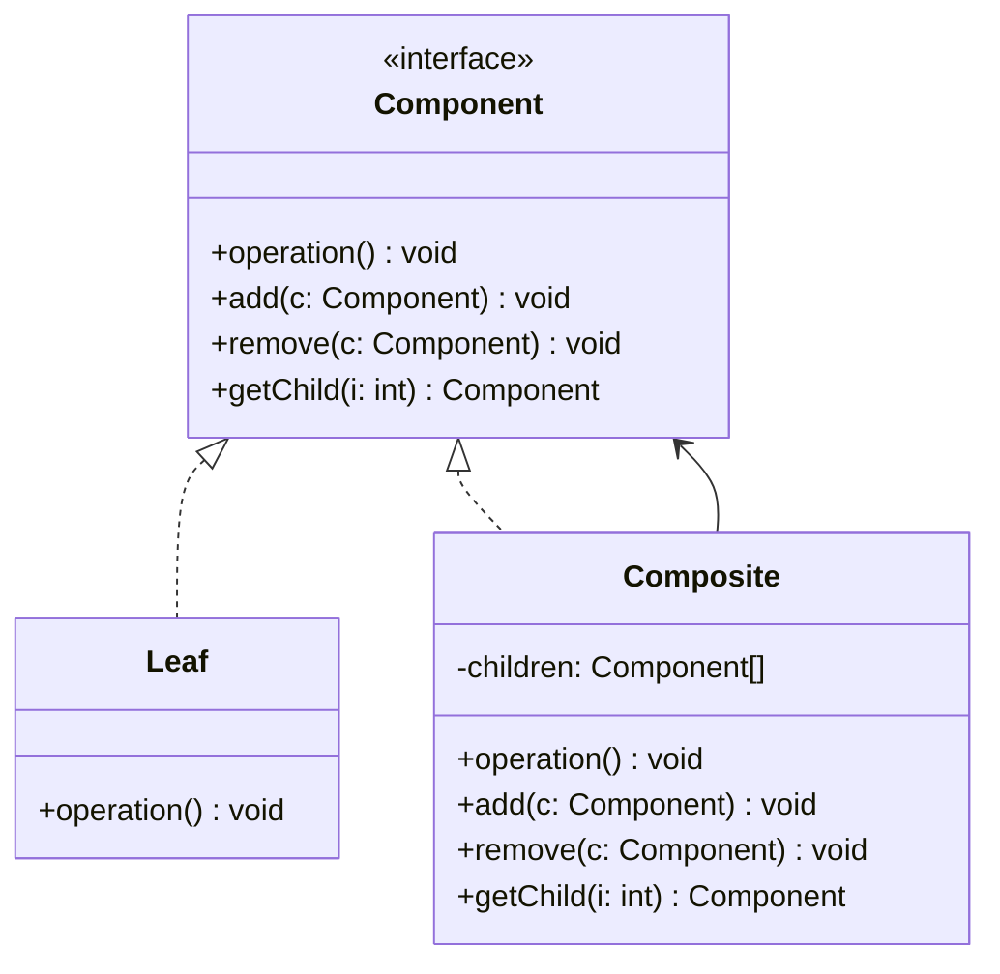

<Hero title="Composite Pattern" subtitle="Compose objects into tree structures—treat individual and composite objects uniformly" imageAlt="Composite pattern illustration" size="large" />

## TL;DR

Composite lets you build tree structures where individual objects (Leaf) and containers (Composite) share a common interface. Write code once to operate on both; clients don't care if they're working with a single file or a folder containing thousands of files. Perfect for UI hierarchies, file systems, or any recursive structure.

## Learning Objectives

- You will be able to design tree structures with uniform interfaces.
- You will be able to implement Composite patterns in recursive scenarios.
- You will be able to decide when a Container is truly Composite vs. just a collection.
- You will be able to handle operations that differ between Leaf and Composite nodes.

## Motivating Scenario

Building a file system UI: you need to display Files and Folders. A Folder can contain both Files and Folders. Without Composite, you'd write one loop for Files and another for Folders with nested conditionals. With Composite, a Folder is also a File-like object; your rendering code works uniformly on both.

## Core Concepts

**Composite** composes objects into tree structures, allowing clients to treat individual and composite objects uniformly. This is the essence of the pattern: both Leaf and Composite respond to the same interface.

Key elements:
- **Component**: common interface for both Leaf and Composite
- **Leaf**: represents an object with no children
- **Composite**: represents an object that can contain children (Leaves or Composites)

<Figure caption="Composite structure">

</Figure>

## Practical Example

<Tabs>
<TabItem value="python" label="Python" default>

```python
from abc import ABC, abstractmethod
from typing import List

# Component: common interface
class FileSystemObject(ABC):
    def __init__(self, name: str):
        self.name = name

    @abstractmethod
    def get_size(self) -> int:
        pass

    @abstractmethod
    def display(self, indent: str = "") -> str:
        pass

# Leaf: represents a file
class File(FileSystemObject):
    def __init__(self, name: str, size: int):
        super().__init__(name)
        self.size = size

    def get_size(self) -> int:
        return self.size

    def display(self, indent: str = "") -> str:
        return f"{indent}{self.name} ({self.size} bytes)"

# Composite: represents a directory
class Directory(FileSystemObject):
    def __init__(self, name: str):
        super().__init__(name)
        self.children: List[FileSystemObject] = []

    def add(self, obj: FileSystemObject) -> None:
        self.children.append(obj)

    def remove(self, obj: FileSystemObject) -> None:
        self.children.remove(obj)

    def get_size(self) -> int:
        # Recursive: sum of all children
        return sum(child.get_size() for child in self.children)

    def display(self, indent: str = "") -> str:
        # Recursive: display all children
        lines = [f"{indent}{self.name}/"]
        for child in self.children:
            lines.append(child.display(indent + "  "))
        return "\n".join(lines)

# Usage: treat files and directories uniformly
root = Directory("root")
root.add(File("readme.txt", 100))
root.add(File("config.json", 50))

docs = Directory("docs")
docs.add(File("guide.md", 200))
docs.add(File("api.md", 300))

root.add(docs)

# Works on both Leaf and Composite!
print(root.display())
print(f"Total size: {root.get_size()} bytes")  # 650
```

</TabItem>
<TabItem value="go" label="Go">

```go
package main

import "fmt"

// Component: common interface
type FileSystemObject interface {
    GetSize() int
    Display(indent string) string
}

// Leaf: represents a file
type File struct {
    Name string
    Size int
}

func (f *File) GetSize() int {
    return f.Size
}

func (f *File) Display(indent string) string {
    return fmt.Sprintf("%s%s (%d bytes)", indent, f.Name, f.Size)
}

// Composite: represents a directory
type Directory struct {
    Name     string
    Children []FileSystemObject
}

func (d *Directory) Add(obj FileSystemObject) {
    d.Children = append(d.Children, obj)
}

func (d *Directory) GetSize() int {
    total := 0
    for _, child := range d.Children {
        total += child.GetSize()
    }
    return total
}

func (d *Directory) Display(indent string) string {
    result := fmt.Sprintf("%s%s/\n", indent, d.Name)
    for _, child := range d.Children {
        result += child.Display(indent+"  ") + "\n"
    }
    return result
}

func main() {
    root := &Directory{Name: "root"}
    root.Add(&File{Name: "readme.txt", Size: 100})
    root.Add(&File{Name: "config.json", Size: 50})

    docs := &Directory{Name: "docs"}
    docs.Add(&File{Name: "guide.md", Size: 200})
    docs.Add(&File{Name: "api.md", Size: 300})
    root.Add(docs)

    fmt.Print(root.Display(""))
    fmt.Printf("Total size: %d bytes\n", root.GetSize())  // 650
}
```

</TabItem>
<TabItem value="nodejs" label="Node.js">

```javascript
// Component: common interface
class FileSystemObject {
    constructor(name) {
        this.name = name;
    }

    getSize() {
        throw new Error("Not implemented");
    }

    display(indent = "") {
        throw new Error("Not implemented");
    }
}

// Leaf: represents a file
class File extends FileSystemObject {
    constructor(name, size) {
        super(name);
        this.size = size;
    }

    getSize() {
        return this.size;
    }

    display(indent = "") {
        return `${indent}${this.name} (${this.size} bytes)`;
    }
}

// Composite: represents a directory
class Directory extends FileSystemObject {
    constructor(name) {
        super(name);
        this.children = [];
    }

    add(obj) {
        this.children.push(obj);
    }

    remove(obj) {
        this.children = this.children.filter(child => child !== obj);
    }

    getSize() {
        return this.children.reduce((sum, child) => sum + child.getSize(), 0);
    }

    display(indent = "") {
        let result = `${indent}${this.name}/\n`;
        for (const child of this.children) {
            result += child.display(indent + "  ") + "\n";
        }
        return result;
    }
}

// Usage: works uniformly on both types
const root = new Directory("root");
root.add(new File("readme.txt", 100));
root.add(new File("config.json", 50));

const docs = new Directory("docs");
docs.add(new File("guide.md", 200));
docs.add(new File("api.md", 300));
root.add(docs);

console.log(root.display());
console.log(`Total size: ${root.getSize()} bytes`);  // 650
```

</TabItem>
</Tabs>

## When to Use / When NOT to Use

<Vs highlight={[1]} items={[
{
    label: "Use Composite when:",
    points: [
      "You have tree or hierarchical structures (files/folders, UI components, org charts)",
      "Clients should treat individual and composite objects uniformly",
      "You want to avoid conditional logic checking node types",
      "Operations should work recursively through the tree",
      "You need to build complex objects by composing simpler ones"
    ],
    highlightTone: "positive"
  },
{
    label: "Don't use Composite when:",
    points: [
      "Your structure is flat (use a simple collection instead)",
      "Leaf and Composite need fundamentally different operations",
      "The overhead of the common interface is not worth the abstraction",
      "Your tree is so deep that recursive operations are problematic",
      "Memory efficiency is critical and many Composites have few children"
    ],
    highlightTone: "positive"
  }
]} />

## Patterns and Pitfalls

<Showcase title="Patterns and Pitfalls" sections={[
  {
    label: "Pitfall: Default implementations in Composite cause issues",
    body: "Some operations (like add/remove) don't make sense on Leaves—be explicit.",
    tone: "positive"
  },
  {
    label: "Pattern: Recursive operations are natural with Composite",
    body: "Operations automatically work through the tree."
  },
  {
    label: "Pattern: Use Iterator for deep traversal",
    body: "For complex trees, consider a separate Iterator pattern.",
    tone: "positive"
  }
]} />

## Design Review Checklist

<Checklist items={[
  "Leaf and Composite share a common Component interface",
  "Clients can treat Leaf and Composite uniformly through the interface",
  "Operations work recursively through the tree structure",
  "Operations that don't apply to Leaves are clearly marked or handled",
  "Child management (add, remove) is only on Composite, not Leaf",
  "Tests cover both shallow trees (few children) and deep/wide trees",
  "Circular reference prevention is handled if needed",
  "Performance of recursive operations is acceptable"
]} />

## Self-Check

1. **Design**: Sketch a tree structure (file system, UI hierarchy, org chart).
2. **Implement**: Create Leaf and Composite classes with a common interface.
3. **Verify**: Write code that operates on both without conditional logic.

:::info
**One Takeaway**: Composite lets you build and operate on tree structures uniformly—code works on individual objects and entire subtrees without knowing the difference. This eliminates conditional type-checking and makes tree operations elegant and recursive. Perfect for hierarchies like file systems, UI components, and organizational structures.

:::

## Next Steps

- Learn **Iterator** for traversing complex trees without recursion.
- Study **Visitor** for operations that vary across node types.
- Explore **Builder** for constructing complex composite objects.

## Real-World Applications

### UI Component Hierarchies (React)

```jsx
// Composite pattern in React component tree

function Panel({ children }) {
  return <div className="panel">{children}</div>;
}

function Button({ label, onClick }) {
  return <button onClick={onClick}>{label}</button>;
}

// Composite: Panel contains Button
<Panel>
  <Button label="Save" onClick={handleSave} />
  <Button label="Cancel" onClick={handleCancel} />
</Panel>

// Complex hierarchy: Panel contains Panels and Buttons
<Panel>
  <h2>Preferences</h2>
  <Panel>
    <h3>Display</h3>
    <Button label="Dark Mode" />
    <Button label="Light Mode" />
  </Panel>
  <Panel>
    <h3>Sound</h3>
    <Button label="Mute" />
    <Button label="Volume Up" />
  </Panel>
</Panel>

// All treated uniformly through component interface
```

### Organizational Hierarchies

```python
class Employee:
    def __init__(self, name, salary):
        self.name = name
        self.salary = salary

class Department:
    def __init__(self, name):
        self.name = name
        self.members = []

    def add_member(self, member):
        self.members.append(member)

    def get_total_salary(self):
        """Recursive: sum all employees including sub-departments."""
        total = 0
        for member in self.members:
            if isinstance(member, Employee):
                total += member.salary
            elif isinstance(member, Department):
                total += member.get_total_salary()  # Recurse
        return total

    def print_hierarchy(self, indent=0):
        """Print organization tree."""
        print("  " * indent + self.name)
        for member in self.members:
            if isinstance(member, Employee):
                print("  " * (indent + 1) + member.name + f" (${member.salary}k)")
            elif isinstance(member, Department):
                member.print_hierarchy(indent + 1)

# Build organization
eng = Department("Engineering")
eng.add_member(Employee("Alice", 100))
eng.add_member(Employee("Bob", 80))

sales = Department("Sales")
sales.add_member(Employee("Carol", 70))

company = Department("Acme Corp")
company.add_member(eng)
company.add_member(sales)

# Query entire organization uniformly
total_cost = company.get_total_salary()  # 250k
company.print_hierarchy()
```

### Menu Systems (Visitor Pattern Integration)

```python
class MenuItem:
    def render(self):
        raise NotImplementedError

class Menu(MenuItem):
    def __init__(self, title):
        self.title = title
        self.items = []

    def add_item(self, item):
        self.items.append(item)

    def render(self):
        """Render menu recursively."""
        lines = [f"[{self.title}]"]
        for item in self.items:
            rendered = item.render()
            # Indent sub-items
            for line in rendered.split("\n"):
                lines.append("  " + line)
        return "\n".join(lines)

class Action(MenuItem):
    def __init__(self, label, handler):
        self.label = label
        self.handler = handler

    def render(self):
        return f"- {self.label}"

# Build menu tree
file_menu = Menu("File")
file_menu.add_item(Action("New", handle_new))
file_menu.add_item(Action("Open", handle_open))

edit_menu = Menu("Edit")
edit_menu.add_item(Action("Cut", handle_cut))
edit_menu.add_item(Action("Copy", handle_copy))
edit_menu.add_item(Action("Paste", handle_paste))

main_menu = Menu("Main")
main_menu.add_item(file_menu)
main_menu.add_item(edit_menu)

# Render entire menu uniformly
print(main_menu.render())
# Output:
# [Main]
#   [File]
#     - New
#     - Open
#   [Edit]
#     - Cut
#     - Copy
#     - Paste
```

## Comparison with Related Patterns

| Pattern | Structure | Use Case |
|---------|-----------|----------|
| Composite | Tree (uniform component interface) | Hierarchies (files, menus, org charts) |
| Decorator | Linear chain | Wrapping objects with behavior |
| Visitor | Tree traversal | Operating on tree elements |
| Iterator | Traversal without structure | Sequential access to elements |

## References

- Gang of Four: *Design Patterns* (Composite)
- *Head First Design Patterns* (Composite chapter)
- Martin Fowler: *Refactoring* (Extract Composite)
- React documentation on components and composition