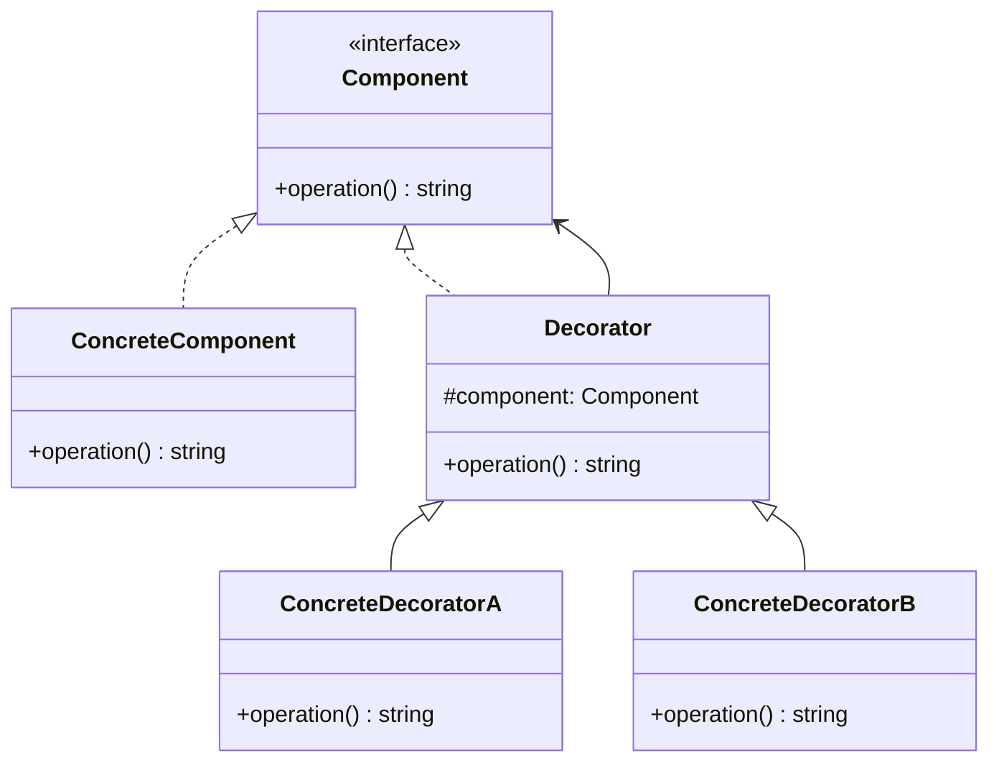

<Hero title="Decorator Pattern" subtitle="Attach responsibilities to objects dynamically—flexible alternative to subclassing" imageAlt="Decorator pattern illustration" size="large" />

## TL;DR

Decorator wraps an object, adding features dynamically without modifying the original or creating explosion of subclasses. Instead of `PlainCoffee`, `CoffeeWithMilk`, `CoffeeWithMilkAndSugar`, `CoffeeWithMilkAndSugarAndVanilla` (4 classes), use Decorator to wrap: `Vanilla(Sugar(Milk(Coffee())))`. Build complex behaviors by stacking Decorators.

## Learning Objectives

- You will be able to recognize situations where Decorator prevents subclass explosion.
- You will be able to implement Decorators that maintain the original interface.
- You will be able to chain Decorators for complex behavior composition.
- You will be able to distinguish Decorator from Adapter, Proxy, and other wrapping patterns.

## Motivating Scenario

A coffee shop has: Espresso, Americano, Cappuccino. Add options: whipped cream, vanilla, caramel, hazelnut. Without Decorator, you'd have 4 × 2^4 = 64 subclasses. With Decorator: one base Coffee class and four option Decorators. Stack them: `Whipped(Vanilla(Caramel(Espresso())))`.

## Core Concepts

**Decorator** wraps a component, adding new responsibilities while maintaining the original interface. Key difference from other wrappers: Decorator is transparent—clients don't know they're using a Decorator.

Key elements:
- **Component**: interface for both original and decorated objects
- **ConcreteComponent**: the object being decorated
- **Decorator**: wraps a Component and implements the same interface
- **ConcreteDecorator**: adds specific responsibilities

<Figure caption="Decorator structure">

</Figure>

## Practical Example

<Tabs>
<TabItem value="python" label="Python" default>

```python
from abc import ABC, abstractmethod

# Component: common interface
class Coffee(ABC):
    @abstractmethod
    def get_description(self) -> str:
        pass

    @abstractmethod
    def get_cost(self) -> float:
        pass

# ConcreteComponent
class SimpleCoffee(Coffee):
    def get_description(self) -> str:
        return "Simple Coffee"

    def get_cost(self) -> float:
        return 2.00

# Decorator: base class for all decorators
class CoffeeDecorator(Coffee):
    def __init__(self, coffee: Coffee):
        self.coffee = coffee

    def get_description(self) -> str:
        return self.coffee.get_description()

    def get_cost(self) -> float:
        return self.coffee.get_cost()

# ConcreteDecorators
class MilkDecorator(CoffeeDecorator):
    def get_description(self) -> str:
        return self.coffee.get_description() + ", Milk"

    def get_cost(self) -> float:
        return self.coffee.get_cost() + 0.50

class VanillaDecorator(CoffeeDecorator):
    def get_description(self) -> str:
        return self.coffee.get_description() + ", Vanilla"

    def get_cost(self) -> float:
        return self.coffee.get_cost() + 0.75

class WhippedCreamDecorator(CoffeeDecorator):
    def get_description(self) -> str:
        return self.coffee.get_description() + ", Whipped Cream"

    def get_cost(self) -> float:
        return self.coffee.get_cost() + 1.00

# Usage: compose features dynamically
coffee = SimpleCoffee()
print(f"{coffee.get_description()}: ${coffee.get_cost():.2f}")

# Add milk and vanilla
coffee = MilkDecorator(coffee)
coffee = VanillaDecorator(coffee)
print(f"{coffee.get_description()}: ${coffee.get_cost():.2f}")

# Add whipped cream on top
coffee = WhippedCreamDecorator(coffee)
print(f"{coffee.get_description()}: ${coffee.get_cost():.2f}")
```

</TabItem>
<TabItem value="go" label="Go">

```go
package main

import "fmt"

// Component: common interface
type Coffee interface {
    GetDescription() string
    GetCost() float64
}

// ConcreteComponent
type SimpleCoffee struct{}

func (s *SimpleCoffee) GetDescription() string {
    return "Simple Coffee"
}

func (s *SimpleCoffee) GetCost() float64 {
    return 2.00
}

// Decorator: base for all decorators
type CoffeeDecorator struct {
    coffee Coffee
}

func (c *CoffeeDecorator) GetDescription() string {
    return c.coffee.GetDescription()
}

func (c *CoffeeDecorator) GetCost() float64 {
    return c.coffee.GetCost()
}

// ConcreteDecorators
type MilkDecorator struct {
    CoffeeDecorator
}

func (m *MilkDecorator) GetDescription() string {
    return m.coffee.GetDescription() + ", Milk"
}

func (m *MilkDecorator) GetCost() float64 {
    return m.coffee.GetCost() + 0.50
}

type VanillaDecorator struct {
    CoffeeDecorator
}

func (v *VanillaDecorator) GetDescription() string {
    return v.coffee.GetDescription() + ", Vanilla"
}

func (v *VanillaDecorator) GetCost() float64 {
    return v.coffee.GetCost() + 0.75
}

type WhippedCreamDecorator struct {
    CoffeeDecorator
}

func (w *WhippedCreamDecorator) GetDescription() string {
    return w.coffee.GetDescription() + ", Whipped Cream"
}

func (w *WhippedCreamDecorator) GetCost() float64 {
    return w.coffee.GetCost() + 1.00
}

func main() {
    coffee := Coffee(&SimpleCoffee{})
    fmt.Printf("%s: $%.2f\n", coffee.GetDescription(), coffee.GetCost())

    coffee = &MilkDecorator{CoffeeDecorator{coffee: coffee}}
    coffee = &VanillaDecorator{CoffeeDecorator{coffee: coffee}}
    fmt.Printf("%s: $%.2f\n", coffee.GetDescription(), coffee.GetCost())

    coffee = &WhippedCreamDecorator{CoffeeDecorator{coffee: coffee}}
    fmt.Printf("%s: $%.2f\n", coffee.GetDescription(), coffee.GetCost())
}
```

</TabItem>
<TabItem value="nodejs" label="Node.js">

```javascript
// Component: common interface
class Coffee {
    getDescription() {
        throw new Error("Not implemented");
    }

    getCost() {
        throw new Error("Not implemented");
    }
}

// ConcreteComponent
class SimpleCoffee extends Coffee {
    getDescription() {
        return "Simple Coffee";
    }

    getCost() {
        return 2.00;
    }
}

// Decorator: base class for all decorators
class CoffeeDecorator extends Coffee {
    constructor(coffee) {
        super();
        this.coffee = coffee;
    }

    getDescription() {
        return this.coffee.getDescription();
    }

    getCost() {
        return this.coffee.getCost();
    }
}

// ConcreteDecorators
class MilkDecorator extends CoffeeDecorator {
    getDescription() {
        return this.coffee.getDescription() + ", Milk";
    }

    getCost() {
        return this.coffee.getCost() + 0.50;
    }
}

class VanillaDecorator extends CoffeeDecorator {
    getDescription() {
        return this.coffee.getDescription() + ", Vanilla";
    }

    getCost() {
        return this.coffee.getCost() + 0.75;
    }
}

class WhippedCreamDecorator extends CoffeeDecorator {
    getDescription() {
        return this.coffee.getDescription() + ", Whipped Cream";
    }

    getCost() {
        return this.coffee.getCost() + 1.00;
    }
}

// Usage: build complex behavior by stacking decorators
let coffee = new SimpleCoffee();
console.log(`${coffee.getDescription()}: $${coffee.getCost().toFixed(2)}`);

coffee = new MilkDecorator(coffee);
coffee = new VanillaDecorator(coffee);
console.log(`${coffee.getDescription()}: $${coffee.getCost().toFixed(2)}`);

coffee = new WhippedCreamDecorator(coffee);
console.log(`${coffee.getDescription()}: $${coffee.getCost().toFixed(2)}`);
```

</TabItem>
</Tabs>

## When to Use / When NOT to Use

<Vs highlight={[1]} items={[
{
    label: "Use Decorator when:",
    points: [
      "You need to add responsibilities to objects dynamically",
      "Subclassing would create an explosion of classes",
      "You want to mix and match features in any combination",
      "The responsibilities are orthogonal (independent)",
      "Order of decoration matters and should be flexible"
    ],
    highlightTone: "positive"
  },
{
    label: "Don't use Decorator when:",
    points: [
      "You have a fixed set of features (use subclasses)",
      "Responsibilities are not truly independent",
      "Tracking decorated objects' identity is important",
      "Order of decoration is fixed and known (simpler patterns work)",
      "Performance overhead of wrapping is critical"
    ],
    highlightTone: "positive"
  }
]} />

## Patterns and Pitfalls

<Showcase title="Patterns and Pitfalls" sections={[
  {
    label: "Pitfall: Deep decorator chains reduce readability",
    body: "Too many layers make code hard to understand and debug."
  },
  {
    label: "Pattern: Decorator vs. Subclass decision",
    body: "Use Decorator when features are optional and combinable."
  },
  {
    label: "Pattern: Enable component identification through Decorator",
    body: "Provide a way to check what decorators are applied."
  }
]} />

## Design Review Checklist

<Checklist items={[
  "Decorator and Component share the same interface",
  "Decorator wraps a Component and delegates to it",
  "Each ConcreteDecorator adds exactly one responsibility",
  "Responsibilities are orthogonal (independent, can be combined in any order)",
  "Clients can apply Decorators dynamically without knowing about them",
  "Tests cover various combinations of decorators",
  "Performance is acceptable (each wrapper adds overhead)",
  "Decorator chains are documented or limited to prevent confusion"
]} />

## Advanced Decorator Patterns

### Decorator Stacking and Composition

```python
# Build complex behavior by stacking decorators
coffee = SimpleCoffee()
coffee = MilkDecorator(coffee)
coffee = VanillaDecorator(coffee)
coffee = WhippedCreamDecorator(coffee)
coffee = CinnamonDecorator(coffee)

# Result: SimpleCoffee wrapped in 4 decorators
# Cost compounds: $2 + $0.50 + $0.75 + $1.00 + $0.25 = $4.50
```

### Identifying Decorators at Runtime

```python
def get_decorator_chain(coffee):
    """Traverse decorator chain to show what's applied"""
    chain = []
    current = coffee
    while isinstance(current, CoffeeDecorator):
        chain.append(current.__class__.__name__)
        current = current.coffee
    chain.append("SimpleCoffee")
    return list(reversed(chain))

# Usage
coffee = MilkDecorator(VanillaDecorator(SimpleCoffee()))
print(get_decorator_chain(coffee))
# Output: ['SimpleCoffee', 'VanillaDecorator', 'MilkDecorator']
```

### Conditional Decorator Application

```python
class CoffeeBuilder:
    def __init__(self):
        self.coffee = SimpleCoffee()

    def add_milk_if(self, condition):
        if condition:
            self.coffee = MilkDecorator(self.coffee)
        return self

    def add_vanilla_if(self, condition):
        if condition:
            self.coffee = VanillaDecorator(self.coffee)
        return self

    def build(self):
        return self.coffee

# Usage
coffee = (CoffeeBuilder()
    .add_milk_if(wants_milk)
    .add_vanilla_if(prefers_vanilla)
    .add_whipped_cream_if(wants_whipped)
    .build())
```

### Decorator with State and Caching

```python
class CachingDecorator(CoffeeDecorator):
    def __init__(self, coffee):
        super().__init__(coffee)
        self._cost_cache = None
        self._description_cache = None

    def get_cost(self):
        if self._cost_cache is None:
            self._cost_cache = self.coffee.get_cost() + 0.50
        return self._cost_cache

    def get_description(self):
        if self._description_cache is None:
            self._description_cache = self.coffee.get_description() + ", Cached"
        return self._description_cache

    def invalidate_cache(self):
        self._cost_cache = None
        self._description_cache = None
```

## Common Implementation Mistakes

### Mistake 1: Breaking Liskov Substitution Principle

```python
# BAD: Decorator changes interface
class CoffeeDecorator(Coffee):
    def get_cost(self):
        return self.coffee.get_cost() + 0.50

    def get_sugar_content(self):  # NEW METHOD!
        # This breaks LSP; client code can't treat decorator as Coffee
        return 0.5

# GOOD: Decorator only extends, never breaks existing interface
class CoffeeDecorator(Coffee):
    def get_cost(self):
        return self.coffee.get_cost() + 0.50

    def get_description(self):
        return self.coffee.get_description()
    # Don't add new methods
```

### Mistake 2: Deep Decorator Chains

```python
# BAD: Chain becomes unreadable
coffee = SimpleCoffee()
coffee = MilkDecorator(coffee)
coffee = VanillaDecorator(coffee)
coffee = WhippedCreamDecorator(coffee)
coffee = CinnamonDecorator(coffee)
coffee = CaramelDecorator(coffee)
# Which decorators applied? How expensive is this?

# GOOD: Use builder or factory
class CoffeeBuilder:
    def __init__(self):
        self.coffee = SimpleCoffee()
        self.decorators = []

    def with_milk(self):
        self.decorators.append(MilkDecorator)
        return self

    def with_vanilla(self):
        self.decorators.append(VanillaDecorator)
        return self

    def build(self):
        result = self.coffee
        for decorator_class in self.decorators:
            result = decorator_class(result)
        return result

# Usage is clearer
coffee = (CoffeeBuilder()
    .with_milk()
    .with_vanilla()
    .with_whipped_cream()
    .build())
```

### Mistake 3: Inefficient Cost Recalculation

```python
# BAD: Recalculates on every call
class CoffeeDecorator(Coffee):
    def __init__(self, coffee):
        self.coffee = coffee

    def get_cost(self):
        # Walks entire chain each time
        return self.coffee.get_cost() + 0.50

# Calling get_cost() 1000 times recalculates 1000 times

# GOOD: Cache computed value
class CoffeeDecorator(Coffee):
    def __init__(self, coffee):
        self.coffee = coffee
        self._cached_cost = None

    def get_cost(self):
        if self._cached_cost is None:
            self._cached_cost = self.coffee.get_cost() + 0.50
        return self._cached_cost

    def invalidate_cache(self):
        self._cached_cost = None
```

## Decorator vs. Similar Patterns

| Pattern | Purpose | Composition | Use When |
|---------|---------|-------------|----------|
| Decorator | Add behavior to instances | Wraps component | Optional, combinable features |
| Adapter | Convert incompatible interface | Wraps adaptee | Interface mismatch |
| Proxy | Control access to object | Wraps subject | Need to intercept before/after |
| Strategy | Vary algorithm behavior | Composes algorithm | Algorithm choice at runtime |
| Builder | Construct complex objects | Step-by-step | Object construction is complex |

## Self-Check

1. **Identify**: Find a class hierarchy with many subclasses for optional features. (Hint: class names like `ConcreteComponentWithFeatureAAndFeatureB`)
2. **Refactor**: Convert optional features to Decorators. (Each feature becomes a separate Decorator class)
3. **Verify**: You can now create any combination without new subclasses. (Compare old: N features = 2^N subclasses. New: 1 component + N decorators)

**Example**: Instead of:
- CoffeeWithMilk
- CoffeeWithSugar
- CoffeeWithMilkAndSugar
- CoffeeWithMilkAndSugarAndVanilla
(4 classes for 3 features)

Use:
- SimpleCoffee (1 class)
- MilkDecorator, SugarDecorator, VanillaDecorator (3 classes)
- Any combination at runtime
(4 classes total, but 2^3 = 8 possible combinations)

:::info
**One Takeaway**: Decorator attaches responsibilities to objects dynamically, avoiding subclass explosion when you have optional, orthogonal features. Build complex behaviors by stacking decorators, but keep chains short and clear. Perfect for configuration options, UI embellishments, and feature stacking.

:::

## Next Steps

- Learn **Proxy** for controlling access to objects (different intent than Decorator).
- Study **Strategy** for different behaviors (separate intent).
- Explore **Builder** for constructing complex objects step-by-step.

## References

- Gang of Four: *Design Patterns* (Decorator)
- *Head First Design Patterns* (Decorator chapter)
- Martin Fowler: *Refactoring* (Replace inheritance with Delegation)