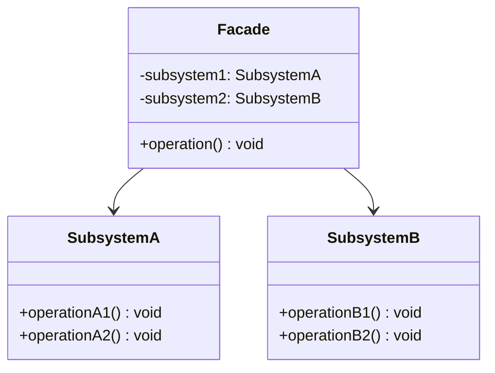

<Hero title="Facade Pattern" subtitle="Provide a unified interface to a complex subsystem—simplify integration and reduce coupling" imageAlt="Facade pattern illustration" size="large" />

## TL;DR

Facade provides a single, simplified interface to a complex subsystem. Instead of clients navigating 20 classes and 100 methods, Facade exposes 5 simple methods that handle the complexity internally. Perfect for wrapping legacy systems, integrating third-party libraries, or decoupling clients from implementation details.

## Learning Objectives

- You will be able to identify opportunities to create Facades for complex subsystems.
- You will be able to design a Facade that simplifies without sacrificing necessary control.
- You will be able to distinguish Facade from Adapter and Decorator.
- You will be able to balance convenience with flexibility in Facade design.

## Motivating Scenario

You're integrating a PDF library with 50 classes, complex builder patterns, and non-intuitive method names. Clients need: "create PDF", "add text", "save to file". Rather than making every client learn the library's API, Facade wraps it: `pdf_facade.create_document().add_text("Hello").save("/tmp/out.pdf")`.

## Core Concepts

**Facade** provides a unified, simplified interface to a complex subsystem. It doesn't add new functionality; it orchestrates existing complexity into a cleaner contract.

Key characteristics:
- **Subsystem classes remain unchanged**: Facade wraps them, doesn't modify them
- **Simplification by composition**: Facade delegates to subsystem classes
- **Decoupling**: Clients depend on Facade, not on subsystem details
- **Optional direct access**: Clients can still use subsystem directly if needed

<Figure caption="Facade structure">

</Figure>

## Practical Example

<Tabs>
<TabItem value="python" label="Python" default>

```python
# Subsystem: complex PDF library
class PDFDocument:
    def __init__(self):
        self.pages = []

    def add_page(self):
        self.pages.append({})
        return len(self.pages) - 1

    def add_text_to_page(self, page_id: int, text: str):
        self.pages[page_id]["text"] = text

class PDFFormatter:
    def format_text(self, text: str, font_size: int) -> str:
        return f"<text size={font_size}>{text}</text>"

class PDFWriter:
    def write_to_file(self, doc: PDFDocument, filename: str):
        content = "".join(str(page) for page in doc.pages)
        with open(filename, "w") as f:
            f.write(content)

# Facade: simple interface to complex subsystem
class SimplePDFFacade:
    def __init__(self):
        self.doc = PDFDocument()
        self.formatter = PDFFormatter()
        self.writer = PDFWriter()
        self.current_page = None

    def create_document(self):
        self.current_page = self.doc.add_page()
        return self

    def add_text(self, text: str, font_size: int = 12):
        formatted = self.formatter.format_text(text, font_size)
        self.doc.add_text_to_page(self.current_page, formatted)
        return self

    def new_page(self):
        self.current_page = self.doc.add_page()
        return self

    def save(self, filename: str):
        self.writer.write_to_file(self.doc, filename)

# Client: simple, clean usage
facade = SimplePDFFacade()
facade.create_document() \
    .add_text("Hello PDF World", 16) \
    .new_page() \
    .add_text("Second page", 12) \
    .save("/tmp/output.pdf")
```

</TabItem>
<TabItem value="go" label="Go">

```go
package main

import (
    "fmt"
    "os"
)

// Subsystem: complex PDF library
type PDFDocument struct {
    Pages []map[string]string
}

func (p *PDFDocument) AddPage() int {
    p.Pages = append(p.Pages, make(map[string]string))
    return len(p.Pages) - 1
}

func (p *PDFDocument) AddTextToPage(pageID int, text string) {
    p.Pages[pageID]["text"] = text
}

// Subsystem: formatter
type PDFFormatter struct{}

func (f *PDFFormatter) FormatText(text string, fontSize int) string {
    return fmt.Sprintf("<text size=%d>%s</text>", fontSize, text)
}

// Subsystem: writer
type PDFWriter struct{}

func (w *PDFWriter) WriteToFile(doc *PDFDocument, filename string) error {
    content := ""
    for _, page := range doc.Pages {
        content += fmt.Sprintf("%v\n", page)
    }
    return os.WriteFile(filename, []byte(content), 0644)
}

// Facade: simple interface
type SimplePDFFacade struct {
    doc        *PDFDocument
    formatter  *PDFFormatter
    writer     *PDFWriter
    currentPage int
}

func NewSimplePDFFacade() *SimplePDFFacade {
    return &SimplePDFFacade{
        doc:       &PDFDocument{Pages: make([]map[string]string, 0)},
        formatter: &PDFFormatter{},
        writer:    &PDFWriter{},
    }
}

func (s *SimplePDFFacade) CreateDocument() *SimplePDFFacade {
    s.currentPage = s.doc.AddPage()
    return s
}

func (s *SimplePDFFacade) AddText(text string, fontSize int) *SimplePDFFacade {
    formatted := s.formatter.FormatText(text, fontSize)
    s.doc.AddTextToPage(s.currentPage, formatted)
    return s
}

func (s *SimplePDFFacade) NewPage() *SimplePDFFacade {
    s.currentPage = s.doc.AddPage()
    return s
}

func (s *SimplePDFFacade) Save(filename string) error {
    return s.writer.WriteToFile(s.doc, filename)
}

func main() {
    facade := NewSimplePDFFacade()
    facade.CreateDocument().
        AddText("Hello PDF World", 16).
        NewPage().
        AddText("Second page", 12).
        Save("/tmp/output.pdf")
}
```

</TabItem>
<TabItem value="nodejs" label="Node.js">

```javascript
// Subsystem: complex PDF library
class PDFDocument {
    constructor() {
        this.pages = [];
    }

    addPage() {
        this.pages.push({});
        return this.pages.length - 1;
    }

    addTextToPage(pageId, text) {
        this.pages[pageId].text = text;
    }
}

// Subsystem: formatter
class PDFFormatter {
    formatText(text, fontSize = 12) {
        return `<text size="${fontSize}">${text}</text>`;
    }
}

// Subsystem: writer
class PDFWriter {
    writeToFile(doc, filename) {
        const content = doc.pages.map(p => JSON.stringify(p)).join("\n");
        require('fs').writeFileSync(filename, content);
    }
}

// Facade: simple interface
class SimplePDFFacade {
    constructor() {
        this.doc = new PDFDocument();
        this.formatter = new PDFFormatter();
        this.writer = new PDFWriter();
        this.currentPage = null;
    }

    createDocument() {
        this.currentPage = this.doc.addPage();
        return this;
    }

    addText(text, fontSize = 12) {
        const formatted = this.formatter.formatText(text, fontSize);
        this.doc.addTextToPage(this.currentPage, formatted);
        return this;
    }

    newPage() {
        this.currentPage = this.doc.addPage();
        return this;
    }

    save(filename) {
        this.writer.writeToFile(this.doc, filename);
        return this;
    }
}

// Client: clean usage
const facade = new SimplePDFFacade();
facade
    .createDocument()
    .addText("Hello PDF World", 16)
    .newPage()
    .addText("Second page", 12)
    .save("/tmp/output.pdf");
```

</TabItem>
</Tabs>

## When to Use / When NOT to Use

<Vs highlight={[1]} items={[
{
    label: "Use Facade when:",
    points: [
      "Integrating complex subsystems with many interdependent classes",
      "You want to decouple clients from subsystem implementation details",
      "Providing a simpler entry point for common use cases",
      "Wrapping legacy systems with confusing or bloated APIs",
      "Organizing many related classes into a cohesive interface"
    ],
    highlightTone: "positive"
  },
{
    label: "Don't use Facade when:",
    points: [
      "The subsystem is already simple (overhead without benefit)",
      "Hiding complexity that clients need direct access to",
      "Facade becomes as complex as the subsystem it wraps",
      "Fine-grained control over subsystem behavior is essential",
      "Different clients need different simplified views"
    ],
    highlightTone: "positive"
  }
]} />

## Patterns and Pitfalls

<Showcase title="Patterns and Pitfalls" sections={[
  {
    label: "Pattern: Facade as the only public entry point",
    body: "Hide subsystem classes, expose only the Facade."
  },
  {
    label: "Pitfall: Facade becomes too opinionated",
    body: "If Facade assumes too much, it limits flexibility."
  },
  {
    label: "Pattern: Provide escape hatch for advanced users",
    body: "Allow direct subsystem access when Facade is too limiting.",
    tone: "positive"
  }
]} />

## Design Review Checklist

<Checklist items={[
  "Facade simplifies the subsystem API without limiting necessary functionality",
  "Subsystem classes are not modified by Facade (wrapping, not inheritance)",
  "Facade encapsulates subsystem dependencies and interactions",
  "Common use cases have simple Facade methods",
  "Advanced use cases can still access subsystem directly if needed",
  "Documentation explains what the Facade hides and why",
  "Facade doesn't add significant overhead to simple operations",
  "Tests cover both simple Facade usage and advanced subsystem access"
]} />

## Advanced Facade Patterns

### Facade Hierarchy for Complex Systems

```python
# Fine-grained facades for different client types
class SimplePDFFacade:
    """For basic PDF creation"""
    def create_document(self):
        # ... simple setup
        return self

    def add_text(self, text):
        # ... basic text
        return self

class AdvancedPDFFacade:
    """For power users needing more control"""
    def create_document(self):
        # ... setup
        return self

    def add_text(self, text, **kwargs):
        # ... advanced text with font, positioning, etc.
        return self

    def add_watermark(self, text):
        # ... watermark support
        return self

# Clients choose appropriate facade for their needs
```

### Facade with Adapter for Legacy Integration

```python
class LegacyPDFLibrary:
    """Old, complicated API"""
    def initialize(self, config):
        pass

    def open_document(self, name):
        pass

    def allocate_page(self):
        pass

    def set_text_properties(self, font, size, color):
        pass

    def write_text(self, x, y, text):
        pass

    def close_document(self):
        pass

class PDFAdapter:
    """Adapter to modern interface"""
    def __init__(self, legacy_lib):
        self.lib = legacy_lib
        self.lib.initialize({})

    def add_text(self, text):
        self.lib.set_text_properties("Arial", 12, "black")
        self.lib.write_text(10, 10, text)

class ModernPDFFacade:
    """Facade uses adapted legacy library"""
    def __init__(self):
        self.adapter = PDFAdapter(LegacyPDFLibrary())

    def create_document(self):
        self.adapter.lib.open_document("output.pdf")
        return self

    def add_text(self, text):
        self.adapter.add_text(text)
        return self

    def save(self, filename):
        self.adapter.lib.close_document()
```

### Facade with Feature Flags for Gradual Migration

```python
class PDFFacade:
    def __init__(self, use_legacy=False):
        self.use_legacy = use_legacy
        if use_legacy:
            self.impl = LegacyPDFImpl()
        else:
            self.impl = ModernPDFImpl()

    def add_text(self, text):
        if self.use_legacy:
            return self.impl.legacy_add_text(text)
        else:
            return self.impl.modern_add_text(text)

# Feature flag controls which implementation to use
# Allows gradual migration from legacy to modern
```

## Real-World Facade Examples

### Database Facade

```python
class DatabaseFacade:
    """Simplifies complex database connection pool, transaction, and query logic"""
    def __init__(self, config):
        self.pool = ConnectionPool(config)
        self.transaction_manager = TransactionManager()

    def execute_query(self, sql):
        conn = self.pool.get_connection()
        try:
            result = conn.execute(sql)
            return result
        finally:
            self.pool.return_connection(conn)

    def run_transaction(self, operations):
        txn = self.transaction_manager.begin()
        try:
            for op in operations:
                op(txn)
            txn.commit()
        except Exception:
            txn.rollback()
            raise
```

### Web Framework Facade

```python
class WebFrameworkFacade:
    """Hides routing, middleware, auth, database, caching layers"""
    def __init__(self):
        self.router = Router()
        self.auth = AuthManager()
        self.db = DatabaseFacade({})
        self.cache = CacheManager()

    def register_route(self, path, handler, auth_required=False):
        def wrapped_handler(request):
            if auth_required and not self.auth.is_authenticated(request):
                return {"error": "Unauthorized"}
            return handler(request)
        self.router.add_route(path, wrapped_handler)

    def get_user(self, user_id):
        # Check cache first
        cached = self.cache.get(f"user:{user_id}")
        if cached:
            return cached
        # Query database
        user = self.db.execute_query(f"SELECT * FROM users WHERE id={user_id}")
        # Cache result
        self.cache.set(f"user:{user_id}", user, ttl=3600)
        return user
```

### Cloud Service Facade

```python
class CloudProviderFacade:
    """Abstracts AWS, Azure, GCP differences"""
    def __init__(self, provider="aws"):
        if provider == "aws":
            self.storage = S3Storage()
            self.compute = EC2Compute()
            self.database = RDSDatabase()
        elif provider == "azure":
            self.storage = AzureBlob()
            self.compute = AzureVM()
            self.database = AzureSQLDatabase()

    def upload_file(self, filename, data):
        return self.storage.put(filename, data)

    def create_instance(self, instance_type):
        return self.compute.create(instance_type)

    def query_database(self, sql):
        return self.database.execute(sql)

# Client doesn't care about specific cloud provider
# Facade handles differences transparently
```

### Media Conversion Library Facade

```python
# Complex subsystem with many interdependent classes
class AudioCodec:
    def decode(self, data): pass
    def encode(self, data): pass

class MP3Codec(AudioCodec):
    def decode(self, data): return "decoded_mp3"
    def encode(self, data): return "encoded_mp3"

class AACCodec(AudioCodec):
    def decode(self, data): return "decoded_aac"
    def encode(self, data): return "encoded_aac"

class Resampler:
    def resample(self, data, target_rate):
        return f"resampled_to_{target_rate}hz"

class EQ:
    def apply(self, data, settings):
        return "eq_applied"

class Compressor:
    def compress(self, data):
        return "compressed"

# Facade simplifies common operations
class AudioProcessingFacade:
    def __init__(self):
        self.decoders = {'mp3': MP3Codec(), 'aac': AACCodec()}
        self.resampler = Resampler()
        self.eq = EQ()
        self.compressor = Compressor()

    def convert_mp3_to_aac(self, mp3_data):
        """Convert MP3 to AAC with standard settings"""
        # Hide complexity: decoding, resampling, EQ, compression
        decoded = self.decoders['mp3'].decode(mp3_data)
        resampled = self.resampler.resample(decoded, 44100)
        equ = self.eq.apply(resampled, {'bass': 0, 'treble': 0})
        compressed = self.compressor.compress(equ)
        encoded = self.decoders['aac'].encode(compressed)
        return encoded

    def normalize_audio(self, audio_data, format='mp3'):
        """Normalize audio to standard format and quality"""
        # Another common operation simplified
        codec = self.decoders[format]
        decoded = codec.decode(audio_data)
        resampled = self.resampler.resample(decoded, 48000)
        return resampled

# Client code is much simpler
facade = AudioProcessingFacade()
aac_file = facade.convert_mp3_to_aac(mp3_bytes)
normalized = facade.normalize_audio(audio_bytes)
```

## Facade vs Adapter vs Decorator

| Pattern | Purpose | When to Use |
|---------|---------|------------|
| Facade | Simplify complex subsystem | Wrapping multiple classes with complex interactions |
| Adapter | Convert interface to another | Interface mismatch between components |
| Decorator | Add behavior to objects | Dynamic behavior addition; optional features |

## Self-Check

1. **Identify**: Find a complex subsystem that clients struggle to integrate. (Look for: many classes, complex interactions, non-intuitive method sequences)
2. **Design**: Create a Facade with methods for common use cases. (Ask: what do most clients need to do? Make that simple)
3. **Verify**: Client code is simpler and cleaner with the Facade. (Compare: with/without facade. Facade code should be 50-80% shorter)

**Red flags you need a Facade**:
- Clients need to understand 10+ subsystem classes
- Typical client code is 30+ lines for simple operation
- Subsystem method names don't match client terminology
- Clients frequently misuse the subsystem

:::info
**One Takeaway**: Facade simplifies integration with complex subsystems by providing a unified, easy-to-use interface. It doesn't add functionality—it orchestrates existing complexity. Always provide an escape hatch for advanced users who need subsystem details, but make the common path simple and obvious.

:::

## Next Steps

- Learn **Adapter** for connecting incompatible interfaces (different intent).
- Study **Builder** for constructing complex objects step-by-step.
- Explore **Mediator** for managing complex interactions between objects.

## References

- Gang of Four: *Design Patterns* (Facade)
- *Head First Design Patterns* (Facade chapter)
- Martin Fowler: *Refactoring* (Hide Delegates)