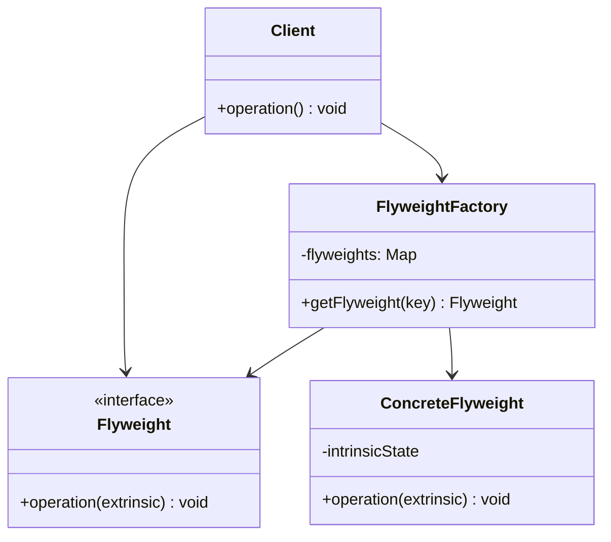

<Hero title="Flyweight Pattern" subtitle="Share fine-grained objects efficiently—optimize memory for millions of similar instances" imageAlt="Flyweight pattern illustration" size="large" />

## TL;DR

Flyweight optimizes memory by sharing common state among many objects. For a text editor with a million characters, create one Flyweight for each glyph (Arial-A, Arial-B, etc.) and reuse it, storing only the position/color separately. Separate **intrinsic state** (shared, immutable) from **extrinsic state** (per-instance). Use Flyweight only when profiling shows memory is actually a problem.

## Learning Objectives

- You will be able to identify opportunities for Flyweight optimization.
- You will be able to separate intrinsic from extrinsic state correctly.
- You will be able to implement a Flyweight factory for managing shared objects.
- You will be able to recognize when Flyweight's complexity is not worth the savings.

## Motivating Scenario

A game renders 100,000 trees on a landscape. Each tree object stores texture, 3D model, animation data (intrinsic—same for all Pine trees). Without Flyweight, that's 100,000 × 2MB = 200GB. With Flyweight: one Pine Flyweight (2MB) + 100,000 position/color entries (intrinsic stored once, extrinsic per instance) = ~5MB.

## Core Concepts

**Flyweight** optimizes memory by sharing intrinsic state (unchanging, immutable) among many instances and externalizing extrinsic state (changeable, per-instance).

Key elements:
- **Intrinsic state**: shared across all Flyweights (font, shape, immutable data)
- **Extrinsic state**: stored outside, passed to Flyweight methods (position, color, size)
- **FlyweightFactory**: creates and caches Flyweights, ensuring reuse
- **Client**: stores extrinsic state and passes it to Flyweights

<Figure caption="Flyweight structure">

</Figure>

## Practical Example

<Tabs>
<TabItem value="python" label="Python" default>

```python
# Flyweight: intrinsic state (shared, immutable)
class CharacterGlyph:
    def __init__(self, char: str, font_name: str, font_size: int):
        self.char = char
        self.font_name = font_name
        self.font_size = font_size

    def render(self, x: int, y: int, color: str) -> str:
        # Extrinsic state: x, y, color passed in
        return f"Render '{self.char}' at ({x},{y}) in {self.font_name}:{self.font_size}, color={color}"

# FlyweightFactory: manage and reuse Flyweights
class CharacterGlyphFactory:
    def __init__(self):
        self._glyphs = {}

    def get_glyph(self, char: str, font_name: str, font_size: int) -> CharacterGlyph:
        key = (char, font_name, font_size)
        if key not in self._glyphs:
            self._glyphs[key] = CharacterGlyph(char, font_name, font_size)
        return self._glyphs[key]

    def get_cache_size(self) -> int:
        return len(self._glyphs)

# Client: stores extrinsic state separately
class TextDocument:
    def __init__(self):
        self.glyph_factory = CharacterGlyphFactory()
        self.characters = []  # List of (glyph, x, y, color)

    def add_character(self, char: str, font_name: str, font_size: int, x: int, y: int, color: str):
        glyph = self.glyph_factory.get_glyph(char, font_name, font_size)
        self.characters.append((glyph, x, y, color))

    def render_all(self) -> str:
        return "\n".join(
            glyph.render(x, y, color)
            for glyph, x, y, color in self.characters
        )

    def get_stats(self) -> str:
        return f"Characters in document: {len(self.characters)}, Unique glyphs cached: {self.glyph_factory.get_cache_size()}"

# Usage: memory-efficient for large documents
doc = TextDocument()
doc.add_character("H", "Arial", 12, 10, 20, "black")
doc.add_character("e", "Arial", 12, 15, 20, "black")
doc.add_character("l", "Arial", 12, 20, 20, "black")
doc.add_character("l", "Arial", 12, 25, 20, "black")  # Reuses 'l' Flyweight
doc.add_character("o", "Arial", 12, 30, 20, "black")

print(doc.render_all())
print(doc.get_stats())  # "Characters in document: 5, Unique glyphs cached: 4"
```

</TabItem>
<TabItem value="go" label="Go">

```go
package main

import "fmt"

// Flyweight: intrinsic state (shared, immutable)
type CharacterGlyph struct {
    Char     string
    FontName string
    FontSize int
}

func (c *CharacterGlyph) Render(x, y int, color string) string {
    return fmt.Sprintf("Render '%s' at (%d,%d) in %s:%d, color=%s", c.Char, x, y, c.FontName, c.FontSize, color)
}

// FlyweightFactory: manage and reuse Flyweights
type CharacterGlyphFactory struct {
    Glyphs map[string]*CharacterGlyph
}

func NewCharacterGlyphFactory() *CharacterGlyphFactory {
    return &CharacterGlyphFactory{
        Glyphs: make(map[string]*CharacterGlyph),
    }
}

func (f *CharacterGlyphFactory) GetGlyph(char, fontName string, fontSize int) *CharacterGlyph {
    key := fmt.Sprintf("%s_%s_%d", char, fontName, fontSize)
    if _, exists := f.Glyphs[key]; !exists {
        f.Glyphs[key] = &CharacterGlyph{
            Char:     char,
            FontName: fontName,
            FontSize: fontSize,
        }
    }
    return f.Glyphs[key]
}

func (f *CharacterGlyphFactory) GetCacheSize() int {
    return len(f.Glyphs)
}

// Client: stores extrinsic state separately
type TextDocument struct {
    factory    *CharacterGlyphFactory
    Characters []struct {
        Glyph *CharacterGlyph
        X, Y  int
        Color string
    }
}

func NewTextDocument() *TextDocument {
    return &TextDocument{
        factory:     NewCharacterGlyphFactory(),
        Characters: make([]struct {
            Glyph *CharacterGlyph
            X, Y  int
            Color string
        }, 0),
    }
}

func (d *TextDocument) AddCharacter(char, fontName string, fontSize, x, y int, color string) {
    glyph := d.factory.GetGlyph(char, fontName, fontSize)
    d.Characters = append(d.Characters, struct {
        Glyph *CharacterGlyph
        X, Y  int
        Color string
    }{glyph, x, y, color})
}

func (d *TextDocument) RenderAll() string {
    result := ""
    for _, c := range d.Characters {
        result += c.Glyph.Render(c.X, c.Y, c.Color) + "\n"
    }
    return result
}

func (d *TextDocument) GetStats() string {
    return fmt.Sprintf("Characters: %d, Cached glyphs: %d", len(d.Characters), d.factory.GetCacheSize())
}

func main() {
    doc := NewTextDocument()
    doc.AddCharacter("H", "Arial", 12, 10, 20, "black")
    doc.AddCharacter("e", "Arial", 12, 15, 20, "black")
    doc.AddCharacter("l", "Arial", 12, 20, 20, "black")
    doc.AddCharacter("l", "Arial", 12, 25, 20, "black")  // Reuses 'l'
    doc.AddCharacter("o", "Arial", 12, 30, 20, "black")

    fmt.Println(doc.RenderAll())
    fmt.Println(doc.GetStats())  // "Characters: 5, Cached glyphs: 4"
}
```

</TabItem>
<TabItem value="nodejs" label="Node.js">

```javascript
// Flyweight: intrinsic state (shared, immutable)
class CharacterGlyph {
    constructor(char, fontName, fontSize) {
        this.char = char;
        this.fontName = fontName;
        this.fontSize = fontSize;
    }

    render(x, y, color) {
        return `Render '${this.char}' at (${x},${y}) in ${this.fontName}:${this.fontSize}, color=${color}`;
    }
}

// FlyweightFactory: manage and reuse Flyweights
class CharacterGlyphFactory {
    constructor() {
        this.glyphs = new Map();
    }

    getGlyph(char, fontName, fontSize) {
        const key = `${char}_${fontName}_${fontSize}`;
        if (!this.glyphs.has(key)) {
            this.glyphs.set(key, new CharacterGlyph(char, fontName, fontSize));
        }
        return this.glyphs.get(key);
    }

    getCacheSize() {
        return this.glyphs.size;
    }
}

// Client: stores extrinsic state separately
class TextDocument {
    constructor() {
        this.glyphFactory = new CharacterGlyphFactory();
        this.characters = [];  // Array of {glyph, x, y, color}
    }

    addCharacter(char, fontName, fontSize, x, y, color) {
        const glyph = this.glyphFactory.getGlyph(char, fontName, fontSize);
        this.characters.push({ glyph, x, y, color });
    }

    renderAll() {
        return this.characters
            .map(c => c.glyph.render(c.x, c.y, c.color))
            .join("\n");
    }

    getStats() {
        return `Characters: ${this.characters.length}, Cached glyphs: ${this.glyphFactory.getCacheSize()}`;
    }
}

// Usage: memory-efficient
const doc = new TextDocument();
doc.addCharacter("H", "Arial", 12, 10, 20, "black");
doc.addCharacter("e", "Arial", 12, 15, 20, "black");
doc.addCharacter("l", "Arial", 12, 20, 20, "black");
doc.addCharacter("l", "Arial", 12, 25, 20, "black");  // Reuses 'l'
doc.addCharacter("o", "Arial", 12, 30, 20, "black");

console.log(doc.renderAll());
console.log(doc.getStats());  // "Characters: 5, Cached glyphs: 4"
```

</TabItem>
</Tabs>

## When to Use / When NOT to Use

<Vs highlight={[1]} items={[
{
    label: "Use Flyweight when:",
    points: [
      "You have many similar objects (thousands or millions)",
      "Memory is a proven bottleneck (profiling confirms this)",
      "Objects share substantial intrinsic (immutable) state",
      "Extrinsic state can be separated and stored elsewhere",
      "Creating and destroying objects frequently is expensive"
    ],
    highlightTone: "positive"
  },
{
    label: "Don't use Flyweight when:",
    points: [
      "Memory usage is not a problem (premature optimization)",
      "Objects don't share enough state to justify the complexity",
      "Intrinsic state is mutable or hard to identify",
      "The overhead of the factory and lookup outweighs savings",
      "Simplicity and readability are more important than memory"
    ],
    highlightTone: "positive"
  }
]} />

## Patterns and Pitfalls

<Showcase title="Patterns and Pitfalls" sections={[
  {
    label: "Pitfall: Premature optimization with Flyweight",
    body: "Only optimize after profiling proves memory is a bottleneck."
  },
  {
    label: "Pattern: Clear separation of intrinsic and extrinsic state",
    body: "Make the distinction explicit in code."
  },
  {
    label: "Pattern: Thread-safe factory for concurrent access",
    body: "Use locks if multiple threads access the factory."
  }
]} />

## Design Review Checklist

<Checklist items={[
  "Profiling confirms memory is actually a bottleneck",
  "Intrinsic state is clearly identified and truly immutable",
  "Extrinsic state is cleanly separated and passed in",
  "FlyweightFactory manages creation and caching correctly",
  "Clients store extrinsic state, not Flyweights",
  "Thread safety is handled if concurrent access occurs",
  "Cache has reasonable bounds (no unbounded memory growth)",
  "Performance gain (memory savings) outweighs implementation complexity"
]} />

## Self-Check

1. **Profile**: Measure memory usage of your current solution.
2. **Analyze**: Identify intrinsic (shared) vs. extrinsic (per-instance) state.
3. **Implement**: Build a Flyweight with Factory and verify memory savings.

:::info
**One Takeaway**: Flyweight optimizes memory by sharing intrinsic (immutable) state across many instances and externalizing extrinsic (changeable) state. Only use Flyweight when profiling proves memory is a bottleneck—the complexity is not worth it otherwise. Separate intrinsic from extrinsic state clearly, use a factory for reuse, and ensure the Flyweight is truly immutable.

:::

## Next Steps

- Learn **Object Pool** for reusing expensive objects (similar optimization pattern).
- Study **Factory** patterns for efficient object creation.
- Explore **Memento** for saving state without memory overhead.

## References

- Gang of Four: *Design Patterns* (Flyweight)
- *Head First Design Patterns* (Flyweight chapter)
- Microsoft Docs: *Flyweight Pattern*