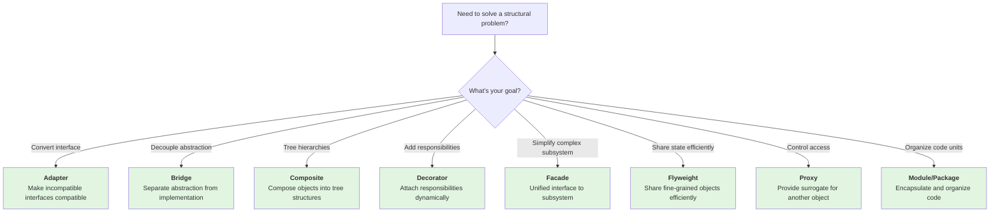

import { useCurrentSidebarCategory } from "@docusaurus/theme-common";

# Structural Design Patterns

Structural patterns deal with object composition, creating larger structures from objects and classes while keeping these structures flexible and efficient. They help you compose objects into larger structures without making those relationships brittle or tightly coupled.

## Overview

Structural patterns solve problems like:
- **Incompatible interfaces**: How do you make incompatible objects work together?
- **Layering and abstraction**: How do you add responsibilities without modifying existing classes?
- **Object relationships**: How do you organize hierarchies and structures flexibly?
- **Resource efficiency**: How do you share common state across many similar objects?

<Figure caption="Structural Patterns Decision Flow">

</Figure>

## Patterns at a Glance

<DocCardList items={useCurrentSidebarCategory().items} />

## When to Apply Structural Patterns

Use structural patterns when you need to:

- **Connect incompatible systems** without modifying either (Adapter)
- **Vary object behavior independently** from its abstraction (Bridge)
- **Work with recursive hierarchies** like trees or menus (Composite)
- **Add features to objects dynamically** without creating subclass explosions (Decorator)
- **Provide a simplified interface** to a complex subsystem (Facade)
- **Optimize memory** by sharing common state across many instances (Flyweight)
- **Control access** to objects for logging, validation, or lazy loading (Proxy)
- **Organize code** into logical, maintainable units (Module/Package)

## Key Principles

**Composition over Inheritance**: Structural patterns favor object composition over inheritance, creating more flexible and maintainable designs.

**Single Responsibility**: Each structural component has one clear role—adapting, bridging, composing, or controlling access.

**Open/Closed Principle**: Structures are open for extension (new decorators, adapters, facades) but closed for modification.

**Loose Coupling**: Patterns minimize dependencies between components, making systems easier to evolve.

## Common Pitfalls

1. **Over-composition**: Adding too many layers (Decorator chains, Adapter stacks) makes code harder to follow.
2. **Wrong pattern for the job**: Using Proxy when Decorator is clearer, or Adapter when redesigning the interface would be better.
3. **Performance overhead**: Every structural layer adds a small cost—be aware when micro-optimization matters.
4. **Testing complexity**: Decorated, proxied, or adapted objects can be harder to test without careful isolation.

## Learning Path

1. Start with **Adapter** and **Facade** (conceptually simplest, most immediately useful)
2. Move to **Decorator** (powerful for adding features dynamically)
3. Explore **Composite** (essential for tree-based systems)
4. Study **Bridge** and **Proxy** (more sophisticated abstraction techniques)
5. Learn **Flyweight** (performance optimization)
6. Master **Module/Package** organization (scalability fundamentals)
---

Each pattern is a tool for a specific structural challenge. Choose the one that best expresses your intent and keeps your code clear and maintainable.
