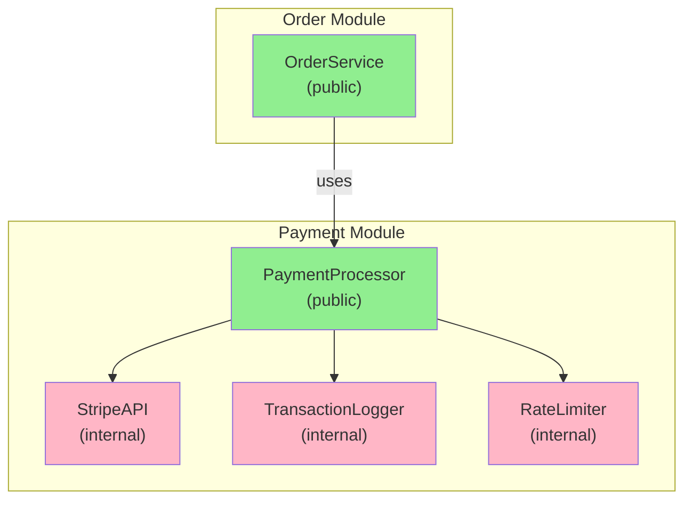

<Hero title="Module/Package Pattern" subtitle="Organize code into logical, cohesive units with clear boundaries and public interfaces" imageAlt="Module/Package pattern illustration" size="large" />

## TL;DR

Module/Package organizes code into logical units with clear responsibilities, cohesive interfaces, and defined boundaries. A well-designed module exposes only what clients need (public API) and hides implementation details. Modules are building blocks of scalable systems—they can be developed, tested, and versioned independently. The pattern applies from namespaces to microservices.

## Learning Objectives

- You will be able to identify natural module boundaries in your codebase.
- You will be able to design cohesive modules with minimal external dependencies.
- You will be able to define clear public interfaces and hide implementation details.
- You will be able to recognize when modules are tightly coupled and need refactoring.

## Motivating Scenario

A monolith grows: database code, API logic, validation, caching, logging all mixed together. Files are everywhere. What should a new developer import to use the payment system? What's internal vs. public? A Module boundary clarifies this: `payments` module exports a public `PaymentProcessor` class and hides internals like `StripeAPI`, `TransactionLogger`, `RateLimiter`.

## Core Concepts

**Module/Package** groups related code with a single, well-defined responsibility. It has:

- **Cohesion**: classes/functions inside serve a clear purpose
- **Clear boundaries**: internal vs. public clearly distinguished
- **Defined interface**: small, focused public API
- **Loose coupling**: minimal dependencies on other modules

Characteristics:
- **Public API**: classes/functions exposed to other modules
- **Private/Internal**: implementation details hidden
- **Dependencies**: clear list of what the module needs
- **Versioning**: modules can evolve independently

<Figure caption="Module/Package structure">

</Figure>

## Practical Example

<Tabs>
<TabItem value="python" label="Python" default>

```python
# payments/__init__.py - Public API only
from .processor import PaymentProcessor

__all__ = ["PaymentProcessor"]

# payments/processor.py - Public class
class PaymentProcessor:
    """Public interface for payment operations."""
    def __init__(self):
        self._stripe_api = StripeAPI()
        self._logger = TransactionLogger()
        self._rate_limiter = RateLimiter()

    def process_payment(self, amount: float, card_token: str) -> str:
        """Process a payment. Returns transaction ID."""
        self._rate_limiter.check_limit()
        transaction_id = self._stripe_api.charge(amount, card_token)
        self._logger.log_transaction(transaction_id, amount)
        return transaction_id

# payments/stripe_api.py - Internal implementation
class StripeAPI:
    """Internal: DO NOT use directly. Use PaymentProcessor instead."""
    def charge(self, amount: float, token: str) -> str:
        # Stripe API details
        return "tx_123"

# payments/logger.py - Internal logging
class TransactionLogger:
    """Internal: handles logging, not part of public API."""
    def log_transaction(self, tx_id: str, amount: float):
        # Log to database or file
        pass

# payments/rate_limiter.py - Internal rate limiting
class RateLimiter:
    """Internal: prevents abuse, transparent to public API."""
    def check_limit(self):
        # Check and enforce rate limits
        pass

# Usage from other modules: clean, focused API
from payments import PaymentProcessor

processor = PaymentProcessor()
tx_id = processor.process_payment(29.99, "tok_abc123")
print(f"Transaction: {tx_id}")

# These are NOT accessible from other modules
# from payments.stripe_api import StripeAPI  # Error or bad practice!
```

</TabItem>
<TabItem value="go" label="Go">

```go
// payments/payments.go - Public API
package payments

import (
    "payments/internal/stripe"
    "payments/internal/logger"
    "payments/internal/limits"
)

// PaymentProcessor - PUBLIC: exported interface
type PaymentProcessor struct {
    stripeAPI   *stripe.API
    logger      *logger.TransactionLogger
    rateLimiter *limits.RateLimiter
}

// NewPaymentProcessor - PUBLIC: constructor
func NewPaymentProcessor() *PaymentProcessor {
    return &PaymentProcessor{
        stripeAPI:   stripe.New(),
        logger:      logger.New(),
        rateLimiter: limits.New(),
    }
}

// ProcessPayment - PUBLIC: main operation
func (p *PaymentProcessor) ProcessPayment(amount float64, cardToken string) (string, error) {
    p.rateLimiter.CheckLimit()
    transactionID, err := p.stripeAPI.Charge(amount, cardToken)
    if err != nil {
        return "", err
    }
    p.logger.LogTransaction(transactionID, amount)
    return transactionID, nil
}

// payments/internal/stripe/api.go - INTERNAL
package stripe

// API - private to package, not exported
type API struct {
    // Implementation details
}

func New() *API {
    return &API{}
}

func (a *API) Charge(amount float64, token string) (string, error) {
    // Stripe API details
    return "tx_123", nil
}

// Usage: clean public API
package main

import "payments"

func main() {
    processor := payments.NewPaymentProcessor()
    txID, _ := processor.ProcessPayment(29.99, "tok_abc123")
    println("Transaction:", txID)

    // These are not accessible!
    // api := stripe.New()  // Error: stripe not exported
}
```

</TabItem>
<TabItem value="nodejs" label="Node.js">

```javascript
// payments/index.js - Public API
module.exports = {
    PaymentProcessor: require('./processor')
};

// payments/processor.js - Public class
const StripeAPI = require('./internal/stripe-api');
const TransactionLogger = require('./internal/logger');
const RateLimiter = require('./internal/rate-limiter');

class PaymentProcessor {
    constructor() {
        this.stripeAPI = new StripeAPI();
        this.logger = new TransactionLogger();
        this.rateLimiter = new RateLimiter();
    }

    processPayment(amount, cardToken) {
        this.rateLimiter.checkLimit();
        const transactionId = this.stripeAPI.charge(amount, cardToken);
        this.logger.logTransaction(transactionId, amount);
        return transactionId;
    }
}

module.exports = PaymentProcessor;

// payments/internal/stripe-api.js - Internal
class StripeAPI {
    charge(amount, token) {
        // Stripe implementation
        return "tx_123";
    }
}

module.exports = StripeAPI;

// Usage: clean, focused public API
const { PaymentProcessor } = require('./payments');

const processor = new PaymentProcessor();
const txId = processor.processPayment(29.99, "tok_abc123");
console.log(`Transaction: ${txId}`);

// These are NOT the intended usage:
// const api = require('./payments/internal/stripe-api');  // Anti-pattern!
```

</TabItem>
</Tabs>

## When to Use / When NOT to Use

<Vs highlight={[1]} items={[
{
    label: "Use Module/Package pattern when:",
    points: [
      "Code reaches a size where organization becomes important",
      "You have multiple related classes/functions with a clear purpose",
      "Other parts of the system need to use your code",
      "You want to control what clients can access",
      "The module could evolve independently (e.g., be upgraded)"
    ],
    highlightTone: "positive"
  },
{
    label: "Don't over-engineer with modules when:",
    points: [
      "You have just a few simple files (keep it simple)",
      "Everything needs to be public anyway",
      "Module boundaries are unclear or change constantly",
      "Module overhead (imports, exports, versioning) exceeds benefit",
      "The codebase is so small that one file is fine"
    ],
    highlightTone: "positive"
  }
]} />

## Patterns and Pitfalls

<Showcase title="Patterns and Pitfalls" sections={[
  {
    label: "Pattern: Public API + Internal directory structure",
    body: "Make the public interface explicit; hide implementation in internal folders."
  },
  {
    label: "Pitfall: Module becomes a dumping ground",
    body: "When a module has no clear cohesion, it's become a god object."
  },
  {
    label: "Pattern: Version your module's public API",
    body: "Stable public API allows consumers to upgrade confidently."
  }
]} />

## Design Review Checklist

<Checklist items={[
  "Module has a single, clear responsibility",
  "Public API is small and focused (not everything exported)",
  "Internal implementation details are hidden (internal/ or private symbols)",
  "Module has minimal dependencies on other modules",
  "Circular dependencies between modules do not exist",
  "README or documentation explains the module's purpose and public API",
  "Tests cover both public API behavior and internal components",
  "Breaking changes to public API are rare and well-communicated"
]} />

## Self-Check

1. **Map**: Draw your current code organization—are boundaries natural?
2. **Refactor**: Group related code; define public interfaces.
3. **Test**: Can a developer import your module without confusion?

:::info
**One Takeaway**: Module/Package organizes code into logical, cohesive units with clear boundaries and focused public interfaces. Hide implementation details, minimize dependencies between modules, and make the public API small and stable. Good modules are building blocks for scalable systems—they can be developed, tested, versioned, and even moved to microservices independently.

:::

## Next Steps

- Learn **Facade** for simplifying module interfaces.
- Study **Dependency Injection** for managing inter-module dependencies.
- Explore **Semantic Versioning** for maintaining public APIs.

## Module Evolution Strategies

### From Monolith to Modules

```
PHASE 1: Single module
  app/
    - users.py
    - payments.py
    - orders.py
    - shared.py (growing!)

PHASE 2: Logical modules emerge
  users/
    __init__.py
    models.py
    repository.py
  payments/
    __init__.py
    processor.py
    gateway.py
  shared/  (should shrink over time)
    __init__.py
    errors.py

PHASE 3: Microservices (if needed)
  users-service/
    - Complete ownership of users
  payments-service/
    - Complete ownership of payments
  # Interact via APIs, not imports
```

### From Modules to Microservices

When should a module become a microservice?

**Signs it's ready:**
- Module is self-contained (minimal dependencies on other modules)
- Module has different scaling requirements (payments scale differently than users)
- Module has different deployment cadence (faster updates needed)
- Team owns the module exclusively (no shared responsibility)
- Compliance requires isolation (payment data in separate service for PCI)

**Signs it's NOT ready:**
- Module has circular dependencies with others
- Module shares database with others (migration nightmare)
- Team is too small to own a service independently
- Service would be called from every request (coupling)

### Module Boundaries Decision Framework

```
Ask these questions:

1. Do the classes/functions serve a single business purpose?
   Yes → Keep in same module
   No → Consider split

2. Can this module be tested independently?
   Yes → Good boundary
   No → Too many dependencies

3. Can this module be deployed independently?
   Yes → Could be a service
   No → Should stay internal module

4. Could another team own this module?
   Yes → Clear boundary
   No → Needs better definition

5. Do clients of this module need implementation details?
   Yes → API is too low-level
   No → Good abstraction
```

## Advanced Module Patterns

### Layered Modules

```
payments/
  external/         (external dependencies)
    __init__.py
    stripe_api.py   (Stripe SDK)
    logger.py       (logging library)

  application/      (business logic)
    __init__.py
    payment_service.py

  domain/           (models, rules)
    __init__.py
    payment.py
    transaction.py

  infrastructure/   (persistence)
    __init__.py
    repository.py
    cache.py
```

### Event-Driven Modules

```
users/ module publishes events:
  - user.created
  - user.updated
  - user.deleted

payments/ module subscribes:
  - On user.created: create default payment method
  - On user.deleted: archive payment history

analytics/ module subscribes:
  - On user.created: track signup
  - On user.updated: track profile changes
```

## Module Anti-Patterns

**Anti-Pattern 1: God Module**

One module does everything. Hard to understand, hard to test.

```python
# BAD
core/
  __init__.py
  everything.py  # 5000 lines! Users, payments, orders, notifications...

# GOOD
users/
  __init__.py
  service.py     # 200 lines

payments/
  __init__.py
  service.py     # 200 lines

orders/
  __init__.py
  service.py     # 200 lines
```

**Anti-Pattern 2: Leaky Internal Details**

Clients access internal modules directly, breaking encapsulation.

```python
# BAD
from payments.internal.stripe_api import StripeAPI  # Don't do this!

# GOOD
from payments import PaymentProcessor  # Use public API only
```

**Anti-Pattern 3: Circular Dependencies**

Module A depends on module B, which depends on module A. Hard to maintain.

```python
# BAD
# users.py
from payments import PaymentProcessor

# payments.py
from users import User  # Circular!

# GOOD: Introduce abstract interface
# interfaces.py
class PaymentGateway(ABC):
    @abstractmethod
    def charge(self, amount):
        pass

# users.py
from interfaces import PaymentGateway

# payments.py
class StripeGateway(PaymentGateway):
    pass
```

## Self-Check

1. **Map**: Draw your current module boundaries. Are they natural?
2. **Test**: Can you test each module in isolation (mock its dependencies)?
3. **Deploy**: Could you deploy one module without touching others?
4. **Own**: Is it clear who owns each module?
5. **Grow**: As you add features, do new modules emerge naturally?

:::info
**One Takeaway**: Well-designed modules are building blocks for scalable systems. Start with modules, evolve to microservices only when justified. Focus on clear boundaries, small public APIs, and hidden implementation details. Good modularization lets teams work in parallel without stepping on each other.

:::

## Next Steps

- Learn **Facade** for simplifying module interfaces
- Study **Dependency Injection** for managing inter-module dependencies
- Explore **Event-Driven Architecture** for loosely coupled modules
- Review **Microservices** when modules should become services

## References

- David Parnas: *On the Criteria to be Used in Decomposing Systems into Modules*
- Robert C. Martin: *Clean Architecture* (Package Principles)
- Eric Evans: *Domain-Driven Design* (Bounded Contexts)
- Sam Newman: *Building Microservices* (Module to Service Migration)
- Sandro Mancuso: *The Software Craftsman* (Module Design)