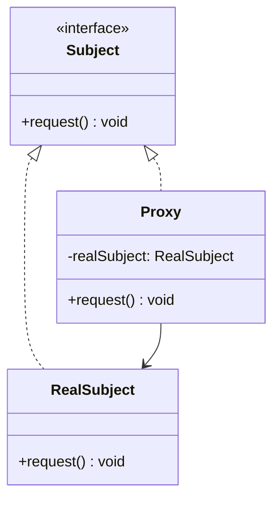

<Hero title="Proxy Pattern" subtitle="Provide a surrogate for another object—control access, lazy-load, or add behavior transparently" imageAlt="Proxy pattern illustration" size="large" />

## TL;DR

Proxy acts as a placeholder or surrogate for another object. Instead of creating an expensive object immediately or granting direct access, use Proxy to control access, delay creation (lazy loading), or add cross-cutting concerns (logging, caching). Transparent to clients—they work with Proxy the same way as the real object.

## Learning Objectives

- You will be able to identify use cases for different proxy types (lazy, protection, remote, cache).
- You will be able to implement Proxy while maintaining the original interface.
- You will be able to distinguish Proxy from Decorator and Adapter.
- You will be able to add control without changing the original object.

## Motivating Scenario

Loading a 100MB image for every document is wasteful—most images aren't viewed. Use an ImageProxy that loads the image only when someone actually calls `display()`. Or, control database access: a UserDataProxy checks permissions before returning user information. Proxy delays expensive operations and adds control.

## Core Concepts

**Proxy** provides a surrogate or placeholder for another object. It implements the same interface and controls access to the real subject.

Types of Proxy:
- **Lazy Proxy**: delays expensive object creation until needed
- **Protection Proxy**: controls access based on permissions
- **Remote Proxy**: represents an object in another process/network
- **Cache Proxy**: caches expensive operations
- **Logging Proxy**: logs all accesses/operations

Key elements:
- **Subject**: interface for both Proxy and RealSubject
- **RealSubject**: the actual object being proxied
- **Proxy**: implements the same interface, controls access

<Figure caption="Proxy structure">

</Figure>

## Practical Example

### Simple Lazy Proxy

<Tabs>
<TabItem value="python" label="Python" default>

```python
from abc import ABC, abstractmethod
import time

# Subject: common interface
class Image(ABC):
    @abstractmethod
    def display(self) -> None:
        pass

# RealSubject: the expensive object
class RealImage(Image):
    def __init__(self, filename: str):
        self.filename = filename
        self._load_image()

    def _load_image(self):
        # Simulate expensive disk I/O
        print(f"[EXPENSIVE] Loading image from disk: {self.filename}")
        time.sleep(0.5)

    def display(self):
        print(f"Displaying {self.filename}")

# Proxy: lazy-loading surrogate
class ImageProxy(Image):
    def __init__(self, filename: str):
        self.filename = filename
        self.real_image = None  # Lazy-loaded

    def display(self):
        if self.real_image is None:
            print(f"Proxy: Loading {self.filename}")
            self.real_image = RealImage(self.filename)
        else:
            print(f"Proxy: Using cached image {self.filename}")
        self.real_image.display()

# Usage: Proxy delays expensive creation
proxy = ImageProxy("photo.jpg")
print("Image proxy created (not loaded yet)")

proxy.display()  # Now it loads and displays
proxy.display()  # Reuses already-loaded image
```

</TabItem>
<TabItem value="go" label="Go">

```go
package main

import "fmt"

// Subject: common interface
type Image interface {
    Display()
}

// RealSubject: the expensive object
type RealImage struct {
    Filename string
}

func NewRealImage(filename string) *RealImage {
    fmt.Printf("Loading image from disk: %s\n", filename)
    return &RealImage{Filename: filename}
}

func (r *RealImage) Display() {
    fmt.Printf("Displaying %s\n", r.Filename)
}

// Proxy: lazy-loading surrogate
type ImageProxy struct {
    Filename  string
    realImage *RealImage
}

func NewImageProxy(filename string) *ImageProxy {
    return &ImageProxy{Filename: filename}
}

func (p *ImageProxy) Display() {
    if p.realImage == nil {
        p.realImage = NewRealImage(p.Filename)
    }
    p.realImage.Display()
}

func main() {
    proxy := NewImageProxy("photo.jpg")
    fmt.Println("Image proxy created (not loaded yet)")

    proxy.Display()  // Now it loads and displays
    proxy.Display()  // Reuses already-loaded image
}
```

</TabItem>
<TabItem value="nodejs" label="Node.js">

```javascript
// Subject: common interface
class Image {
    display() {
        throw new Error("Not implemented");
    }
}

// RealSubject: the expensive object
class RealImage extends Image {
    constructor(filename) {
        super();
        this.filename = filename;
        this.loadImage();
    }

    loadImage() {
        console.log(`Loading image from disk: ${this.filename}`);
    }

    display() {
        console.log(`Displaying ${this.filename}`);
    }
}

// Proxy: lazy-loading surrogate
class ImageProxy extends Image {
    constructor(filename) {
        super();
        this.filename = filename;
        this.realImage = null;  // Lazy-loaded
    }

    display() {
        if (this.realImage === null) {
            this.realImage = new RealImage(this.filename);
        }
        this.realImage.display();
    }
}

// Usage: Proxy delays expensive creation
const proxy = new ImageProxy("photo.jpg");
console.log("Image proxy created (not loaded yet)");

proxy.display();  // Now it loads and displays
proxy.display();  // Reuses already-loaded image
```

</TabItem>
</Tabs>

## When to Use / When NOT to Use

<Vs highlight={[1]} items={[
{
    label: "Use Proxy when:",
    points: [
      "Object creation is expensive (Lazy Proxy)",
      "You need to control access based on permissions (Protection Proxy)",
      "Object exists in another process/network (Remote Proxy)",
      "You want to cache expensive operation results (Cache Proxy)",
      "You need to log or monitor all access to an object"
    ],
    highlightTone: "positive"
  },
{
    label: "Don't use Proxy when:",
    points: [
      "The object is already lightweight (no benefit)",
      "Access control can be handled more simply",
      "Proxy overhead exceeds the benefit it provides",
      "Transparency to clients is impossible or undesirable",
      "Simpler patterns (inheritance, composition) solve the problem"
    ],
    highlightTone: "positive"
  }
]} />

## Patterns and Pitfalls

<Showcase title="Patterns and Pitfalls" sections={[
  {
    label: "Pattern: Lazy Proxy for expensive resources",
    body: "Delay creation until the object is actually needed."
  },
  {
    label: "Pitfall: Proxy adds overhead—not always worth it",
    body: "Only use Proxy if the benefit (lazy load, caching, control) exceeds the overhead."
  },
  {
    label: "Pattern: Distinguish Proxy from Decorator",
    body: "Proxy controls access; Decorator adds responsibility."
  }
]} />

## Design Review Checklist

<Checklist items={[
  "Proxy and RealSubject implement the same interface",
  "Proxy controls access in a clear, understandable way",
  "The benefit of the Proxy outweighs its overhead",
  "Clients don't know they're using a Proxy (transparency)",
  "Lazy loading (if applicable) is thread-safe",
  "Cache invalidation (if applicable) is handled correctly",
  "Tests cover both proxy behavior and real subject access",
  "Documentation explains what the Proxy controls and why"
]} />

## Self-Check

1. **Identify**: Find an expensive operation that could be lazy-loaded.
2. **Implement**: Create a Proxy that delays operation until needed.
3. **Verify**: Proxy is transparent to clients and provides clear benefit.

:::info
**One Takeaway**: Proxy acts as a transparent placeholder, controlling access to the real object. Use Lazy Proxy for expensive creation, Protection Proxy for access control, Remote Proxy for network communication, and Cache Proxy for result caching. The key distinction: Proxy controls access to the real object, while Decorator adds new responsibility. Only use Proxy when the benefit clearly outweighs the overhead.

:::

## Advanced Proxy Use Cases

### Protection Proxy Example

A protection proxy controls access to sensitive data based on permissions:

```python
class UserData:
    def __init__(self, username, email, salary):
        self.username = username
        self.email = email
        self.salary = salary

class UserDataProxy:
    def __init__(self, user_data, current_user, current_user_role):
        self.user_data = user_data
        self.current_user = current_user
        self.current_user_role = current_user_role

    def get_username(self):
        # Everyone can see usernames
        return self.user_data.username

    def get_email(self):
        # Only admins and the user themselves
        if self.current_user_role == 'admin' or self.current_user == self.user_data.username:
            return self.user_data.email
        raise PermissionError("Cannot access email")

    def get_salary(self):
        # Only the user and HR can see salary
        if self.current_user_role in ['admin', 'hr'] or self.current_user == self.user_data.username:
            return self.user_data.salary
        raise PermissionError("Cannot access salary")

# Usage
user = UserData("alice", "alice@example.com", 120000)
proxy_as_user = UserDataProxy(user, "alice", "user")
proxy_as_admin = UserDataProxy(user, "admin", "admin")

print(proxy_as_user.get_username())  # Works
print(proxy_as_user.get_email())     # Works (same user)
# proxy_as_user.get_salary()         # Would raise PermissionError

print(proxy_as_admin.get_salary())   # Works (admin)
```

### Remote Proxy Example (Service Communication)

A remote proxy represents an object in another process or system:

```python
import requests
from typing import List

# Remote object interface
class WeatherService:
    def get_temperature(self, city: str) -> float:
        pass

# Real implementation (remote)
class RemoteWeatherService(WeatherService):
    def __init__(self, api_url: str, api_key: str):
        self.api_url = api_url
        self.api_key = api_key

    def get_temperature(self, city: str) -> float:
        # Call remote API
        response = requests.get(
            f"{self.api_url}/weather",
            params={'city': city, 'key': self.api_key}
        )
        return response.json()['temperature']

# Local proxy that acts as stand-in
class WeatherServiceProxy(WeatherService):
    def __init__(self, api_url: str, api_key: str):
        self.api_url = api_url
        self.api_key = api_key
        self.remote_service = None
        self.cache = {}

    def get_temperature(self, city: str) -> float:
        # Check cache first
        if city in self.cache:
            print(f"Returning cached temperature for {city}")
            return self.cache[city]

        # Lazy initialize remote service
        if self.remote_service is None:
            self.remote_service = RemoteWeatherService(self.api_url, self.api_key)

        # Fetch from remote
        print(f"Fetching temperature for {city} from remote")
        temp = self.remote_service.get_temperature(city)
        self.cache[city] = temp
        return temp

# Usage
weather = WeatherServiceProxy("https://api.weather.com", "key123")
print(weather.get_temperature("New York"))    # Remote call
print(weather.get_temperature("New York"))    # Cached
print(weather.get_temperature("London"))      # Remote call
```

### Cache Proxy Example (Result Caching)

A cache proxy stores expensive operation results:

```python
import hashlib
import json
from typing import Any, Callable

class ExpensiveComputation:
    def compute(self, data: List[int]) -> int:
        # Expensive calculation (e.g., ML inference, heavy algorithm)
        import time
        time.sleep(2)  # Simulate expensive work
        return sum(data) * len(data)

class CacheProxy(ExpensiveComputation):
    def __init__(self, real_computation):
        self.real = real_computation
        self.cache = {}

    def compute(self, data: List[int]) -> int:
        # Create cache key from input
        key = hashlib.md5(json.dumps(data).encode()).hexdigest()

        if key in self.cache:
            print(f"Cache hit for {data}")
            return self.cache[key]

        print(f"Cache miss for {data}, computing...")
        result = self.real.compute(data)
        self.cache[key] = result
        return result

    def clear_cache(self):
        self.cache.clear()

# Usage
real = ExpensiveComputation()
cached = CacheProxy(real)

print(cached.compute([1, 2, 3]))  # Computes: ~18
print(cached.compute([1, 2, 3]))  # Cache hit: instant
print(cached.compute([4, 5, 6]))  # Computes: ~45
```

## Real-World Scenarios

**Web Framework Proxy**: Many web frameworks use proxies for request/response handling. Middleware acts as proxies that intercept requests before they reach controllers.

**Database Connection Pooling**: A proxy manages a pool of database connections, creating them lazily and reusing them rather than creating a new connection per request.

**API Clients**: SDK clients often use proxies that wrap HTTP calls, adding retry logic, timeouts, and circuit breaker patterns transparently.

**Lazy Data Loading (ORMs)**: Object-relational mapping libraries like SQLAlchemy use proxies to lazily load related objects only when accessed, avoiding N+1 query problems.

**Aspect-Oriented Programming**: Frameworks like Spring use proxies to implement cross-cutting concerns (logging, transaction management, security) without modifying business code.

## Proxy vs Similar Patterns

**Proxy vs Decorator**: Both wrap objects, but Proxy controls access while Decorator adds responsibility. Proxy maintains the interface; Decorator extends it.

**Proxy vs Adapter**: Adapter converts one interface to another. Proxy maintains the same interface but intercepts access.

**Proxy vs Facade**: Facade simplifies a complex subsystem. Proxy controls access to a single object.

## Next Steps

- Learn **Decorator** for adding responsibility (similar structure, different intent).
- Study **Bridge** for decoupling abstraction and implementation.
- Explore **Cache-Aside Pattern** for advanced caching strategies.
- Read about **Aspect-Oriented Programming** for cross-cutting concerns.

## References

- Gang of Four: *Design Patterns* (Proxy)
- *Head First Design Patterns* (Proxy chapter)
- Martin Fowler: *Enterprise Integration Patterns* (Remote Proxy)
- Joshua Bloch: *Effective Java* (Proxies and lazy initialization)