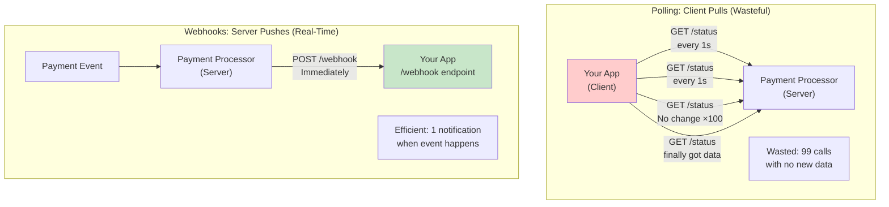

<Hero title="Webhooks and Callbacks" subtitle="Master event-driven integrations where servers push updates to clients" imageAlt="Webhooks illustration" size="large" />

## TL;DR

Webhooks are server-initiated HTTP callbacks: server POSTs to your endpoint when something happens (instead of you polling). Sign webhooks with HMAC-SHA256 to verify authenticity. Handle duplicate deliveries with idempotent endpoints (track event IDs). Implement exponential backoff retries: give webhooks max 24 hours to deliver. Use at-least-once semantics (duplicates expected, your code must handle). Webhooks enable real-time integrations; use message queues for guaranteed ordering and delivery.

## Learning Objectives

- Understand webhook architecture and push-vs-pull patterns
- Implement webhook signing and signature verification
- Handle duplicate deliveries with idempotency and deduplication
- Design reliable retry strategies with exponential backoff
- Build webhook infrastructure (dispatcher, retry queue, dead-letter handling)
- Recognize webhook limitations and alternative patterns
- Debug webhook delivery failures
- Design webhook event schemas

## Motivation: Webhooks vs Polling

Imagine you integrate with a payment processor. Two approaches:

**Polling (Old Way)**:
```
Your App:
  while True:
    sleep(1)  # Every second
    status = payment_processor.get_status(order_id)
    if status.paid:
      fulfill_order()
```
Problems: Wasteful (99% of calls get no data), slow (1 second latency), expensive (1000 orders * 1 call/sec = 1M API calls/day).

**Webhooks (Better Way)**:
```
Payment Processor → Your App:
  POST /webhook/payment with { orderId, status, amount }
  Your App immediately processes, no polling needed
```
Benefits: Instant notification, no wasted API calls, real-time.

But webhooks introduce challenges: network failures, duplicate delivery, signature spoofing, performance/reliability.

<Figure caption="Webhook vs Polling: Architecture Comparison">



</Figure>

## Core Concepts

**Webhook**: HTTP POST request from server to client endpoint when something happens. Asynchronous, unidirectional.

**Event ID**: Unique identifier for webhook. Enables deduplication if webhook delivered twice.

**Signature**: HMAC-SHA256 hash of payload. Proves webhook came from trusted server, not attacker.

**Idempotency**: Webhook endpoint safe to call twice; second call doesn't duplicate side-effects.

**At-Least-Once Delivery**: Webhook delivered at least once, possibly multiple times. Client must handle duplicates.

**Retry Strategy**: If webhook delivery fails, retry with exponential backoff (1s, 2s, 4s, 8s...) up to 24 hours.

## Practical Examples

<Tabs>
  <TabItem value="stripe-webhook" label="Stripe Webhook (Real-World)" default>
```python
# Receiving webhooks from Stripe payment processor

import hmac
import json
import hashlib
from datetime import datetime
from flask import Flask, request
from database import db

app = Flask(__name__)
STRIPE_WEBHOOK_SECRET = 'whsec_...'  # From Stripe dashboard

@app.post('/webhook/stripe')
def handle_stripe_webhook():
    """
    Handle payment events from Stripe.
    Stripe sends:
      charge.succeeded, charge.failed, payment_intent.succeeded, etc.
    """
    
    # Get raw body (must verify signature before parsing JSON)
    payload = request.get_data(as_text=True)
    signature = request.headers.get('Stripe-Signature', '')
    
    # Verify signature
    try:
        event = verify_stripe_signature(payload, signature)
    except ValueError as e:
        return {'error': 'Invalid signature'}, 401
    
    # Extract event details
    event_id = event['id']  # Unique per webhook
    event_type = event['type']
    event_data = event['data']['object']
    
    # Deduplication: check if already processed
    existing = db.query_one(
        'SELECT * FROM webhooks WHERE event_id = ?',
        event_id
    )
    if existing:
        return {'ok': True, 'duplicate': True}
    
    # Process based on event type
    try:
        if event_type == 'charge.succeeded':
            handle_charge_succeeded(event_data)
        elif event_type == 'charge.failed':
            handle_charge_failed(event_data)
        elif event_type == 'payment_intent.payment_failed':
            handle_payment_failed(event_data)
        else:
            # Unknown event type, still acknowledge receipt
            pass
        
        # Mark as processed (deduplication)
        db.execute(
            'INSERT INTO webhooks (event_id, event_type, received_at) VALUES (?, ?, ?)',
            event_id, event_type, datetime.utcnow()
        )
        return {'ok': True}
    
    except Exception as e:
        # Don't mark as processed; Stripe will retry
        app.logger.error(f'Webhook processing failed: {e}', exc_info=True)
        return {'error': 'Processing failed'}, 500

def verify_stripe_signature(payload, signature_header):
    """
    Verify Stripe signature format: t=timestamp,v1=signature
    """
    try:
        parts = dict(part.split('=') for part in signature_header.split(','))
        timestamp = int(parts['t'])
        signature = parts['v1']
    except (KeyError, ValueError):
        raise ValueError('Invalid signature format')
    
    # Stripe uses: hmac_sha256(timestamp.payload, secret)
    signed_content = f'{timestamp}.{payload}'
    expected = hmac.new(
        STRIPE_WEBHOOK_SECRET.encode(),
        signed_content.encode(),
        hashlib.sha256
    ).hexdigest()
    
    if not hmac.compare_digest(expected, signature):
        raise ValueError('Signature mismatch')
    
    return json.loads(payload)

def handle_charge_succeeded(charge):
    """Process successful payment"""
    order_id = charge['metadata']['order_id']
    amount = charge['amount'] / 100  # Stripe uses cents
    
    db.execute(
        'UPDATE orders SET status = ? WHERE id = ?',
        'PAYMENT_CONFIRMED', order_id
    )
    
    # Trigger fulfillment
    send_to_fulfillment_queue(order_id)

def handle_charge_failed(charge):
    """Process failed payment"""
    order_id = charge['metadata']['order_id']
    reason = charge['failure_message']
    
    db.execute(
        'UPDATE orders SET status = ?, failure_reason = ? WHERE id = ?',
        'PAYMENT_FAILED', reason, order_id
    )
    
    # Notify customer
    send_payment_failure_email(order_id)
```
  </TabItem>

  <TabItem value="github-webhook" label="GitHub Webhook (Build Deployment)">
```python
# GitHub webhook: deploy on push to main branch

import hmac
import hashlib
import subprocess
from flask import Flask, request

app = Flask(__name__)
GITHUB_WEBHOOK_SECRET = 'your_webhook_secret'

@app.post('/webhook/github')
def handle_github_webhook():
    """Deploy application when code pushed to main"""
    
    # Verify signature
    signature = request.headers.get('X-Hub-Signature-256', '')
    payload = request.get_data(as_text=True)
    
    expected = 'sha256=' + hmac.new(
        GITHUB_WEBHOOK_SECRET.encode(),
        payload.encode(),
        hashlib.sha256
    ).hexdigest()
    
    if not hmac.compare_digest(expected, signature):
        return {'error': 'Invalid signature'}, 401
    
    # Parse event
    event = request.json
    
    # Filter: only deploy on push to main
    if event['ref'] != 'refs/heads/main':
        return {'ok': True, 'skipped': 'Not main branch'}
    
    # Deduplication: GitHub sends same webhook multiple times during network issues
    delivery_id = request.headers.get('X-GitHub-Delivery')
    if is_duplicate(delivery_id):
        return {'ok': True, 'duplicate': True}
    
    # Trigger deployment
    try:
        subprocess.run(['./deploy.sh'], check=True, timeout=300)
        record_delivery(delivery_id, 'success')
        return {'ok': True, 'deployed': True}
    except Exception as e:
        record_delivery(delivery_id, 'failed')
        return {'error': str(e)}, 500

def is_duplicate(delivery_id):
    # Check if we've already processed this delivery
    pass

def record_delivery(delivery_id, status):
    # Log delivery for audit
    pass
```
  </TabItem>

  <TabItem value="custom-webhook" label="Custom Webhook System">
```python
# Build your own webhook/event notification system

from datetime import datetime, timedelta
from enum import Enum
import json
import hmac
import hashlib
import requests
from database import db
from celery import shared_task

class EventType(Enum):
    ORDER_CREATED = 'order.created'
    ORDER_CONFIRMED = 'order.confirmed'
    ORDER_SHIPPED = 'order.shipped'
    ORDER_DELIVERED = 'order.delivered'
    ORDER_CANCELED = 'order.canceled'
    PAYMENT_RECEIVED = 'payment.received'

class WebhookEvent:
    def __init__(self, event_type: EventType, data: dict, timestamp: datetime = None):
        self.id = generate_event_id()  # Unique ID for deduplication
        self.type = event_type.value
        self.data = data
        self.timestamp = timestamp or datetime.utcnow()
    
    def to_json(self):
        return json.dumps({
            'id': self.id,
            'type': self.type,
            'data': self.data,
            'timestamp': self.timestamp.isoformat()
        })

# Server Side: Registering webhooks and dispatching events

class WebhookRegistry:
    """Store and manage webhook registrations"""
    
    @staticmethod
    def register(callback_url: str, events: list[EventType], secret: str):
        """
        User/app registers to receive webhooks
        events: list of EventType they want to receive
        secret: used for HMAC signature
        """
        db.execute(
            '''
            INSERT INTO webhooks 
            (callback_url, events, secret, is_active, created_at)
            VALUES (?, ?, ?, ?, ?)
            ''',
            callback_url,
            json.dumps([e.value for e in events]),
            secret,
            True,
            datetime.utcnow()
        )
    
    @staticmethod
    def get_webhooks_for_event(event_type: EventType):
        """Get all registered webhooks interested in this event"""
        webhooks = db.query_all(
            'SELECT * FROM webhooks WHERE is_active = ? AND events LIKE ?',
            True,
            f'%{event_type.value}%'
        )
        return webhooks
    
    @staticmethod
    def get_failed_webhooks():
        """Get webhooks that need retry (failed, not yet max retries)"""
        cutoff = datetime.utcnow() - timedelta(seconds=30)
        return db.query_all(
            '''
            SELECT * FROM webhook_queue
            WHERE status = ? AND retry_count < ? AND last_attempt_at < ?
            ''',
            'FAILED', 5, cutoff
        )

# Event dispatching

def dispatch_event(event: WebhookEvent):
    """Dispatch event to all registered webhooks"""
    webhooks = WebhookRegistry.get_webhooks_for_event(
        EventType(event.type)
    )
    
    for webhook in webhooks:
        enqueue_webhook_delivery(webhook, event)

def enqueue_webhook_delivery(webhook: dict, event: WebhookEvent):
    """Queue webhook for async delivery"""
    db.execute(
        '''
        INSERT INTO webhook_queue
        (webhook_id, event_id, event_type, payload, status, retry_count, created_at)
        VALUES (?, ?, ?, ?, ?, ?, ?)
        ''',
        webhook['id'],
        event.id,
        event.type,
        event.to_json(),
        'PENDING',
        0,
        datetime.utcnow()
    )
    # Trigger async task
    deliver_webhook_async.delay(webhook['id'], event.id)

# Celery task for async delivery

@shared_task(max_retries=5, default_retry_delay=30)
def deliver_webhook_async(webhook_id: int, event_id: str):
    """Async task to deliver webhook with retries"""
    webhook = db.query_one('SELECT * FROM webhooks WHERE id = ?', webhook_id)
    queue_entry = db.query_one(
        'SELECT * FROM webhook_queue WHERE webhook_id = ? AND event_id = ?',
        webhook_id, event_id
    )
    
    if queue_entry['status'] == 'SUCCESS':
        return  # Already delivered
    
    payload = queue_entry['payload']
    signature = sign_payload(payload, webhook['secret'])
    
    try:
        response = requests.post(
            webhook['callback_url'],
            data=payload,
            headers={
                'Content-Type': 'application/json',
                'X-Webhook-Signature': f'sha256={signature}',
                'X-Webhook-Event-Id': event_id,
                'X-Webhook-Attempt': str(queue_entry['retry_count'] + 1)
            },
            timeout=30
        )
        
        if response.status_code == 200:
            # Success
            db.execute(
                'UPDATE webhook_queue SET status = ? WHERE id = ?',
                'SUCCESS', queue_entry['id']
            )
        else:
            # Server returned error, retry
            raise Exception(f'HTTP {response.status_code}')
    
    except Exception as e:
        # Delivery failed, schedule retry with backoff
        retry_count = queue_entry['retry_count'] + 1
        backoff = 2 ** (retry_count - 1)  # Exponential: 1, 2, 4, 8, 16 seconds
        
        db.execute(
            '''
            UPDATE webhook_queue 
            SET status = ?, retry_count = ?, last_attempt_at = ?, last_error = ?
            WHERE id = ?
            ''',
            'FAILED', retry_count, datetime.utcnow(), str(e), queue_entry['id']
        )
        
        # Retry: exponential backoff with jitter
        retry_delay = backoff + random.randint(0, backoff // 2)
        raise deliver_webhook_async.retry(
            exc=e,
            countdown=retry_delay,
            max_retries=5
        )

def sign_payload(payload: str, secret: str) -> str:
    """Create HMAC-SHA256 signature"""
    return hmac.new(
        secret.encode(),
        payload.encode(),
        hashlib.sha256
    ).hexdigest()

# Usage in application

def create_order(user_id, items):
    """Create order and notify via webhooks"""
    order = db.insert_order(user_id, items)
    
    event = WebhookEvent(
        EventType.ORDER_CREATED,
        {
            'order_id': order['id'],
            'user_id': user_id,
            'total': order['total'],
            'items': items
        }
    )
    
    dispatch_event(event)  # Async webhook delivery
    return order

def confirm_order(order_id):
    """Confirm order, notify payment received"""
    order = db.update_order(order_id, status='CONFIRMED')
    
    event = WebhookEvent(
        EventType.ORDER_CONFIRMED,
        {
            'order_id': order['id'],
            'confirmation_number': generate_confirmation_number()
        }
    )
    
    dispatch_event(event)
    return order
```
  </TabItem>
</Tabs>

## Webhook Signing and Verification

CRITICAL: Always verify webhook signatures to prevent spoofing:

<Tabs>
  <TabItem value="hmac-signing" label="HMAC-SHA256 Signing" default>
```python
# Sender (Service) creates signature

import hmac
import hashlib
import json

def create_signed_webhook(payload: dict, secret: str) -> tuple:
    """Create webhook with HMAC signature"""
    
    # Convert to JSON
    payload_json = json.dumps(payload, separators=(',', ':'), sort_keys=True)
    
    # Create signature: HMAC-SHA256(payload, secret)
    signature = hmac.new(
        secret.encode(),
        payload_json.encode(),
        hashlib.sha256
    ).hexdigest()
    
    return payload_json, signature

# Send webhook
payload = {'orderId': 123, 'status': 'paid', 'amount': 99.99}
secret = 'your_webhook_secret_key'
payload_json, signature = create_signed_webhook(payload, secret)

requests.post(
    'https://client.example.com/webhook',
    data=payload_json,
    headers={
        'Content-Type': 'application/json',
        'X-Webhook-Signature': f'sha256={signature}'
    }
)
```

```python
# Receiver (Client) verifies signature

from flask import Flask, request
import hmac
import hashlib
import json

app = Flask(__name__)
SECRET = 'your_webhook_secret_key'

@app.post('/webhook')
def handle_webhook():
    """Verify webhook before processing"""
    
    # Get signature from header
    signature_header = request.headers.get('X-Webhook-Signature', '')
    
    # Get raw body (MUST use raw bytes, not parsed JSON)
    payload_raw = request.get_data(as_text=True)
    
    # Calculate expected signature
    expected_signature = hmac.new(
        SECRET.encode(),
        payload_raw.encode(),
        hashlib.sha256
    ).hexdigest()
    
    # Compare signatures (timing-safe comparison!)
    if not hmac.compare_digest(
        f'sha256={expected_signature}',
        signature_header
    ):
        return {'error': 'Invalid signature'}, 401
    
    # Signature verified! Safe to process
    payload = json.loads(payload_raw)
    process_webhook(payload)
    return {'ok': True}

def process_webhook(payload):
    """Handle verified webhook"""
    print(f'Processing order {payload["orderId"]}')
```
  </TabItem>

  <TabItem value="common-mistakes" label="Common Signature Mistakes">
```python
# ❌ MISTAKE 1: Not using timing-safe comparison
if expected == signature:  # Vulnerable to timing attacks!
    process_webhook()

# ✅ CORRECT: Use hmac.compare_digest
if hmac.compare_digest(expected, signature):
    process_webhook()

# ❌ MISTAKE 2: Using parsed JSON instead of raw body
payload = request.json  # Wrong! May not match original bytes
signature = hmac.new(SECRET, json.dumps(payload).encode()).hexdigest()

# ✅ CORRECT: Always use raw request body
payload_raw = request.get_data(as_text=True)
signature = hmac.new(SECRET, payload_raw.encode()).hexdigest()

# ❌ MISTAKE 3: Signing with different format
# Sender uses: json.dumps(payload, separators=(',', ':'), sort_keys=True)
# Receiver uses: json.dumps(payload, indent=2)
# Result: signatures don't match!

# ✅ CORRECT: Use same format both sides
JSON_FORMAT = json.dumps(payload, separators=(',', ':'), sort_keys=True)
```
  </TabItem>
</Tabs>

## Idempotency and Duplicate Handling

Webhooks use at-least-once delivery semantics. Duplicates WILL happen:

<Tabs>
  <TabItem value="idempotency-pattern" label="Idempotent Webhook Endpoint" default>
```python
# Idempotent endpoint: safe to call twice

from flask import Flask, request
from database import db

app = Flask(__name__)

@app.post('/webhook/payment')
def handle_payment_webhook():
    """Process payment webhook idempotently"""
    
    event = request.json
    event_id = event['id']  # Unique per webhook (e.g., 'evt_123abc')
    
    # Step 1: Check if already processed (deduplication)
    existing = db.query_one(
        'SELECT id FROM webhook_events WHERE event_id = ?',
        event_id
    )
    
    if existing:
        # Already processed, return same response (idempotent)
        return {
            'ok': True,
            'status': 'already_processed',
            'event_id': event_id
        }, 200
    
    # Step 2: Process the event (atomic transaction)
    try:
        # Use database transaction
        with db.transaction():
            # Record event as processed FIRST (prevents duplicate processing)
            db.execute(
                '''
                INSERT INTO webhook_events 
                (event_id, event_type, received_at)
                VALUES (?, ?, ?)
                ''',
                event_id,
                event['type'],
                datetime.utcnow()
            )
            
            # Then process the actual event
            if event['type'] == 'payment.confirmed':
                payment_data = event['data']
                db.execute(
                    '''
                    UPDATE orders
                    SET status = ?, payment_id = ?
                    WHERE id = ?
                    ''',
                    'CONFIRMED',
                    payment_data['payment_id'],
                    payment_data['order_id']
                )
            
            # Commit both inserts atomically
        
        return {'ok': True, 'event_id': event_id}, 200
    
    except Exception as e:
        # If error occurs, don't record as processed
        # Webhook will retry
        app.logger.error(f'Webhook failed: {e}', exc_info=True)
        return {'error': 'Processing failed'}, 500
```
  </TabItem>

  <TabItem value="idempotency-key" label="Idempotency Keys (Client Side)">
```python
# When YOUR app calls external API, use idempotency keys
# Allows you to safely retry without duplicating

import requests
import uuid

def charge_payment(order_id: int, amount: float) -> dict:
    """Charge payment with idempotency"""
    
    # Generate or retrieve idempotency key
    idempotency_key = get_or_create_idempotency_key(order_id)
    
    # Call payment API with idempotency key
    response = requests.post(
        'https://payment-api.example.com/charges',
        json={
            'order_id': order_id,
            'amount': amount
        },
        headers={
            'Idempotency-Key': idempotency_key  # Server returns same result if retry
        }
    )
    
    if response.status_code == 200:
        charge = response.json()
        record_charge(order_id, charge['id'])
        return charge
    else:
        raise Exception(f'Charge failed: {response.status_code}')

def get_or_create_idempotency_key(order_id: int) -> str:
    """Generate stable idempotency key for order"""
    # Server stores this; if network fails and we retry with same key,
    # server recognizes retry and returns same result (no duplicate charge)
    existing = db.query_one(
        'SELECT idempotency_key FROM orders WHERE id = ?',
        order_id
    )
    
    if existing:
        return existing['idempotency_key']
    
    # Generate new UUID
    key = str(uuid.uuid4())
    db.execute(
        'UPDATE orders SET idempotency_key = ? WHERE id = ?',
        key, order_id
    )
    return key
```
  </TabItem>
</Tabs>

## Retry Strategy with Exponential Backoff

Design webhooks for eventual consistency with retries:

<Tabs>
  <TabItem value="backoff" label="Exponential Backoff with Jitter" default>
```python
import time
import random

def retry_webhook_with_backoff(webhook_url, payload, max_attempts=10):
    """Retry webhook delivery with exponential backoff"""
    
    for attempt in range(1, max_attempts + 1):
        try:
            response = requests.post(
                webhook_url,
                json=payload,
                timeout=30
            )
            
            if response.status_code == 200:
                return True  # Success
            
            # Server returned error (4xx, 5xx)
            raise Exception(f'HTTP {response.status_code}')
        
        except Exception as e:
            # Check if max attempts reached
            if attempt == max_attempts:
                # All retries exhausted
                send_alert(f'Webhook failed after {max_attempts} attempts: {e}')
                return False
            
            # Calculate backoff: exponential + jitter
            base_delay = 2 ** (attempt - 1)  # 1, 2, 4, 8, 16, 32...
            jitter = random.uniform(0, base_delay * 0.1)  # +/- 10% random
            delay = base_delay + jitter
            
            print(f'Attempt {attempt} failed, retrying in {delay:.1f}s: {e}')
            time.sleep(delay)
    
    return False

# Retry schedule (example with 10 attempts, ~24 hours total):
# Attempt 1: Immediate
# Attempt 2: 1s + jitter
# Attempt 3: 2s + jitter
# Attempt 4: 4s + jitter
# Attempt 5: 8s + jitter
# Attempt 6: 16s + jitter
# Attempt 7: 32s + jitter      (~1 minute total)
# Attempt 8: 64s + jitter      (~2 minutes total)
# Attempt 9: 128s + jitter     (~4 minutes total)
# Attempt 10: 256s + jitter    (~8 minutes total)
# Total time: ~15 minutes to exhaust retries
# For longer retries (24h): use longer base delays or more attempts
```
  </TabItem>

  <TabItem value="celery-retries" label="Celery Task Retries">
```python
from celery import shared_task
from celery.exceptions import MaxRetriesExceededError
import requests

@shared_task(bind=True, max_retries=10, autoretry_for=(Exception,))
def deliver_webhook_task(self, webhook_url: str, payload: dict):
    """Celery task with automatic exponential backoff"""
    
    try:
        response = requests.post(
            webhook_url,
            json=payload,
            timeout=30
        )
        
        if response.status_code != 200:
            # Celery will auto-retry with backoff
            raise Exception(f'HTTP {response.status_code}')
        
        return {'status': 'delivered'}
    
    except Exception as exc:
        try:
            # Retry with exponential backoff
            # Celery uses: base ** retry_count (default base=2)
            raise self.retry(exc=exc, countdown=2 ** self.request.retries)
        
        except MaxRetriesExceededError:
            # Max retries reached, log and give up
            app.logger.error(f'Webhook delivery failed after max retries: {webhook_url}')
            # Send to dead-letter queue for manual review
            record_failed_webhook(webhook_url, payload)
```
  </TabItem>
</Tabs>

## Common Webhook Patterns and Pitfalls

<Showcase sections={[
  {
    title: "Pitfall: Webhooks Delivered Out of Order",
    description: "Events arrive out of sequence (OrderCreated after OrderShipped). Business logic assumes ordering.",
    fix: "Don't assume ordering. Use event versioning/timestamps. Design idempotent handlers."
  },
  {
    title: "Pitfall: Webhook Endpoint Timeouts",
    description: "Slow endpoint (>30s) causes webhooks to timeout and retry infinitely.",
    fix: "Webhook handler must respond <5 seconds. Queue heavy work asynchronously."
  },
  {
    title: "Pitfall: Unbounded Webhook Queue Growth",
    description: "Receiver constantly down; webhook queue grows to millions, never delivered.",
    fix: "Max TTL on webhooks (e.g., 24h). Dead-letter failed webhooks for review."
  },
  {
    title: "Pitfall: No Webhook Signing",
    description: "Attacker spoofs webhooks, triggers false orders/payments.",
    fix: "Always sign with HMAC-SHA256. Verify signature before processing."
  },
  {
    title: "Pattern: Webhook Dashboard",
    description: "Track webhook delivery status, failures, retries. Resend failed webhooks.",
    fix: "Build admin UI: list webhooks, delivery attempts, error logs, manual retry button."
  },
  {
    title: "Pattern: Dead-Letter Queue",
    description: "Webhooks that fail all retries sent to DLQ for manual investigation.",
    fix: "Prevents silent failures. Alerts notify ops. Can replay webhooks."
  }
]} />

## Webhook vs Alternatives

| Pattern | Pros | Cons | Use Case |
|---------|------|------|----------|
| **Webhooks** | Real-time, no polling, simple | Unreliable network, duplicates, no ordering | Real-time notifications (payments, deploys) |
| **Message Queue** | Ordered, exactly-once, retries built-in | Complex setup, slower (ms to s latency) | Mission-critical (financial txns, inventory) |
| **Polling** | Simple, reliable | Wasteful, latency, scales poorly | Non-critical, low-frequency changes |
| **WebSocket** | Bidirectional, real-time | Requires persistent connection, firewall issues | Chat, live updates, games |
| **Server-Sent Events (SSE)** | Simple streaming, one-way | Limited browser support, firewall issues | Live updates, dashboard feeds |

## Webhook Delivery Checklist

<Checklist items={[
  "Are webhooks signed with HMAC-SHA256?",
  "Is signature verified using timing-safe comparison (hmac.compare_digest)?",
  "Are endpoint handlers idempotent (safe to call twice)?",
  "Is event_id used for deduplication?",
  "Are failed webhooks retried with exponential backoff?",
  "Is max TTL enforced (e.g., no retries older than 24h)?",
  "Do endpoints respond < 5 seconds (heavy work deferred to queue)?",
  "Are failed webhooks sent to dead-letter queue for review?",
  "Is there a webhook delivery dashboard (status, logs, retry)?",
  "Are webhook failures alerted to ops/monitoring?",
  "Can old webhooks be replayed (for debugging)?",
  "Is the webhook format documented (schema, examples)?",
]} />

## Self-Check

1. **Why sign webhooks?** Prove they came from trusted source, prevent spoofing.
2. **What's idempotency?** Webhook endpoint safe to call twice; second call doesn't duplicate side-effects.
3. **Why retry with backoff?** Avoid overwhelming receiver; transient failures recover naturally.
4. **What if webhook endpoint is down?** Retry with exponential backoff up to 24h; eventually give up and send to DLQ.
5. **Can webhooks be out of order?** Yes. Don't assume ordering; design handlers to be order-agnostic.

:::info
**One Takeaway**: Webhooks are excellent for real-time integrations but require careful handling: sign them, handle duplicates, retry failures, and monitor delivery. For mission-critical operations, use message queues instead.
:::

## Next Steps

- Implement **webhook delivery dashboard** for monitoring and replay
- Study **message queues** (Kafka, RabbitMQ) for guaranteed delivery
- Learn **event sourcing** for building auditable systems
- Explore **CQRS** (command query responsibility segregation) pattern
- Build **webhook templates** for common integrations (Stripe, GitHub, etc.)

## References

- Stripe Webhooks: https://stripe.com/docs/webhooks
- GitHub Webhooks: https://docs.github.com/en/developers/webhooks-and-events/webhooks
- Newman, S. (2015). *Building Microservices*. O'Reilly Media.
- AWS SQS + Lambda for webhook pattern: https://aws.amazon.com/blogs/compute/
- Temporal Workflows for distributed transactions: https://temporal.io/
