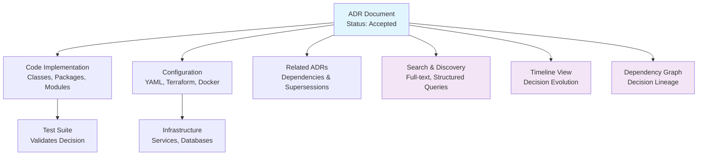

<Hero
  title="ADR Catalog & Traceability"
  description="Organize and track architecture decisions across projects and time"
  size="large"
/>

## TL;DR

Store ADRs in version control within a standardized directory (e.g., `docs/adr/` or `decisions/`). Number sequentially (ADR-001, ADR-002, etc.). Track decision status consistently: Proposed, Accepted, Superseded, or Deprecated. Link ADRs bidirectionally to code implementations, related ADRs, and project documentation. Use metadata (date, author, impact area) to make decisions discoverable through search and filtering. Maintain an index or catalog file for easy navigation and discoverability across the organization.

## Learning Objectives

You will be able to:

- Design and implement a scalable ADR catalog structure for discovery across teams
- Track decision status, supersessions, and deprecations with clear lineage
- Establish bidirectional links between ADRs and codebase implementations
- Create automated tooling to maintain catalog health and prevent decision drift
- Leverage ADR catalogs for effective onboarding and architectural audits

## Motivating Scenario

Your organization has grown to 50+ engineers across multiple teams. Over the past three years, you've made hundreds of architectural decisions. When a new engineer joins, they ask: "Why do we use PostgreSQL instead of MongoDB?" When investigating a production issue, you need to understand: "What were the trade-offs when we chose this caching strategy?" When planning a major refactor, you discover: "We already made a decision about this years ago—and it's been superseded twice since." Without a well-organized ADR catalog with clear traceability, this institutional knowledge becomes fragmented and inaccessible.

## Core Content

### The Value of ADR Catalogs

An ADR catalog is more than a collection of documents—it's the institutional memory of your architectural evolution. It answers critical questions: What constraints led us here? Who decided this? Has this decision been challenged or replaced? What other decisions depend on this one? Without a systematic approach to organizing ADRs, decisions become tribal knowledge, lost when people leave, and difficult to recover when you need to understand why something was built a certain way.

Organizations that invest in ADR catalogs report measurable benefits: faster onboarding (new engineers understand context), fewer repeated mistakes (decisions are discoverable), better compliance (audit trails are clear), and improved architectural coherence (decisions are explicitly linked to implementation).

### Directory Structure & Naming Conventions

The foundation of a discoverable ADR catalog is consistent structure and naming. Consider this organization:

```
docs/
  adr/
    README.md                          # Index and guide
    TEMPLATE.md                        # Standard template
    decisions/
      0001-use-postgresql.md
      0002-implement-cqrs-pattern.md
      0003-adopt-kubernetes.md
      0004-event-sourcing-for-audit.md
    superseded/
      0001-mysql-initial-choice.md     # Mark why superseded
    index.json                          # Machine-readable index
```

Sequential numbering (ADR-0001, ADR-0002, etc.) provides chronological context and prevents conflicts. Separate subdirectories for active vs. superseded decisions keep the catalog navigable. A machine-readable index enables tooling: IDE plugins to search ADRs, CI/CD scripts to detect violations, dashboards to visualize decision landscape.

### Metadata & Indexing

Each ADR should carry metadata for discoverability:

```markdown
---
adr: 0047
title: Implement Redis for Session Storage
status: Accepted
decision_date: 2025-02-10
author: Alice Chen (Backend Team)
supersedes: ADR-0028 (In-Memory Session Store)
affects: ["session-management", "authentication", "performance"]
dependencies: ["ADR-0012", "ADR-0035"]
tags: ["caching", "session-mgmt", "infrastructure"]
---
```

Machine-readable headers enable filtering by team, domain, date range, or status. Tags create cross-cutting views (e.g., "show me all security decisions" or "all deprecated decisions"). Impact areas link decisions to code organization, so engineers can discover relevant ADRs as they work.

### Status Tracking & Lifecycle

Define clear status definitions and lifecycle rules:

- **Proposed**: Under discussion, not yet decided. Typically reviewed in architecture board.
- **Accepted**: Decided and approved. Triggers implementation.
- **Deprecated**: No longer recommended, but still in use in some parts of the codebase. Use if replacement hasn't been uniformly adopted.
- **Superseded**: Replaced by a newer ADR. Links to the superseding decision. Signals that code following the old decision should eventually migrate.

Status transitions should be explicit and auditable. ADR-0001 accepted on 2025-02-10; superseded by ADR-0042 on 2025-10-15. This allows tracking of decision evolution and understanding when architectural shifts occurred.

### Linking ADRs to Implementation

Traceability is where ADR catalogs become truly valuable. Link decisions to:

1. **Code locations** (classes, packages, modules that implement the decision)
2. **Configuration files** (Kubernetes manifests, Docker Compose, Terraform, etc.)
3. **Related ADRs** (dependencies and alternatives)
4. **Test suites** (integration tests validating the decision)
5. **Infrastructure components** (databases, queues, services)

Example linkage in ADR-0015 (PostgreSQL for event store):

```markdown
## Implementation Locations

- Package: `com.acme.eventstore.*`
- Config: `config/database.yaml`
- Tests: `integration-tests/eventstore-suite.java`
- Infrastructure: Kubernetes StatefulSet `postgres-eventstore`
- Related ADRs: ADR-0008 (Event Sourcing Pattern), ADR-0009 (Database Replication)
```

Code comments should reference ADRs:

```java
// See ADR-0015: PostgreSQL for event store
// Rationale: ACID guarantees + JSON support
class PostgresEventStore implements EventStore {
    // implementation
}
```

### Bidirectional Navigation

Make it easy to navigate from code to ADR and back:

- **Code to ADR**: IDE plugin or Makefile target: `make find-adr FILE=EventStore.java` → lists relevant ADRs
- **ADR to Code**: Each ADR links to implementing code with file paths and line numbers
- **ADR to ADR**: Dependency graphs showing decision lineage

This bidirectional traceability is invaluable during:
- **Code reviews**: "Why did we make this choice?" → Link to ADR
- **Refactoring**: "Is this decision still valid?" → Check ADR status
- **Incident response**: "Was this configuration intentional?" → Reference ADR context

### Building Searchability

Enable multiple discovery paths:

1. **Full-text search**: Git-based docs sites (like Docusaurus) index ADRs. Search for "caching" returns all ADRs mentioning caches.
2. **Structured queries**: `adr list --status=Accepted --tags=security` → security decisions currently in force
3. **Timeline view**: Visual timeline of decisions by date, team, or domain
4. **Dependency graph**: Graph visualization showing decision dependencies (ADR-X depends on ADR-Y)
5. **Impact map**: Which ADRs affect this service/module?

Example Bash script for searching:

```bash
#!/bin/bash
# find-adrs: Search ADR catalog
grep -r "$1" docs/adr/decisions/ | \
  cut -d: -f1 | \
  sort -u | \
  while read file; do
    echo "=== $(basename $file) ==="
    grep -E "^(title|status|affects):" "$file"
  done
```

### Managing ADR Supersessions

When a decision is superseded, don't delete it. Instead, mark it clearly and maintain the lineage:

**Old ADR-0028: In-Memory Session Storage (Superseded)**
```markdown
status: Superseded
superseded_by: ADR-0047
reason: In-memory sessions lost on pod restart; Redis provides durability
migration_deadline: 2025-06-30
action_required: |
  - Migrate session code from InMemoryStore to RedisStore
  - Update configuration to point to Redis
  - Run integration tests
```

Create a "migration playbook" for superseded decisions, guiding teams on how to migrate. Track adoption: which services still follow the old decision? This prevents architectural drift where different parts of the system follow contradictory decisions.

### Organizational Scale & Governance

As your ADR catalog grows, establish governance:

- **Architecture board** reviews and approves ADRs (prevents frivolous decisions)
- **Quarterly audits** identify stale ADRs and opportunities to supersede outdated decisions
- **Team assignment**: Which team "owns" this ADR? Who's responsible for keeping it current?
- **Deprecation policy**: How long does a decision stay in the catalog after being superseded?

For organizations with 100+ ADRs, consider domain-specific catalogs (backend decisions separate from frontend), or use tags to organize decisions by concern (infrastructure, data, API design, etc.).

<Figure caption="ADR Catalog Organization and Traceability Flow">

</Figure>

### Example: Complete ADR with Traceability

```markdown
---
adr: 0047
title: Use Redis for Session Storage
status: Accepted
decision_date: 2025-02-10
author: Alice Chen (Backend Team Lead)
affects: ["session-mgmt", "authentication"]
dependencies: ["ADR-0012", "ADR-0035"]
supersedes: ADR-0028
tags: ["infrastructure", "caching", "critical"]
---

## Context
Sessions stored in application memory are lost on pod restart.
Kubernetes deployments require stateless services.
Current solution causes session loss during deployments.

## Decision
Use Redis (cluster mode) for distributed session storage.
Configuration via environment variables.
All session-related services deployed with Redis client.

## Consequences
Positive:
- Sessions survive pod restarts
- Can scale sessions independently
- Session sharing across service replicas

Negative:
- Additional Redis cluster to operate
- Network latency for session lookups
- Redis failure impacts authentication

## Implementation Locations
- Package: `com.acme.session.*`
- Service: `session-service` (Kubernetes Deployment)
- Config: `config/session.yaml`
- Tests: `test/SessionStoreTest.java`
- Infrastructure: `terraform/redis-cluster.tf`

## Related ADRs
- ADR-0028 (In-Memory Session Store) [Superseded by this decision]
- ADR-0012 (Kubernetes for Container Orchestration) [Prerequisite]
- ADR-0035 (Redis for Caching Layer) [Related decision]

## Migration Notes
Teams using ADR-0028 must migrate by 2025-06-30.
See playbook: `docs/migration-to-redis-sessions.md`
```

## Patterns & Pitfalls

**Pattern: Regular ADR Reviews**
Quarterly review of the entire catalog. Identify stale, contradictory, or superseded decisions. Update status, add clarifications. Keeps catalog fresh and prevents decision drift.

**Pattern: ADR Dependency Graph**
Visualize decision dependencies. Some decisions depend on others (e.g., "event sourcing" depends on "immutable event store"). Graph helps identify decision clusters and areas of architectural stability vs. change.

**Pitfall: ADR Chaos**
Hundreds of ADRs with no organization. No search. No clear status. Becomes unmaintainable. Invest in structure upfront: directory organization, metadata, automation.

**Pitfall: Supersessions Without Migration**
An ADR is superseded, but old code still follows the old decision. This creates architectural inconsistency. Establish clear migration deadlines and track adoption.

**Pitfall: Lose Decision Context**
ADR describes the decision but loses the context: who advocated for this? What alternatives were strongly considered? What was the political context? Capture context in the ADR; it's invaluable when revisiting old decisions.

## When to Use / When Not to Use

**Use ADR catalogs when:**
- Team size > 10 engineers (decisions become organizational knowledge)
- System longevity > 2 years (architectural decisions accumulate)
- Distributed teams (decisions can't be communicated verbally)
- Regulated industries (audit trail required)
- High-stakes decisions (caching strategy, data storage, security model)

**Don't over-invest in ADR catalogs for:**
- Tiny startups (< 5 engineers) moving very fast and pivoting frequently
- Greenfield projects with fewer than 3-4 major decisions
- Decisions easily reversible (choice of logging framework)

**Balance:** Document important decisions with lasting impact. Don't create ADRs for every implementation detail. ADRs are for decisions that constrain future work.

## Operational Considerations

- **Storage**: Store ADRs in version control alongside code. Use Markdown for human readability and version history.
- **Automation**: Write scripts to validate ADR structure, check for broken links, report stale decisions.
- **Access**: Make ADRs searchable in company wikis, documentation sites, and IDE plugins.
- **Governance**: Establish review process. Who approves ADRs? What's the turnaround time?
- **Maintenance burden**: Allocate time for quarterly reviews and updates. Without maintenance, catalogs decay.

## Design Review Checklist

<Checklist items={["ADR catalog exists in version control with clear directory structure", "Naming convention established and documented (ADR-XXXX format)", "Metadata header includes status, date, author, affected areas", "Status lifecycle clearly defined (Proposed → Accepted → Superseded/Deprecated)", "Each accepted ADR links to implementation locations (code, config, tests)", "Related ADRs are cross-linked (dependencies and supersessions)", "Search tooling implemented (full-text or structured queries)", "Superseded decisions marked clearly with migration guidance", "Quarterly review cadence established to detect stale/drift decisions", "Team assignments clear: who maintains each ADR?", "Onboarding playbook links to ADR catalog", "Audit trail preserved: decision dates, status changes, supersessions"]} />

<Showcase>
A well-maintained ADR catalog is a differentiator for mature engineering organizations. Example: A new engineer joins and can understand in one afternoon why the system uses event sourcing, why PostgreSQL was chosen, and why certain APIs were designed a certain way. During an outage, engineers can quickly reference ADRs to understand configuration decisions and constraints. When planning a major refactor, architects can reference the decision lineage to understand which decisions are stable (low risk to change) vs. foundational (changing would require significant work).
</Showcase>

## Self-Check

1. **Can you trace from any piece of code in your system back to the ADR that justified it?** If not, your traceability is weak. Start by linking major components (caching layer, database choice, API design) to ADRs.

2. **If an ADR is superseded, can you identify which services still follow the old decision?** This indicates adoption gaps. Tracking adoption helps prioritize migration work.

3. **Could a new engineer find the answer to "Why do we use technology X?" within 15 minutes?** If not, your catalog isn't discoverable enough. Invest in search, indexing, or cross-referencing.

## Next Steps

1. **Establish ADR structure**: Create `docs/adr/` directory with README, TEMPLATE, and initial decisions from your system.
2. **Link to implementation**: For each major architectural component, create or locate the ADR. Add links in code comments.
3. **Build search tooling**: Implement Bash script or IDE plugin to make ADRs discoverable from code.
4. **Schedule quarterly reviews**: Set recurring calendar event to audit catalog, update status, identify drift.
5. **Engage stakeholders**: Share ADR catalog with onboarding, compliance, and architecture teams to demonstrate value.

<Callout tone="info">
An ADR catalog without traceability is just documentation. The real value comes from making decisions discoverable at the point where engineers need them: in code reviews, during incident response, and when planning changes. Invest in linking ADRs to implementation.
</Callout>

## References

1. <a href="https://adr.github.io/" target="_blank" rel="nofollow noopener noreferrer">ADR GitHub Organization - Architecture Decision Records ↗️</a>
2. <a href="https://github.com/adr/adr-tools" target="_blank" rel="nofollow noopener noreferrer">ADR Tools - Command-line tools for working with ADRs ↗️</a>
3. <a href="https://cognitect.com/blog/2011/11/15/documenting-architecture-decisions" target="_blank" rel="nofollow noopener noreferrer">Cognitect - Documenting Architecture Decisions (Original ADR concept) ↗️</a>
4. <a href="https://www.ozimmer.ch/practices/2020/04/27/ArchitectureDecisionRecords.html" target="_blank" rel="nofollow noopener noreferrer">Ozimmer - Architecture Decision Records Best Practices ↗️</a>
---
