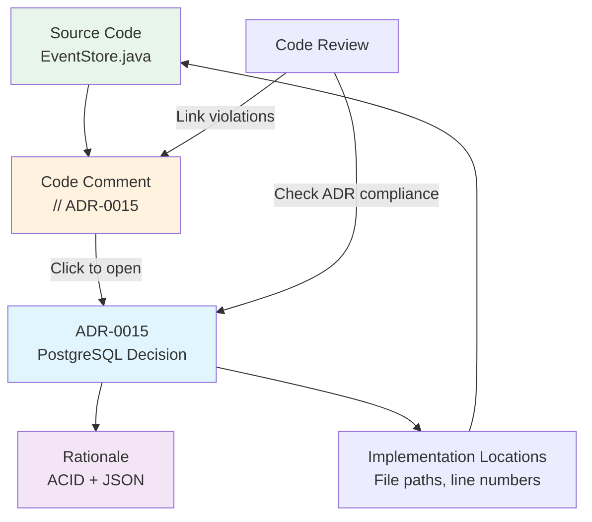

<Hero
  title="Linking ADRs to Code & Docs"
  description="Make architecture decisions discoverable and connected to implementation"
  size="large"
/>

## TL;DR

Reference ADRs in code comments with clear syntax: `// See ADR-0015: PostgreSQL for event store` or `# ADR-0042: Use Redis for sessions`. Link ADRs in pull request descriptions and commit messages to establish bidirectional traceability. Use tools like adr-tools, custom IDE plugins, and CI/CD scripts to auto-detect violations and keep links fresh. Enable developers to discover decisions at the point where they code: in their editor, during review, and in version control history.

## Learning Objectives

You will be able to:

- Implement code comment conventions that reference ADRs consistently
- Create pull request templates that encourage linking ADRs to implementation
- Build tooling to detect violations of architectural decisions
- Establish bidirectional navigation between ADRs and code
- Use ADR links to improve code review quality and catch architectural drift

## Motivating Scenario

You're in a code review. A junior engineer has implemented session caching in-memory. You know this is wrong—your team decided years ago to use Redis for sessions (ADR-0047). But the new engineer never found that decision. They didn't know it existed. They reinvented the wheel, poorly.

Three months later, your system goes down because an application restart lost all sessions. In the postmortem, you realize: the ADR existed, but there was no way for developers to discover it while coding. The decision was hidden in a dusty document directory.

This is the linking problem: ADRs are only valuable if developers can find them when they need them—not weeks later in a code review, but at the moment they're designing the system or implementing a component.

## Core Content

### The Discovery Problem

Most organizations have architecture decisions documented somewhere. The problem isn't documentation—it's discoverability. Engineers working on code don't naturally search the ADR directory. They code, implement, push code, and get reviewed. If the review catches an ADR violation, it's often too late—the code is already written.

Linking ADRs directly to code solves this problem by embedding decision references at the point of implementation. When an engineer touches session management code, they see: "// ADR-0047: Use Redis for session storage. See docs/adr/decisions/0047-redis-sessions.md". Now the decision is immediately visible and discoverable.

### Code Comment Conventions

Establish clear, searchable conventions for ADR references in code:

**Java/C#/JavaScript:**
```java
// ADR-0015: PostgreSQL for event store
// Rationale: ACID + JSON support required for event immutability
class PostgresEventStore implements EventStore {
    // ...
}
```

**Python:**
```python
# ADR-0042: Redis for session storage
# Context: In-memory sessions lost on container restart
class RedisSessionStore(SessionStore):
    pass
```

**Configuration files (YAML/TOML):**
```yaml
# ADR-0035: Redis for cache layer
# See: docs/adr/decisions/0035-redis-caching.md
cache:
  backend: redis
  cluster: true
```

**SQL/Database:**
```sql
-- ADR-0028: Event sourcing for audit trail
-- All mutations recorded immutably
CREATE TABLE events (
    event_id UUID PRIMARY KEY,
    aggregate_id UUID NOT NULL,
    event_type VARCHAR NOT NULL,
    payload JSONB NOT NULL,
    -- ...
);
```

Make ADR references machine-readable so tooling can parse them:

```python
# ADR-0015: PostgreSQL for event store
# Link: docs/adr/decisions/0015.md
# Status: Accepted (2025-02-15)
# Related: ADR-0008, ADR-0009
```

Include the ADR number, title, and link to the full document. Optionally add status and related decisions for richer context.

### Pull Request & Commit Linking

ADRs should appear at multiple stages of development:

**Pull Request Template** (`.github/pull_request_template.md`):
```markdown
## Changes
Brief description of what changed.

## Related ADRs
- [ ] No ADRs affected by this change
- [ ] ADR-0015 (PostgreSQL for event store)
- [ ] ADR-0042 (Redis for sessions)
- [ ] Other: _______

## ADR Compliance Check
- [ ] Implementation follows referenced ADR(s)
- [ ] No violations of superseded decisions detected
- [ ] Comments reference ADR rationale

## Design Review
Reviewed by: _______
```

Checking "Related ADRs" makes developers think: "What architectural decisions affect this code?" This shifts mindset from "implement feature" to "implement feature within architectural constraints."

**Commit Message Convention:**
```
Fix: Handle session eviction gracefully

Implements session timeout strategy from ADR-0042 (Redis sessions).
When Redis connection drops, evict local cache rather than serving stale data.
Tests added for 3-second timeout scenario.

ADR: 0042
Relates-to: ADR-0015, ADR-0035
Fixes: #4521
```

Include `ADR: 0042` in commit messages. This makes git history traceable: `git log | grep "ADR: 0042"` shows all commits implementing that decision.

### Bidirectional Navigation

Make it easy to navigate both directions:

**Code to ADR:** When reviewing code, engineers should find the ADR.
- IDE extension: Hover over `// ADR-0015`, press Ctrl+Click to open the document
- Makefile target: `make find-adr FILE=EventStore.java` → lists all ADRs referenced
- Git hooks: Pre-commit script verifies referenced ADRs exist

**ADR to Code:** When reading an ADR, engineers should find implementations.
- ADR includes "Implementation Locations" section with file paths, line numbers
- Docusaurus link: ADR title is a link that searches codebase for references
- IDE plugin: Shows "found in N files" count with jump-to-code functionality

Example IDE workflow:
1. Engineer opens `EventStore.java`
2. Sees comment: `// ADR-0015`
3. Right-click → "Open ADR" → Opens decision document in side panel
4. Reads context, consequences, related decisions
5. Understands constraints before modifying

### Detecting Violations & Drift

Build automation to detect when code violates decisions:

**Pattern 1: Check for Unauthorized Technologies**

```bash
#!/bin/bash
# Scan codebase for banned tech (based on ADR supersessions)
# ADR-0028 (In-Memory Sessions) superseded by ADR-0047 (Redis)

grep -r "InMemorySessionStore\|HashMap.*session" \
  src/ --include="*.java" && \
  echo "ERROR: Found in-memory session storage" && \
  echo "Update to RedisSessionStore per ADR-0047" && \
  exit 1
```

Run this in pre-commit or CI/CD to catch violations before merge.

**Pattern 2: Verify ADR References Exist**

```bash
#!/bin/bash
# Verify all ADR references in code are to actual ADRs

grep -r "ADR-[0-9]\{4\}" src/ | \
  cut -d: -f2 | \
  grep -o "ADR-[0-9]\{4\}" | \
  sort -u | \
  while read adr; do
    if [ ! -f "docs/adr/decisions/${adr#ADR-}.md" ]; then
      echo "ERROR: Referenced $adr not found"
      exit 1
    fi
  done
```

**Pattern 3: Detect Missing ADR References**

```bash
#!/bin/bash
# Flag architectural files missing ADR references

find src -name "*Store.java" -o -name "*Repository.java" -o \
    -name "*Service.java" | \
  while read file; do
    if ! grep -q "// ADR-" "$file"; then
      echo "WARNING: Architectural component without ADR reference: $file"
    fi
  done
```

Flag suspicious code for review. Not every file needs an ADR, but core architectural components should.

### Code Review Integration

Use ADR references to improve code review:

**Reviewer workflow:**
1. Engineer submits PR referencing ADR-0015
2. Reviewer clicks link to ADR document
3. Reads decision context: "Why PostgreSQL?"
4. Reviewers code against this context: "Does this maintain ACID guarantees?"
5. Reviewer comments: "Good; this preserves ACID property described in ADR-0015"

**Comment template for reviewers:**
```
This change affects ADR-0042 (Redis sessions).
Per that decision:
- Sessions must survive pod restart [✓ Redis persists]
- Lookup latency < 10ms [? Need latency test]
- Must handle 100K concurrent sessions [? Need load test]

Request: Add benchmark verifying latency/capacity constraints from ADR-0042.
```

Reviewers reference decision rationale, not just personal preference. This makes code review more objective and educational.

### IDE and Editor Integration

Make ADRs available directly in the editor:

**VS Code Extension Sketch:**
```javascript
// extension.js: VS Code ADR extension
vscode.languages.registerHoverProvider('*', {
  provideHover(document, position, token) {
    const match = document.lineAt(position.line).text.match(/ADR-(\d{4})/);
    if (!match) return;
    const adr = match[1];
    const filePath = `docs/adr/decisions/${adr}.md`;

    return new vscode.Hover(
      `[ADR-${adr}](command:adr.openDocument?${adr})`
    );
  }
});

// Click ADR reference → Opens decision document in side panel
```

**Command palette:**
```
Cmd+P → "ADR: Find Related" → Lists all ADRs mentioning current function/class
Cmd+P → "ADR: Check Violations" → Runs linter, flags architectural issues
Cmd+P → "ADR: Open" → Type ADR number, jump to document
```

### Integrating with Version Control

**GitHub Actions Workflow:**

```yaml
name: ADR Compliance Check

on: [pull_request]

jobs:
  adr-check:
    runs-on: ubuntu-latest
    steps:
      - uses: actions/checkout@v3

      - name: Check ADR References Valid
        run: |
          # Verify all referenced ADRs exist
          grep -r "ADR-[0-9]\{4\}" src/ | \
            cut -d: -f2 | grep -o "ADR-[0-9]\{4\}" | \
            sort -u | while read adr; do
              if [ ! -f "docs/adr/${adr#ADR-}.md" ]; then
                echo "ERROR: Invalid ADR reference $adr"
                exit 1
              fi
            done

      - name: Detect Architecture Violations
        run: |
          # Check for in-memory session store (violates ADR-0047)
          if grep -r "InMemorySessionStore" src/; then
            echo "ERROR: Found deprecated session implementation"
            echo "ADR-0047 requires Redis sessions"
            exit 1
          fi

      - name: Comment on PR
        if: failure()
        uses: actions/github-script@v6
        with:
          script: |
            github.rest.issues.createComment({
              issue_number: context.issue.number,
              owner: context.repo.owner,
              repo: context.repo.repo,
              body: 'ADR compliance check failed. See workflow logs.'
            })
```

Automated checks catch violations before review, reducing manual effort.

### Custom Linking Strategies

**Tagging system:**

```python
# marker.py: Custom ADR marker
import functools

class adr:
    """Decorator to mark functions/classes implementing ADRs"""
    def __init__(self, adr_id: str, rationale: str = ""):
        self.adr_id = adr_id
        self.rationale = rationale

    def __call__(self, fn):
        @functools.wraps(fn)
        def wrapper(*args, **kwargs):
            return fn(*args, **kwargs)
        wrapper.__adr__ = self.adr_id
        wrapper.__adr_rationale__ = self.rationale
        return wrapper

# Usage:
@adr("0047", "Use Redis for session durability")
class RedisSessionStore(SessionStore):
    """Session store backed by Redis cluster"""
    pass
```

At runtime or during code analysis, tools can introspect `__adr__` to find all code implementing a decision.

<Figure caption="Code to ADR and ADR to Code Navigation Flow">

</Figure>

## Patterns & Pitfalls

**Pattern: ADR Comments Near Decision Points**
Place ADR references near the code that implements the decision. If a cache is used, comment should be on the cache line, not the class definition.

**Pattern: Link Chain in PRs**
PR description: "Implements ADR-0047 (Redis sessions). Related: ADR-0015, ADR-0035. Fixes #1234"
Creates readable chain: Issue → PR → ADRs → Code

**Pitfall: Stale Links**
ADRs get renamed or reorganized. Links break. Use stable identifiers (ADR-0047, not "the Redis decision") and test links in CI/CD.

**Pitfall: Over-linking**
Not every line needs an ADR reference. Overdo it and the signal disappears. Link at decision points: class definitions, config files, major algorithms. Not every method.

**Pitfall: Link Without Context**
"// ADR-0047" alone is useless. Include rationale: "// ADR-0047: Redis for session durability (ACID + distributed)"

## When to Use / When Not to Use

**Use ADR linking when:**
- Multiple implementations of same pattern exist (risk of inconsistency)
- Decision has ongoing implications (caching strategy, API design, database choice)
- Team turnover is high (knowledge preservation critical)
- Code reviews benefit from architectural context

**Less critical for:**
- Trivial decisions (logging format, naming conventions)
- Decisions unlikely to be revisited (deprecated frameworks)
- Solo developer projects (low knowledge loss risk)

## Operational Considerations

- **Maintenance**: Review and update ADR links during quarterly architecture reviews
- **Automation**: Invest in CI/CD checks; they catch violations faster than humans
- **Tooling**: Consider IDE extensions and documentation site plugins for discoverability
- **Training**: Onboard new engineers on ADR linking conventions
- **Escalation**: Treat ADR violations as architectural debt; flag in sprint reviews

## Design Review Checklist

<Checklist items={["Code comment convention established and documented", "All ADR references in code are valid (ADR file exists)", "Critical architectural components reference implementing ADRs", "Pull request template includes \"Related ADRs\" section", "Commit messages include ADR numbers when applicable", "Bidirectional navigation implemented (code ↔ ADR)", "CI/CD checks verify ADR reference validity", "CI/CD checks detect violations of superseded decisions", "IDE extensions or editor plugins available for ADR discovery", "Code review guidelines teach use of ADR references", "Documentation links implementation locations in each ADR", "Quarterly review verifies link freshness"]} />

<Showcase>
A well-linked ADR system transforms code reviews. When an engineer proposes implementing feature X, reviewers immediately reference ADR-Y showing why the previous approach was rejected. When investigating a bug, engineers find the ADR explaining the design trade-off. During onboarding, new developers can read code, follow ADR links, and understand architectural constraints without asking colleagues. This is architectural documentation that actually gets read and used.
</Showcase>

## Self-Check

1. **Can a developer find the relevant ADR within 30 seconds of looking at architectural code?** If not, improve discoverability through comments, links, or tooling.

2. **Do your CI/CD checks catch architectural violations before human review?** If not, automate the checks to shift left.

3. **When you change a decision (supersede an ADR), can you find all code still following the old decision?** If not, traceability is weak.

## Next Steps

1. **Establish code comment convention**: Document in ARCHITECTURE.md or contributing guide
2. **Create PR template**: Add "Related ADRs" section
3. **Write CI/CD check**: Automate ADR reference validation
4. **Review key files**: Add ADR comments to core architectural components
5. **Build or integrate IDE tooling**: Start with simple approach (Ctrl+F in docs), evolve to IDE plugins

<Callout tone="info">
Linking ADRs to code is the difference between documentation that's stored and documentation that's used. When developers see ADR references while coding and reviewing, decisions influence implementation in real-time, not in hindsight during postmortems.
</Callout>

## References

1. <a href="https://adr.github.io/" target="_blank" rel="nofollow noopener noreferrer">ADR GitHub - Architecture Decision Records ↗️</a>
2. <a href="https://github.com/adr/adr-tools" target="_blank" rel="nofollow noopener noreferrer">ADR Tools - Working with ADRs in Projects ↗️</a>
3. <a href="https://www.infoq.com/articles/scaling-architecture-decisions/" target="_blank" rel="nofollow noopener noreferrer">InfoQ - Scaling Architecture Decisions ↗️</a>
4. <a href="https://github.blog/2020-08-13-oh-my-zsh-how-we-get-developers-to-care-about-code-quality/" target="_blank" rel="nofollow noopener noreferrer">GitHub - Making Code Quality Visible ↗️</a>
---
