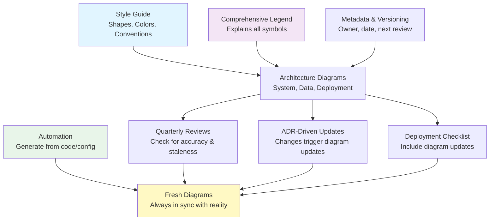

<Hero
  title="Diagram Governance, Legends & Updates"
  description="Ensure architecture diagrams stay current and consistent with clear conventions"
  size="large"
/>

## TL;DR

Establish consistent diagram conventions (shapes, colors, labels) documented in a style guide. Create comprehensive legends explaining symbols, line styles, and color meanings to prevent ambiguity across diagrams. Assign diagram ownership and establish quarterly review cadence to keep diagrams synchronized with architecture. Use automation tools to generate diagrams from code or configuration when possible, reducing manual update burden. Track diagram freshness using metadata (last reviewed date, status). Stale diagrams are worse than no diagrams—they mislead and erode trust in documentation.

## Learning Objectives

You will be able to:

- Design and enforce organizational diagram conventions and style guides
- Create clear, comprehensive legends that make diagrams self-explanatory
- Establish governance processes ensuring diagrams stay synchronized with actual architecture
- Implement automation to reduce manual diagram maintenance
- Assess and prevent diagram staleness through metadata, reviews, and tooling

## Motivating Scenario

You're onboarding a new engineer. You show them the system architecture diagram. "This is our deployment topology," you say confidently. She studies it for a moment, then asks: "What does the double line mean? Is this node critical or optional? When was this last updated?"

You don't know. The diagram was created three months ago. It's probably correct. Or maybe services have been added since then. The legend says "double lines = high availability" but you're not sure. Did someone change the diagram and forget to update the legend? Or did someone change the architecture and the diagram stayed the same?

This is the governance problem. Without clear conventions, legends, and update processes, diagrams become liabilities rather than assets. New engineers waste time guessing what symbols mean. Architects waste time wondering if diagrams are stale. Diagrams that are wrong are worse than no diagrams at all—they actively mislead.

## Core Content

### Why Diagram Governance Matters

Diagrams are compressed, visual representations of complex systems. They help teams understand architecture at a glance. But that compression comes at a cost: symbols must be clear, consistent, and explained. Without governance, diagrams devolve into noise.

Poor diagram governance costs:
- **Onboarding time**: New engineers waste hours deciphering ambiguous symbols
- **Review quality**: Architecture reviews can't happen if diagrams are unclear or stale
- **Decision making**: Architects can't decide about changes if they don't trust current diagrams
- **Institutional knowledge**: When a diagram's creator leaves, meaning of symbols is lost
- **Tool migration**: When switching diagram tools, inconsistent diagrams are hard to migrate

Good diagram governance provides:
- **Clarity**: Symbols mean the same thing across all diagrams
- **Trust**: Engineers know diagrams are current and accurate
- **Maintainability**: Clear ownership and review process prevents decay
- **Scalability**: New diagrams follow conventions; no rework needed
- **Automation**: Consistency enables tooling to auto-generate or validate diagrams

### Establishing Style Guides

A diagram style guide is the foundation of governance. It documents:

**1. Shape Conventions**

```
Component → Rectangle (rounded corners)
Container → Square/Rectangle (slightly larger)
System Boundary → Dashed rectangle
Database → Cylinder
User/Actor → Stick figure or icon
External System → Bold rectangle with different fill
Message Queue → Parallelogram
Cache → Octagon
```

Document why you chose shapes. Are you following UML? C4 Model? Custom conventions?

**2. Color Palette**

Establish a limited, accessible palette:

```
Backend Services → Blue (#1976D2)
Data Stores → Green (#388E3C)
Message Queues → Orange (#F57C00)
External Systems → Gray (#616161)
User Interfaces → Purple (#7B1FA2)
Critical Path → Red (#D32F2F) or thick border
Optional Components → Lighter shade or dashed outline
```

Colors should be distinguishable for colorblind viewers. Avoid pure red/green alone. Test with accessibility tools.

**3. Line Styles & Meanings**

```
Solid arrow → Direct synchronous communication (REST call)
Dashed arrow → Asynchronous communication (message queue)
Thick line → High traffic or critical path
Thin line → Low traffic or optional
Bidirectional arrow → Synchronous request/response
One-way arrow → One-directional message flow
```

Different line styles convey protocol or importance. Document consistently.

**4. Label Conventions**

```
Boxes: Service name + (optional) version or tech stack
  Example: "User Service (Node.js)", "PostgreSQL 13"

Arrows: Protocol or message type
  Example: "REST API (JSON)", "Kafka Topic: user-events"

Groupings: Domain or team ownership
  Example: "Payment Domain (Finance Team)", "Data Pipeline (Analytics)"
```

Consistent labeling reduces cognitive load. Readers know where to look for information.

### Comprehensive Legends

A legend is a diagram's rosetta stone. Even standard symbols like UML need explanation in your context.

**Good Legend Example:**

```
LEGEND: System Architecture Diagram

SHAPES:
  Rectangle    = Microservice or application component
  Cylinder     = Persistent data store (database, cache)
  Parallelogram = Message broker or event queue
  Cloud shape  = External SaaS service or cloud provider resource

COLORS:
  Blue        = Backend service (internal responsibility)
  Green       = Data store (owned by team)
  Orange      = Message broker (shared infrastructure)
  Gray        = External service (third-party)
  Red (bold)  = Critical path (system unavailability if down)

LINE STYLES:
  ─────→      = Synchronous call (REST, gRPC)
  ┈┈┈┈┈→      = Asynchronous message (Kafka, RabbitMQ)
  ═════→      = High-volume traffic (caching layer)
  ─ ─ ─       = Optional or fallback path

PATTERNS:
  (2025-02-14) = Last updated date
  [Deprecated] = Component being phased out
  [To Deploy]  = Planned but not yet deployed

NOTES:
  This diagram shows deployment topology (where components run).
  For data flow, see: Data Flow Diagram v2.3
  For sequence of operations, see: Request Flow Diagram v1.5
  Owner: Alice Chen (Backend Team)
  Next review: 2025-05-14
```

Legends should be comprehensive enough that someone unfamiliar with your system can understand diagrams. Assume readers won't remember context.

### Metadata & Versioning

Track diagram metadata to prevent staleness:

```markdown
# System Architecture Diagram v2.4

**Owner:** Alice Chen (Backend Team)
**Last Updated:** 2025-02-14
**Last Reviewed:** 2025-02-14
**Next Review Due:** 2025-05-14

**Changes in v2.4:**
- Added Redis cluster (ADR-0047: Redis for sessions)
- Deprecated: In-memory session store
- New service: Session-service in auth domain

**Known Issues:**
- [ ] CDN deployment topology TBD
- [ ] Mobile app connection path needs clarification

**Superseded Versions:**
- v2.3 (2024-11-30): Used before Kafka upgrade
- v2.2 (2024-08-15): Monolithic architecture (before microservices)

**Review History:**
- 2025-02-14: Approved by Architecture Board
- 2024-11-30: Updated Kafka cluster topology
- 2024-08-15: Major refactor for microservices
```

Metadata reveals whether a diagram is fresh. If "Last Updated" was 2023 and you're in 2025, the diagram is suspect.

### Preventing Staleness: Processes

**Process 1: Quarterly Architecture Reviews**

Calendar event: "Q2 Diagram Review and Update"
Participants: Architects, team leads, technical writers
Agenda:
1. Walk through each diagram (system topology, data flow, deployment, etc.)
2. Check against current architecture: Are components still there? Still connected?
3. Identify missing pieces or inaccuracies
4. Update diagrams and metadata
5. Note any components being deprecated or added

Schedule this recurring. If it's optional, it won't happen.

**Process 2: ADR-Driven Updates**

When an architectural decision is made (ADR created), associated diagrams must be updated.

ADR approval process includes: "Update diagrams before marking ADR as Accepted"

If ADR-0047 (Redis for sessions) is accepted, the system topology diagram must be updated to show Redis cluster before the ADR is truly "done."

**Process 3: Deployment Triggers Updates**

When deploying major changes, diagrams are updated as part of deployment checklist:

```markdown
Deployment Checklist: Add New Service

- [ ] Code deployed to staging
- [ ] Integration tests passing
- [ ] Production deployment approved
- [ ] System topology diagram updated (show new service + connections)
- [ ] Update legend if new colors/shapes needed
- [ ] Update data flow diagram if new data flows created
- [ ] Update deployment diagram (K8s manifests, resource allocation)
- [ ] Notify architecture team of changes
- [ ] Schedule diagram review within 2 weeks
```

This embeds diagram updates into deployment workflow, not an afterthought.

**Process 4: Automated Validation**

Use tooling to detect obvious staleness:

```bash
#!/bin/bash
# check-diagram-freshness.sh

THRESHOLD_DAYS=90

for diagram in docs/diagrams/*.md; do
  last_updated=$(grep "^Last Updated:" "$diagram" | cut -d: -f2)
  last_updated_seconds=$(date -d "$last_updated" +%s)
  now_seconds=$(date +%s)
  days_old=$(( (now_seconds - last_updated_seconds) / 86400 ))

  if [ $days_old -gt $THRESHOLD_DAYS ]; then
    echo "WARNING: $diagram is $days_old days old"
  fi
done
```

Run in CI/CD. Flag diagrams older than threshold for review. Doesn't prevent staleness but surfaces it.

### Automation: Diagrams from Code

The best way to prevent staleness is to generate diagrams from code or configuration:

**Terraform → Architecture Diagram**

```python
# terraform-to-diagram.py
# Parse Terraform, generate C4-style architecture diagram

import json
import subprocess

# Get Terraform plan as JSON
result = subprocess.run(['terraform', 'plan', '-json'],
                       capture_output=True, text=True)
plan = json.loads(result.stdout)

# Extract resources
resources = plan['resource_changes']

# Generate Mermaid diagram
print("flowchart TB")
for resource in resources:
  if resource['type'] == 'kubernetes_service':
    print(f"  {resource['name']}[Service: {resource['name']}]")
  elif resource['type'] == 'kubernetes_statefulset':
    print(f"  {resource['name']}[StatefulSet: {resource['name']}]")

# Similar for other resource types
```

Infrastructure-as-code tools (Terraform, CloudFormation, Helm) define the actual deployment. Generating diagrams from these ensures freshness.

**Docker Compose → Container Diagram**

```python
# docker-compose-to-diagram.py
import yaml

with open('docker-compose.yml') as f:
  compose = yaml.safe_load(f)

print("flowchart TB")
for service, config in compose['services'].items():
  image = config.get('image', 'unknown')
  print(f"  {service}[{service}<br/>{image}]")

# Extract links between services
for service, config in compose['services'].items():
  links = config.get('links', [])
  for link in links:
    target = link.split(':')[0]
    print(f"  {service} --> {target}")
```

Docker Compose defines actual deployment. Diagram generated from it is always fresh.

**Kubernetes Manifests → Deployment Diagram**

```bash
#!/bin/bash
# k8s-to-diagram.sh
# Generate deployment diagram from K8s manifests

echo "flowchart TB"

# Extract all deployments
kubectl get deployments -o jsonpath='{.items[*].metadata.name}' | \
  tr ' ' '\n' | \
  while read deployment; do
    replicas=$(kubectl get deployment $deployment \
               -o jsonpath='{.spec.replicas}')
    echo "  $deployment[Deployment: $deployment<br/>($replicas replicas)]"
  done

# Extract services and their endpoints
kubectl get services -o jsonpath='{.items[*].metadata.name}' | \
  tr ' ' '\n' | \
  while read service; do
    selectors=$(kubectl get service $service \
                -o jsonpath='{.spec.selector}' | sed 's/ /,/g')
    echo "  $service[Service: $service]"
    echo "  $service --> {connected pods}"
  done
```

When infrastructure changes (new deployment added), diagram is automatically updated.

**OpenAPI → API Diagram**

```python
# openapi-to-diagram.py
# Generate API interaction diagram from OpenAPI spec

import json

with open('openapi.json') as f:
  spec = json.load(f)

# Extract endpoints and operations
for path, methods in spec['paths'].items():
  for method, operation in methods.items():
    tags = operation.get('tags', ['untagged'])
    print(f"  {tags[0]}[{tags[0]} API]")
    print(f"  {path}[{method.upper()} {path}]")
    print(f"  {tags[0]} --> {path}")
```

OpenAPI specs define APIs. Diagrams generated from specs show actual endpoints and operations.

The pattern: **Source of truth (Terraform, K8s, Docker Compose, OpenAPI) → Generated Diagram**

This requires discipline: treat diagrams as generated artifacts, not manually created. When architecture changes, first update the source of truth, then regenerate diagrams.

### Color & Accessibility

Use accessible color schemes:

**Do:**
- Use color + shape + label. Don't rely on color alone.
- Test with colorblind-friendly tools (Color Brewer, WebAIM)
- Provide sufficient contrast (WCAG AA standard: 4.5:1)

**Don't:**
- Red + green alone (indistinguishable for protanopia)
- Light gray on white (too low contrast)
- Assume everyone perceives colors the same

Example accessible palette:
```
Blue (#1976D2), Orange (#F57C00), Green (#388E3C), Purple (#7B1FA2)
Distinguishable even in grayscale or for colorblind viewers
```

<Figure caption="Diagram Governance & Legend Structure">

</Figure>

## Patterns & Pitfalls

**Pattern: Diagram as Artifact in CI/CD**
Check diagrams into version control as source files (SVG, PlantUML, Mermaid).
CI/CD renders and publishes them automatically.
Changes to diagrams show in pull requests.

**Pattern: Diagram Ownership**
Each diagram has an owner and a backup owner. Owners are responsible for quarterly reviews.
If owner leaves, backup takes over.

**Pitfall: Too Many Diagram Types**
Having 10 different diagram types (system, data, deployment, sequence, component, etc.) creates maintenance burden.
Focus on 3-4 key diagrams that answer stakeholder questions.

**Pitfall: Legends Outside the Diagram**
Legend on a separate page that readers don't see. Put legend on the diagram itself or immediately below.

**Pitfall: "This is Architecture; It Never Changes"**
Architecture changes constantly. If diagrams aren't reviewed quarterly, they'll drift.

## When to Use / When Not to Use

**Use comprehensive diagram governance for:**
- Systems with 10+ components
- Distributed teams (can't communicate informally)
- Multi-year projects (knowledge retention critical)
- Regulated industries (audit trail needed)
- Frequent architectural changes

**Less critical for:**
- Small monolithic systems (< 3 components)
- Single-team projects with strong institutional knowledge
- Greenfield projects still evolving rapidly (diagrams stabilize after v1)

## Operational Considerations

- **Tools**: Choose diagramming tools that support version control (PlantUML, Mermaid, SVG)
- **Automation**: Invest in scripts to auto-generate diagrams from infrastructure code
- **Storage**: Store diagrams in Git alongside code and documentation
- **Publishing**: Publish diagrams to documentation site with metadata (date, owner, etc.)
- **Review calendar**: Block quarterly review on team calendar. Make it recurring, not optional.

## Design Review Checklist

<Checklist items={["Diagram style guide documented and accessible to all teams", "Consistent shape conventions (rectangles, cylinders, etc.) established", "Color palette defined and tested for accessibility", "Line styles have documented meanings (sync vs. async, etc.)", "Every diagram includes a comprehensive legend", "Metadata included: owner, creation date, last reviewed, next review due", "Diagram versioning system in place (v2.4, etc.)", "Quarterly review process scheduled and recurring", "ADR-driven update process: diagram updates part of ADR approval", "Deployment checklist includes diagram updates", "Automation scripts validate diagram freshness (age check)", "Where possible, diagrams generated from code/config (IaC, K8s, OpenAPI)", "Diagram storage in version control (Git)", "Diagrams published with metadata to documentation site", "Accessibility tested (colors, contrast, colorblind-friendly)"]} />

<Showcase>
Organizations with strong diagram governance have a significant advantage in architecture work. New engineers understand topology in minutes, not days. Architecture reviews are productive because everyone's looking at the same, accurate diagram. When incidents happen, team knows the exact topology to investigate. ADR writers reference diagrams; architects make decisions faster. This is multiplied across hundreds of engineers and thousands of design decisions over years. The investment in governance pays compounding returns.
</Showcase>

## Self-Check

1. **Could an engineer unfamiliar with your system understand your architecture diagram from the legend alone?** If not, legend is incomplete.

2. **What's the date on your oldest architecture diagram? Is it over 6 months old?** If yes, staleness is a problem.

3. **When you deployed a new service, was the architecture diagram updated within a week?** If not, your process isn't catching deployment-driven changes.

## Next Steps

1. **Create style guide**: Document shape conventions, color palette, line styles. Share with team.
2. **Write legend template**: Create standard legend format. Apply to all existing diagrams.
3. **Add metadata**: Audit all diagrams. Add owner, last updated date, next review date.
4. **Schedule reviews**: Block quarterly 1-hour review on team calendar. Start first quarter review.
5. **Automate generation**: Identify 1-2 key diagrams that can be generated from code. Build scripts.

<Callout tone="info">
Diagram governance is not about perfection; it's about consistency and freshness. Consistent diagrams enable teams to understand architecture quickly. Fresh diagrams build trust. Without governance, diagrams decay into misleading noise. Invest in structure upfront.
</Callout>

## References

1. <a href="https://c4model.com/" target="_blank" rel="nofollow noopener noreferrer">C4 Model - Visualising Software Architecture ↗️</a>
2. <a href="https://www.uml-diagrams.org/" target="_blank" rel="nofollow noopener noreferrer">UML Diagrams - Everything About UML Notation ↗️</a>
3. <a href="https://www.mermaidjs.org/" target="_blank" rel="nofollow noopener noreferrer">Mermaid - Diagram and Chart Tool ↗️</a>
4. <a href="https://www.w3.org/WAI/design-develop/" target="_blank" rel="nofollow noopener noreferrer">W3C WAI - Accessibility Design and Development ↗️</a>
---
