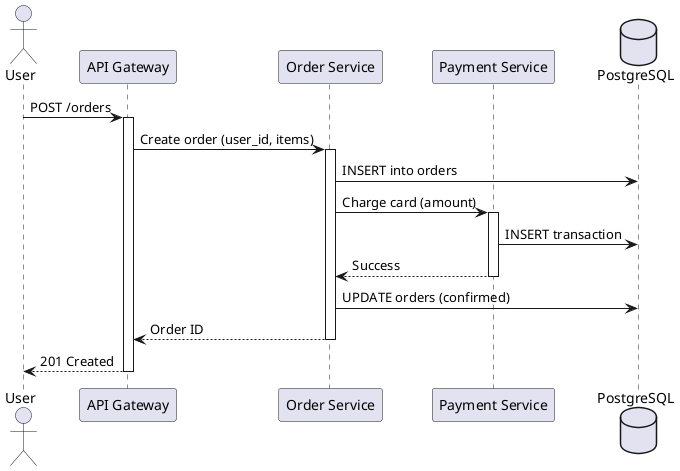
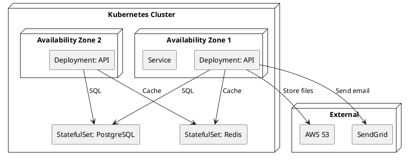
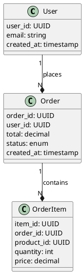
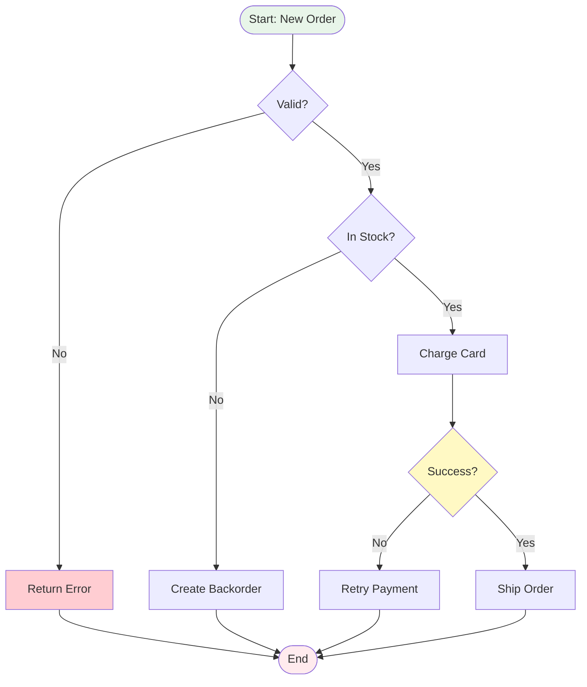
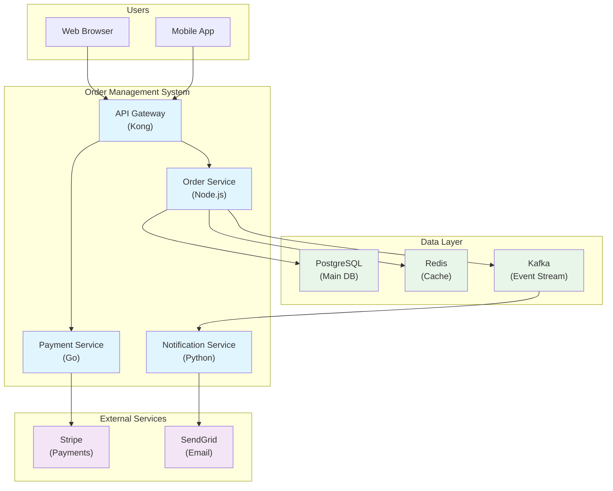
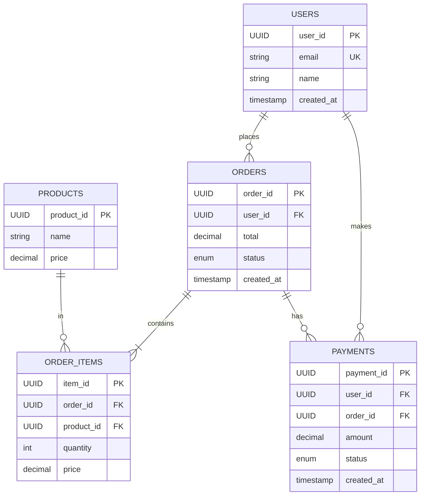
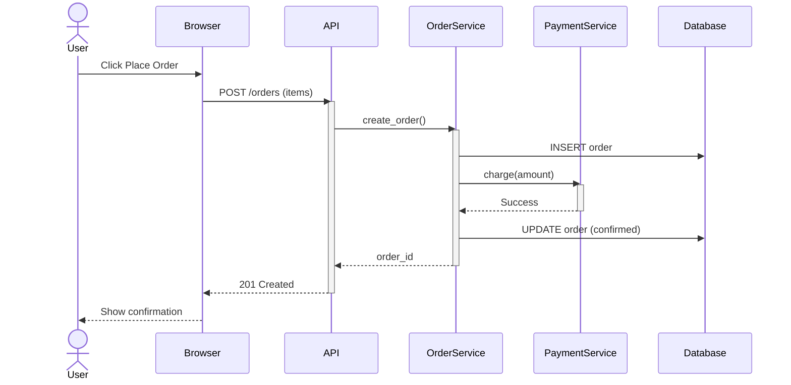
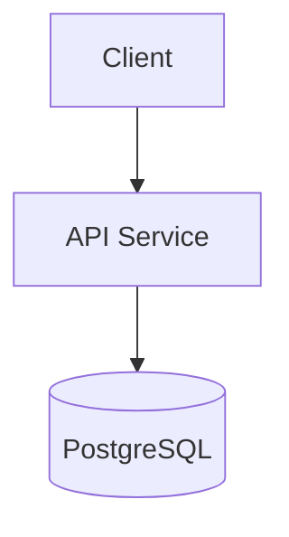
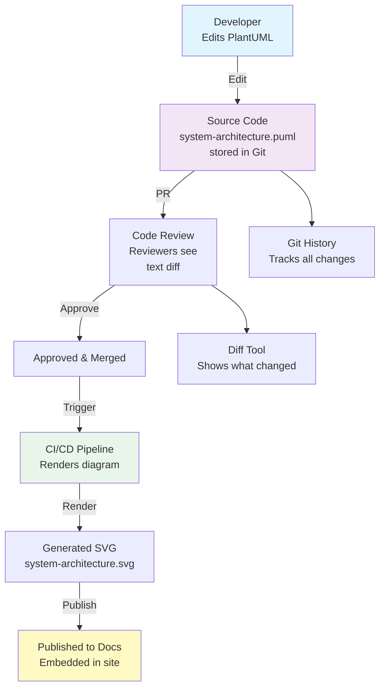

<Hero
  title="Diagrams-as-Code - PlantUML, Mermaid"
  description="Version-controlled diagrams with automated generation from code/configuration"
  size="large"
/>

## TL;DR

Diagrams-as-code (PlantUML, Mermaid, or Graphviz) store diagrams as text in version control rather than binary files (Visio, Lucidchart). This enables code review of diagram changes, Git history tracking, automated rendering, and diff visibility ("what changed?"). PlantUML is comprehensive and feature-rich (UML, flowcharts, deployment diagrams, C4 models). Mermaid is lighter and embeds directly in Markdown (great for documentation sites). Both solve the staleness problem by treating diagrams like code: reviewable, versionable, automatable. Choose based on diagram complexity and team preference.

## Learning Objectives

You will be able to:

- Write architecture diagrams in PlantUML and Mermaid syntax
- Version control diagrams alongside code and documentation
- Integrate diagram generation into CI/CD pipelines
- Use version control history to understand diagram evolution
- Review diagram changes in pull requests
- Generate multiple output formats (SVG, PNG, PDF) from source code

## Motivating Scenario

Your architect creates an architecture diagram in Lucidchart (cloud tool). She exports a PNG and commits it to the Git repo. A month later, a new service is added. The diagram is updated... in Lucidchart. But the PNG in Git doesn't get re-exported. It's forgotten. Three months pass. The diagram is wildly out of date.

During a design review, someone notices the stale diagram. It's marked for update. But the person who created it is on vacation. The Lucidchart link is lost. A new person has to recreate it from scratch.

This is the problem with binary diagram tools: diagrams become decoupled from code. Updates are manual. History is lost. Collaboration is difficult. Version control becomes a dumping ground for outdated PNGs.

Diagrams-as-code solves this: diagrams are text files. They live in Git. Changes are visible in diffs. Code review applies to diagrams. CI/CD renders them automatically. When someone wants to understand why a diagram changed, they see the Git history and review comments. Diagrams become maintainable infrastructure, not disconnected artifacts.

## Core Content

### Why Diagrams-as-Code?

Treating diagrams as code provides architectural benefits:

**Version Control**
- Every change tracked in Git history
- Diffs show what changed: "Added Redis cluster connection"
- Revert if change was wrong
- Blame shows who made changes and why
- Branch and merge diagrams like code

**Code Review**
- Pull requests include diagram changes
- Reviewers see proposed architecture changes
- Comments: "Why is this connection needed?"
- Approval gate before diagram is finalized
- Encourages discussion before commit

**Automation**
- CI/CD pipeline generates final diagrams (SVG, PNG)
- No manual export step (reduces user error)
- Multiple formats from single source
- Automatically embedded in documentation
- Publish to docs site without manual upload

**Collaboration**
- Conflicts in text are resolvable (vs. binary conflicts)
- Multiple people can edit same diagram (merge carefully)
- Comments in code explain design decisions
- Links to ADRs and issues

**Discoverability**
- Search for components in diagrams (full-text search)
- Find diagrams showing specific pattern or technology
- Git log: "Show all changes to data flow diagrams"

**Single Source of Truth**
- One format (text), one location (Git), one process (pull request)
- No duplication between Lucidchart and Git
- No wondering "which version is current?"

### PlantUML: Comprehensive Diagramming

PlantUML is a mature tool for creating UML and non-UML diagrams from text.

**Component Diagram (System Structure)**

```plantuml
@startuml architecture
!include https://raw.githubusercontent.com/plantuml-stdlib/C4-PlantUML/master/C4_Component.puml

' Define components
component "User Service" as US
component "Order Service" as OS
component "Payment Service" as PS
component "Notification Service" as NS

' Define data store
database "PostgreSQL" as DB
queue "Kafka" as MQ
cache "Redis" as CACHE

' Define connections
US --> OS: REST (orders)
OS --> PS: REST (charge)
OS --> DB: SQL
PS --> DB: SQL
OS --> MQ: Publish OrderCreated
MQ --> NS: Subscribe
NS --> CACHE: Cache notifications

@enduml
```

Renders as visual diagram. Easy to read, version control friendly.

**Sequence Diagram (Message Flow Over Time)**



Shows interaction sequence, timing, actor participation. Useful for understanding request flows.

**Deployment Diagram (Infrastructure Topology)**



Shows where components run, availability zones, infrastructure topology.

**Class Diagram (Data Model)**



Shows data model, relationships, cardinality.

PlantUML strengths:
- Comprehensive diagram types (UML + more)
- Mature syntax and tool ecosystem
- Integrations with Confluence, Jira, VS Code
- Supports C4 model library
- Extensive styling options

PlantUML limitations:
- Steeper learning curve than Mermaid
- Requires Java runtime for local rendering
- Layout sometimes requires manual tweaking

### Mermaid: Lightweight & Embeddable

Mermaid is lighter-weight, JavaScript-based, embeds directly in Markdown/HTML.

**Flowchart (Decision Flow)**



Clear decision flow, easy to understand. Great for processes and workflows.

**Architecture Diagram (C4-style)**



Clean system architecture, color-coded by component type. Embeds directly in Markdown.

**Entity-Relationship Diagram (Database Schema)**



Clear ER diagram with cardinality and keys.

**Sequence Diagram (Interaction Over Time)**



Shows interaction order, parallel activities, activation boxes. Great for understanding request flows.

Mermaid strengths:
- Lightweight, easy to learn
- Embeds in Markdown, HTML, documentation sites
- No external dependencies (JavaScript based)
- Good for flowcharts, sequence, ERD, C4 models
- Growing ecosystem and feature set

Mermaid limitations:
- Fewer diagram types than PlantUML
- Layout auto-calculation sometimes suboptimal
- Less mature than PlantUML
- Limited styling options compared to PlantUML

### Integrating with Documentation Sites

**Docusaurus (React-based docs)**

```javascript
// docusaurus.config.js
module.exports = {
  plugins: [
    [
      '@docusaurus/plugin-content-docs',
      {
        remarkPlugins: [
          [require('remark-mermaid'), {}],
        ],
      },
    ],
  ],
};
```

Markdown files can include Mermaid blocks:

```markdown
## System Architecture

```mermaid
flowchart TB
    ...diagram code...
```

The diagram renders directly in the docs site.
```

**MkDocs (Python-based docs)**

```yaml
# mkdocs.yml
plugins:
  - search
  - mermaid2

markdown_extensions:
  - pymdownx.superfences:
      custom_fences:
        - name: mermaid
          class: mermaid
          format: !!python/name:pymdownx.superfences.fence_code_formatter
```

Mermaid blocks in Markdown render automatically.

**GitHub README**

```markdown
## Architecture



GitHub renders Mermaid directly in README and wiki pages.

### CI/CD Integration: Auto-Rendering

**GitHub Actions Workflow**

```yaml
name: Render Diagrams

on:
  push:
    paths:
      - 'diagrams/**/*.puml'
      - 'diagrams/**/*.md'

jobs:
  render:
    runs-on: ubuntu-latest
    steps:
      - uses: actions/checkout@v3

      - name: Install PlantUML
        run: |
          apt-get update
          apt-get install -y plantuml

      - name: Render PlantUML diagrams
        run: |
          find diagrams -name "*.puml" | while read file; do
            output="${file%.puml}.svg"
            plantuml -tsvg "$file" -o "$(dirname "$output")"
          done

      - name: Commit rendered diagrams
        run: |
          git config user.name "Diagram Bot"
          git config user.email "bot@example.com"
          git add diagrams/**/*.svg
          git commit -m "Auto-render diagrams" || echo "No changes"
          git push
```

When diagram source changes, pipeline auto-renders and commits SVG/PNG to repo.

### Version Control & Code Review

**Pull Request with Diagram Changes**

```
PR #1234: Add Redis cluster to architecture

**Changes:**
- Added Redis cluster for session storage (ADR-0047)
- Updated architecture diagram to show Redis cluster
- Removed deprecated in-memory session store from diagram

**Files changed:**
- diagrams/system-architecture.puml (diagram source)
- docs/diagrams/system-architecture.svg (rendered output)
```

Reviewer sees:
1. PlantUML source change: adds Redis component, updates connections
2. Rendered SVG: visual before/after comparison
3. ADR reference explaining why

This provides full context for architecture review.

**Git History**

```
$ git log --oneline diagrams/system-architecture.puml

abc1234 Add Redis cluster (ADR-0047)
def5678 Add caching layer
ghi9012 Initial deployment diagram
```

Git log shows architecture evolution. Commits reference ADRs.

```
$ git show abc1234 diagrams/system-architecture.puml
```

Shows exact changes to architecture: which connections were added/removed, which components were updated.

### Organizing Diagram Code

**Directory Structure**

```
diagrams/
  system-architecture/
    architecture.puml          # Source diagram
    architecture.svg           # Rendered output
    architecture.png           # Alternative format
    README.md                  # Explanation and metadata

  data-flow/
    data-flow.puml
    data-flow.svg
    README.md

  deployment/
    deployment.puml
    deployment.svg
    README.md

  .gitignore                   # Ignore rendered output? No!
  index.md                     # Overview of all diagrams
```

Keep source and rendered output in Git. Allows reviewer to see both source syntax and visual result.

**Reusable Components**

PlantUML and Mermaid support includes/variables for reuse:

**PlantUML with includes:**

```plantuml
@startuml architecture
!include ./common.puml

' Define services using common style
component "Order Service" as OS
component "Payment Service" as PS
component "Notification Service" as NS

STYLE_SERVICE(OS)
STYLE_SERVICE(PS)
STYLE_SERVICE(NS)

' Connections
OS --> PS
PS --> NS

@enduml
```

**common.puml:**
```plantuml
!define STYLE_SERVICE(name) \
  name : background-color : #1976D2; \
  name : text-color : #FFFFFF

!define DB_COMPONENT(name) \
  database name
```

Define common styles once, reuse across diagrams.

<Figure caption="Diagrams-as-Code Workflow: Text to Visual">

</Figure>

## Patterns & Pitfalls

**Pattern: Diagram Testing**
Add tests that verify diagram syntax is valid and renders without errors.

```bash
#!/bin/bash
# test-diagrams.sh
for file in diagrams/**/*.puml; do
  if ! plantuml -testDot "$file" > /dev/null; then
    echo "ERROR: $file has syntax errors"
    exit 1
  fi
done
```

**Pattern: Diagram Linting**
Lint diagrams for consistency (same component names, colors, etc.).

**Pitfall: Huge Monolithic Diagram**
Single diagram with 50+ components. Unreadable. Break into multiple diagrams (system, data flow, deployment).

**Pitfall: Out-of-Sync Source and Rendered**
Someone edits SVG directly, forgets to update source. Source and render diverge. Trust dies.
Rule: Always edit source (PlantUML). Never manually edit SVG. CI/CD renders from source.

## When to Use / When Not to Use

**Use diagrams-as-code when:**
- Diagrams change frequently (version control is essential)
- Architecture is complex (many stakeholders, need clear communication)
- Team is distributed (can't have informal whiteboard conversations)
- Compliance/audit trail required (Git history provides it)
- Diagrams are embedded in documentation site (automation is valuable)

**Don't over-invest for:**
- One-time diagrams (quick explanation to a single person)
- Very simple systems (text description might suffice)
- Teams with deep institutional knowledge (less need for documentation)

## Operational Considerations

- **Tool choice**: PlantUML for comprehensive diagrams, Mermaid for lightweight/embedded diagrams
- **Local rendering**: Install tools locally or use cloud renderers (PlantUML Online, Kroki)
- **Storage**: Store source in Git. Store rendered output in Git too (for history and publishing).
- **Publishing**: Automate rendering and publishing to docs site
- **Review**: Treat diagram changes as code: review, approve, commit with message
- **Maintenance**: Update diagrams when architecture changes (ADR-driven or deployment-driven)

## Design Review Checklist

<Checklist items={["Diagrams stored as source code (PlantUML, Mermaid, or similar) in Git", "Rendered diagrams (SVG, PNG) also committed (for history and publishing)", "CI/CD pipeline auto-renders diagrams on source changes", "Diagram changes visible in pull requests (text diff + visual comparison)", "Code review applies to diagram changes (approval gate)", "Diagrams embedded in documentation site (Docusaurus, MkDocs, etc.)", "Git history tracks diagram evolution and references ADRs", "Syntax validation in CI/CD (diagrams render without errors)", "Reusable components and styles defined (DRY principle)", "Diagrams organized in directory structure (system, data, deployment, etc.)", "README or metadata provided for each diagram (owner, last updated, etc.)", "Multiple output formats supported (SVG for web, PNG for presentations, PDF for printing)"]} />

<Showcase>
Teams using diagrams-as-code have architecture documentation that's actually maintained. When architecture changes, diagrams change in the same pull request. Code review applies to diagrams. Git history shows why diagrams changed. New engineers find correct, up-to-date diagrams embedded in the docs site. Diagrams are treated with the same rigor as code: version controlled, reviewed, tested. This is how architecture documentation becomes a first-class artifact, not a afterthought.
</Showcase>

## Self-Check

1. **Are your diagrams in version control as text (PlantUML/Mermaid) or binary (Visio/Lucidchart export)?** Text enables code review and automation.

2. **Can you see in Git history why your architecture diagram changed and when?** If diagrams are binary exports, this history is invisible.

3. **Do diagram changes go through code review, or are they pushed directly?** Without review, diagrams drift from intent.

## Next Steps

1. **Choose tool**: Evaluate PlantUML vs. Mermaid for your needs. Start with Mermaid if unsure.
2. **Convert existing diagrams**: Export existing diagrams from Lucidchart/Visio/Figma. Rewrite as PlantUML/Mermaid.
3. **Set up Git storage**: Create `diagrams/` directory in repo. Commit source files and rendered outputs.
4. **Build CI/CD**: Create GitHub Actions (or equivalent) to auto-render on source changes.
5. **Integrate with docs**: Embed diagrams in Docusaurus/MkDocs documentation site.

<Callout tone="info">
Treating diagrams as code is a mindset shift. When diagrams are text, version controlled, code-reviewed, and auto-rendered, they become first-class architecture documentation. This is how you prevent staleness and keep architecture visible to the entire team.
</Callout>

## References

1. <a href="https://plantuml.com/" target="_blank" rel="nofollow noopener noreferrer">PlantUML - Open-source tool for creating diagrams from text ↗️</a>
2. <a href="https://mermaid.js.org/" target="_blank" rel="nofollow noopener noreferrer">Mermaid - JavaScript-based diagramming and charting tool ↗️</a>
3. <a href="https://kroki.io/" target="_blank" rel="nofollow noopener noreferrer">Kroki - Multi-syntax diagram renderer ↗️</a>
4. <a href="https://c4model.com/tooling" target="_blank" rel="nofollow noopener noreferrer">C4 Model - Tooling and Rendering ↗️</a>
---
