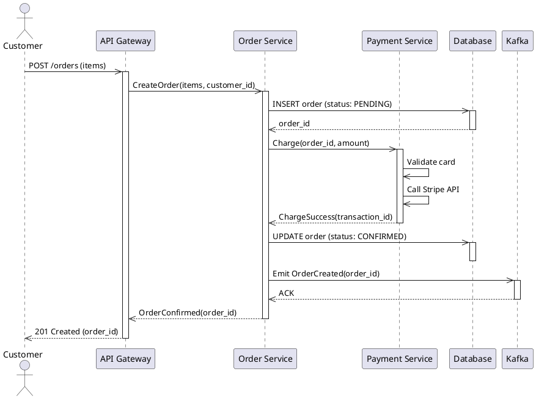
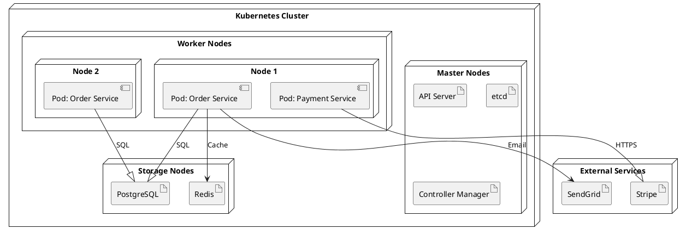
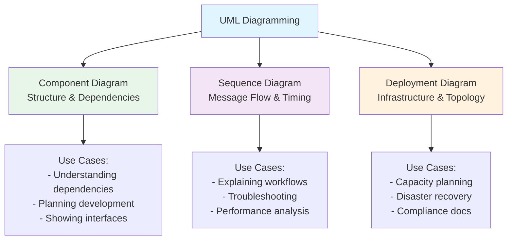

<Hero
  title="UML - Component, Sequence, Deployment Diagrams"
  description="Use standard UML notation to document architecture clearly"
  size="large"
/>

## TL;DR

UML provides three key diagram types for architecture: **Component Diagrams** show system structure (components, interfaces, dependencies); **Sequence Diagrams** show message flow and timing over time; **Deployment Diagrams** show where software runs (nodes, servers, networks). UML is a comprehensive standard but verbose—powerful for detailed specifications but often overkill for typical systems. Modern alternatives (C4 Model) are often simpler and more practical. Use UML when you need to communicate precisely to technically sophisticated audiences; use C4 or custom notation for most teams.

## Learning Objectives

You will be able to:

- Create UML component diagrams to document system structure and dependencies
- Design UML sequence diagrams to illustrate message flow and timing
- Build UML deployment diagrams to show infrastructure topology and artifacts
- Recognize UML notation and conventions across different diagram types
- Choose between UML, C4 Model, and custom notation based on audience and complexity
- Avoid diagram clutter by focusing on key relationships and abstractions

## Motivating Scenario

Your team has a complex system with multiple services, databases, and external integrations. You need to explain this to:
- New engineers (need understandable overview)
- Auditors and compliance officers (need precise specifications)
- Operations team (need deployment topology)
- C-level executives (need 30-second explanation)

A single diagram won't work for all audiences. Component diagrams help engineers understand dependencies. Sequence diagrams help everyone understand request flows. Deployment diagrams help ops understand infrastructure. UML provides standard notation so these diagrams are intelligible across organizations and tools.

## Core Content

### UML Overview: Why Standards Matter

UML (Unified Modeling Language) is an ISO/IEC standard notation for software design. Advantages:

- **Widely recognized**: Any software professional understands basic UML
- **Precise**: Standardized symbols reduce ambiguity
- **Comprehensive**: One notation for many diagram types
- **Tool support**: Most diagramming tools support UML natively
- **Documentation**: Extensive resources and best practices

Disadvantages:

- **Steep learning curve**: Full UML is complex; most people use a subset
- **Verbose**: Even simple diagrams can require many details
- **Overkill for simple systems**: Like using a formal grammar to explain a basic concept
- **Abstract**: Not always intuitive for non-technical stakeholders

**Best practice**: Use UML for precisely documented systems. Use C4 or custom notation for team communication. Don't force UML if C4 or flowcharts communicate better.

### Component Diagrams: System Structure

Component diagrams show how a system is composed: components (logical groupings), interfaces (APIs), and dependencies (what connects to what).

**Example: E-commerce System Components**

```plantuml
@startuml components
    !include https://raw.githubusercontent.com/plantuml-stdlib/C4-PlantUML/master/C4_Component.puml

    package "Frontend" {
        component "Web UI" as WEB
        component "Mobile App" as MOBILE
    }

    package "API Layer" {
        component "API Gateway" as GW
        component "GraphQL Resolver" as GQL
    }

    package "Services" {
        component "Order Service" as OS {
            interface "REST" as OSREST
            interface "Events" as OSEVENT
        }

        component "Payment Service" as PS {
            interface "REST" as PSREST
        }

        component "Notification Service" as NS {
            interface "Events" as NSEVENT
        }
    }

    package "Data" {
        component "PostgreSQL" as DB
        component "Redis Cache" as CACHE
        component "Kafka Broker" as KAFKA
    }

    package "External" {
        component "Stripe API" as STRIPE
        component "SendGrid API" as SENDGRID
    }

    WEB --> GW
    MOBILE --> GW
    GW --> OSREST
    GW --> PSREST
    GQL --> OSREST
    OS --> DB
    OS --> CACHE
    OS --> OSEVENT
    OSEVENT --> KAFKA
    PS --> STRIPE
    PS --> DB
    KAFKA --> NSEVENT
    NS --> SENDGRID

@enduml
```

**Key UML Component Notation:**

- **Rectangle with component icon**: Represents a component (logical grouping)
- **Small circles on edges**: Provided interfaces (what the component offers)
- **Half circles on edges**: Required interfaces (what the component needs)
- **Arrows**: Dependencies (uses relationship)
- **Packages**: Grouping related components

**Best Practices:**

1. **Focus on key components**: Don't show every internal module. Show logical groupings.
2. **Show interfaces**: Make dependencies explicit. What interface is being used?
3. **Avoid complexity**: If diagram has > 20 components, split into multiple diagrams.
4. **Label clearly**: Component names should be self-explanatory.
5. **Use packages**: Group related components to reduce visual clutter.

**When Component Diagrams Add Value:**

- Documenting a system's internal structure for architects and senior engineers
- Clarifying interfaces between components (important for API contracts)
- Planning dependencies for parallel development (team A works on component X, team B on component Y)
- Understanding impact of changes (changing component X affects these components)

### Sequence Diagrams: Message Flow Over Time

Sequence diagrams show how components interact: who sends what message to whom, in what order, over time.

**Example: Order Processing Sequence**



**Key UML Sequence Notation:**

- **Actor/Participant boxes at top**: The entities involved (humans, services, systems)
- **Lifelines**: Vertical dashed lines representing the entity's existence over time
- **Solid arrow**: Synchronous message (caller waits for response)
- **Dashed arrow**: Return/response message
- **Activation box**: Rectangle on lifeline showing when entity is active
- **Parallel regions**: Show concurrent activities

**Best Practices:**

1. **Show realistic flows**: Include error cases, timeouts, retries.
2. **Timing matters**: Message order communicates causality. Don't rearrange for aesthetics.
3. **Labels are key**: Each message should indicate what's being sent and why.
4. **Avoid deep nesting**: If diagram goes more than 5-6 lifelines wide, split it up.
5. **Show wait times**: If a service waits, illustrate with activation boxes.

**When Sequence Diagrams Add Value:**

- Explaining complex workflows (multi-step processes, error handling)
- Onboarding (new engineer needs to understand request flow)
- Design reviews (discussing interaction patterns before implementation)
- Troubleshooting (understanding which service failed and why)
- Performance analysis (seeing where bottlenecks occur—long waits for responses)

### Deployment Diagrams: Infrastructure Topology

Deployment diagrams show the hardware and software infrastructure: nodes (computers, servers), connections (networks), and artifacts (deployed software).

**Example: Kubernetes Deployment Topology**



**Key UML Deployment Notation:**

- **3D cube (node)**: Represents a piece of hardware or execution environment
- **Component boxes inside nodes**: Software running on that node
- **Artifact boxes**: Deployable software units (JAR, Docker image, binary)
- **Connections/lines**: Communication links between nodes
- **Stereotypes**: Labels indicating type of node (&lt;&lt;database&gt;&gt;, &lt;&lt;server&gt;&gt;, &lt;&lt;cloud&gt;&gt;)

**Best Practices:**

1. **Show realistic topology**: Include redundancy, load balancers, multiple zones.
2. **Label networks**: Show which networks are public vs. private.
3. **Include artifact versions**: Helps correlate deployment topology with software versions.
4. **Consider availability**: Show how system handles node failures (replicas, failover).
5. **Security zones**: Use packages/groupings to show security boundaries.

**When Deployment Diagrams Add Value:**

- Planning infrastructure (how many nodes needed? What specs?)
- Understanding disaster recovery (what happens if a node fails?)
- Compliance documentation (showing segregation of systems, security zones)
- Operations runbooks (ops team needs to understand topology to respond to incidents)
- Capacity planning (current topology and what's needed for growth)

### UML vs. C4 vs. Custom Notation

**UML Component Diagram vs. C4 Component Level**

| Aspect | UML | C4 |
|--------|-----|-----|
| **Formality** | Formal standard notation | Informal, practical |
| **Interfaces** | Shows interfaces explicitly | Implicit in descriptions |
| **Complexity** | Can express complex relationships | Focuses on main dependencies |
| **Audience** | Architects, senior engineers | Any technical person |
| **Learning curve** | Steeper | Gentler |
| **Tool support** | Excellent (widely supported) | Growing (Structurizr, draw.io, etc.) |

**Decision tree:**
- **Audience: Auditors/compliance team** → UML (precise, formal, recognizable)
- **Audience: Engineering team** → C4 or custom (clearer, less formal)
- **Diagram complexity: High** → UML (richer notation for details)
- **Diagram complexity: Low** → C4 (simpler is better)
- **Team familiarity: High with UML** → UML (leverage existing knowledge)
- **Team familiarity: Low with UML** → C4 (easier to learn)

**Recommendation**: Start with C4. If you need to communicate to non-technical stakeholders or auditors, supplement with C4 diagrams at Levels 1-2. Use UML for deep technical documentation when needed.

### Reading UML Diagrams: Key Symbols

**Multiplicity/Cardinality** (on associations):
```
1     : Exactly one
0..1  : Zero or one (optional)
*     : Zero or more (any number)
1..*  : One or more
2,4,6 : Specific values
```

**Association Types**:
```
→      : Simple association (uses)
▶      : Inheritance (is-a)
◇      : Aggregation (has-a, weak ownership)
◆      : Composition (has-a, strong ownership—child can't exist without parent)
⟶      : Dependency (weaker, temporary relationship)
```

**Example Interpretation**:
```plantuml
Company "1" --* "0..*" Employee: employs
```
One company can employ zero or more employees.
```plantuml
Parent "1" *-- "2..*" Child: has
```
A parent has 2 or more children (strong ownership).

### Common Pitfalls

**Pitfall: Overloaded Diagram**

Bad: Trying to show entire enterprise architecture in one component diagram (100+ components, spaghetti of connections).
Good: Multiple diagrams at different levels of abstraction. High-level system diagram. Detailed diagrams for subsystems.

**Pitfall: Unclear Lifelines**

Bad: Sequence diagram where it's unclear who is calling whom or why.
Good: Clear labels on each message. Consistent ordering (from left to right, logical flow).

**Pitfall: Mismatched Abstraction**

Bad: Mixing high-level services and low-level classes in same diagram.
Good: Consistent abstraction level. Either all services or all classes, not mixed.

**Pitfall: Diagram Doesn't Match Reality**

Bad: Diagram is outdated. Shows services that no longer exist or connections that were removed.
Good: Treat diagrams like code. Update when architecture changes. Version control them.

<Figure caption="UML Diagram Types and Their Use Cases">

</Figure>

## Patterns & Pitfalls

**Pattern: Hierarchical Diagrams**
Start with high-level component diagram (major systems). Drill down into subsystem diagrams (detailed components within a system). This prevents overload.

**Pattern: Sequence Diagram Variations**
Normal flow (happy path), then separate diagrams for error flows. Makes each diagram simpler.

**Pitfall: Copy-paste From Tools**
Creating UML in Visio or SmartDraw, exporting PNG, pasting into repo. Can't version control or diff. Use text-based tools (PlantUML) instead.

**Pitfall: No Legend**
UML has standard notation, but your context might add meaning. Include legend explaining any custom conventions.

## When to Use / When Not to Use

**Use UML diagrams when:**
- Communicating with formally trained architects or engineers
- Detailed specification for implementation is needed
- Compliance/audit trail requires precise documentation
- Audience expects industry-standard notation
- System complexity justifies detailed diagrams

**Don't invest in UML for:**
- Communicating with non-technical stakeholders (use C4 Level 1)
- Small, simple systems (C4 or text description better)
- Quick whiteboard discussions (formality is overhead)
- Teams unfamiliar with UML notation (C4 is easier)

## Operational Considerations

- **Tool choice**: PlantUML for UML diagramming. Good balance of features and ease of use.
- **Training**: Spend time ensuring team understands notation. Don't assume knowledge.
- **Documentation**: Link diagrams to ADRs and design documents explaining decisions.
- **Updates**: When architecture changes (new service, new connection), update all three diagram types.
- **Review**: Architecture reviews should include examining UML diagrams.

## Design Review Checklist

<Checklist items={["Component diagram shows major components and their interfaces", "Component diagram includes key dependencies and relationships", "Component diagram avoids overload (&lt; 20 major components; use packages to group)", "Sequence diagram shows message order and timing clearly", "Sequence diagram includes error/exception flows (not just happy path)", "Deployment diagram shows actual infrastructure topology", "Deployment diagram includes redundancy and availability considerations", "All diagrams follow consistent UML notation and conventions", "Legend provided explaining any custom symbols or meaning", "Diagrams stored as text (PlantUML) in version control", "Diagrams have metadata (owner, last updated, next review)", "Diagrams linked to relevant ADRs and design documents", "All three diagram types created when system complexity warrants", "Diagrams reviewed and approved before deployment changes"]} />

<Showcase>
Mature engineering organizations maintain comprehensive UML documentation for critical systems. New engineers studying component diagrams understand system structure. Operations team uses deployment diagrams during incident response to understand what could fail. Auditors find sequence diagrams helpful in understanding security-critical workflows. When system changes, all UML diagrams are updated together, keeping documentation synchronized with reality. This is how architecture knowledge becomes durable and organizational rather than tribal.
</Showcase>

## Self-Check

1. **Could you draw a component diagram of your system's major components and their dependencies from memory?** If not, you need to create one.

2. **If someone asked you to trace the flow of an order through your system, could you draw a sequence diagram?** This is a good way to test your understanding.

3. **Could an operations engineer use your deployment diagram to understand how to recover from a node failure?** If not, add more infrastructure details.

## Next Steps

1. **Create component diagrams**: Map major system components and interfaces
2. **Create sequence diagrams**: Document 3-5 critical workflows (happy path + error flows)
3. **Create deployment diagrams**: Show actual infrastructure topology including redundancy
4. **Store as PlantUML**: Convert to text-based format for version control
5. **Integrate with architecture process**: Update diagrams when architecture changes

<Callout tone="info">
UML is a powerful notation standard, but it's not the only way to communicate architecture. Use UML when precision and formality are valued by your audience. Use C4 Model or custom notation when simplicity and approachability matter more. The best diagram is one that gets understood and used by your team.
</Callout>

## References

1. <a href="https://www.uml-diagrams.org/" target="_blank" rel="nofollow noopener noreferrer">UML Diagrams - UML Notation Reference ↗️</a>
2. <a href="https://www.omg.org/spec/UML/" target="_blank" rel="nofollow noopener noreferrer">Object Management Group - UML Specification ↗️</a>
3. <a href="https://plantuml.com/component-diagram" target="_blank" rel="nofollow noopener noreferrer">PlantUML - Component Diagram Documentation ↗️</a>
4. <a href="https://plantuml.com/sequence-diagram" target="_blank" rel="nofollow noopener noreferrer">PlantUML - Sequence Diagram Documentation ↗️</a>
---
