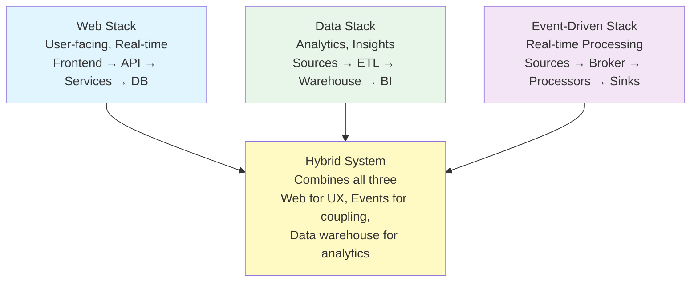

<Hero
  title="Common Stacks - Web, Data, Event-Driven"
  description="Reference architectures for web applications, data platforms, and event-driven systems"
  size="large"
/>

## TL;DR

Common architecture patterns emerge across industry. **Web Stack** (frontend + API + services + database + cache + CDN) optimizes for user-facing applications with real-time responsiveness. **Data Stack** (ingestion + lake/warehouse + ETL + analytics) optimizes for batch processing and historical analysis. **Event-Driven Stack** (sources + brokers + processors + sinks + state stores) optimizes for loose coupling, scalability, and real-time stream processing. Each stack has different trade-offs, operational complexity, and cost characteristics. Don't blindly adopt a stack—understand your constraints (latency, throughput, consistency, cost) and choose the architecture that matches. Reference architectures accelerate planning by providing proven patterns, not recipes to follow unchanged.

## Learning Objectives

You will be able to:

- Understand components and rationale for Web, Data, and Event-Driven stacks
- Evaluate trade-offs (performance, cost, complexity) within each stack
- Make informed technology choices for each component (databases, brokers, frameworks)
- Identify when hybrid approaches (combining stacks) are appropriate
- Customize reference architectures to your specific constraints and requirements
- Design cost-effective systems that don't over-engineer for your scale

## Motivating Scenario

Your startup is building an e-commerce platform. You need:
- Users browsing products in real-time (fast API responses)
- Daily analytics on sales and inventory
- Real-time notifications when inventory runs low
- Cost-effective infrastructure

You could build three separate systems: web platform, data warehouse, event streaming. Or you could use a hybrid architecture that combines elements of all three. Different choices lead to different costs, complexity, and performance characteristics.

A reference architecture gives you a starting point: "Here's a proven Web Stack. Here's how you'd add a Data Stack. Here's how you'd add Event Streaming. Pick what you need; skip what you don't."

This accelerates your decision-making instead of starting from scratch.

## Core Content

### Web Stack: User-Facing Applications

The **Web Stack** optimizes for responsiveness, reliability, and user experience. It's the most common architecture for apps, websites, and APIs.

**Typical Components:**

```
┌─────────────────────────────────────────┐
│ User/Client Layer                       │
│ - Web Browser (React, Vue, Angular)     │
│ - Mobile App (React Native, Flutter)    │
│ - Desktop App                           │
└────────────────┬────────────────────────┘
                 │ HTTPS
┌────────────────▼────────────────────────┐
│ Edge & Caching Layer                    │
│ - CDN (CloudFront, Cloudflare)          │
│ - Distributed cache for assets          │
└────────────────┬────────────────────────┘
                 │ HTTPS/gRPC
┌────────────────▼────────────────────────┐
│ API Gateway Layer                       │
│ - Kong, Nginx, AWS API Gateway          │
│ - Rate limiting, auth, routing          │
│ - Load balancing across services        │
└────────────────┬────────────────────────┘
                 │ gRPC/REST
┌────────────────▼────────────────────────┐
│ Microservices Layer                     │
│ - Order Service (Node.js, Go, Python)   │
│ - Product Service                       │
│ - Payment Service                       │
│ - User Service                          │
│ - Notification Service                  │
└────────────────┬────────────────────────┘
                 │ SQL/gRPC
┌────────────────▼────────────────────────┐
│ Data Layer                              │
│ - Primary Database (PostgreSQL)         │
│ - Cache Layer (Redis)                   │
│ - Message Queue (RabbitMQ, Kafka)       │
│ - Search Index (Elasticsearch)          │
└─────────────────────────────────────────┘
```

**Web Stack Technology Choices:**

**Frontend:**
- React (most popular, large ecosystem, JSX)
- Vue (simpler learning curve, smaller bundle)
- Angular (enterprise, full framework)
- Choice: Depends on team expertise and project complexity

**API Gateway:**
- Kong (open-source, feature-rich)
- Nginx (lightweight, proven)
- AWS API Gateway (serverless, managed)
- Choice: Self-managed vs. managed (cost/control trade-off)

**Services:**
- Node.js (JavaScript, fast dev velocity, great for I/O)
- Go (compiled, fast, great for concurrency)
- Python (quick development, great libraries, slower runtime)
- Java (enterprise, mature ecosystem, verbose)
- Choice: Language familiarity, performance requirements, team expertise

**Database:**
- PostgreSQL (ACID, rich features, most popular)
- MySQL (simpler, good for basics)
- MongoDB (document DB, flexible schema, eventual consistency)
- DynamoDB (serverless, managed)
- Choice: Structured (PostgreSQL) vs. flexible schema (MongoDB), managed vs. self-hosted

**Cache Layer:**
- Redis (in-memory, atomic operations, pub/sub)
- Memcached (simpler, pure cache, no persistence)
- Choice: Redis for complex operations; Memcached for simple caching

**Message Queue:**
- RabbitMQ (traditional, reliable, easy to operate)
- Kafka (high throughput, log-based, great for analytics)
- SQS (serverless, managed, simple)
- Choice: Throughput and durability requirements

**Operational Characteristics:**
- Latency: 50-200ms typical (optimized for user responsiveness)
- Throughput: Scales with services/database capacity
- Complexity: Medium (multi-layered, but well-understood patterns)
- Cost: Moderate (depends on scale)

### Data Stack: Analytics & Insights

The **Data Stack** optimizes for historical analysis, large-scale data processing, and insights. It's focused on batch processing and analytical queries, not real-time user responses.

**Typical Components:**

```
┌─────────────────────────────────────────┐
│ Data Sources                            │
│ - Application databases                 │
│ - Third-party APIs                      │
│ - Event logs, clickstream                │
│ - User behavior tracking                 │
└────────────────┬────────────────────────┘
                 │ Batch ETL
┌────────────────▼────────────────────────┐
│ Ingestion & ETL Layer                   │
│ - Apache Airflow (orchestration)        │
│ - dbt (data transformation)             │
│ - Talend, Informatica (enterprise)      │
│ - Kafka (streaming ingestion)           │
└────────────────┬────────────────────────┘
                 │
┌────────────────▼────────────────────────┐
│ Data Lake / Warehouse                   │
│ - Snowflake (cloud-native warehouse)    │
│ - BigQuery (fully managed, serverless)  │
│ - Redshift (AWS managed warehouse)      │
│ - S3 + Spark (data lake)                │
│ - HDFS + Hadoop (on-prem data lake)     │
└────────────────┬────────────────────────┘
                 │ SQL/Spark
┌────────────────▼────────────────────────┐
│ Analytics & Processing Layer            │
│ - Spark (distributed processing)        │
│ - Presto (SQL query engine)             │
│ - Custom analytics jobs                 │
│ - Machine learning pipelines            │
└────────────────┬────────────────────────┘
                 │
┌────────────────▼────────────────────────┐
│ Visualization & BI Tools                │
│ - Tableau (powerful, expensive)         │
│ - Looker (embedded analytics)           │
│ - Metabase (open-source, lightweight)   │
│ - Grafana (time-series, monitoring)     │
│ - Custom dashboards                     │
└─────────────────────────────────────────┘
```

**Data Stack Technology Choices:**

**Data Warehouse:**
- Snowflake (easiest to use, cloud-native, scalable)
- BigQuery (fully managed, great for analytics, built-in ML)
- Redshift (AWS-native, cheaper at scale)
- Choice: Ease-of-use (Snowflake) vs. cost (Redshift) vs. ecosystem (BigQuery)

**ETL Orchestration:**
- Airflow (most popular, flexible, learning curve)
- dbt (modern, SQL-first, great for analytics)
- Stitch (simple connector-based)
- Choice: Custom logic (Airflow) vs. SQL-focused (dbt)

**Processing Engine:**
- Spark (distributed, handles large scale, complex)
- Pandas (for smaller datasets, simple)
- SQL (for structured data, simple and fast)
- Choice: Scale (Spark) vs. simplicity (SQL)

**BI Tools:**
- Tableau (powerful, expensive, best-in-class)
- Looker (integrated with data, embedded analytics)
- Metabase (open-source, lightweight)
- Choice: Enterprise need (Tableau) vs. budget-friendly (Metabase)

**Operational Characteristics:**
- Latency: Hours (batch processing) to seconds (streaming)
- Throughput: Can process terabytes of data
- Complexity: High (multiple tools, orchestration)
- Cost: Variable (can be expensive at scale, but cost per GB decreasing)

### Event-Driven Stack: Real-Time Processing

The **Event-Driven Stack** optimizes for loose coupling, real-time processing, and scalability. Services emit events; other services react to those events. Great for complex workflows and real-time insights.

**Typical Components:**

```
┌─────────────────────────────────────────┐
│ Event Sources                           │
│ - User actions (clicks, purchases)      │
│ - System events (order placed, etc.)    │
│ - Third-party webhooks                  │
│ - Sensors, IoT devices                  │
└────────────────┬────────────────────────┘
                 │
┌────────────────▼────────────────────────┐
│ Event Broker / Message Queue            │
│ - Apache Kafka (most popular)           │
│ - RabbitMQ (traditional, reliable)      │
│ - AWS Kinesis (managed, cloud-native)   │
│ - Pulsar (scalable, cloud-native)       │
└────────────────┬────────────────────────┘
                 │ Events (topics/streams)
┌────────────────▼────────────────────────┐
│ Stream Processors                       │
│ - Kafka Streams (Java library)          │
│ - Flink (distributed, complex logic)    │
│ - Spark Streaming (batch + stream)      │
│ - AWS Lambda (serverless, simple)       │
│ - Custom consumers                      │
└────────────────┬────────────────────────┘
                 │ Processed events
┌────────────────▼────────────────────────┐
│ Sinks (Data Destinations)               │
│ - Databases (write processed results)   │
│ - Message queues (downstream services)  │
│ - Data warehouse (analytics)            │
│ - Cache (real-time feeds)               │
│ - Alerting systems                      │
│ - User notifications                    │
└─────────────────────────────────────────┘
```

**Event-Driven Stack Technology Choices:**

**Event Broker:**
- Kafka (most popular, durable, high throughput)
- RabbitMQ (reliable, easier to operate than Kafka)
- Pulsar (cloud-native, scales well)
- Kinesis (managed, simpler operations)
- Choice: Scale/throughput (Kafka), ease (RabbitMQ/Kinesis)

**Stream Processor:**
- Kafka Streams (lightweight, use existing JVMs)
- Flink (powerful, complex logic, distributed)
- Spark Streaming (batch + stream, familiar to data teams)
- Lambda (simple, serverless, limited logic)
- Choice: Simplicity (Kafka Streams) vs. complex logic (Flink)

**State Store:**
- RocksDB (embedded, low-latency state)
- Redis (external, distributed state)
- Cassandra (distributed, highly available)
- Choice: Embedded (RocksDB) vs. distributed (Redis)

**Operational Characteristics:**
- Latency: Milliseconds to seconds (real-time)
- Throughput: Very high (millions of events/sec)
- Complexity: High (distributed, stateful processing)
- Cost: Moderate (hardware for Kafka cluster, or managed service)

### Hybrid Approaches

Most real systems combine elements of all three stacks:

**E-Commerce Example:**
- **Web Stack** for user-facing shopping experience (fast, responsive)
- **Event-Driven** for real-time inventory updates and notifications (when stock runs low)
- **Data Stack** for nightly analytics (sales trends, customer insights)

Data flow:
```
User purchases → Order Service (Web Stack)
              → Publishes OrderCreated event
              → Kafka topic (Event-Driven)
                → Inventory Service (real-time check, notifies if low)
                → Nightly ETL (Data Stack)
                  → Data warehouse
                  → BI dashboards (next morning)
```

### Technology Trade-offs

| Dimension | Web Stack | Data Stack | Event-Driven |
|-----------|-----------|-----------|--------------|
| **Latency** | 50-200ms | Hours-days | Milliseconds |
| **Throughput** | Moderate | Very high | Very high |
| **Complexity** | Medium | High | High |
| **Cost** | Moderate | Variable | Moderate |
| **Use Case** | Real-time user apps | Analytics, insights | Real-time processing |
| **Consistency** | Strong (ACID) | Eventual | Eventual |
| **Coupling** | Direct (REST) | Loose (ETL) | Loose (events) |

### Choosing Your Stack

Decision questions:

1. **Real-time user interaction required?** → Web Stack
2. **Large-scale historical analysis needed?** → Data Stack
3. **Loose coupling and real-time events important?** → Event-Driven
4. **All three?** → Hybrid approach

Other considerations:
- Team expertise (hire for what you need)
- Operational overhead (managed vs. self-hosted)
- Cost at your scale (different trade-offs at 10 users vs. 10M users)
- Time to market (pick battle-tested stacks, not bleeding-edge)

<Figure caption="Three Reference Stacks: Architecture Patterns">

</Figure>

## Patterns & Pitfalls

**Pattern: Start Simple, Add Complexity as Needed**
Start with Web Stack (most teams need it). Add Data Stack when analytics becomes important. Add Event-Driven when you need real-time processing or loose coupling. Don't over-engineer early.

**Pattern: Reference Architecture as Checklist, Not Recipe**
Reference architecture shows "typical" choices. Adapt based on your constraints. No single stack works for everyone.

**Pitfall: Over-Engineer**
Building event-driven system when Web Stack would suffice. Adds complexity without benefit. Start simple.

**Pitfall: Technology Chasing**
Picking cool new technology without evaluating maturity, team expertise, operational burden. Pick proven stacks.

**Pitfall: One-Size-Fits-All**
Forcing all services into one architectural style. Some parts benefit from Web Stack, others from Event-Driven. Mix and match.

## When to Use / When Not to Use

**Use reference architectures for:**
- Greenfield projects (starting from scratch)
- Planning system refactors (which pieces to rebuild?)
- Onboarding new team members (shared vocabulary)
- Tech stack decisions (comparing options)

**Skip detailed reference for:**
- Mature systems with established patterns (already know your stack)
- Simple projects where COTS (commercial off-the-shelf) solutions exist
- Experimenting (try different stacks, see what works)

## Operational Considerations

- **Tool maturity**: Use battle-tested tools, not bleeding-edge
- **Team expertise**: If team knows Kafka, use it. Don't force Pulsar.
- **Operational burden**: Managed services cost more but reduce ops burden
- **Migration path**: Avoid architectural dead-ends; choose stacks you can evolve

## Design Review Checklist

<Checklist items={["Determined primary use case (user-facing, analytics, real-time processing)", "Evaluated whether single stack or hybrid approach needed", "For Web Stack: chose frontend framework, API gateway, services, database, cache", "For Data Stack: chose ETL tool, warehouse, processing engine, BI tool", "For Event-Driven: chose broker (Kafka, etc.), stream processor, sinks", "Documented technology choices and rationale", "Evaluated operational burden for each technology choice", "Estimated cost at expected scale", "Verified team expertise with chosen technologies", "Identified migration paths (can you change later if needed?)", "Reviewed with experienced engineers before committing", "Documented rationale in ADR"]} />

<Showcase>
Organizations that thoughtfully choose reference architectures rather than randomly picking technologies build systems that are easier to operate, cheaper to run, and faster to develop on. Team velocity increases because patterns are clear and familiar. Operational incidents decrease because proven stacks have fewer surprises. New engineers onboard faster because they can reference patterns. This is how architecture choices compound into organizational advantage.
</Showcase>

## Self-Check

1. **Could you justify every major technology choice in your system with clear trade-offs?** If not, choice was made without proper evaluation.

2. **Could a new engineer understand why you chose this stack by reading your architecture documentation?** If not, rationale wasn't captured.

3. **Does your stack match your scale? Overly complex for your needs or under-engineered?** Course-correct early.

## Next Steps

1. **Document current stack**: Which technologies are you using? Why?
2. **Evaluate against reference**: Does your stack match typical Web/Data/Event patterns?
3. **Identify pain points**: Which parts of your stack are problems?
4. **Plan improvements**: Should you add data warehouse? Event streaming? Refactor?
5. **Compare alternatives**: If you could rebuild, what would you change?

<Callout tone="info">
Reference architectures are starting points, not destinations. They show proven patterns for common problems. Adapt them to your constraints, not the other way around. The best architecture is one your team can operate effectively and afford.
</Callout>

## References

1. <a href="https://microservices.io/patterns/data/saga.html" target="_blank" rel="nofollow noopener noreferrer">Microservices Patterns - Data Management ↗️</a>
2. <a href="https://kafka.apache.org/documentation/" target="_blank" rel="nofollow noopener noreferrer">Apache Kafka - Event Streaming Documentation ↗️</a>
3. <a href="https://www.snowflake.com/en/" target="_blank" rel="nofollow noopener noreferrer">Snowflake - Cloud Data Platform ↗️</a>
4. <a href="https://www.thoughtworks.com/radar" target="_blank" rel="nofollow noopener noreferrer">ThoughtWorks Technology Radar - Tools & Frameworks Evaluation ↗️</a>
---
