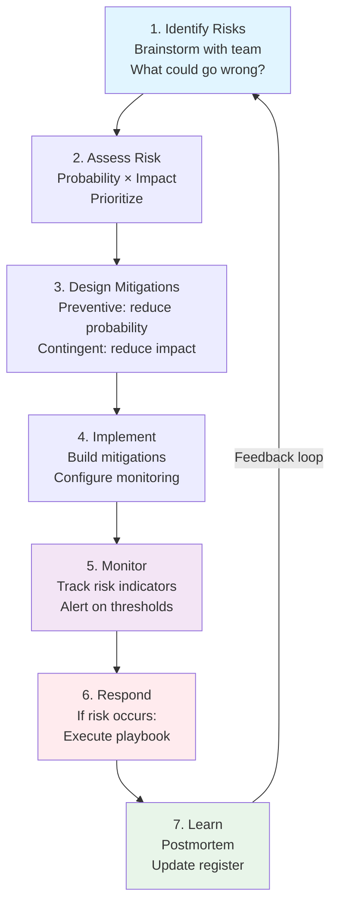

<Hero
  title="Risk Registers & Mitigation Plans"
  description="Systematically identify, assess, and mitigate architectural risks"
  size="large"
/>

## TL;DR

**Risk Register** is a systematic catalog of architectural and operational risks: identified risks, probability/impact assessment, mitigation strategy, and response plan. **Mitigation** can be preventive (reduce probability of risk occurring) or contingent (reduce impact if risk occurs). **Monitoring** tracks risk indicators—when a threshold is breached, escalate and activate response plan. **Response Plan** includes incident playbooks for known risks, so teams respond quickly if risk materializes. Risk management is proactive: identify risks early in design, implement mitigations before going to production, monitor continuously, and improve based on incidents. Organizations with disciplined risk management prevent more issues than they encounter.

## Learning Objectives

You will be able to:

- Identify architectural and operational risks systematically
- Assess probability and impact of each risk
- Design preventive mitigations (reduce likelihood) and contingent mitigations (reduce impact)
- Create and maintain risk registers integrated with project planning
- Establish monitoring and alerting for risk indicators
- Develop incident playbooks and response procedures
- Use postmortems to update risk registers and improve future designs

## Motivating Scenario

Your team designs a new payment processing system. You consider risks:

**Risk 1**: Payment gateway API goes down (external dependency failure)
- Probability: Low (Stripe has 99.9% uptime)
- Impact: Very high (can't process payments)
- Mitigation: Implement fallback to secondary payment gateway; implement graceful degradation (queue payments for retry when service recovers)

**Risk 2**: Database connection pool exhaustion under load
- Probability: Medium (happens under unexpectedly high load)
- Impact: High (API becomes unresponsive)
- Mitigation: Load test to find connection pool limit; set alerts when pool usage > 80%; implement connection pooling with backpressure

**Risk 3**: Incorrect payment amount charged (data corruption)
- Probability: Very low (transactional ACID database)
- Impact: Catastrophic (financial liability, regulatory issues)
- Mitigation: Validate amount at multiple layers; implement idempotency (can't charge twice for same order); daily reconciliation job

You document these risks in a risk register. You implement mitigations before launch. During operation, you monitor indicators (Stripe API availability, connection pool usage, reconciliation failures). If any indicator breaches threshold, you activate response plan. Months later, Stripe has an outage. Your fallback payment gateway kicks in automatically. Users experience minor degradation, not complete failure. The risk you identified and mitigated prevented a major incident.

This is proactive risk management.

## Core Content

### Building Risk Registers

A risk register is a structured list of identified risks with probability, impact, mitigations, and response plans.

**Risk Register Template:**

```
RISK #1: Payment Gateway Dependency Failure

Description:
External payment processing gateway (Stripe) becomes unavailable,
blocking all payment processing.

Probability: Low (1 in 100, <1% chance per month)
Impact: Very High (complete system down for payments, revenue lost)
Risk Score: Probability × Impact = 1% × 10 = 0.1 (low score, but
            high impact means worth mitigating)

Current State (Without Mitigation):
- Single gateway (Stripe only)
- No fallback
- No graceful degradation
- Full outage if Stripe down

Preventive Mitigations (Reduce Probability):
1. Monitor Stripe status page continuously
2. Use Stripe redundancy features (multiple API regions)
3. Contract SLA guarantees

Contingent Mitigations (Reduce Impact):
1. Implement secondary payment gateway (PayPal) ready to switch
2. Queue payments when primary gateway unavailable
3. Retry queued payments when service recovers
4. User can retry payment manually
5. Notify users of temporary payment issues

Residual Risk (After Mitigation):
- Even with mitigations, 1% chance of impact
- But impact reduced: graceful degradation instead of complete failure
- Revenue impact reduced significantly

Monitoring & Indicators:
- Monitor Stripe API health (endpoint responses)
- Track failed payment attempts
- Alert if >5% of payment requests timeout

Response Plan (If Risk Occurs):
1. Alert fires: "Stripe API unavailable"
2. Ops team verifies (check status page, try direct call)
3. Activate fallback: switch to PayPal gateway (automated)
4. Notify support: "Payments temporarily using PayPal"
5. Notify customers via UI: "Some payment methods temporarily unavailable"
6. Monitor fallback for issues
7. When Stripe recovers, process queued payments
8. Send customer confirmation emails
9. Post-incident review: why did this happen? Can we improve?
```

**Key Risk Attributes:**

1. **Identification**: What could go wrong?
2. **Description**: Why does it matter? What's the impact?
3. **Probability**: How likely? (Low, Medium, High) or (1-10 scale)
4. **Impact**: How bad if it happens? (Low, Medium, High, Catastrophic)
5. **Current state**: What's the baseline risk without mitigation?
6. **Preventive mitigation**: How do we reduce probability?
7. **Contingent mitigation**: How do we reduce impact if it happens?
8. **Residual risk**: What's the risk after mitigation?
9. **Monitoring**: What indicators tell us risk is materializing?
10. **Response**: What do we do if the risk occurs?

### Categories of Risks

Risks come in several categories. Organize register by category:

**Operational Risks** (System fails to operate):
- Service unavailability (crash, overload)
- Data loss or corruption
- Dependency failures (external APIs, databases)
- Infrastructure failures (hardware, network)

**Scaling Risks** (System can't grow):
- Database becomes bottleneck
- API can't scale to handle load
- Cache invalidation issues under scale
- Cost scales faster than revenue

**Security Risks** (Unauthorized access):
- Data breach (credentials, user data stolen)
- API compromise (injection attacks, authentication bypass)
- Supply chain attack (compromised dependency)
- Insider threat (rogue employee)

**Compliance & Regulatory Risks**:
- GDPR violation (improper data handling)
- PCI-DSS non-compliance (payment card data)
- Audit failure (lack of documentation)
- Data residency violation (data in wrong region)

**Business Risks** (System can't support business):
- Vendor lock-in (can't switch cloud providers)
- Key person dependency (critical knowledge in one person)
- Technology obsolescence (chosen tech becomes abandoned)
- Cost over-run (infrastructure costs exceed budget)

### Risk Assessment Matrix

Visualize risks by probability and impact:

```
                 IMPACT
         Low    Medium    High    Critical
       ┌─────┬────────┬────────┬──────────┐
   H I │  ▪  │  ▪ ▪  │  ▪ ▪   │  ▪ ▪ ▪  │  ← Mitigate immediately
   G   ├─────┼────────┼────────┼──────────┤
   H   │  ▪  │  ▪    │  ▪ ▪   │  ▪ ▪    │  ← High priority
 P R   ├─────┼────────┼────────┼──────────┤
 R O   │  ▪  │  ▪    │  ▪     │  ▪      │  ← Monitor
 O B   ├─────┼────────┼────────┼──────────┤
 B   │     │     │       │          │  ← Low priority
   L   └─────┴────────┴────────┴──────────┘

▪ = Each risk plotted by probability and impact
```

Risks in top-right quadrant (high probability, high impact) are urgent.
Risks in bottom-left quadrant (low probability, low impact) can be deferred.

### Preventive vs. Contingent Mitigations

**Preventive Mitigation** reduces probability:

Example: Payment gateway unavailability
- Mitigation: Use redundant gateways, implement failover logic
- Effect: Probability drops from 5% to 1%
- Cost: Engineering effort to implement failover

**Contingent Mitigation** reduces impact:

Example: Database corruption
- Mitigation: Daily backups, automated recovery testing
- Effect: Impact drops from "data loss" to "1 hour of data loss"
- Cost: Storage for backups, automation

**Combined Approach:**
Preventive + contingent = lowest risk

Example payment processing system:
- Preventive: Multiple payment gateways, health monitoring (reduce probability)
- Contingent: Queue failed payments, manual retry (reduce impact)

### Risk Register Maintenance

Risk registers aren't static documents. They evolve:

**Initial Creation** (During Design):
Brainstorm with team. What could go wrong?
Probability assessment based on research, past experiences.
Mitigation design (engineering, architecture)

**Pre-Launch Review** (Before Going Live):
Verify mitigations are implemented
Add new risks discovered during implementation
Update probability based on testing

**Operational Monitoring** (During Operations):
Track indicators continuously
If threshold breached, escalate
Document actual incidents in register
Learn from incidents to update future designs

**Quarterly Review** (Regular Cadence):
Have risks changed? (new risks, old risks resolved)
Are mitigations still effective?
Has probability changed based on real data?
Update register

**Postmortem Integration** (After Incidents):
After incident, ask: "Was this risk in our register?"
If yes: why did mitigation fail? Update it.
If no: why didn't we identify this risk? Add it.
Improve register iteratively

### Monitoring & Alerting for Risks

Each risk should have monitored indicators. When indicator crosses threshold, alert.

**Risk: Database Overload**
- Indicator: Query latency p95
- Threshold: >500ms
- Alert: "Database query latency high"
- Action: Investigate slow queries, optimize, or scale

**Risk: Memory Leak**
- Indicator: Memory usage trend
- Threshold: >80% capacity
- Alert: "Service memory usage abnormally high"
- Action: Check for leaks, restart if necessary

**Risk: Payment Fraud**
- Indicator: Unusual transaction patterns
- Threshold: >10 declined payments/min from same IP
- Alert: "Possible fraudulent activity"
- Action: Investigate, block IP if necessary, review transactions

**Risk: Dependency Unavailability**
- Indicator: External service response time
- Threshold: 5xx errors >5% of requests
- Alert: "External service degraded"
- Action: Switch to fallback, activate contingency

Well-designed monitoring turns risks from surprises into managed incidents.

### Incident Response Plans

When a risk materializes, have a plan:

**Response Plan Template:**

```
RISK: Payment Gateway Unavailability
TRIGGER: Stripe API responses with 5xx errors >10% of requests

SEVERITY LEVELS:
- Warning: 5xx errors >5% for <2 minutes
- Critical: 5xx errors >10% for >2 minutes
- Catastrophic: Stripe completely unreachable

RESPONSE PLAYBOOK (Critical Level):

1. DETECTION & VERIFICATION (0-1 min)
   - Alert fires
   - On-call engineer verifies: Check status page, try test payment
   - Slack: #incident-response: "Stripe API issue detected"

2. IMMEDIATE ACTIONS (1-5 min)
   - If fallback payment gateway available: Activate
     Command: ./scripts/activate-payment-fallback.sh paypal
     Monitor: Check fallback processing
   - If no fallback: Queue payments (inform users)
     UI message: "Payments temporarily disabled; please try in 5 mins"

3. ESCALATION (5-10 min)
   - Page on-call Payments team lead
   - Create incident ticket: #incident-payment-12345
   - Estimate impact: How many customers affected?
   - Communication: Post status update to status page

4. MITIGATION (10-60 min)
   - Monitor Stripe status page continuously
   - If Stripe recovers: Start processing queued payments
   - If Stripe still down: Activate secondary fallback
   - If all gateways down: Business decision (manual processing? Refund? etc.)

5. RECOVERY (When service recovers)
   - Process all queued payments
   - Reconcile against transaction log
   - Send customer confirmation emails
   - Remove UI message

6. POST-INCIDENT (Within 1 day)
   - Write postmortem: Why did this happen?
   - Was the risk registered? (If yes: why mitigation failed? If no: why not caught?)
   - Improvements: Could this be prevented/detected earlier?
   - Update risk register based on learnings
```

### Risk-Driven Architecture Decisions

Risks should inform architecture:

**Risk: Service Dependency Failure**
→ Architecture: Implement circuit breakers, timeouts, fallbacks
→ Pattern: Bulkhead pattern (isolate failures)

**Risk: Data Loss**
→ Architecture: Multi-region replication, backup strategy
→ Pattern: WAL (Write-Ahead Logging), backup scheduling

**Risk: Unauthorized Access**
→ Architecture: Strong authentication, authorization, audit logging
→ Pattern: Zero trust, least privilege

**Risk: Scaling Bottleneck**
→ Architecture: Horizontal scalability, caching, eventual consistency
→ Pattern: Stateless services, sharding

A well-designed risk register drives architectural decisions.

<Figure caption="Risk Management Lifecycle">

</Figure>

## Patterns & Pitfalls

**Pattern: Risk Scoring Prioritization**
Score each risk: Probability (1-3) × Impact (1-3) = Score (1-9)
Focus on risks scoring 6+ (high probability or high impact)
Re-evaluate as mitigations are implemented

**Pattern: Risk by Project Phase**
Design phase: Identify architectural risks
Implementation: Add operational risks
Pre-launch: Security, compliance risks
Operations: Scaling, reliability risks

**Pitfall: Risk Register Never Opened After Created**
Document risks, implement mitigations, then ignore register. Don't monitor. Register becomes useless.
Instead: Treat register as living document. Review regularly, update based on incidents.

**Pitfall: False Sense of Security**
"Risk registered, mitigation designed, monitoring set up" → think risk is gone.
Reality: Mitigations can fail. Monitoring can miss edge cases. Need defense-in-depth.

**Pitfall: Over-Mitigation**
Mitigating trivial risks (probability 0.1%, impact low) costs more than potential loss.
Balance: Mitigate high-probability or high-impact risks. Accept trivial risks.

## When to Use / When Not to Use

**Create risk registers for:**
- Critical systems (payments, identity, data)
- Systems handling compliance requirements (fintech, healthcare, GDPR)
- Systems with complex architecture (many moving parts, many failure modes)
- Organizations shipping to production regularly (risks change frequently)

**Skip detailed risk management for:**
- Internal tools with low impact if down
- Greenfield prototypes (risk register becomes stale too fast)
- Teams too small to operationalize mitigations
- Systems with obvious, well-mitigated risks

## Operational Considerations

- **Tool**: Spreadsheet (simple) or Jira (integrated with project management)
- **Cadence**: Create during design, update pre-launch, review quarterly
- **Ownership**: Assign owner for each risk (architect, team lead, etc.)
- **Monitoring**: Integrate risk indicators into monitoring/alerting system
- **Response**: Link to incident playbooks and runbooks

## Design Review Checklist

<Checklist items={["Risk register created and documented", "Risks identified for: operational, scaling, security, compliance, business", "Each risk assessed: probability (1-3) and impact (1-3)", "Risks prioritized by score (focus on 6+)", "Preventive mitigations designed (reduce probability)", "Contingent mitigations designed (reduce impact)", "Residual risk documented (risk remaining after mitigation)", "Monitoring indicators identified for each risk", "Alert thresholds defined", "Response playbooks written for critical risks", "Playbooks include: detection, verification, escalation, mitigation, recovery, postmortem", "Mitigations implemented and tested", "Team trained on response procedures", "Risk register reviewed: pre-launch, quarterly, and after incidents", "Postmortem process includes updating risk register", "Risk register linked to relevant ADRs (why certain architecture chosen)"]} />

<Showcase>
Organizations with disciplined risk management prevent incidents instead of just responding to them. When a risk materializes, teams have playbooks ready. Response is quick, impact is minimized. After incidents, the organization learns and updates processes. Over time, the same risk occurs repeatedly—but impact decreases because mitigations and response procedures improve. This is how mature organizations build resilience.
</Showcase>

## Self-Check

1. **Could you list 5 major risks for your system and their mitigations from memory?** If not, you haven't identified and communicated risks.

2. **If a critical risk occurred tomorrow, could your team respond quickly?** If not, you need response playbooks.

3. **Can you point to postmortems where your organization updated risk registers based on incidents?** If not, you're not learning from incidents.

## Next Steps

1. **Create risk register**: Brainstorm major risks for your system
2. **Assess each risk**: Probability, impact, current state
3. **Design mitigations**: Preventive and contingent
4. **Implement monitoring**: Identify indicators, set thresholds
5. **Create playbooks**: Response plans for critical risks

<Callout tone="info">
Risk management is not about eliminating all risk—impossible and would paralyze the organization. It's about identifying significant risks, implementing reasonable mitigations, and responding well when risks materialize. This balance is what separates resilient organizations from fragile ones.
</Callout>

## References

1. <a href="https://en.wikipedia.org/wiki/Risk_management" target="_blank" rel="nofollow noopener noreferrer">Wikipedia - Risk Management ↗️</a>
2. <a href="https://www.nist.gov/publications/risk-management-framework" target="_blank" rel="nofollow noopener noreferrer">NIST - Risk Management Framework ↗️</a>
3. <a href="https://www.pagerduty.com/resources/learn/post-incident-review/" target="_blank" rel="nofollow noopener noreferrer">PagerDuty - Post-Incident Review Best Practices ↗️</a>
4. <a href="https://www.gartner.com/en/documents/3887762" target="_blank" rel="nofollow noopener noreferrer">Gartner - Enterprise Risk Management ↗️</a>
---
