<Hero
  title="C4 Model"
  description="Hierarchical context → container → component → code diagrams for scalable architecture documentation"
  size="large"
/>

## TL;DR

The C4 Model (Simon Brown) provides four hierarchical levels of architecture diagrams: **Level 1 (Context)** shows the system in context of users and external systems (high-level, non-technical friendly), **Level 2 (Container)** shows applications, databases, and major infrastructure components (tech stack), **Level 3 (Component)** shows internal structure of major containers, **Level 4 (Code)** shows classes and methods (rarely needed; usually code-generated). Progressive zoom enables different audiences to engage at appropriate depth: stakeholders and managers focus on Level 1-2, developers work with Level 3. C4 is simpler and more practical than 4+1 Model for most teams. Start with Levels 1-3; skip Level 4.

## Learning Objectives

You will be able to:

- Create Context diagrams (Level 1) showing system in its broader ecosystem
- Create Container diagrams (Level 2) showing major infrastructure components and tech stack
- Create Component diagrams (Level 3) showing internal structure and module organization
- Decide which levels to document based on system complexity and audience needs
- Use tools (Structurizr, draw.io, PlantUML, Mermaid) to create and maintain C4 diagrams
- Navigate between levels showing progressive detail without overwhelming any single diagram

## Motivating Scenario

You're explaining your e-commerce system to different audiences:

**Non-technical stakeholder (CEO)**: "I need a 30-second overview. What is this system? Who uses it? What external systems does it depend on?"
→ Show Level 1 (Context). System box, users, external systems. Done.

**Product manager**: "I need to understand our infrastructure. What technologies are we using? How many databases? Do we have caches?"
→ Show Level 2 (Container). Services, databases, caches, message queues. Done.

**Architect designing new feature**: "I need to understand how the Order Service is internally structured. What components does it have? How do they interact?"
→ Show Level 3 (Component). Order Service broken into order handler, order repository, payment processor, notification publisher. Done.

**Backend engineer writing code**: "I need to understand the exact class structure and dependencies."
→ Show code or generate Level 4 (Code) from IDE. Done.

One system, four audiences, four levels of detail. This is the power of C4 Model: progressive zoom enables everyone to engage at the right level.

## Core Content

### Why C4 Model?

The C4 Model was introduced by Simon Brown as a practical alternative to formal architecture frameworks like 4+1 Model. Advantages:

- **Simple**: Four levels, easy to understand and remember
- **Pragmatic**: Focus on what matters, skip what doesn't
- **Progressive**: Zoom from high-level (context) to detailed (component) naturally
- **Widely adopted**: Lot of tool support (Structurizr, PlantUML, draw.io, Mermaid)
- **Stakeholder-friendly**: Non-technical folks understand Level 1; developers understand Level 3

Compared to 4+1:
- **4+1**: More comprehensive, formal, heavyweight. Best for large enterprises and regulated industries.
- **C4**: More practical, lightweight, pragmatic. Best for most teams and systems.

### Level 1: System Context Diagram

Level 1 shows the system as a black box, with users and external systems it interacts with.

**Purpose:**
- High-level understanding of system
- Identify scope and boundaries
- Show key users and stakeholders
- Show external systems (payment providers, email services, etc.)

**Audience:**
- Everyone: developers, managers, stakeholders
- Non-technical folks should understand this

**What to show:**
- The system (single box)
- Users and actors (people/roles using the system)
- External systems (third-party services, integrations)
- Relationships (what does system exchange with each user/system?)

**Example: E-Commerce System Context**

```mermaid
graph TB
    User["👤 Customer<br/>Uses Web & Mobile Apps"]
    Admin["👤 Administrator<br/>Manages Products & Orders"]
    System["eCommerce System<br/>(Order Management)"]
    Payment["Payment Gateway<br/>(Stripe)"]
    Email["Email Service<br/>(SendGrid)"]
    Inventory["Inventory System<br/>(External Warehouse)"]

    User -->|Browse, Order, Pay| System
    Admin -->|Manage, Reports| System
    System -->|Process Payments| Payment
    System -->|Send Confirmations| Email
    System -->|Check Stock| Inventory

    style System fill:#1976D2,color:#fff
    style User fill:#e1f5ff
    style Admin fill:#e1f5ff
    style Payment fill:#f3e5f5
    style Email fill:#f3e5f5
    style Inventory fill:#f3e5f5
```

**Best Practices for Level 1:**

1. **Keep it simple**: One system, few users, few external systems (5-7 max)
2. **Focus on scope**: What's IN scope, what's OUT of scope?
3. **Label relationships**: What data flows? REST API? File upload? Database replication?
4. **Use simple language**: Avoid technical jargon that non-technical folks won't understand
5. **One page**: If it doesn't fit on one page, you're adding too much detail

### Level 2: Container Diagram

Level 2 zooms into the system, showing major containers (applications, databases, services, message brokers).

**Purpose:**
- Show technology stack
- Identify major components and how they interact
- Understand infrastructure from high level
- Communicate to architects and tech leads

**Audience:**
- Technical folks: developers, architects, DevOps
- Non-technical folks won't understand; that's okay (they use Level 1)

**What to show:**
- Containers: major applications, services, databases, caches, queues
- Technologies: what tech stack is used (Node.js, PostgreSQL, Kafka, etc.)
- Connections: how do containers interact?
- Protocols: REST API, gRPC, message passing, database replication, etc.

**Example: E-Commerce System Containers**

**Key Containers to Show:**

- **Applications**: Web app, mobile app, desktop client
- **Services**: Microservices, monolithic services, worker processes
- **Data stores**: Databases, data warehouses, caches, search engines
- **Message brokers**: Kafka, RabbitMQ, SQS
- **External integrations**: Third-party APIs wrapped in adapters

**Best Practices for Level 2:**

1. **Technology + Architecture**: Include technology stack (Node.js, PostgreSQL, Kafka)
2. **Logical grouping**: Group related containers (all order-related services together)
3. **Protocols matter**: Label connections with protocol (REST, gRPC, Kafka, SQL, etc.)
4. **One per service**: If system has 20+ containers, create separate Level 2 diagrams for each major domain
5. **Data store grouping**: Show databases and caches clearly (different color/shape)
6. **External vs. Internal**: Distinguish internal containers from external systems

### Level 3: Component Diagram

Level 3 zooms into a single container, showing its internal structure: components, their responsibilities, and interactions.

**Purpose:**
- Understand internal structure of a service/application
- Show key design patterns and dependencies
- Guide developers implementing the component
- Identify architectural issues or opportunities

**Audience:**
- Developers working on this component
- Architects designing new features
- Code reviewers ensuring design consistency

**What to show:**
- Components: logical groupings within the container (not individual classes)
- Responsibilities: what does each component do?
- Interfaces: what does each component expose?
- Dependencies: which components depend on which?
- Technologies: frameworks, libraries used (if relevant)

**Example: Order Service Components (Level 3)**

**Common Component Patterns:**

- **API/Handler**: Handles incoming requests (REST, gRPC)
- **Service**: Business logic, orchestration
- **Repository**: Data access, queries
- **Adapter**: Integration with external systems
- **Publisher**: Event publishing
- **Validator**: Business rule validation

**Best Practices for Level 3:**

1. **Not every class**: Show logical components, not individual classes (usually 5-15 components per container)
2. **Responsibility**: Label what each component does
3. **Dependencies**: Show dependency direction (who depends on whom)
4. **Patterns**: Use component patterns (Service, Repository, Adapter, etc.)
5. **Interfaces**: Important interfaces should be labeled
6. **Color coding**: Use colors to group related components or distinguish roles

### Level 4: Code Diagram

Level 4 shows class structure: classes, methods, fields, inheritance, and composition. This level is rarely hand-drawn; usually generated from code.

**When Level 4 is Useful:**
- Explaining complex class hierarchies or design patterns
- Code generation or reverse engineering from existing code
- Detailed design specifications for implementation

**When Level 4 is Overkill:**
- Most of the time! Developers should read code, not diagrams.
- Diagrams go stale quickly; code is the source of truth.

**Recommendation**: Skip Level 4 unless you have a specific need. Use IDE to explore code instead.

### Progressive Zoom: Connecting Levels

C4 works best when levels are connected: click/navigate from Level 1 to Level 2, Level 2 to Level 3, Level 3 potentially to code.

**Tools Supporting Progressive Zoom:**

- **Structurizr**: Purpose-built for C4 Model. Web-based, interactive navigation between levels.
- **draw.io**: Free, supports C4. No built-in zoom, but can link diagrams (hyperlinks between pages)
- **PlantUML**: Text-based. Create separate diagrams for each level; link them in documentation
- **Mermaid**: Embedded in Markdown. Create diagrams in docs site. Progressive detail as you scroll

**Example Workflow with Structurizr:**

1. User views Level 1 (System Context)
2. Clicks on "Order Service"
3. Navigates to Level 2 (Container diagram showing Order Service details)
4. Clicks on Order Service container
5. Navigates to Level 3 (Component diagram showing Order Service internals)
6. Sees component dependencies, responsibilities, technologies

This navigation enables stakeholders to engage at their level without overwhelming them with detail.

<Figure caption="C4 Model: Four Hierarchical Levels">

</Figure>

### C4 Model Best Practices

**1. Start with Context (Level 1)**

Begin documentation with Level 1. Ensure everyone understands scope and boundaries. Only then move to deeper levels.

**2. Focus on Levels 1-3**

Level 4 is rarely needed. Use IDE to explore code. Keep diagrams at Level 3 or above.

**3. Separate Diagrams for Domains**

If system has multiple domains (Order Management, Payment Processing, Inventory), create separate Level 2 diagrams for each. One giant Level 2 is unreadable.

**4. Technology Matters**

Include technology stack in Level 2 and 3 (Node.js, PostgreSQL, Kafka, etc.). This guides implementation.

**5. Consistent Notation**

Use same shapes, colors, styles across all diagrams. Makes them easier to read and compare.

**6. Update Regularly**

When architecture changes, update all levels. Out-of-date diagrams are worse than no diagrams.

**7. Link to ADRs**

C4 diagrams should link to relevant ADRs explaining *why* containers/components are structured this way.

### C4 vs. 4+1 vs. UML

| Aspect | C4 | 4+1 | UML |
|--------|-----|------|-----|
| **Learning curve** | Gentle | Moderate | Steep |
| **Levels/Views** | 4 levels | 5 views | N/A (many diagram types) |
| **Completeness** | Good for most | Comprehensive | Very detailed |
| **Audience-friendly** | Yes (Level 1 non-technical) | Moderate | No (technical only) |
| **Tool support** | Excellent (Structurizr, draw.io) | Good (PlantUML) | Excellent (many tools) |
| **Best for** | Most systems | Large enterprises, regulated industries | Detailed specification |
| **When overkill** | Never | Small systems | Most of the time |

**Decision:**
- **Small/medium systems, most teams**: Use C4 Model
- **Large enterprises, regulated industries**: Consider 4+1 Model
- **Deep technical specification**: Use UML (or supplement C4 with UML diagrams)

## Patterns & Pitfalls

**Pattern: Domain-Driven Level 2s**
If system has multiple domains (Order Management, Payments, Inventory), create separate Level 2 diagrams for each domain. Makes each diagram clearer.

**Pattern: README for Each Level**
Provide brief narrative explaining each level. Diagrams alone are insufficient context.

**Pitfall: Levels too detailed/abstract**
Level 2 shows 50 containers (too much detail). Level 3 shows only 2 components (too abstract). Calibrate depth appropriately.

**Pitfall: Losing technology info**
Container boxes show names but not technologies. Result: readers don't know what tech stack is used. Always include tech (Node.js, PostgreSQL, Kafka, etc.).

**Pitfall: Disconnected from reality**
C4 diagrams created once, never updated. After 6 months, system has changed. Diagrams are stale. Treat them like code: review, update, version control.

## When to Use / When Not to Use

**Use C4 Model when:**
- Creating architecture documentation
- Onboarding new team members
- Communicating with stakeholders (non-technical and technical)
- Designing new systems or major features
- Documenting deployment topology
- Almost any system (it's that practical)

**Less critical for:**
- Existing complex systems with great informal knowledge (though still valuable)
- Projects moving so fast documentation can't keep up
- Single-developer projects (less need for documentation)

## Operational Considerations

- **Tool**: Structurizr (most purpose-built), draw.io (free, simple), PlantUML (text-based, version control friendly), Mermaid (embedded in docs)
- **Storage**: Store in version control if text-based (PlantUML, Mermaid) or cloud tool (Structurizr, draw.io)
- **Publishing**: Embed in documentation site or wiki for discoverability
- **Updates**: When architecture changes, update all relevant levels
- **Reviews**: Code review should include diagram reviews if diagrams change

## Design Review Checklist

<Checklist items={["Level 1 (Context) diagram created", "Level 1 shows system, users, external systems (not too detailed)", "Level 2 (Container) diagram created", "Level 2 shows major applications, databases, services, message brokers", "Level 2 includes technology stack (Node.js, PostgreSQL, Kafka, etc.)", "Level 2 labels connections with protocols (REST, gRPC, Kafka, etc.)", "Level 3 (Component) diagram created for major services", "Level 3 shows components within container (5-15 components)", "Level 3 labels component responsibilities", "Level 3 shows key dependencies and interfaces", "Level 4 skipped (not needed for most systems)", "Diagrams stored in version control or cloud tool", "Diagrams linked/navigable (Level 1 → Level 2 → Level 3)", "Consistent notation (shapes, colors, styles across all diagrams)", "Metadata included (owner, last updated, next review)", "README/narrative provided for each level", "Linked to relevant ADRs", "All team members trained on using C4 Model"]} />

<Showcase>
Teams using C4 Model produce architecture documentation that's actually read and maintained. Non-technical stakeholders use Level 1 to understand system scope. Product managers use Level 2 to understand tech stack and infrastructure. Developers use Level 3 to guide implementation. Diagrams are kept synchronized with code through regular reviews. When architecture changes, all levels are updated together. This is how C4 becomes the source of truth for system architecture.
</Showcase>

## Self-Check

1. **Could you explain your system's scope in 30 seconds to a non-technical CEO using only Level 1?** If not, Level 1 is too detailed or unclear.

2. **If someone asked "What's our tech stack?", could you answer by pointing to your Level 2 diagram?** If not, add technology labels.

3. **If onboarding a new engineer to a specific service, could you hand them Level 3 component diagram and have them understand module structure?** If not, components need better labeling or grouping.

## Next Steps

1. **Create Level 1 (Context)**: System, users, external systems only
2. **Create Level 2 (Container)**: Major apps, databases, services, with technologies
3. **Create Level 3 (Component)**: Zoom into major services (Order Service, Payment Service, etc.)
4. **Store in version control**: Use PlantUML or tool of choice. Commit diagrams.
5. **Link to docs**: Embed in documentation site. Make discoverable during onboarding.

<Callout tone="info">
C4 Model is simple yet powerful. Start with Level 1-2 to establish scope. Add Level 3 as system complexity grows. Skip Level 4. Update levels as architecture changes. This discipline keeps your architecture visible and understandable to the entire team.
</Callout>

## References

1. <a href="https://c4model.com/" target="_blank" rel="nofollow noopener noreferrer">C4 Model - Visualising Software Architecture ↗️</a>
2. <a href="https://structurizr.com/" target="_blank" rel="nofollow noopener noreferrer">Structurizr - C4 Model Visualization Tool ↗️</a>
3. <a href="https://www.simonbrown.je/" target="_blank" rel="nofollow noopener noreferrer">Simon Brown - C4 Model Creator ↗️</a>
4. <a href="https://www.youtube.com/playlist?list=PLjQdo72ZvBBKLJzEuGyeWqcJpfaHJ8m5Q" target="_blank" rel="nofollow noopener noreferrer">Simon Brown - C4 Model Videos ↗️</a>
---
