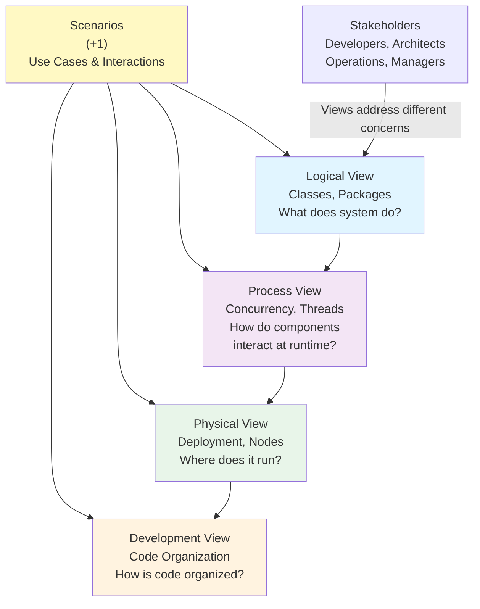

<Hero
  title="4+1 Architectural Model"
  description="Kruchten's classic five views: logical, process, physical, development, and use-case scenarios"
  size="large"
/>

## TL;DR

The 4+1 Architectural Model (Kruchten, 1995) addresses four key architectural views plus one tying them together: **Logical View** (class diagrams, packages, functional decomposition—what the system does), **Process View** (concurrency, processes, threads—how components interact at runtime), **Physical View** (deployment, nodes, networks—where software runs), **Development View** (code organization, modules, build structure—how engineers organize code), and **Scenarios** (+1) (use cases and user interactions tying all views together). Each view serves different stakeholders and answers different questions. The 4+1 Model is comprehensive but heavyweight; teams working on smaller systems may find C4 Model simpler.

## Learning Objectives

You will be able to:

- Understand which architectural view answers which stakeholder questions
- Create and present Logical, Process, Physical, Development, and Scenario views
- Use scenarios to connect and validate all four views
- Choose between 4+1 Model and simpler approaches (C4) based on system complexity
- Ensure each view is internally consistent and cross-referenced

## Motivating Scenario

You're designing a system with 15+ services, complex asynchronous interactions, and deployment across multiple cloud regions. You're meeting with different stakeholders:
- **Product manager**: "What does the system do? What are its main capabilities?"
- **Backend engineer**: "How do all these services fit together? How do they communicate?"
- **DevOps engineer**: "Where does everything run? How many nodes? What's the deployment?"
- **Frontend engineer**: "How does the UI integrate with the backend?"
- **CTO**: "Is the architecture sound? Does it support our business model?"

A single diagram won't address all these perspectives. The Logical View shows functionality. The Process View shows concurrency and async interactions. The Physical View shows deployment topology. The Development View shows how code is organized. Scenarios tie them all together by showing how a user interaction flows through all views.

The 4+1 Model is a mature framework for this kind of comprehensive architecture documentation. It ensures you've thought through all important perspectives.

## Core Content

### History and Context

The 4+1 Architectural Model was introduced by Philippe Kruchten in 1995 and published in a seminal paper in IEEE Software. It was a response to the observation that no single view adequately describes a system. Different stakeholders care about different aspects:

- Architects care about logical structure (classes, packages, patterns)
- Developers care about code organization and build structure
- Operations care about deployment and infrastructure
- Managers care about system capabilities and use cases

Kruchten's insight: provide four views addressing different concerns, plus scenarios that show how everything works together. The model has been widely adopted and influenced modern approaches like C4 Model.

### View 1: Logical View (What the system does)

The Logical View describes the system's functionality and decomposition: what the system does, broken down into functional components.

**Key elements:**
- Classes and objects (if object-oriented)
- Packages or modules (logical groupings)
- Interfaces (contracts between components)
- Design patterns (key patterns used)
- Relationships (inheritance, composition, association)

**Audience:**
- Architects, senior engineers understanding overall structure
- Business analysts understanding capabilities

**Representation:**
- UML class diagrams
- Package diagrams
- Component diagrams (logical, not physical)
- Architecture diagrams showing domain boundaries

**Example: E-Commerce System Logical View**

```plantuml
@startuml logical
package "User Management" {
  class User {
    user_id: UUID
    email: string
    password_hash: string
    created_at: timestamp
  }
  interface IUserRepository
  class UserService {
    register(email, password)
    authenticate(email, password)
  }
  UserService implements IUserRepository
}

package "Order Management" {
  class Order {
    order_id: UUID
    user_id: UUID (FK)
    total: decimal
    status: enum
  }
  class OrderItem {
    item_id: UUID
    product_id: UUID
    quantity: int
    price: decimal
  }
  class OrderService {
    createOrder(user_id, items)
    processPayment(order_id)
    shipOrder(order_id)
  }
  Order "1" --* "N" OrderItem
}

package "Payment Processing" {
  interface IPaymentGateway
  class StripeAdapter implements IPaymentGateway
  class PaymentService {
    charge(amount)
    refund(transaction_id)
  }
}

OrderService --> IPaymentGateway
UserService --> User

@enduml
```

This view shows:
- Major functional domains (User Management, Order Management, Payment)
- Classes and relationships within each domain
- Key interfaces and contracts
- How domains relate to each other

**Process for Creating Logical View:**

1. **Identify domains**: Break system into major functional areas
2. **Decompose each domain**: Identify classes/modules within each
3. **Define interfaces**: What contracts do domains expose?
4. **Show relationships**: How do domains interact?
5. **Apply patterns**: What design patterns are used?
6. **Document rationale**: Why this decomposition?

### View 2: Process View (How components interact at runtime)

The Process View describes concurrency, synchronization, and how components interact at runtime. It focuses on processes, threads, and asynchronous communication.

**Key elements:**
- Processes or threads (units of concurrency)
- Synchronization and communication (locks, queues, messages)
- State machines (lifecycle of processes)
- Timing and performance considerations

**Audience:**
- Developers implementing components
- Performance engineers optimizing system
- Reliability engineers designing fault tolerance

**Representation:**
- Sequence diagrams (message flow)
- Activity diagrams (workflows)
- State machine diagrams (process lifecycle)
- Timing diagrams (timing relationships)

**Example: E-Commerce System Process View**

```plantuml
@startuml process
!define THREAD rectangle "<<process>>"

THREAD API_Handler {
  note "Handles REST requests"
  queue INPUT_QUEUE
  process PROCESSOR
  queue OUTPUT_QUEUE
}

THREAD Background_Worker {
  note "Async order processing"
  queue TASK_QUEUE
  process TASK_PROCESSOR
}

THREAD Payment_Processor {
  note "Handles payment processing"
  queue PAYMENT_QUEUE
  process STRIPE_ADAPTER
}

INPUT_QUEUE --> PROCESSOR: Request
PROCESSOR --> TASK_QUEUE: Enqueue payment task
TASK_QUEUE --> TASK_PROCESSOR: Dequeue
TASK_PROCESSOR --> PAYMENT_QUEUE: Enqueue Stripe charge
PAYMENT_QUEUE --> STRIPE_ADAPTER: Process charge
STRIPE_ADAPTER --> OUTPUT_QUEUE: Response
OUTPUT_QUEUE --> API_Handler: Return response

@enduml
```

This view shows:
- Separate threads/processes for different concerns (API, background workers, payment processing)
- Message queues enabling asynchronous communication
- Data flow through the system
- Concurrency and bottlenecks

**Design Patterns in Process View:**

- **Producer-Consumer**: One process produces, another consumes (queue-mediated)
- **Pipeline**: Data flows through series of processors
- **Thread Pool**: Pool of threads servicing incoming requests
- **Master-Slave**: Master coordinates, slaves execute work
- **Broker**: Central coordinator mediating message flow

### View 3: Physical View (Where components run)

The Physical View describes the system's deployment: what hardware exists, how software is deployed, network topology, and physical constraints.

**Key elements:**
- Nodes (computers, servers, containers)
- Network connections
- Deployed artifacts (executables, libraries, data)
- Physical constraints (latency, bandwidth, availability zones)

**Audience:**
- Operations and DevOps engineers
- Infrastructure and capacity planners
- Compliance and security teams

**Representation:**
- Deployment diagrams
- Infrastructure-as-code (Terraform, CloudFormation)
- Network diagrams
- High-availability and disaster-recovery diagrams

**Example: E-Commerce System Physical View**

```plantuml
@startuml deployment
node "AWS Region us-east-1" as REGION {
  node "Availability Zone 1a" {
    node "Load Balancer" as LB1 {
      artifact "API Server 1"
    }
    node "Kubernetes Pod" as POD1 {
      artifact "Order Service"
    }
  }

  node "Availability Zone 1b" {
    node "Load Balancer" as LB2 {
      artifact "API Server 2"
    }
    node "Kubernetes Pod" as POD2 {
      artifact "Order Service"
    }
  }

  node "Managed Services" {
    artifact "RDS PostgreSQL"
    artifact "ElastiCache Redis"
    artifact "SNS/SQS"
  }
}

node "AWS Region eu-west-1" as REGION2 {
  node "Read Replica Database"
  node "Backup Storage"
}

LB1 --> POD1: Route traffic
LB2 --> POD2: Route traffic
POD1 --> RDS: Query
POD2 --> RDS: Query
RDS --> Read Replica: Replicate
RDS --> Backup Storage: Backup

@enduml
```

This view shows:
- Multiple availability zones for redundancy
- Load balancers distributing traffic
- Managed services (RDS, ElastiCache)
- Cross-region replication for disaster recovery
- Physical constraints and distributed nature

**Physical View Considerations:**

- **Availability**: Redundancy across zones/regions
- **Latency**: Network latency between zones
- **Bandwidth**: Network capacity and costs
- **Scalability**: How to add more nodes
- **Compliance**: Data residency requirements (GDPR, etc.)

### View 4: Development View (How code is organized)

The Development View describes how the system is structured from a developer's perspective: code organization, modules, build processes, and configuration.

**Key elements:**
- Module/package structure (how code is organized)
- Dependencies between modules (what depends on what)
- Build structure (libraries, frameworks, build tools)
- Configuration and variability (different configurations for different environments)

**Audience:**
- Developers writing and maintaining code
- Build engineers configuring CI/CD
- Release engineers managing deployments

**Representation:**
- Module dependency diagrams
- Package structure diagrams
- Build system documentation
- Layered architecture diagrams

**Example: E-Commerce System Development View**

```
order-service/
├── api/                    # REST API endpoints
│   └── handlers/
│       ├── order_handler.go
│       ├── product_handler.go
│       └── payment_handler.go
├── domain/                 # Business logic (domain layer)
│   ├── order/
│   │   ├── order.go        # Order entity
│   │   ├── service.go      # Order service
│   │   └── repository.go   # Order repository interface
│   └── product/
├── infrastructure/         # External integrations
│   ├── database/
│   │   └── postgres_repository.go
│   ├── payment/
│   │   └── stripe_adapter.go
│   └── messaging/
│       └── kafka_events.go
├── config/                 # Configuration
│   ├── dev.yaml
│   ├── staging.yaml
│   └── prod.yaml
├── go.mod                  # Dependencies
└── Dockerfile             # Container definition
```

**Architectural Layers:**

```
┌─────────────────────────┐
│   API/Handler Layer     │  (REST endpoints)
├─────────────────────────┤
│   Service/Business Layer│  (Business logic)
├─────────────────────────┤
│   Repository Layer      │  (Data access)
├─────────────────────────┤
│   Infrastructure Layer  │  (Database, queues, etc.)
└─────────────────────────┘
```

Typical layered architecture:
- **Presentation**: REST/GraphQL endpoints, request handling
- **Application**: Business logic, orchestration
- **Domain**: Core business entities and rules
- **Infrastructure**: Database, queues, external APIs

### View 5 (+1): Scenarios

Scenarios tie all views together by showing how a user interaction or use case flows through the system, touching Logical, Process, Physical, and Development views.

**Example Scenario: Customer Places Order**

**Scenario 1: Happy Path (Normal Order)**

```
User places order (Physical: Web browser on client machine)
  → REST API endpoint (Development: api/handlers/order_handler.go)
  → OrderService.createOrder() (Logical: OrderService class)
  → Validate order (Domain: Order entity validation)
  → Write to database (Process: Synchronous call)
  → Enqueue payment task (Process: Asynchronous via Kafka)
  → Return 201 Created (API returns)
  → Payment service picks up task (Process: Background worker)
  → Charges card via Stripe (Development: infrastructure/payment/stripe_adapter.go)
  → Updates order status (Domain: Order status → CONFIRMED)
  → Publishes OrderConfirmed event (Process: Kafka topic)
  → Notification service subscribes (Logical: NotificationService)
  → Sends confirmation email (Development: infrastructure/messaging)
```

**Scenario 2: Error Case (Insufficient Funds)**

```
(Same as above until payment processing)
  → Stripe returns error (insufficient funds)
  → Payment service publishes PaymentFailed event
  → Notification service sends failure email
  → Order status → PAYMENT_FAILED
  → User can retry payment or abandon order
```

**Scenario 3: Load Scenario (Black Friday)**

```
1,000 concurrent users place orders
  → Load balancer distributes to API servers (Physical: Multiple availability zones)
  → Order service instances handle in parallel (Process: Thread pools)
  → Database connections pooled (Development: Connection pooling)
  → Queue handles payment tasks asynchronously (Process: Decoupling)
  → System remains responsive (not blocked by payment processing)
```

Each scenario traces through the system, showing how different views interact.

**Creating Scenarios:**

1. **Identify use cases**: Key user workflows
2. **Trace happy path**: How request flows through system
3. **Trace error cases**: What happens when something fails
4. **Trace load scenarios**: How system behaves under stress
5. **Validate against views**: Does scenario match Logical, Process, Physical, Development views?

<Figure caption="4+1 Model: Five Views of Architecture">

</Figure>

## Patterns & Pitfalls

**Pattern: View Consistency Checks**
During architecture reviews, validate that all views are consistent. If Logical View shows no async communication, but Process View has concurrent processing, there's a mismatch. Resolve it.

**Pattern: Scenario Validation**
Use scenarios to validate the design. Trace happy path and error cases through all views. If trace doesn't match any view, views are inconsistent.

**Pitfall: Missing Views**
Creating only Logical and Physical views, ignoring Process and Development. This leaves critical architectural decisions undocumented.

**Pitfall: Views Disconnected from Reality**
Diagrams are created once, never updated. After 6 months, they don't match system. Keep views synchronized with code and deployment.

**Pitfall: Overwhelming Detail**
Including too much detail in each view. Focus on key decisions and patterns, not every class or every node.

## When to Use / When Not to Use

**Use 4+1 Model when:**
- System is large and complex (20+ components)
- System has complex concurrency or async patterns
- Team is distributed (can't rely on informal communication)
- Stakeholders have varied concerns (different teams care about different aspects)
- Project longevity is long (architecture documentation will be valuable over time)
- Regulatory requirements demand comprehensive documentation

**Don't invest in full 4+1 for:**
- Small systems (monolithic, < 5 major components)
- Teams with strong institutional knowledge and high stability
- Projects moving very fast and pivoting frequently
- Single-team projects where everyone knows the system

**Alternative**: For smaller systems, use C4 Model (simpler, 4 levels) or custom notation.

## Operational Considerations

- **Tool choice**: PlantUML for 4+1 diagrams. Supports all necessary diagram types.
- **Storage**: Store diagrams in version control (PlantUML source files)
- **Documentation**: Write narrative explaining each view. Diagrams alone are insufficient.
- **Updates**: When architecture changes (new service, new pattern), update all affected views
- **Reviews**: Architecture reviews should examine all five views for consistency
- **Scenarios**: Use scenarios in design reviews to validate design before implementation

## Design Review Checklist

<Checklist items={["Logical View created (classes, packages, interfaces)", "Logical View shows functional decomposition", "Process View created (concurrency, async patterns, message flows)", "Process View shows how components interact at runtime", "Physical View created (deployment topology, nodes, networks)", "Physical View shows redundancy and availability zones", "Development View created (code organization, module structure)", "Development View shows layering and build structure", "Scenarios created (at least 3: happy path, error case, load scenario)", "Scenarios trace through all four views", "Views are internally consistent (Logical matches Process, etc.)", "Views linked to relevant ADRs", "All views stored in version control", "All views have metadata (owner, last updated, next review)", "Narrative documentation explains each view", "Team trained on interpreting all five views"]} />

<Showcase>
Large, complex systems with comprehensive 4+1 documentation have a significant advantage. Architects, developers, operations, and management can all understand the system from their perspective. When incidents occur, ops team can reference Physical View to understand infrastructure. When designing new features, developers reference Logical and Development views. When planning capacity, infrastructure team references Physical View. When communicating with executives, scenarios show how business flows through system. This is architectural documentation that serves the entire organization.
</Showcase>

## Self-Check

1. **Could you create a Logical View showing your system's functional decomposition?** If not, you don't fully understand your system's structure.

2. **If asked about concurrency or async patterns in your system, could you draw a Process View?** This forces you to think through synchronization and timing.

3. **Could you trace a key user scenario through all four views, showing how it maps to each?** This validates that your views are consistent and complete.

## Next Steps

1. **Create Logical View**: Diagram major components and relationships
2. **Create Process View**: Diagram concurrency and async interactions
3. **Create Physical View**: Diagram deployment topology and redundancy
4. **Create Development View**: Diagram code organization and layering
5. **Create Scenarios**: Trace key use cases through all views and validate consistency

<Callout tone="info">
The 4+1 Model is comprehensive but heavyweight. Use it for complex systems where different stakeholders care about different aspects. For smaller systems, C4 Model may be simpler. Choose the approach that matches your system's complexity and team's needs.
</Callout>

## References

1. <a href="https://en.wikipedia.org/wiki/4%2B1_architectural_view_model" target="_blank" rel="nofollow noopener noreferrer">Wikipedia - 4+1 Architectural View Model ↗️</a>
2. <a href="https://www.computer.org/csdl/magazine/so/1995/11/s6032/13rRUIUK5O8" target="_blank" rel="nofollow noopener noreferrer">IEEE Software - Kruchten's Original Paper ↗️</a>
3. <a href="https://www.ozimmer.ch/practices/2020/05/22/4plus1.html" target="_blank" rel="nofollow noopener noreferrer">Ozimmer - 4+1 Model Explained ↗️</a>
4. <a href="https://c4model.com/" target="_blank" rel="nofollow noopener noreferrer">C4 Model - A Simpler Alternative ↗️</a>
---
