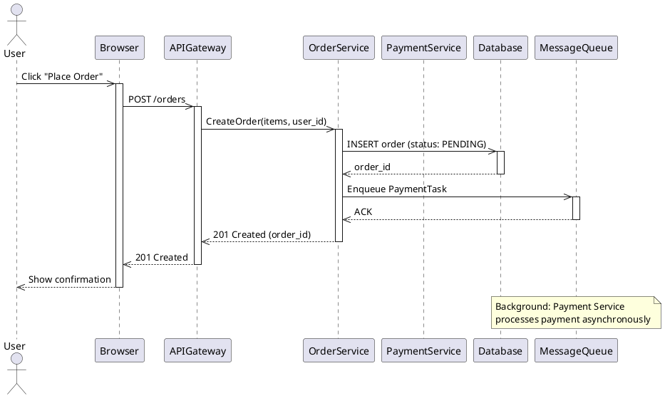
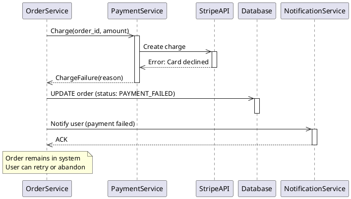
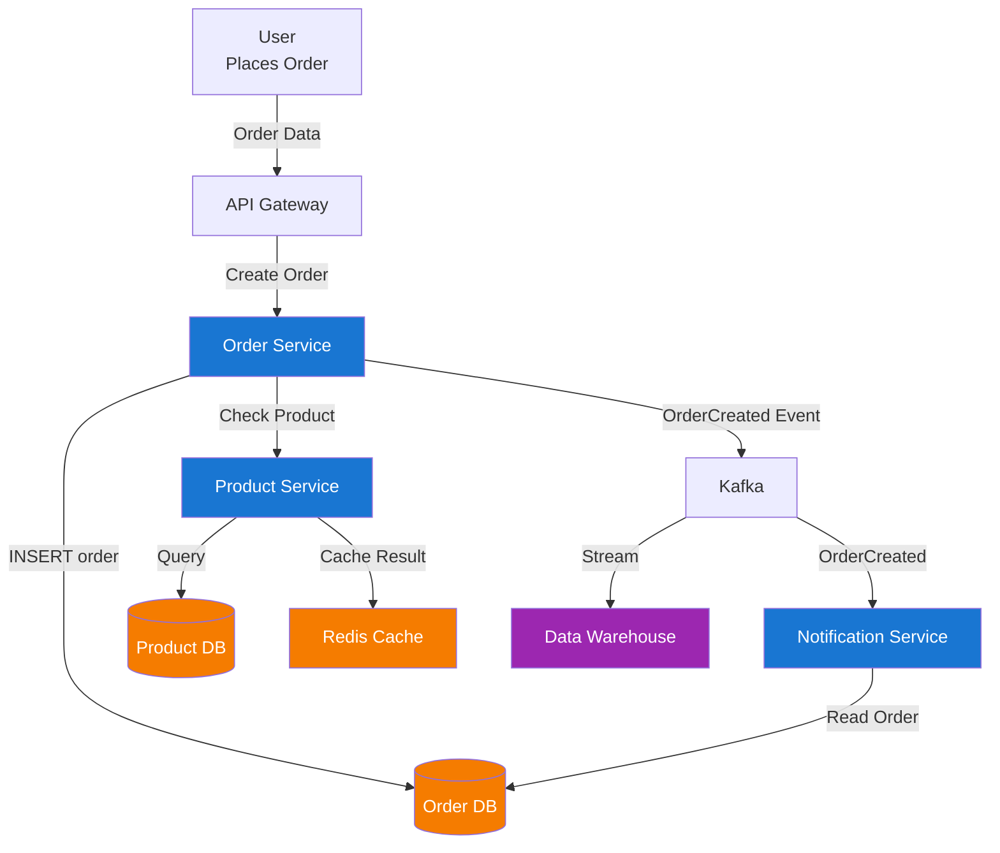
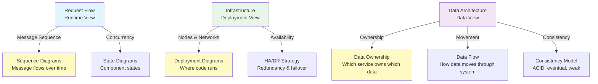

<Hero
  title="Runtime, Deployment & Data Views"
  description="Capture dynamic behavior, infrastructure topology, and information flow"
  size="large"
/>

## TL;DR

**Runtime View** captures dynamic behavior: how components interact at runtime, message sequences, concurrency patterns, and state transitions (sequence diagrams, activity diagrams, state machines). **Deployment View** shows infrastructure topology: where software runs, node distribution, availability zones, networks, and physical constraints (deployment diagrams, infrastructure-as-code). **Data View** documents data ownership, flow, storage, consistency guarantees, and replication strategies (data flow diagrams, entity-relationship diagrams, data architecture diagrams). Together, these three views answer operational and implementation questions: how does the system behave at runtime? Where does it run? How is data managed? These views are essential for operations, incident response, and capacity planning.

## Learning Objectives

You will be able to:

- Create sequence diagrams to illustrate complex component interactions and message flows
- Design deployment diagrams showing infrastructure topology and high availability
- Document data ownership, data flow, and consistency requirements
- Understand trade-offs between consistency, availability, and partition tolerance
- Design for resilience, scalability, and disaster recovery
- Use views to guide operational runbooks and incident response

## Motivating Scenario

Your system experiences a production outage. The API Gateway is returning 503 errors. Your team scrambles to understand what's happening:

- **Developer**: "How does the request flow through the system? Which services touch which data?"
→ Needs Runtime View (sequence diagram showing request flow)

- **DevOps**: "Where is the API Gateway deployed? How many instances? Which availability zone is down?"
→ Needs Deployment View (infrastructure diagram showing node distribution)

- **Database Admin**: "Which service owns which data? Are we replicating? What's the consistency guarantee?"
→ Needs Data View (data architecture showing data ownership and replication)

Without these views, incident response is slow and uncertain. With them, team can quickly diagnose the problem and plan recovery.

## Core Content

### Runtime View: How Components Interact Over Time

The Runtime View captures the dynamic behavior of the system: how components interact, in what sequence, over time. It complements static structural views (Logical, Component) by showing behavior.

**Key Elements:**
- Sequence of interactions (message order matters)
- Timing (who waits for whom?)
- Concurrency (parallel activities)
- State changes (component state transitions)
- Error scenarios (what happens when something fails?)

**Representation:**
- Sequence diagrams (detailed message flow over time)
- Activity diagrams (workflows, parallel activities)
- State machine diagrams (state transitions)
- Timing diagrams (timing relationships)

**Example 1: Request-Response Sequence (Happy Path)**



This sequence shows:
- Message order (API Gateway → Order Service → Database)
- Synchronous vs asynchronous (OrderService waits for DB, but not for Payment Service)
- Response flow (replies bubble back up)
- Activation boxes showing when each component is active

**Example 2: Error Scenario (Payment Failure)**



This error sequence shows:
- Failure propagation (Stripe error → Payment Service → Order Service)
- Error handling (updating order status, notifying user)
- Recovery options (user can retry)

**Example 3: Concurrent Activities (Load Scenario)**

```plantuml
@startuml concurrent
    participant LoadBalancer
    participant OrderService1
    participant OrderService2
    participant Database

    par Concurrent Requests
        LoadBalancer ->> OrderService1: Request 1
        activate OrderService1
        OrderService1 ->> Database: INSERT order
        activate Database
    and
        LoadBalancer ->> OrderService2: Request 2
        activate OrderService2
        OrderService2 ->> Database: INSERT order
    and
        LoadBalancer ->> OrderService1: Request 3
    end

    Database -->> OrderService1: ACK
    Database -->> OrderService2: ACK
    deactivate Database
    OrderService1 -->> LoadBalancer: Response 1
    deactivate OrderService1
    OrderService2 -->> LoadBalancer: Response 2
    deactivate OrderService2

@enduml
```

This concurrent sequence shows:
- Load balancer distributing requests to multiple service instances
- Parallel processing (multiple requests being handled simultaneously)
- Database handling concurrent writes

**Best Practices for Runtime View:**

1. **Show realistic scenarios**: Include happy path, error cases, load scenarios
2. **Timing matters**: Order of messages communicates causality
3. **Synchronous vs. Async**: Use different line types (solid for sync, dashed for async)
4. **Error handling**: Don't just show happy path; show what happens when something fails
5. **Avoid huge diagrams**: If diagram has 10+ lifelines, break into multiple diagrams
6. **Label clearly**: Each message should indicate what's being sent and why

### Deployment View: Where Components Run

The Deployment View captures the infrastructure topology: where software runs, how it's distributed, availability zones, networks, and physical constraints.

**Key Elements:**
- Nodes (computers, servers, containers, cloud instances)
- Networks (connectivity, availability zones, regions)
- Artifacts (deployed software, versions)
- Redundancy and failover mechanisms
- Scaling and capacity considerations

**Example 1: Kubernetes Deployment (Multi-Zone HA)**

```plantuml
@startuml deployment
    node "AWS Region us-east-1" as REGION {
        node "Availability Zone 1a" as AZ1 {
            node "Kubernetes Masters" {
                artifact "API Server" as APIMASTER
                artifact "etcd" as ETCD1
            }
            node "Worker Nodes" {
                rectangle "Deployment: API (2 replicas)" {
                    artifact "Pod: API-1"
                    artifact "Pod: API-2"
                }
                rectangle "Deployment: Order Service (3 replicas)" {
                    artifact "Pod: Order-1"
                    artifact "Pod: Order-2"
                }
            }
            node "Storage" {
                artifact "EBS Volume 1"
            }
        }

        node "Availability Zone 1b" as AZ2 {
            node "Worker Nodes" {
                rectangle "Deployment: Order Service (replica)" {
                    artifact "Pod: Order-3"
                }
                rectangle "Deployment: Payment (2 replicas)" {
                    artifact "Pod: Payment-1"
                    artifact "Pod: Payment-2"
                }
            }
            node "Storage" {
                artifact "EBS Volume 2"
            }
        }

        node "Managed Services" {
            artifact "RDS PostgreSQL (Multi-AZ)"
            artifact "ElastiCache Redis Cluster"
            artifact "SNS/SQS"
        }
    }

    node "AWS Region eu-west-1" as REGION2 {
        note "Backup / Disaster Recovery Region"
        artifact "RDS Read Replica"
        artifact "S3 Backup Bucket"
    }

    ETCD1 -.->|Replicates| REGION2
    RDS -->|Replica| "RDS Read Replica"

@enduml
```

This deployment diagram shows:
- Multiple availability zones for redundancy
- Multiple replicas of services across zones
- Managed services (RDS, ElastiCache, SNS)
- Cross-region replication for disaster recovery
- Shared managed services used by multiple services

**Example 2: Multi-Cloud Deployment**

```plantuml
@startuml multicloud
    cloud "AWS (Primary)" {
        node "AWS Region 1" {
            artifact "API Service (Elastic Beanstalk)"
            artifact "PostgreSQL (RDS)"
            artifact "Redis (ElastiCache)"
        }
    }

    cloud "Google Cloud (Failover)" {
        node "GCP Region" {
            artifact "API Service (Cloud Run)"
            artifact "PostgreSQL (Cloud SQL)"
            artifact "Redis (Memorystore)"
        }
    }

    cloud "CDN" {
        artifact "CloudFront (AWS)"
        artifact "Cloud CDN (GCP)"
    }

    note
        Traffic routed based on health checks
        If AWS down, traffic routes to GCP
        Data synced via database replication
    end note

@enduml
```

This shows:
- Multiple cloud providers for redundancy
- Failover mechanisms
- Data synchronization across clouds
- CDN for geo-distribution

**Deployment View Considerations:**

1. **High Availability**: Multiple zones, replicas, failover mechanisms
2. **Scalability**: Can you add more nodes to handle load?
3. **Resilience**: What happens if a zone fails? A node fails? A service crashes?
4. **Latency**: Network latency between zones/regions affects performance
5. **Cost**: Number of nodes, managed services, data transfer costs
6. **Compliance**: Data residency requirements, security zones

### Data View: Data Ownership, Flow, and Consistency

The Data View documents data ownership (which service owns which data), data flow (how data moves through the system), storage mechanisms, and consistency guarantees.

**Key Elements:**
- Data ownership (which service is authoritative for which data?)
- Data flow (how data moves between services)
- Storage (databases, caches, data warehouses)
- Consistency (ACID, eventual consistency, etc.)
- Replication (how is data synchronized?)
- Backup and recovery (how is data protected?)

**Example 1: Data Ownership Model**

```
Service: Order Service
  Owns: orders table, order_items table
  Writes: Order Service only
  Readers: Payment Service, Notification Service, Analytics
  Consistency: ACID (PostgreSQL)
  Replication: Primary-replica (PostgreSQL replication)

Service: Product Service
  Owns: products table, inventory table
  Writes: Product Service only
  Readers: Order Service, API Gateway
  Consistency: ACID
  Replication: Read-only replicas for scale

Service: User Service
  Owns: users table, credentials table
  Writes: User Service only
  Readers: Order Service, Notification Service
  Consistency: ACID
  Special: passwords encrypted

Shared Cache: Redis
  Data: Session cache, computed aggregates
  Owner: No owner (computed from primary data)
  TTL: 1 hour for sessions, 15 minutes for aggregates
  Consistency: Eventual (cache can be stale)

Data Warehouse: Snowflake
  Data: Denormalized copy of all operational data
  Owner: Analytics team
  Update frequency: Nightly batch + real-time Kafka streams
  Purpose: Analytics, reporting, BI tools
```

**Example 2: Data Flow Diagram**



This shows:
- Data origin (User submits order)
- Primary data stores (Order DB, Product DB)
- Data flow (requests and events)
- Read-only access patterns (Notification Service reads Order DB)
- Caching layers (Redis)
- Analytics pipeline (Kafka → Data Warehouse)

**Example 3: Consistency Guarantees**

```
Critical Path (Requires ACID):
- Order creation + Payment processing
- Must not lose data
- Must ensure no double-charging
- Mechanism: Distributed transactions or saga pattern

Semi-critical (Eventual Consistency OK):
- Inventory updates
- Product search results
- User analytics
- Mechanism: Eventual consistency with retry/compensation

Non-critical (Consistency not essential):
- Cache contents (sessions, computed results)
- Temporary data
- Mechanism: TTL-based expiration

Replication Strategy:
- Order/Product/User data: Synchronous replication (standby must acknowledge)
- Cache: No replication (ephemeral)
- Analytics: Asynchronous (nightly sync acceptable)
```

**Data Consistency Trade-offs:**

| Consistency Model | Guarantees | Use Case | Example |
|-------------------|-----------|----------|---------|
| **ACID** | Strong consistency | Critical financial operations | Order + Payment transactions |
| **Eventual** | Consistency after some delay | User-facing reads | Inventory counts, product reviews |
| **Causal** | Causally related operations ordered | Chat messages, comments | Event feeds |
| **Weak** | No guarantees | Caches, temporary data | Session cache, computed results |

**Best Practices for Data View:**

1. **Explicit ownership**: Each data table/collection has clear owner
2. **Read patterns**: Document who reads which data (helps with caching, replication)
3. **Consistency levels**: Not everything needs ACID (costs performance); be explicit
4. **Replication**: Show how data is synchronized (sync vs. async, multi-region, etc.)
5. **Backup/Recovery**: How is data protected? What's the RTO/RPO?
6. **Secrets management**: Where do passwords, API keys, etc. live? (not in diagrams!)

<Figure caption="Three Views: Runtime, Deployment, and Data">

</Figure>

## Patterns & Pitfalls

**Pattern: Sequence Diagram Gallery**
Create multiple sequence diagrams showing different scenarios (happy path, error cases, load, security). Each diagram focuses on one scenario.

**Pattern: Infrastructure-as-Code Driven Deployment View**
Deployment diagrams generated from Terraform or CloudFormation. They're always accurate because they reflect actual infrastructure.

**Pattern: Data Lineage Tracking**
Document how data flows from source to sink. Useful for GDPR compliance (data deletion) and debugging (where did this data come from?).

**Pitfall: Sequence Diagram Overload**
100-lifeline sequence diagram that's unreadable. Split into multiple smaller diagrams, each showing one flow.

**Pitfall: Deployment Diagram Without HA**
Showing only happy path deployment (single node, no redundancy). Real deployment has replication, failover, backup. Diagram should reflect reality.

**Pitfall: Ignoring Data Consistency**
"Everything is eventually consistent" is wrong. Critical operations need strong consistency. Be explicit about consistency guarantees.

## When to Use / When Not to Use

**Use Runtime Views when:**
- Complex multi-step workflows (4+ steps)
- Asynchronous communication patterns
- Error handling is important
- Performance/timing is critical
- Helping developers understand request flows

**Use Deployment Views when:**
- Infrastructure is non-trivial (multiple zones, services, databases)
- High availability/disaster recovery is important
- Multiple environments (dev, staging, prod)
- DevOps/operations team needs to understand topology
- Capacity planning or cost analysis needed

**Use Data Views when:**
- Multiple services accessing shared data
- Data consistency is important (payments, inventory, etc.)
- Data replication across regions
- Analytics pipeline exists
- Compliance/audit trail required

## Operational Considerations

- **Tool choice**: PlantUML for diagrams, Terraform/CloudFormation for deployment, data lineage tools for data flow
- **Automation**: Generate deployment diagrams from infrastructure code. Keep infrastructure-as-code as source of truth.
- **Runbooks**: Use these views in operational runbooks. How does incident response use deployment view?
- **Updates**: When architecture changes, update all three views
- **Training**: Ensure operations team understands these views for incident response

## Design Review Checklist

<Checklist items={["Runtime Views (Sequence Diagrams) created for major workflows", "Happy path sequence documented", "Error scenarios documented in separate sequences", "Load/concurrent scenarios documented", "Async vs. sync communication clearly shown", "Sequence diagrams not too large (max 8-10 lifelines per diagram)", "Deployment View created showing infrastructure topology", "Deployment View shows availability zones/redundancy", "Deployment View includes all major services and data stores", "Deployment View shows scaling strategy (how to add capacity?)", "Deployment View shows HA/DR strategy (what happens if zone fails?)", "Data View documents data ownership", "Data View shows which service can write/read each data entity", "Data View documents consistency guarantees (ACID, eventual, etc.)", "Data View shows replication strategy (sync, async, multi-region, etc.)", "Backup and recovery strategy documented", "All views stored in version control", "Views updated when architecture/infrastructure changes", "Views linked to relevant ADRs", "Operations team trained on using views for incident response"]} />

<Showcase>
Organizations with comprehensive Runtime, Deployment, and Data Views can respond to production issues quickly. When an incident occurs, operations team references the deployment view to understand topology. Developers use runtime view to trace request flow. Database administrators use data view to understand replication and consistency. This shared understanding of the system enables faster diagnosis and recovery. Architecture documentation becomes operational documentation—it's used daily, not just for onboarding.
</Showcase>

## Self-Check

1. **If an API request fails, could you draw a sequence diagram showing the happy path?** This helps identify where failures could occur.

2. **If a database node fails, would your deployment diagram show what happens?** HA/redundancy should be explicit.

3. **If someone asks "Can I delete this user?", could you trace all data owned by that user using your Data View?** GDPR compliance requires this knowledge.

## Next Steps

1. **Create sequence diagrams**: Trace 3-5 key workflows (order placement, payment processing, user registration, etc.)
2. **Create deployment diagram**: Show actual infrastructure (Kubernetes, databases, load balancers, etc.)
3. **Document data ownership**: Which service owns which tables? Replication strategy?
4. **Link to ops runbooks**: Use views in incident response playbooks
5. **Use in design reviews**: When designing new features, trace through these views

<Callout tone="info">
Runtime, Deployment, and Data Views bridge the gap between architecture and operations. They answer questions architects care about (how does data flow?) and questions operations cares about (where does it run? What do we do when it fails?). Keep these views updated as your system evolves.
</Callout>

## References

1. <a href="https://www.uml-diagrams.org/sequence-diagrams.html" target="_blank" rel="nofollow noopener noreferrer">UML Diagrams - Sequence Diagrams ↗️</a>
2. <a href="https://www.uml-diagrams.org/deployment-diagrams.html" target="_blank" rel="nofollow noopener noreferrer">UML Diagrams - Deployment Diagrams ↗️</a>
3. <a href="https://www.cloudflare.com/en-gb/learning/access-management/what-is-disaster-recovery/" target="_blank" rel="nofollow noopener noreferrer">Cloudflare - Disaster Recovery Explained ↗️</a>
4. <a href="https://dzone.com/articles/building-data-architecture" target="_blank" rel="nofollow noopener noreferrer">DZone - Building Data Architecture ↗️</a>
---
