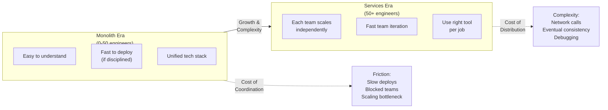
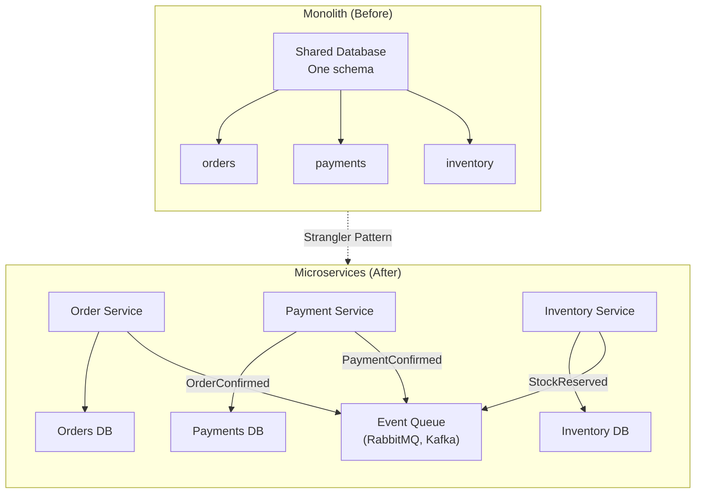

<Hero title="Strategic Decomposition to Services" subtitle="Break monoliths into services aligned with bounded contexts" imageAlt="illustration" size="large" />

## TL;DR

Strategic decomposition breaks monoliths into services aligned with bounded contexts (DDD principle). Identify service boundaries based on business capability, not technical layers. Use the **Strangler Pattern** for safe, incremental migration: build new service alongside monolith, route requests via API Gateway, gradually shift load, then decommission old code. Benefits: independent scaling, team autonomy, deployment velocity. Risks: increased complexity, eventual consistency, distributed debugging. Plan **3-6 months per service** for proper decomposition.

## Learning Objectives

- Identify bounded contexts and service boundaries using DDD
- Map monolith code to contexts and dependencies
- Prioritize decomposition: which services first (ROI analysis)
- Apply Strangler Pattern for safe, incremental migration
- Manage data consistency and ownership across service boundaries
- Design APIs, contracts, and event schemas
- Monitor and validate decomposition progress
- Handle rollback and failure scenarios

## Motivation: When to Decompose

Decompose when monolith becomes:
- **Hard to change**: Multiple teams step on each other; deployment coordination pain
- **Slow to deploy**: Small change requires full testing, deployment; 30+ minutes from code to prod
- **Uneven scaling**: One feature needs 10x more instances; forced to scale entire monolith
- **Recruitment bottleneck**: New engineers scared of touching monolith; high onboarding time
- **Technology blocker**: Want to use different languages/frameworks for different domains

**Do NOT decompose**:
- Small, fast-changing systems (simplicity > benefits)
- Early-stage startups (product-market fit unclear)
- When you don't understand your domain well (boundaries fuzzy)
- Single team owning everything (no team scaling benefit)

<Figure caption="Monolith vs Microservices: When does the crossover happen?">



</Figure>

## Domain Analysis: Identifying Bounded Contexts

Before coding, understand your domains:

<Tabs>
  <TabItem value="analysis" label="Domain Analysis Process" default>
```yaml
Step 1: List Business Capabilities
  e-commerce platform capabilities:
    - Product Catalog (browse, search, recommendations)
    - Orders (create, track, history)
    - Payments (authorize, capture, refund)
    - Shipping (calculate cost, track)
    - Inventory (stock, reservations)
    - Notifications (email, SMS, push)
    - Customer Accounts (profile, preferences)
    - Reviews & Ratings (CRUD, moderation)

Step 2: Group into Bounded Contexts
  Each context has:
    - Clear responsibility (one reason to change)
    - Distinct ubiquitous language
    - Own data model
    - Limited external dependencies

  Initial Contexts:
    1. Catalog Context (Products, Search, Recommendations)
    2. Order Context (Orders, Order Items)
    3. Payment Context (Payments, Transactions)
    4. Shipping Context (Shipments, Tracking)
    5. Inventory Context (Stock, Reservations)
    6. Notification Context (Email, SMS, Push)
    7. Customer Context (Accounts, Profiles)

Step 3: Analyze Dependencies
  Order Context
    ├─ depends on: Inventory (check stock)
    ├─ depends on: Product Catalog (product details)
    ├─ depends on: Customer (shipping address)
    ├─ publishes: OrderCreated, OrderShipped
    ├─ subscribes to: PaymentConfirmed
    └─ risk: HIGH (many dependencies)

  Notification Context
    ├─ depends on: none (subscribes to events)
    ├─ publishes: none
    └─ risk: LOW (loosely coupled)

Step 4: Calculate Extraction Cost vs Benefit
  Metrics:
    - Code size (lines extractable from monolith)
    - Coupling to others (dependencies)
    - Deployment frequency needed
    - Scaling requirements
    - Team size assigned to context
    - Business value

  Scoring:
    ┌─────────────────────────────────────┐
    │ Service      │ ROI  │ Effort │ Risk  │
    ├─────────────────────────────────────┤
    │ Payments     │ HIGH │ MED   │ MED   │ ✓ First
    │ Notifications│ MED  │ LOW   │ LOW   │ ✓ Second
    │ Shipping     │ MED  │ HIGH  │ HIGH  │ ✓ Third
    │ Inventory    │ HIGH │ HIGH  │ HIGH  │ ✗ Later
    └─────────────────────────────────────┘

Step 5: Prioritize Extraction Order
  Ideal services to extract first:
    1. HIGH value, LOW effort
    2. Loosely coupled
    3. HIGH business impact
    4. Clear boundaries
    5. High deployment frequency
```
  </TabItem>

  <TabItem value="real-example" label="Real-World Example: E-commerce">
```
MONOLITH TODAY (Single codebase):

src/
  ├─ domain/
  │   ├─ order/
  │   │   ├─ Order.java
  │   │   ├─ OrderService.java
  │   │   ├─ OrderRepository.java
  │   │   └─ OrderStatus.enum
  │   ├─ payment/
  │   │   ├─ Payment.java
  │   │   ├─ PaymentService.java  ← Logic: authorize, capture, refund
  │   │   ├─ PaymentGatewayAdapter.java  ← Stripe/Square integration
  │   │   └─ Transaction.java
  │   ├─ inventory/
  │   │   ├─ Stock.java
  │   │   ├─ InventoryService.java
  │   │   └─ Reservation.java
  │   ├─ shipping/
  │   │   ├─ Shipment.java
  │   │   ├─ ShippingService.java
  │   │   └─ TrackingNumber.java
  │   └─ notification/
  │       ├─ Email.java
  │       ├─ NotificationService.java
  │       └─ EmailTemplate.java
  ├─ api/
  │   └─ Controllers
  ├─ db/
  │   └─ schema.sql
  └─ config/
      └─ Application.yml

DECOMPOSITION PLAN:

Phase 1 (Month 1): Extract Payment Service
  New Repository: payment-service/
    ├─ src/main/java/com/company/payment/
    │   ├─ domain/
    │   │   ├─ Payment.java
    │   │   ├─ PaymentService.java
    │   │   └─ PaymentGatewayAdapter.java
    │   ├─ api/
    │   │   └─ PaymentController.java (REST API)
    │   ├─ event/
    │   │   ├─ PaymentConfirmed.java (publish)
    │   │   └─ OrderCreated.java (subscribe)
    │   ├─ db/
    │   │   └─ payments_schema.sql (separate database)
    │   └─ config/
    │       └─ application.yml
    └─ tests/

Phase 2 (Month 2-3): Extract Notification Service
  New Repository: notification-service/
    ├─ Subscribes to events (OrderCreated, PaymentConfirmed, etc.)
    ├─ No external dependencies on order/payment/inventory
    ├─ Separate database (minimal)
    └─ Template engine, email provider integration

Phase 3 (Month 3-4): Extract Shipping Service
  New Repository: shipping-service/
    ├─ Depends on: Orders (by reference)
    ├─ Publishes: ShipmentCreated, ShipmentDispatched, DeliveryConfirmed
    ├─ Subscribes to: OrderConfirmed, PaymentConfirmed
    └─ Calls: Shipping provider API (UPS, FedEx, DHL)

Remaining in Monolith:
  - Order Service (complex, many dependencies)
  - Inventory Service (complex, many interactions)
  - Catalog Service
  - Customer Service
```
  </TabItem>
</Tabs>

## Strangler Pattern: Incremental Migration

Safe migration in phases:

<Tabs>
  <TabItem value="phase1" label="Phase 1: Build & Test (Weeks 1-4)">
```yaml
Build New Payment Service:
  ✓ Greenfield implementation
  ✓ All unit + integration tests
  ✓ Own database (separate schema)
  ✓ REST API matching monolith's payment API
  ✓ Event publisher for PaymentConfirmed
  ✓ Ready for requests, but not receiving any yet

Monolith Status:
  ✓ Payment code still present
  ✓ No awareness of new service
  ✓ Handling all payment requests
  ✓ Fully operational

Risk Assessment:
  ✓ ZERO impact on production (new service not live)
  ✓ Only risk: development/testing

Timeline:
  Week 1: Design API, database schema, architecture
  Week 2: Implement core payment logic
  Week 3: Implement payment gateway integration
  Week 4: Test, fix bugs, performance tune

Deliverable:
  ✓ Payment Service artifact (Docker image, JAR, etc.)
  ✓ Documentation
  ✓ Test coverage 80%+
```
  </TabItem>

  <TabItem value="phase2" label="Phase 2: Route Test Traffic (Weeks 5-6)">
```yaml
Deploy Payment Service:
  ✓ Separate container/instance
  ✓ Separate database
  ✓ Integration with monitoring/logging

API Gateway (NEW COMPONENT):
  ✓ Intercepts all payment requests
  ✓ Decision logic:
    if (request.path == '/payments/*'):
      if (random() < 0.1):  // 10% to new service
        forward to payment-service
      else:  // 90% to monolith (production)
        forward to monolith

Traffic Flow:
  Client Request
    ├─ API Gateway decision
    ├─ 10% → Payment Service (test traffic)
    │        └─ New database, new code
    └─ 90% → Monolith (production traffic)
             └─ Old database, old code

Validation:
  ✓ Payment Service receives requests
  ✓ Handles 10% of payment volume
  ✓ Compare payment service response vs monolith
  ✓ Alert if error rates differ >1%
  ✓ Verify database consistency

Timeline:
  Day 1: Deploy service + gateway
  Day 2-7: Monitor, validate, fix issues
  Day 8: Increase traffic to 25% if stable

Rollback:
  If payment-service fails: immediately route 100% back to monolith
```
  </TabItem>

  <TabItem value="phase3" label="Phase 3: Data Migration (Weeks 7-10)">
```yaml
Sync Historical Data:
  Copy all payments from monolith DB to service DB:
    1. Dump payments from monolith (ORDER BY created_at)
    2. Load into payment service database
    3. Verify count matches (select count(*) both sides)
    4. Validate checksums (CRC, hash)

Bidirectional Sync (Running in Parallel):
  Monolith → Service:
    ✓ On each payment created/updated in monolith
    ✓ Async event published to message queue
    ✓ Payment service consumes event
    ✓ Writes to its database

  Service → Monolith (reverse sync):
    ✓ May need to update monolith for compatibility
    ✓ Service publishes PaymentConfirmed
    ✓ Monolith consumes and updates its record

Validation:
  ✓ Compare row counts (monolith vs service)
  ✓ Spot-check 100 random payments
  ✓ Verify no payments lost
  ✓ Check consistency of state

Timeline:
  Week 7: Prepare data, plan sync
  Week 8: Initial copy, validate
  Week 9: Run parallel, monitor divergence
  Week 10: Fix any inconsistencies

Risks:
  ✗ Data loss if sync fails
  ✗ Duplicate payments if not idempotent
  ✓ Mitigation: test in staging, backup databases
```
  </TabItem>

  <TabItem value="phase4" label="Phase 4: Gradual Cutover (Weeks 11-14)">
```yaml
Gradual Traffic Migration:
  Week 11 (Day 1-7):    10% → service, 90% → monolith
  Week 11 (Day 8-14):   25% → service, 75% → monolith
  Week 12 (Day 1-7):    50% → service, 50% → monolith
  Week 12 (Day 8-14):   75% → service, 25% → monolith
  Week 13 (Day 1-7):    90% → service, 10% → monolith
  Week 13 (Day 8-14):   100% → service, 0% → monolith
  Week 14: Monitor for 2 weeks

API Gateway Config:
  ```yaml
  routes:
    - path: /payments/*
      service: payment-service
      traffic: 100  # percentage
      fallback: monolith  # if service errors
  ```

Monitoring During Cutover:
  ✓ Payment success rate (target: 99.9%+)
  ✓ Latency p99 (target: under 500ms)
  ✓ Error rates by type
  ✓ Database consistency (monolith vs service)
  ✓ Alert thresholds:
    - Error rate > 1%: alert
    - Latency p99 > 1s: alert
    - Consistency divergence: alert immediately

Rollback Procedure:
  If issues detected at any traffic %:
    1. Immediate: revert traffic % back to 0%
    2. Debug: compare monolith vs service responses
    3. Fix: patch service or revert code
    4. Retry: once fix validated in staging

Real-World Risks Mitigated:
  ✓ Data consistency: running in parallel
  ✓ Service bugs: caught at low traffic %
  ✓ Performance: measured under real load
  ✓ Dependencies: validated with real requests
```
  </TabItem>

  <TabItem value="phase5" label="Phase 5: Decommission (Weeks 15-16)">
```yaml
Monolith Cleanup:
  Week 15:
    ✓ Confirm 100% traffic on service
    ✓ Monitor for 1 week (stable)
    ✓ Verify no monolith fallback hits
    ✓ Remove payment logic from monolith code

  Week 16:
    ✓ Archive old payment code (git tag)
    ✓ Update documentation
    ✓ Decommission old payment database
    ✓ Close monitoring/alerting on old code

Knowledge Transfer:
  ✓ Team now owns payment-service
  ✓ Document API contracts
  ✓ Runbook for common issues
  ✓ Post-mortem: lessons learned

Next Service:
  ✓ Apply learnings to Notification Service
  ✓ Process becomes faster (2-3 months)
  ✓ Tools/patterns established
```
  </TabItem>
</Tabs>

## Data Ownership and Consistency

Critical decisions when decomposing:

<Figure caption="From shared database to service-owned data">



</Figure>

<Tabs>
  <TabItem value="data-ownership" label="Data Ownership Rules" default>
```yaml
Rule 1: One Service Owns Data
  ✓ Payment Service owns payments table
  ✓ Only Payment Service writes to payments
  ✓ Other services READ via API (not direct DB access)

Rule 2: No Shared Database
  ✗ BAD: Order Service and Payment Service share schema
  ✓ GOOD: Each has separate database

Rule 3: Access Data via API or Events
  Order Service wants to know if payment succeeded:
    ✓ GOOD: Call Payment Service API
      GET /payments/{paymentId}
    
    ✓ GOOD: Subscribe to PaymentConfirmed event
      when PaymentConfirmed(orderId, success)
        update order.paymentStatus = success
    
    ✗ BAD: Query payments table directly
      SELECT * FROM payments WHERE order_id = ?

Rule 4: Manage Consistency Explicitly
  Order + Payment are eventually consistent:
    - Create Order (state: PENDING_PAYMENT)
    - Request Payment Service
    - If Payment fails: Order state becomes PAYMENT_FAILED
    - If Payment succeeds: Order state becomes CONFIRMED
    - Payment Service publishes PaymentConfirmed
    - Order Service receives and marks CONFIRMED
    
  Transactional consistency (ACID) LOST
  Eventual consistency (all updates eventually propagate) GAINED
```
  </TabItem>

  <TabItem value="saga-pattern" label="Saga Pattern (Distributed Transactions)">
```
Problem: Order creation needs Order + Payment + Inventory all succeed

Order Created Event
  ├─ Order Service creates order (state: PENDING)
  │
  └─ Saga Orchestrator (or Choreography)
      ├─ Step 1: Request Payment Service
      │   └─ PaymentService.authorize(orderId, amount)
      │       └─ Publish: PaymentAuthorized
      │
      ├─ Step 2: Request Inventory Service
      │   └─ InventoryService.reserve(orderId, items)
      │       └─ Publish: InventoryReserved
      │
      └─ Step 3: Confirm Order
          └─ OrderService.confirm(orderId)
              └─ state = CONFIRMED

Failure Handling (Compensation):
  If Payment fails:
    ✓ Publish PaymentFailed
    ✓ Saga detects failure
    ✓ Release inventory reservation (compensation)
    ✓ Mark order as FAILED
    ✓ Customer receives notification

  If Inventory fails:
    ✓ Release payment reservation (compensation)
    ✓ Mark order as FAILED
    ✓ Customer retry with reduced quantity

Tools:
  - Temporal (workflow orchestration)
  - Axon Framework (event sourcing + sagas)
  - AWS Step Functions
  - Custom event choreography
```
  </TabItem>
</Tabs>

## Common Pitfalls and How to Avoid Them

<Showcase sections={[
  {
    title: "Pitfall: Big Bang Migration",
    description: "Rewrite entire service at once. Months of parallel development, high risk, team distracted.",
    fix: "Use strangler pattern. Migrate one service incrementally while maintaining production."
  },
  {
    title: "Pitfall: Wrong Service Boundaries",
    description: "Services don't align with business domains. Result: heavy inter-service calls, tight coupling.",
    fix: "Invest 2-3 weeks in domain analysis. Use DDD bounded contexts. Test with hypothetical changes."
  },
  {
    title: "Pitfall: Shared Database Between Service & Monolith",
    description: "Both service and monolith write to same tables. Data consistency nightmares.",
    fix: "Each service owns its data from day 1. Migrate data upfront. Use events for sync."
  },
  {
    title: "Pitfall: Insufficient Monitoring",
    description: "Service works in staging, fails in production. Silent data loss.",
    fix: "Implement comprehensive monitoring before routing live traffic. Alert on divergence."
  },
  {
    title: "Pitfall: Skipping Rollback Testing",
    description: "Service fails, can't rollback quickly. Takes 1 hour to revert to monolith.",
    fix: "Test rollback procedure in staging. Automate traffic shifting. Document runbook."
  }
]} />

## Decomposition Checklist

<Checklist items={[
  "Are service boundaries clearly aligned with bounded contexts?",
  "Have you analyzed dependencies between contexts?",
  "Is data ownership clear (which service owns which tables)?",
  "Are inter-service dependencies documented and minimal?",
  "Do services communicate via APIs and events (NOT shared DB)?",
  "Is the strangler pattern planned (don't rewrite everything)?",
  "Is data migration strategy documented (copy, sync, validate)?",
  "Are monitoring and alerts in place for the new service?",
  "Is rollback procedure tested and documented?",
  "Can each service be deployed independently?",
  "Do teams understand their service ownership and dependencies?",
  "Is the next service already being analyzed for decomposition?",
]} />

## Decision Questions

Before decomposing a service, ask:

1. **Is this bounded context stable?** (Will requirements change frequently?)
2. **Will this service be deployed frequently?** (Multiple times per week?)
3. **Does this need independent scaling?** (Different traffic patterns than monolith?)
4. **Are the dependencies minimal?** (How many other services must it call?)
5. **Can a team own this independently?** (Clear responsibility, success metrics?)
6. **What's the ROI?** (Developer velocity gain vs operational complexity?)

If YES to 4+ questions: decompose. If NO to most: stay in monolith longer.

## One Takeaway

Decompose strategically based on business domains (DDD), not technical layers. Use the Strangler Pattern to migrate safely and incrementally. Start with loosely-coupled, high-value services. Invest in monitoring and data consistency strategies before moving traffic. Decomposition is a 6-12 month investment for most systems; plan accordingly.

## Next Steps

- Read **Domain-Driven Design** by Eric Evans (bounded contexts foundation)
- Study **Build Microservices** by Sam Newman (strangler pattern details)
- Practice **Domain storytelling** to identify contexts
- Plan your first service decomposition (2-3 months timeline)
- Set up **API Gateway** and **event bus** infrastructure

## References

- Evans, E. (2003). *Domain-Driven Design*. Addison-Wesley.
- Newman, S. (2015). *Building Microservices*. O'Reilly.
- Fowler, M. (2004). Strangler Application: https://martinfowler.com/bliki/StranglerFigApplication.html
- Temporal Workflows: https://temporal.io/
- Event Sourcing: https://martinfowler.com/eaaDev/EventSourcing.html
