import { useCurrentSidebarCategory } from "@docusaurus/theme-common";

<Hero title="Domain-Driven Design (DDD)" subtitle="Strategic and tactical design techniques to model complex domains and align software with business" imageAlt="Domain-Driven Design principles and practices" size="large" />

## Overview

Domain-Driven Design (DDD) is an approach to building software that places business complexity at the center of architecture. Rather than designing systems around technical layers (web, database, business logic), DDD organizes code and teams around the business domain itself.

DDD bridges the gap between business stakeholders and technical teams through a shared understanding: the **Ubiquitous Language**. This language permeates code, architecture, and organizational structure, ensuring alignment and reducing misunderstanding.

```mermaid
graph TB
    subgraph Strategic["🎯 Strategic Design"]
        Domains["Domains & Subdomains"]
        BC["Bounded Contexts"]
        CM["Context Maps"]
    end

    subgraph Tactical["🔧 Tactical Design"]
        Aggregates["Aggregates & Roots"]
        Entities["Entities"]
        VO["Value Objects"]
        Services["Domain Services"]
        Repos["Repositories"]
    end

    subgraph Practice["⚙️ DDD in Practice"]
        Events["Event Storming"]
        Integration["Legacy Integration"]
        Microservices["Microservices Alignment"]
    end

    Strategic -->|guides| Tactical
    Tactical -->|enables| Practice
```

<Figure caption="DDD layers: Strategic design defines boundaries, tactical design implements within them">

</Figure>

## Two Dimensions of DDD

### Strategic Design
Answers the organizational questions: How should we partition our domain? Where are the boundaries? How do teams, services, and contexts align?

**Key Concepts:**
- **Domains & Subdomains**: Partition the business problem into manageable pieces
- **Bounded Contexts**: Define explicit boundaries where a specific model applies
- **Ubiquitous Language**: Shared terminology between business and technical teams
- **Context Maps**: Document how bounded contexts interact

### Tactical Design
Answers the implementation questions: How do we design domain models? What patterns help us build clean, maintainable code?

**Key Patterns:**
- **Entities**: Objects with identity and mutable state
- **Value Objects**: Objects without identity, immutable, replaceable
- **Aggregates**: Clusters of related entities and values with a single root
- **Domain Services**: Stateless operations on domain concepts
- **Repositories**: Abstract data access behind a domain-centric interface
- **Domain Events**: Model important business occurrences

## When to Use DDD

### Use DDD When:
- Domain complexity justifies the investment (many business rules, edge cases)
- Business and technical teams need alignment
- System will evolve significantly over its lifetime
- Multiple teams need to work on related but separate concerns
- Long-term maintainability is more important than quick prototyping

### Avoid DDD When:
- Building simple CRUD applications with minimal business logic
- Team is very small or domain is trivial
- Quick time-to-market is the only priority
- Domain is unlikely to change significantly

## DDD Mindset

**Core Principle**: Code structure should mirror business structure. Business experts and developers should speak the same language. A "Customer" in code is a "Customer" in business conversations.

**Investment Model**: DDD requires upfront investment in understanding the domain deeply. This investment pays dividends through clearer code, easier refactoring, and better alignment with business goals.

**Not Just Technical**: DDD is as much about organization, communication, and team structure as it is about code patterns.

## Section Structure

<DocCardList items={useCurrentSidebarCategory().items} />

## Getting Started

1. **Start with Strategic Design**: Understand your domain's partitions and boundaries before writing code
2. **Engage Domain Experts**: DDD requires deep collaboration with business stakeholders
3. **Build Ubiquitous Language**: Create a shared vocabulary and document it everywhere
4. **Apply Tactical Patterns**: Use domain-driven tactical patterns within your bounded contexts
5. **Iterate and Evolve**: Domain understanding improves over time; refactor as you learn

## Next Steps

- Explore **Strategic Design** to partition your domain and define bounded contexts
- Learn **Tactical Patterns** to implement domain models with clarity and maintainability
- See **DDD in Practice** for event storming, legacy integration, and microservices alignment

## Key References

- Evans, E. (2003). *Domain-Driven Design*. Addison-Wesley.
- Vaughn, V. (2016). *Domain-Driven Design Distilled*. Addison-Wesley.
- Vernon, V. (2013). *Implementing Domain-Driven Design*. Addison-Wesley.
