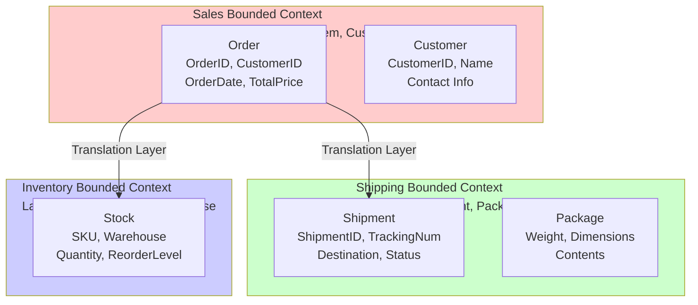

<Hero title="Bounded Contexts" subtitle="Explicit boundaries where domain models apply and language remains consistent" imageAlt="illustration" size="large" />

## TL;DR

A bounded context is an explicit boundary around a domain model where a specific ubiquitous language applies. Within it, terms have precise, unambiguous meanings. Across boundaries, terms may have different meanings—translation is required. Bounded contexts isolate complexity, enable team autonomy, and map naturally to services and code modules.

## Learning Objectives

- Define bounded contexts with clear boundaries and explicit language
- Understand context isolation and its benefits
- Identify context boundaries from subdomains and linguistic breaks
- Recognize common context boundary mistakes
- Map contexts to services and team ownership

## Motivating Scenario

In an e-commerce system, "Product" means different things in different contexts:

- **Catalog Context**: A product is what's searchable and displayed. Attributes: SKU, name, description, images.
- **Inventory Context**: A product is a quantity-tracked item. Attributes: warehouse location, stock count, reorder level.
- **Order Context**: A product is a line item with a price. Attributes: order ID, quantity, unit price paid.

Without explicit contexts, "Product" becomes overloaded. One class tries to represent all views. Bounded contexts keep these models separate.

## Core Concepts

### Bounded Context
A clear, explicit boundary defining where a model applies and a ubiquitous language is consistent.

**Example**: The "Shipping Context" has its own model of Order, different from Order in the Sales Context.

### Model (within a context)
A simplified representation of a problem domain. Every model applies within a specific context.

### Ubiquitous Language
The language shared between domain experts and developers. It applies within a bounded context; meanings may differ across contexts.

### Explicit Boundary
A clear demarcation (code structure, database schema, team ownership, service boundary) that defines where one context ends and another begins.

<Figure caption="Bounded contexts with distinct models and languages">

</Figure>

### Translating Across Contexts

Models don't match across contexts. A Sales Order is not an Inventory Stock item. When they interact, an **Anti-Corruption Layer** translates between models, preserving context independence.

## Practical Example

**Banking Application**

```
Accounts Bounded Context:
  - Model: Account
    - accountId, balance, owner
    - withdraw(), deposit(), transfer()
  - Language: account, balance, holder

Risk Management Bounded Context:
  - Model: Position (not Account)
    - positionId, riskExposure, counterparty
    - assessRisk(), exceedLimit()
  - Language: position, exposure, limit

Compliance Bounded Context:
  - Model: Transaction (not Account or Position)
    - transactionId, type, amount, timestamp
    - isReportable(), auditTrail()
  - Language: transaction, compliance, audit
```

**Observation**: Each context has a model with the same data but different purposes, methods, and language.

## When to Use / When Not to Use

<Vs highlight={[1]} items={[
{
    label: "Define a Bounded Context When:",
    points: [
      "Language or meaning changes across a boundary",
      "Different teams own different areas",
      "Model behavior differs across areas",
      "Need to decouple and test independently",
      "Building microservices or modular systems"
    ]
  },
{
    label: "Avoid Over-Contexting When:",
    points: [
      "Model and language are truly shared",
      "Single team, single model",
      "Splitting contexts adds overhead without benefit",
      "Language is still consistent across area"
    ],
    highlightTone: "warning"
  }
]} />

## Patterns and Pitfalls

<Showcase title="Patterns and Pitfalls" sections={[
  {
    label: "Pitfall: Unclear Boundaries",
    body: "Bounded context exists on paper but not enforced in code. Models leak across contexts. Explicit code structure: different packages/modules per context. Enforce in code review."
  },
  {
    label: "Pitfall: Shared Database",
    body: "Multiple contexts share a database schema, creating hidden coupling. Each context owns its schema. Communicate via APIs, not shared tables."
  },
  {
    label: "Pitfall: Lost Ubiquitous Language",
    body: "Terms are used inconsistently. Code doesn't reflect business terminology. Document language. Use domain terms in code. Refuse ambiguity."
  },
  {
    label: "Pattern: Clear Entry Points",
    body: "Contexts have explicit interfaces (services, facades) for external communication. Each context defines a public API. All cross-context communication goes through it."
  },
  {
    label: "Pattern: Context-Specific Models",
    body: "Don't reuse classes across contexts. Create separate models even if similar. Each context is independent. Translate at boundaries via anti-corruption layers."
  }
]} />

## Design Review Checklist

<Checklist items={[
  "Are bounded context boundaries clear and explicit in code?",
  "Does ubiquitous language remain consistent within each context?",
  "Are context dependencies documented in a context map?",
  "Do team boundaries align with context boundaries?",
  "Is there a translation layer (anti-corruption) for cross-context communication?",
  "Does each context have a clearly defined entry point (API/facade)?",
  "Are shared resources (database, libraries) avoided across contexts?",
  "Can you explain why each boundary exists in business terms?",
  "Do developers understand the context they're working in?",
  "Is context isolation enforced in architecture and code review?"
]} />

## Testing Across Bounded Contexts

### Unit Tests (Within Context)

```python
# Test within Sales context - uses Sales models only
def test_order_creation():
    order = Order(
        id='ORD-123',
        customer_id='CUST-456',
        items=[OrderItem(sku='SKU789', qty=2, price=Money(50))],
        status=OrderStatus.PENDING
    )

    assert order.total == Money(100)
    assert order.status == OrderStatus.PENDING
```

### Integration Tests (Between Contexts)

```python
# Test interaction between Sales and Shipping contexts
def test_order_to_shipment_translation():
    # In Sales context
    order = Order(
        id='ORD-123',
        shipping_address=Address('123 Main St', 'Boston'),
        items=[OrderItem(sku='SKU789', qty=2)]
    )

    # Translate to Shipping context
    shipment = OrderToShipmentTranslator.translate(order)

    # Assert correct translation
    assert shipment.destination.street == '123 Main St'
    assert len(shipment.packages) == 1

    # Shipping context doesn't know about Order
    assert not hasattr(shipment, 'customer_id')
```

### Contract Tests (Verify Boundaries)

```python
# Verify Sales → Shipping contract
class SalesShippingContractTest:
    def test_sales_publishes_order_event(self):
        """Sales context publishes OrderCreated event."""
        events = self.capture_domain_events()

        order = self.create_order()

        assert OrderCreatedEvent in events

    def test_shipping_consumes_order_event(self):
        """Shipping context consumes OrderCreated and creates shipment."""
        event = OrderCreatedEvent(order_id='ORD-123')

        self.shipping_service.on_order_created(event)

        shipment = self.shipment_repo.get_by_order('ORD-123')
        assert shipment is not None
```

## Self-Check

1. **How is a bounded context different from a subdomain?** A subdomain is a business partition. A bounded context is a linguistic/modeling boundary. They often align but are conceptually different. One business subdomain might need multiple contexts if language varies.

2. **Can one context depend on another?** Yes, but dependencies should be explicit and unidirectional. Use anti-corruption layers to avoid tight coupling. Prefer event-driven communication over direct dependencies.

3. **What if our system is really just one context?** Then you're right. Not every system needs multiple contexts. But be honest: Is language truly uniform across your entire system? Do different teams use different terminology for the same concept?

4. **How do I know where to draw context boundaries?** Listen to domain experts. When they switch vocabularies or change their mental model, that's a boundary. Where teams naturally split responsibilities = good boundary.

:::info
**One Takeaway**: Bounded contexts are linguistic and organizational boundaries. Define them explicitly. Keep models and language consistent within them. Translate at boundaries. This enables teams to move fast without interfering with each other.

:::

## Next Steps

- **Context Maps**: Document how bounded contexts interact
- **Ubiquitous Language**: Build consistent language within each context
- **Anti-Corruption Layers**: Translate between contexts
- **Microservices**: Map contexts to services

## Context Mapping and Relationships

Different bounded contexts have different relationships:

```
Sales Context ──[Conformist]──→ Inventory Context
  (small)                         (large, controls schema)
  Inventory must conform

Sales Context ──[Customer-Supplier]──→ Shipping Context
  (customer)                            (supplier)
  Shipping decides contract

Reporting Context ──[Open Host Service]──→ Sales/Inventory
  (needs data)                           (publish events)
  Open API for data consumption

Integration Context ──[Anti-Corruption Layer]──→ Legacy System
  (new)                                          (old, can't change)
  Translate between models
```

## Real-World Context Boundaries

### E-Commerce Complex Example

```yaml
Contexts:
  1. Catalog Context
     - Models: Product, Category, Inventory
     - Ubiquitous Language: SKU, catalog, inventory level
     - Responsibility: What's searchable and available?

  2. Sales Context
     - Models: Order, LineItem, Customer
     - Ubiquitous Language: order, line item, customer
     - Responsibility: Customer's purchase intent and history

  3. Shipping Context
     - Models: Shipment, Package, DeliveryRoute
     - Ubiquitous Language: shipment, destination, tracking
     - Responsibility: Physical movement of goods

  4. Billing Context
     - Models: Invoice, Payment, Refund
     - Ubiquitous Language: invoice, payment method, transaction
     - Responsibility: Financial transactions

Interactions:
  Sales → Catalog: "Is SKU123 available at quantity 5?"
           Response: SKU123 available, price $19.99

  Sales → Shipping: "Ship these items to address"
           (Anti-corruption layer translates Order → Shipment)

  Sales → Billing: "Charge customer for order"
           (Publishes OrderCreated event)

  Billing: Listens to OrderCreated, creates Invoice
```

## Enforcing Context Boundaries in Code

```python
# Directory structure enforces boundaries
ecommerce/
├── catalog/
│   ├── models.py       # Product, SKU (never Order, LineItem)
│   ├── services.py     # CatalogService
│   └── repository.py   # ProductRepository
├── sales/
│   ├── models.py       # Order, LineItem, Customer
│   ├── services.py     # OrderService
│   └── repository.py   # OrderRepository
├── shipping/
│   ├── models.py       # Shipment, Package
│   ├── services.py     # ShippingService
│   └── repository.py   # ShipmentRepository
└── shared/
    ├── events.py       # Domain events (OrderCreated, etc.)
    └── anti_corruption/
        ├── catalog_to_sales.py
        └── sales_to_shipping.py
```

```python
# Anti-corruption layer: translate between contexts
# sales/anti_corruption/shipping_adapter.py

from shipping.models import Shipment, Address
from sales.models import Order

class OrderToShipmentTranslator:
    """Translate Order (Sales) to Shipment (Shipping)."""

    @staticmethod
    def translate(order: Order) -> Shipment:
        """Convert Order model to Shipment model."""
        # Sales context has Order with LineItems
        # Shipping context has Shipment with Packages

        return Shipment(
            shipment_id=f"SHIP-{order.id}",  # Generate new ID
            destination=Address(
                street=order.shipping_address.street,
                city=order.shipping_address.city,
                zip=order.shipping_address.zip
            ),
            packages=[
                Package(
                    item_description=item.product_name,
                    weight=item.weight,
                    quantity=item.quantity
                )
                for item in order.line_items
            ],
            special_handling=order.get_special_shipping_instructions()
        )

# Usage in sales context
def ship_order(order: Order, shipping_service):
    """Ship order using shipping service."""
    shipment = OrderToShipmentTranslator.translate(order)
    shipping_service.create_shipment(shipment)
    order.mark_as_shipped()
```

## Context Boundaries and Microservices

Bounded contexts map naturally to microservices:

```
Bounded Context 1: Catalog Service
├── Database: Catalog DB (products, categories)
├── API: GET /products, GET /catalog/search
└── Events published: ProductAdded, PriceChanged

Bounded Context 2: Order Service
├── Database: Orders DB (orders, line items)
├── API: POST /orders, GET /orders/{id}
└── Events published: OrderCreated, OrderPaid

Bounded Context 3: Shipping Service
├── Database: Shipments DB (shipments, tracking)
├── API: POST /shipments, GET /shipments/{id}/track
└── Events published: ShipmentDispatched, DeliveryConfirmed

Communication:
OrderService: Subscribes to PaymentProcessed event
             → Creates Order, publishes OrderCreated
ShippingService: Subscribes to OrderCreated event
                → Creates Shipment automatically
```

## Context Maturity Levels

Not all contexts are equally important. Consider maturity:

```
Level 1: Core Domain (Business Differentiator)
├── E-commerce: Recommendation engine, personalization
├── Fintech: Risk calculation, fraud detection
├── Healthcare: Clinical decision support
└── Investment: Market timing algorithms

Level 2: Supporting Domain (Important, differentiating)
├── E-commerce: Inventory management
├── Fintech: Compliance, KYC
└── Healthcare: Patient records

Level 3: Generic Domain (Not differentiating)
├── E-commerce: Reporting, analytics
├── Fintech: Email delivery, logging
└── Healthcare: Appointment scheduling

Investment:
- Level 1: Build custom, highly optimized
- Level 2: Buy or build carefully
- Level 3: Buy off-the-shelf (SaaS)
```

## Anti-Corruption Layer Patterns

How to integrate with external systems:

```python
# Pattern 1: Adapter (outgoing)
class CatalogAdapter:
    """Adapt external Catalog API to our domain."""

    def __init__(self, external_api):
        self.api = external_api

    def get_product(self, sku: str) -> Product:
        """External API returns different structure."""
        response = self.api.get_product({'code': sku})

        # Translate to our model
        return Product(
            sku=response['code'],
            name=response['title'],
            price=Money(response['price_cents'], 'USD'),
            available=response['stock_level'] > 0
        )

# Pattern 2: Facade (incoming)
class LegacyIntegrationFacade:
    """Accept legacy system data, translate to ours."""

    def __init__(self, inventory_service):
        self.inventory = inventory_service

    def legacy_update_stock(self, legacy_request):
        """Legacy system calls us; we translate."""
        # Legacy format: {'item_code': 'X', 'qty_available': 10}
        # Our format: OrderItem(sku='X', quantity=10)

        sku = legacy_request['item_code']
        quantity = legacy_request['qty_available']

        self.inventory.update_stock(sku, quantity)
        return {'status': 'OK'}

# Pattern 3: Event Translation (async)
class EventTranslationService:
    """Subscribe to external events, translate to ours."""

    def on_external_order_created(self, external_event):
        """External system published OrderCreated."""
        # Their model: {'order_id': 'EXT123', 'customer_id': 'C456', ...}
        # Our model: Order(id='SALES-EXT123', customer_id='C456', ...)

        our_order = Order(
            id=f"SALES-{external_event['order_id']}",
            external_id=external_event['order_id'],
            customer_id=external_event['customer_id'],
            items=[...],
            created_at=parse_timestamp(external_event['timestamp'])
        )

        self.order_repo.save(our_order)
        self.event_publisher.publish(OurOrderCreatedEvent(our_order))
```

## References

- Evans, E. (2003). *Domain-Driven Design*. Addison-Wesley.
- Vernon, V. (2013). *Implementing Domain-Driven Design*. Addison-Wesley.
- "Patterns of Enterprise Application Architecture" by Martin Fowler
- "Building Microservices" by Sam Newman (covers context mapping)