<Hero title="Context Maps" subtitle="Document relationships and interactions between bounded contexts" imageAlt="illustration" size="large" />

## TL;DR

A context map documents how bounded contexts interact. Relationships include: **Partnership** (equals, negotiated), **Upstream/Downstream** (one depends on another), **Conformist** (downstream adapts to upstream's model), **Anti-Corruption Layer** (downstream protects against upstream changes), **Published Language** (explicit contract). Mapping reveals integration complexity and informs service design.

## Learning Objectives

- Create context maps for multi-context systems
- Identify and classify context relationships
- Design integration patterns (Upstream/Downstream, Anti-Corruption)
- Recognize problematic relationship patterns
- Use context maps to guide service decomposition

## Motivating Scenario

Your e-commerce system has four contexts:

1. **Catalog**: Product data
2. **Orders**: Customer orders
3. **Shipping**: Fulfillment and delivery
4. **Inventory**: Stock management

How do they interact?

- Orders needs Catalog data (product info). Orders is downstream of Catalog.
- Shipping needs Order data. Shipping is downstream of Orders.
- Inventory and Orders both care about stock. Complex dependency.
- Shipping and Inventory collaborate. Both affect fulfillment.

A context map makes these relationships explicit and guides integration decisions.

## Core Concepts

### Context Map
A visual or textual representation of bounded contexts and their relationships.

### Upstream Context
Provides data or services to other contexts. Often more stable, core to the business.

### Downstream Context
Consumes or depends on another context. Must adapt to upstream changes.

### Partnership
Two contexts collaborate as equals. Neither is fundamentally upstream.

```mermaid
graph TB
    Catalog["📚 Catalog<br/>Core Domain"]
    Orders["🛒 Orders<br/>Core Domain"]
    Shipping["📦 Shipping<br/>Support"]
    Inventory["📊 Inventory<br/>Support"]
    Payment["💳 Payment<br/>Generic"]

    Catalog -->|"Published<br/>Language"| Orders
    Orders -->|"Upstream"| Shipping
    Orders -->|"Upstream"| Inventory
    Inventory -->|"Partnership<br/>(negotiated)"| Shipping
    Orders -->|"Anti-Corruption<br/>Layer"| Payment

    style Catalog fill:#ff9999
    style Orders fill:#ff9999
    style Shipping fill:#ffcc99
    style Inventory fill:#ffcc99
    style Payment fill:#99ccff
```

<Figure caption="Context map patterns and relationships">

</Figure>

### Common Relationship Patterns

**Upstream/Downstream**: One context provides, one consumes. Downstream must adapt to upstream changes.

**Conformist**: Downstream adopts upstream's model directly. Simple but tight coupling.

**Anti-Corruption Layer (ACL)**: Downstream translates upstream's model into its own. Decoupled but more work.

**Partnership**: Equals collaborate. Negotiate changes jointly.

**Published Language**: Explicit, versioned API between contexts. High clarity.

## Practical Example

**SaaS Accounting Platform**

```
Contexts:
  - Ledger (Core)
  - Tax (Support)
  - Reporting (Support)
  - Integration (Generic)

Relationships:
  Ledger --[Upstream/Published Language]--> Tax
    Decision: Tax reads Ledger via API. Clear contract.

  Ledger --[Upstream/Published Language]--> Reporting
    Decision: Reporting reads Ledger via events and API.

  Tax <--[Partnership]--> Reporting
    Decision: Both need to agree on tax classification.

  Integration --[Anti-Corruption Layer]--> Ledger
    Decision: Third-party data is translated before entering Ledger.
```

## When to Use / When Not to Use

<Vs items={[
{
    label: "Create a Context Map When:",
    points: [
      "Multiple bounded contexts exist in your system",
      "Teams need to coordinate across contexts",
      "Integration patterns are unclear",
      "Planning microservices deployment",
      "Onboarding new team members to architecture"
    ]
  },
{
    label: "Skip Context Mapping When:",
    points: [
      "Only one bounded context exists",
      "Contexts have no dependencies",
      "Team is very small and communication is direct",
      "Still in early discovery phase"
    ]
  }
]} />

## Patterns and Pitfalls

<Showcase title="Patterns and Pitfalls" sections={[
  {
    label: "Pitfall: Unmapped Dependencies",
    body: "Implicit context dependencies cause surprises. Team A changes their API; Team B breaks. Create explicit context map. Document all dependencies. Use published language for contracts."
  },
  {
    label: "Pitfall: Unclear Upstream/Downstream",
    body: "Ambiguous relationship. Both contexts try to own data; circular dependencies. Be explicit: Who is upstream? Upstream owns the data/model. Downstream adapts."
  },
  {
    label: "Pitfall: Over-engineered ACLs",
    body: "Anti-corruption layers for every boundary. Adds complexity unnecessarily. Use ACL when decoupling is worth the cost. For tight partnerships, simpler patterns work."
  },
  {
    label: "Pattern: Event-Driven Upstream/Downstream",
    body: "Upstream publishes events. Downstream subscribes. Loosely coupled. Use domain events for notifications. Each context translates events to its model."
  },
  {
    label: "Pattern: API-Driven Published Language",
    body: "Upstream exposes REST/GraphQL API. Downstream consumes. Clear contract. Version APIs. Document thoroughly. Use OpenAPI specs for clarity."
  }
]} />

## Design Review Checklist

<Checklist items={[
  "Are all bounded contexts identified and named?",
  "Is each context relationship documented and classified?",
  "Are upstream and downstream roles explicit?",
  "Are integration patterns chosen consciously (not defaulted)?",
  "Is there a published language/contract between contexts?",
  "Do anti-corruption layers exist where needed?",
  "Are dependencies documented in team wikis and code?",
  "Can you explain each relationship in business terms?",
  "Are circular dependencies identified and resolved?",
  "Is the context map updated as architecture evolves?"
]} />

## Self-Check

1. **When should you use Anti-Corruption Layers?** When downstream needs protection from upstream changes, or when upstream's model is foreign/complex. Not every relationship needs an ACL.

2. **Can contexts have circular dependencies?** In a context map, yes (partnership pattern). But in implementation, avoid circular runtime dependencies. Resolve via events or asymmetric communication.

3. **How do you know your context map is good?** Teams can work independently. Integration points are clear. Changes in one context don't surprise others.

:::info
**One Takeaway**: Context maps make system structure explicit. They guide team coordination, inform service boundaries, and prevent integration surprises. The effort to create them is repaid quickly.

:::

## Next Steps

- **Ubiquitous Language**: Define language within and across contexts
- **Anti-Corruption Layers**: Implement translation between contexts
- **Microservices**: Align services with context boundaries
- **Event-Driven Architecture**: Use domain events for loose coupling

## Real-World Context Map Examples

### Example 1: B2B SaaS Platform

```
Contexts:
  - User Management (Core Domain)
  - Billing (Core Domain)
  - Audit & Compliance (Support)
  - Notification (Generic)
  - Analytics (Support)
  - Webhook Integration (Generic)

Relationships:

1. User Management ← Upstream [Published Language: REST API + Events]
   Billing ← Downstream

   Decision: Billing needs user data (name, email, plan tier)
   User Management exposes REST API:
     GET /users/{id} → User details
     Events: user.created, user.plan_upgraded

   Billing subscribes to events and pulls additional data via API

2. Billing ← Upstream [Published Language: Events]
   Audit & Compliance ← Downstream

   Decision: Compliance needs ledger (who paid what, when)
   Billing publishes domain events:
     payment.charged, payment.refunded, invoice.sent
   Audit subscribes and records immutable log

3. User Management <→ [Partnership]
   Notification

   Decision: Both care about notifications
   (User created → send welcome email)
   Negotiated contract:
     Notification.send(user_id, template_name, context)
     Returns: delivery_status
   Both teams must agree on notification templates/channels

4. Billing → [Anti-Corruption Layer]
   Stripe API (External)

   Decision: Stripe's concepts (payment_intent, charge) differ from domain
   ACL translates:
     Stripe.create_charge(card, amount)
     → BillingDomain.createTransaction(user, amount, metadata)
   Protects domain from external API changes
```

### Example 2: Event-Driven Architecture

```
User Registration Flow:

  User Service (Upstream)
    │
    ├─ Publishes: user.registered
    │
    ├─→ Email Service (Downstream - Conformist)
    │   "Send welcome email" (simple, tight coupling OK)
    │
    ├─→ Analytics Service (Downstream - Anti-Corruption)
    │   ACL translates user.registered → analytics event
    │   Protects analytics from user service changes
    │
    ├─→ Notification Service (Downstream - Published Language)
    │   Explicit contract: Notification.enqueue(event)
    │   Notification responsible for routing
    │
    └─→ Accounting Service (Downstream - Anti-Corruption)
        ACL converts user domain → accounting domain
        e.g., user.plan_tier → accounting.tier_code
```

## Common Integration Mistakes

| Mistake | Impact | Solution |
|---------|--------|----------|
| Circular dependencies (A depends on B, B on A) | Impossible to deploy independently | Introduce event bus, break cycle |
| No explicit contract between contexts | Changes in one break another | Published Language: REST API + docs |
| Tight coupling (Conformist everywhere) | Changes propagate everywhere | Use Anti-Corruption Layers for non-core |
| Over-engineered (ACL for simple dependency) | Unnecessary complexity | Use Conformist for stable upstream |
| No versioning of APIs | Breaking changes block deployment | Version APIs: /v1/, /v2/ |

## Organizational Alignment

Context maps should align with team structure (Conway's Law):

```
Organization: 4 teams

❌ BAD: Context map doesn't match org
  - User team owns: User context + Billing context (too much)
  - Analytics team owns: Analytics context + Notification context (unrelated)
  → Teams step on each other, communication overhead

✅ GOOD: Context map matches org
  - User team owns: User Management context (cohesive)
  - Billing team owns: Billing context (focused)
  - Analytics team owns: Analytics context (specialized)
  - Platform team owns: Notification + Integration (shared infrastructure)
  → Teams work independently, clear contracts
```

## Evolving Context Maps

Context maps change as the system grows:

```
Year 1: Monolith
  ┌─────────────────────────┐
  │   Monolithic App        │
  │ - User management       │
  │ - Billing               │
  │ - Orders                │
  │ - Analytics             │
  └─────────────────────────┘

Decision: One team, one codebase, tight coupling
---

Year 2: Growth forces decomposition
  User Service ← → Billing Service ← → Order Service
  (Partnerships everywhere)

  Problem: Tight coupling, hard to deploy independently
---

Year 3: Mature context map
  User Service [Upstream - Published Language]
    └→ Billing Service [Downstream - ACL]
    └→ Order Service [Downstream - ACL]

  Order Service [Upstream - Events]
    └→ Analytics [Downstream - ACL]
    └→ Notification [Downstream - Published Language]

  Problem: Solved. Teams deploy independently.
```

## Using Context Maps for Microservices Design

1. **Create context map** of your domain (independent of tech)
2. **Align services to contexts** (one service per context)
3. **Define integration patterns** (Upstream/Downstream, ACL, etc.)
4. **Version APIs** (protect from changes)
5. **Evolve strategically** (merge/split contexts as needs change)

## Self-Check

1. **Can you draw your context map in 10 minutes?** If not, architecture is unclear.
2. **Does each context have a clear responsibility?** (Single business purpose)
3. **Are upstream/downstream roles explicit?** (Who depends on whom?)
4. **Are integration patterns intentional?** (Not defaulting to tight coupling)

## One Takeaway

Context maps make system structure explicit. They guide service boundaries, team organization, and integration strategies. The effort to create them pays back during design, implementation, and operations.

## Next Steps

- **Document your context map** (even rough sketches help)
- **Identify problematic relationships** (circular deps, unclear boundaries)
- **Implement integration patterns** (API contracts, event buses)
- **Evolve strategically** (split contexts as needs change)
- **Align teams to contexts** (reduce coordination overhead)

## References

- <a href="https://www.domainlanguage.com/ddd/" target="_blank" rel="nofollow noopener noreferrer">Domain-Driven Design Community ↗</a>
- Evans, E. (2003). *Domain-Driven Design*. Addison-Wesley.
- Vernon, V. (2013). *Implementing Domain-Driven Design*. Addison-Wesley.
- <a href="https://martinfowler.com/articles/bounded-contexts.html" target="_blank" rel="nofollow noopener noreferrer">Martin Fowler - Bounded Contexts ↗</a>
