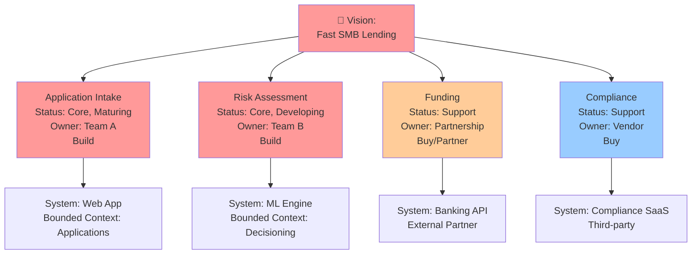

<Hero title="Domain Vision & Capability Mapping" subtitle="Align business capabilities with technical boundaries and competitive strategy" imageAlt="illustration" size="large" />

## TL;DR

Domain Vision articulates what your system must do to deliver business value. Capability Mapping identifies business capabilities and maps them to systems, bounded contexts, or value streams. Together, they align technical architecture with strategic business goals, guide investment, and support long-term planning.

## Learning Objectives

- Articulate domain vision aligned with business strategy
- Map business capabilities to technical components
- Identify capability gaps and improvement areas
- Guide investment decisions with capability maps
- Evolve systems as capabilities mature and change

## Motivating Scenario

A fintech startup is building a lending platform. Their vision is: "Provide fast, accessible lending decisions to SMBs."

Key capabilities:
- Application Intake: Fast, simple loan applications
- Risk Assessment: Automated credit decisioning
- Funding: Reliable, fast capital deployment
- Compliance: Meet regulatory requirements
- Customer Support: Quick issue resolution

For each capability, they ask: "Is this core to our vision? Are we building or buying? What's the technical implementation?"

**Application Intake** (Core): Build in-house. Create user-friendly forms with instant submission.

**Risk Assessment** (Core): Build in-house with ML. This is our competitive advantage.

**Funding** (Supporting): Partner with banks. Don't build fund distribution.

**Compliance** (Support): Buy compliance software. Generic need.

**Support** (Support): Use Zendesk. Generic service.

This mapping aligns spending with vision.

## Core Concepts

### Domain Vision
A clear, concise statement of what your system enables. It guides strategy, investment, and design.

**Example Vision Statements**:

- "Enable anyone to learn anything, anywhere, anytime" (education platform)
- "Process insurance claims in hours, not weeks" (InsurTech)
- "Give small businesses enterprise-grade financial tools" (FinTech)

### Business Capability
A specific, measurable business function. What the organization does or should do.

**Examples**:

- Order Management
- Payment Processing
- Customer Support
- Inventory Optimization
- Fraud Detection

### Capability Map
A visual representation of business capabilities, their maturity, ownership, and alignment with vision.

<Figure caption="Capability map aligns business and technical architecture">

</Figure>

### Value Stream
The sequence of activities and capabilities required to deliver value to a customer. Mapping capabilities to value streams shows end-to-end flow.

### Maturity Assessment
Evaluate each capability: emerging, developing, maturing, stable. Investments change with maturity.

## Practical Example

**E-Commerce Platform**

```
Vision: "Shop and purchase anything online with confidence"

Capabilities:

Core (Competitive Advantage):
  1. Product Discovery & Search
     - Maturity: Mature
     - Owned by: Search Team
     - Tech: Elasticsearch, ML ranking
     - Vision alignment: HIGH
     - Investment: Continuous optimization
     - Rationale: Customers find products faster → more conversions

  2. Checkout & Payment
     - Maturity: Mature
     - Owned by: Payments Team
     - Tech: Payment gateway (Stripe)
     - Vision alignment: HIGH
     - Investment: Stability and security focus
     - Rationale: Trust is critical; fraud prevention essential

  3. Inventory Management
     - Maturity: Developing
     - Owned by: Fulfillment Team
     - Tech: Custom system
     - Vision alignment: HIGH
     - Investment: Building in-house, not outsourced
     - Rationale: Real-time accuracy enables "confidence"

Supporting (Important but not differentiating):
  4. Customer Reviews
     - Maturity: Developing
     - Owned by: Content Team
     - Tech: In-house (custom built)
     - Vision alignment: MEDIUM
     - Investment: Build features customers request
     - Rationale: Builds trust, but reviews are commodity

Generic (Commoditized):
  5. Email Notifications
     - Maturity: Stable
     - Owned: Outsourced to SendGrid
     - Tech: SendGrid
     - Vision alignment: MEDIUM
     - Investment: Minimal, SaaS managed
     - Rationale: Email is solved; no advantage to building

  6. Analytics Dashboard
     - Maturity: Stable
     - Owned: Outsourced to Google Analytics
     - Tech: Google Analytics, Mixpanel
     - Vision alignment: LOW
     - Investment: Configuration, not development
     - Rationale: Standard metrics; third-party tools sufficient

Value Stream Analysis (Customer Purchase):
  1. Product Discovery -> (Search algorithm, discovery ML) -> REVENUE IMPACT: HIGH
  2. Review Details -> (UI/UX, images, pricing) -> REVENUE IMPACT: MEDIUM
  3. Add to Cart -> (Session management, inventory lookup) -> REVENUE IMPACT: HIGH
  4. Checkout -> (Multiple payment options, security) -> REVENUE IMPACT: CRITICAL
  5. Payment -> (PCI compliance, fraud detection) -> REVENUE IMPACT: CRITICAL
  6. Order Confirmation -> (Email, SMS) -> REVENUE IMPACT: MEDIUM
  7. Shipping -> (Carrier integration, tracking) -> REVENUE IMPACT: MEDIUM
  8. Delivery -> (Third-party logistics) -> REVENUE IMPACT: MEDIUM
  9. Review & Support -> (Customer service tools, ratings) -> REVENUE IMPACT: MEDIUM

Investment Decisions by Capability:
- HIGH PRIORITY (Competitive): Product Discovery & Search, Checkout & Payment
- MEDIUM PRIORITY (Differentiating): Inventory Management, Customer Service
- LOW PRIORITY (Commodity): Email, Analytics, Shipping (all have mature solutions)

This map guides where to invest engineering resources and where to partner/outsource.
```

### Capability Maturity Stages

Understanding maturity helps set realistic investment expectations:

**Emerging**: Unproven, experimental. Example: AI-powered personalization (new to market).
- Investment: R&D, pilot with small customer segments
- Success metric: "Does this work at all?"
- Team: 2-4 engineers exploring

**Developing**: Works but needs refinement. Example: Checkout process with occasional issues.
- Investment: Stability, performance, features
- Success metric: "Can we handle 100% traffic reliably?"
- Team: 4-8 engineers building, testing

**Maturing**: Stable, performant, core to operations. Example: Payment processing.
- Investment: Optimization, security, operational excellence
- Success metric: "99.99% uptime, under 100ms response"
- Team: 2-3 engineers maintaining, improving

**Stable/Commodity**: Mature, best-in-class solutions exist. Example: Email delivery.
- Investment: Minimal; prefer SaaS/outsourcing
- Success metric: "Cost-effective delivery"
- Team: 0 engineers (outsourced) unless competitive advantage

## When to Use / When Not to Use

<Vs highlight={[0,0]} items={[
{
    label: "Use Vision & Capability Mapping When:",
    points: [
      "Need to align multiple teams with strategy",
      "Planning large-scale systems or transformations",
      "Deciding build vs. buy for specific capabilities",
      "Setting technical roadmap from business strategy",
      "Assessing capability maturity and investment needs"
    ],
    highlightTone: "positive"
  },
{
    label: "Less Critical When:",
    points: [
      "Small, focused system with clear scope",
      "Team is tiny and strategy is obvious",
      "Still in very early discovery phase",
      "Business strategy is volatile and undefined"
    ]
  }
]} />

## Patterns and Pitfalls

<Showcase title="Patterns and Pitfalls" sections={[
  {
    label: "Pitfall: Vision Disconnected from Architecture",
    body: "Vision says 'fast insights,' but architecture is batch-processing and slow. Architecture must enable vision. Review capability map against vision regularly."
  },
  {
    label: "Pitfall: Ignoring Capability Maturity",
    body: "Treat emerging capabilities the same as mature ones. Overinvest in unstable areas. Assess maturity. Emerging: experiment, iterate quickly. Mature: optimize, stabilize."
  },
  {
    label: "Pitfall: Capability Creep",
    body: "Add capabilities that don't support the vision. Systems become bloated and unfocused. Every new capability must connect to the vision. Ask: Does this help us deliver value?"
  },
  {
    label: "Pattern: Value Stream Mapping",
    body: "Trace a customer journey through capabilities. Identify gaps and bottlenecks. Map the end-to-end flow. Optimize for the customer's path to value."
  },
  {
    label: "Pattern: Capability-Driven Roadmaps",
    body: "Plan releases around capabilities, not technical features. Delivers business value faster. Roadmap item: 'Improve Fraud Detection accuracy by 10%' (capability + metric) not 'Upgrade ML library' (technical)."
  }
]} />

## Design Review Checklist

<Checklist items={[
  "Is domain vision clear, concise, and understood by the team?",
  "Are all key business capabilities identified?",
  "Is each capability classified as core, supporting, or generic?",
  "Are capability maturity levels assessed (emerging/developing/maturing/stable)?",
  "Do bounded contexts align with important capabilities?",
  "Are build-vs-buy decisions visible in the capability map?",
  "Can you trace a value stream through capabilities?",
  "Does system architecture enable the domain vision?",
  "Is the capability map used to guide roadmap planning?",
  "Is the map updated as business strategy evolves?"
]} />

## Self-Check

1. **How is domain vision different from a mission statement?** Vision is more technical and architecture-focused. It describes what the system enables, not the company's broader purpose.

2. **What if a capability doesn't align with the vision?** Question it. Either it's low priority and shouldn't be built, or the vision needs updating.

3. **How often should capability maps change?** When business strategy shifts, new capabilities emerge, or maturity levels change. Quarterly review is reasonable.

:::info
**One Takeaway**: Domain vision and capability mapping connect business strategy to technical architecture. Use them to guide investment, align teams, and ensure systems deliver real business value.

:::

## Next Steps

- **Domain Events**: Model capabilities as events that trigger business processes
- **Microservices Design**: Align services with key capabilities
- **Strategic Roadmapping**: Plan technical investments by capability
- **OKRs & Metrics**: Connect capabilities to business outcomes

## References

- Evans, E. (2003). *Domain-Driven Design*. Addison-Wesley.
- Zhamak Dehghani. (2019). "Modular Monolith: Is This the Citadel We've been Seeking?" ThoughtWorks Radar.
