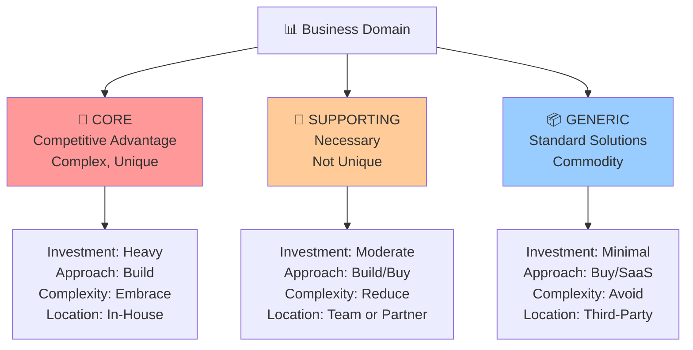

<Hero title="Domains and Subdomains" subtitle="Partitioning business complexity into core, supporting, and generic subdomains" imageAlt="illustration" size="large" />

## TL;DR

A domain is your entire business problem space. Subdomains partition it into meaningful areas. Classify subdomains as **core** (competitive advantage), **supporting** (necessary but not unique), or **generic** (standard, potentially outsourced). This stratification guides investment, team assignment, and build-vs-buy decisions.

## Learning Objectives

- Identify and partition your business domain into subdomains
- Classify subdomains as core, supporting, or generic
- Understand implications of each classification
- Align investment and team resources accordingly
- Map subdomains to organizational units and technical boundaries

## Motivating Scenario

You're building a financial trading platform. Your domain includes: Order Management, Risk Management, Compliance Reporting, Payment Processing, Market Data, and User Authentication.

- **Order Management**: Your competitive advantage. Complex rules, unique logic.
- **Risk Management**: Critical but similar across financial companies.
- **Compliance Reporting**: Required but standard regulatory patterns.
- **Payment Processing**: Generic. Could use Stripe or similar.
- **Market Data**: Could integrate with a data provider.
- **User Authentication**: Generic. Could use Okta or Auth0.

Classification guides decisions: invest heavily in order management; buy or outsource payment processing.

## Core Concepts

### Domain
Your entire business problem space and all associated subproblems.

### Subdomain
A logical part of the overall domain. Solves a specific business problem or capability.

### Core Subdomains
Represent competitive advantage. Unique, complex business logic. Invest heavily. Build in-house. Protect from external changes.

**Example**: In a streaming service, content recommendation is core. It differentiates you from competitors.

### Supporting Subdomains
Necessary for the business but not unique. Important but not a differentiator.

**Example**: Billing is supporting for a streaming service. Every company has billing, but it's not what differentiates you.

### Generic Subdomains
Standard solutions exist. Business logic is generic, not unique.

**Example**: Email notification is generic. Use a service like SendGrid or AWS SES.

<Figure caption="Domain partitioning based on strategic importance">

</Figure>

### Subdomains and Team Structure

Subdomains often map to teams. A team owns a subdomain, understands its business rules, and maintains its code. This alignment—subdomains to teams—is powerful but not absolute. Sometimes one team owns multiple subdomains, or one subdomain requires multiple teams.

### Subdomains and Bounded Contexts

A subdomain often (but not always) maps to a bounded context. A bounded context is an explicit boundary around a model; a subdomain is a business boundary. They're related but distinct concepts.

## Practical Example

**E-commerce Platform**

```
Domain: E-Commerce

Core Subdomains:
  - Product Catalog & Search
  - Shopping Cart & Checkout
  - Order Management
  - Inventory Management
  - Recommendation Engine

Supporting Subdomains:
  - Customer Management
  - Pricing & Discounts
  - Shipping Logistics
  - Returns & Refunds
  - Notifications

Generic Subdomains:
  - User Authentication
  - Email Delivery
  - Payment Processing
  - Analytics
  - Logging & Monitoring
```

**Strategic Decisions**:

- **Product Catalog**: Build custom search with ML ranking. Core competitive advantage.
- **Recommendations**: Build ML model in-house. Differentiator.
- **Pricing**: Buy pricing engine SaaS. Generic logic.
- **Payment**: Use Stripe. Don't build payment processing.
- **Email**: Use SendGrid. Generic service.
- **Authentication**: Use Auth0. Standard OIDC/OAuth.

## When to Use / When Not to Use

<Vs highlight={[0, 1]} items={[
{
    label: "Use Domain Partitioning When:",
    points: [
      "Building systems with multiple distinct areas of responsibility",
      "Multiple teams will work on the system",
      "Need to decide where to invest engineering effort",
      "Planning microservices or modular architecture",
      "System complexity warrants strategic decomposition"
    ],
    highlightTone: "positive"
  },
{
    label: "Avoid Premature Partitioning When:",
    points: [
      "Team is tiny and works on everything together",
      "System is simple CRUD with minimal logic",
      "Still discovering domain structure",
      "Only one person understands the domain"
    ],
    highlightTone: "warning"
  }
]} />

## Patterns and Pitfalls

<Showcase title="Patterns and Pitfalls" sections={[
  {
    label: "Pitfall: Mistaken Core Subdomains",
    body: "Treating every complex problem as core. Overinvesting in generic areas. Question: Is this a competitive differentiator? If customers don't care and competitors do it similarly, it's not core."
  ,
    highlightTone: "positive"
  },
  {
    label: "Pitfall: Ignoring Evolution",
    body: "Classification is static. Over time, subdomains change importance as markets and business evolve. Revisit classifications regularly. What was generic may become core; what was core may become commodity."
  },
  {
    label: "Pitfall: One Team, Many Subdomains",
    body: "Team ownership unclear when one team spans unrelated subdomains. Keep team-to-subdomain mapping clear. One team per subdomain ideally, or explicitly shared ownership."
  ,
    highlightTone: "positive"
  },
  {
    label: "Pattern: Build vs. Buy Analysis",
    body: "Classify subdomain first, then apply build-vs-buy rationale. Core: Build in-house. Supporting: Build or buy. Generic: Buy or SaaS."
  },
  {
    label: "Pattern: Subdomain-First Architecture",
    body: "Design team structure and services around subdomains. Each team owns a subdomain (or related subdomains). Services follow subdomain boundaries."
  ,
    highlightTone: "positive"
  }
]} />

## Design Review Checklist

<Checklist items={[
  "Have you identified all major business areas (potential subdomains)?",
  "Are subdomains classified as core, supporting, or generic?",
  "Do teams understand why their subdomain is classified as it is?",
  "Are build-vs-buy decisions aligned with subdomain classification?",
  "Does team structure roughly map to subdomains?",
  "Can you articulate why each core subdomain provides competitive advantage?",
  "Are supporting and generic subdomains properly scoped (not over-engineered)?",
  "Is there a clear process to revisit classifications as business evolves?",
  "Are subdomain boundaries clear and non-overlapping?",
  "Does each subdomain have identified business stakeholders?"
]} />

## Self-Check

1. **What makes a subdomain 'core'?** It provides competitive advantage and is unique to your business. Customers would notice if it's missing or poor.

2. **Why classify generic subdomains separately?** To avoid overinvesting in non-differentiating areas. Buy or use SaaS for generic needs.

3. **Can a subdomain change classification?** Yes. As markets evolve, importance changes. Email was core for many companies; now SaaS is sufficient.

:::info
**One Takeaway**: Partition your domain strategically based on business importance and build-vs-buy rationale. Don't treat all subdomains equally; invest heavily in core, moderately in supporting, minimally in generic.

:::

## Evolution of Subdomains

Subdomain classifications change as business evolves:

```
Timeline Example: Video Streaming Service

Year 1 (Launch):
- Core: Video Encoding (differentiator, complex)
- Supporting: User Management, Billing, Playback
- Generic: Email, Hosting

Year 3 (Mature):
- Core: Recommendation Engine (now the differentiator)
- Supporting: Video Encoding (commoditized), Playback
- Generic: User Management (Auth0), Billing (Stripe), Email (SendGrid)
- Outcome: Shifted investment from encoding to ML recommendations

Year 5 (Competitive Pressure):
- New Core: Content Licensing (negotiating deals becomes strategic)
- Former Core: Encoding (now handled by third parties like Mux)
- Outcome: Acquired content licensing expertise, outsourced encoding
```

## Subdomain-to-Team Mapping

Effective organizations align teams with subdomains:

```
E-Commerce Example:

Core Domains (Heavy Investment):
├─ Product Catalog Team (10 engineers)
│  ├─ Search with ML ranking
│  ├─ Inventory management
│  └─ Product recommendations
│
└─ Order Management Team (8 engineers)
   ├─ Order processing
   ├─ Payment integration
   └─ Fulfillment orchestration

Supporting Domains (Moderate Investment):
├─ Customer Service Team (4 engineers)
│  ├─ Customer profiles
│  └─ Support ticket system
│
└─ Analytics Team (3 engineers)
   ├─ Event tracking
   └─ Data warehouse

Generic Domains (Minimal Investment):
├─ Use Auth0 (formerly Authentication Team - outsourced)
├─ Use Stripe (formerly Billing - outsourced)
└─ Use AWS Lambda (formerly Hosting - outsourced)

Total Team Count: 25 engineers (instead of 50+ if building everything)
Outcome: Heavy investment where you compete, lean on vendors elsewhere
```

## Anti-Patterns in Domain Partitioning

```
ANTI-PATTERN: Mistaking "complex" for "core"
- Difficult technology != competitive advantage
- Machine learning is complex, but so is message queuing
- Solution: Ask "Would customers care if we did this poorly?"

ANTI-PATTERN: Never revisiting classifications
- Business changes, subdomains should reclassify
- What was core becomes commodity over time
- Solution: Annual review of domain classifications

ANTI-PATTERN: Treating all teams the same
- Core domains need high-performing, senior engineers
- Generic domains can use newer/less experienced engineers
- Supporting domains are middle ground
- Solution: Align hiring and compensation with domain classification

ANTI-PATTERN: Letting organizational silos override subdomains
- "This is the Java team's work" doesn't align with subdomains
- Creates duplicate logic, missed communication
- Solution: Reorganize teams around subdomains, not technologies

ANTI-PATTERN: Overly fine-grained subdomains
- "API layer" and "database layer" aren't subdomains (too fine)
- Subdomains should be business-aligned, not technical
- Solution: Think about business capabilities, not technical layers
```

## Tools and Frameworks

### Event Storming for Discovery

Event Storming is a workshop technique to discover domains through events:

```
Process:
1. Gather domain experts, engineers, product managers
2. Identify domain events (timeline of what happens)
   - "User searched for products"
   - "Product purchased"
   - "Order fulfilled"
3. Group related events into potential subdomains
4. Identify which events are "interesting" (require logic)
5. Classify: core (lots of logic), supporting (moderate), generic (standard)

Output:
- Clear list of subdomains
- Business language (ubiquitous language) for each
- Boundary identification (what's in this subdomain?)
- Dependency graph (how do they interact?)
```

### Domain-Driven Design Model Canvas

```
Subdomain: Order Management

Name & Description:
- Handles customer orders from creation through fulfillment
- Core domain (competitive advantage: fast, accurate order processing)

Ubiquitous Language:
- Order, LineItem, Fulfillment, Shipment, Return
- "Allocate inventory", "Reserve payment", "Fulfill order"

Bounded Context:
- Clear input boundary: REST API accepting order creation requests
- Clear output boundary: Events published (OrderCreated, OrderFulfilled)
- No shared database with other contexts

Subdomains It Depends On:
- Inventory Management (reserve items)
- Payment Processing (charge customer)
- Fulfillment (pick and pack items)

Key Metrics:
- Order processing time: target under 1 second
- Fulfillment accuracy: target 99.9%
- Payment success rate: target 98%+
```

## Next Steps

- **Learn Bounded Contexts**: Map subdomains to bounded contexts with explicit boundaries and language
- **Context Maps**: Document how subdomains and contexts interact
- **Event Storming**: Run workshops to discover subdomains through domain events
- **Microservices Design**: Align services with core and supporting subdomains
- **Team Structure**: Reorganize teams around subdomains for ownership clarity
- **Dependency Management**: Define clear contracts between subdomain teams

## References

- Evans, E. (2003). *Domain-Driven Design*. Addison-Wesley.
- Vaughn, V. (2016). *Domain-Driven Design Distilled*. Addison-Wesley.
- Brandolini, A. "EventStorming: Collaborative Domain Discovery" (eventstorming.com)
- "The Art of Scalability" (subdomains and organizational design)
