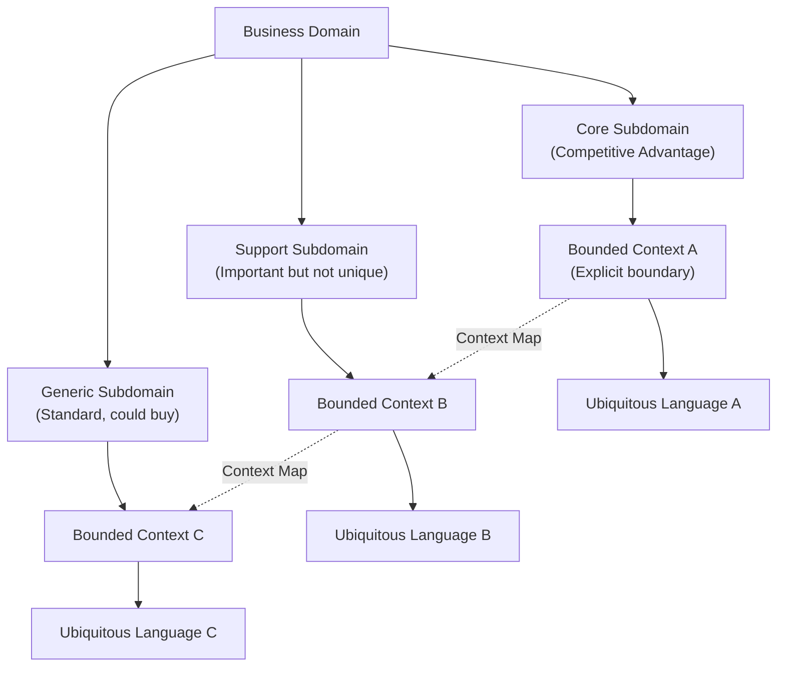

import { useCurrentSidebarCategory } from "@docusaurus/theme-common";

<Hero title="Strategic Design" subtitle="Domain partitioning, bounded contexts, and organizational alignment" imageAlt="Strategic DDD design concepts" size="large" />

## Overview

Strategic Design in DDD focuses on the big picture: partitioning complex business domains, defining clear boundaries, and aligning organizational structure with software architecture. It answers fundamental questions before diving into implementation details.

<Figure caption="Strategic design drives organizational and architectural decisions">

</Figure>

## Key Concepts

### Domains and Subdomains
Break down your business problem into manageable pieces. Identify which subdomains are core to your competitive advantage, which are supporting, and which are generic (potentially outsourced or purchased).

### Bounded Contexts
Establish explicit boundaries where a specific model applies. Within a bounded context, terms have precise meanings; across boundaries, translation is required.

### Ubiquitous Language
Build a shared vocabulary between business stakeholders and technical teams. This language is expressed in code, documentation, and conversation.

### Context Maps
Document how bounded contexts relate: do they collaborate, is one upstream and one downstream, are they anti-corrupt layers protecting legacy systems?

### Team Topologies and Conway's Law
Align organizational structure with system architecture. Teams should correspond to bounded contexts; communication patterns should reflect your desired architecture.

## Strategic Design Benefits

1. **Clarity**: Explicit boundaries prevent vague, sprawling systems
2. **Team Autonomy**: Teams can work independently within their contexts
3. **Evolutionary Architecture**: Bounded contexts can evolve and be replaced independently
4. **Business Alignment**: Architecture mirrors business structure
5. **Reduced Integration Complexity**: Clear contracts between contexts

## When to Apply Strategic Design

- **Early in Project**: Before detailed implementation
- **During Domain Exploration**: With domain experts and architects
- **At Organizational Level**: When multiple teams will work on the system
- **For Microservices Planning**: Strategic design naturally leads to service boundaries
- **Legacy System Integration**: Map existing systems as bounded contexts

## Strategic vs. Tactical

**Strategic Design** (this section) focuses on **partitioning and organization**. It answers: "What are the boundaries? How do teams align?"

**Tactical Design** (next section) focuses on **implementation patterns within boundaries**. It answers: "How do we model entities, aggregates, and services within a context?"

Both are essential. Strategic design without tactical patterns leads to vague architecture; tactical patterns without strategic boundaries create chaos.

## Section Structure

<DocCardList items={useCurrentSidebarCategory().items} />

## Recommended Reading Order

1. **Domains and Subdomains**: Understand how to partition your domain
2. **Bounded Contexts**: Define explicit boundaries with clear meaning
3. **Ubiquitous Language**: Build shared terminology
4. **Context Maps**: Document inter-context relationships
5. **Domain Vision and Capability Mapping**: Align business capabilities with technical boundaries
6. **Team Topologies**: Organize teams to match your architecture

## Getting Started with Strategic Design

1. **Gather Stakeholders**: Bring together business experts, architects, and technical leads
2. **Identify Subdomains**: Break down the business problem into natural pieces
3. **Define Bounded Contexts**: Choose boundaries that respect both business and technical concerns
4. **Build Ubiquitous Language**: For each context, establish a shared vocabulary
5. **Create a Context Map**: Document how contexts interact
6. **Align Teams**: Ensure team structure reflects context boundaries

## Next Steps

- **Explore Tactical Design**: Apply patterns within your bounded contexts
- **Event Storming**: Run workshops to discover domain events and refine context boundaries
- **Microservices Architecture**: Use strategic design to inform service decomposition
- **Legacy Integration**: Model existing systems as bounded contexts with anti-corruption layers

## References

- Evans, E. (2003). *Domain-Driven Design*. Addison-Wesley.
- Vaughn, V. (2016). *Domain-Driven Design Distilled*. Addison-Wesley.
- Vernon, V. (2013). *Implementing Domain-Driven Design*. Addison-Wesley.
- Team Topologies: Conway's Law and Organizational Design (see references in team-topologies article)
