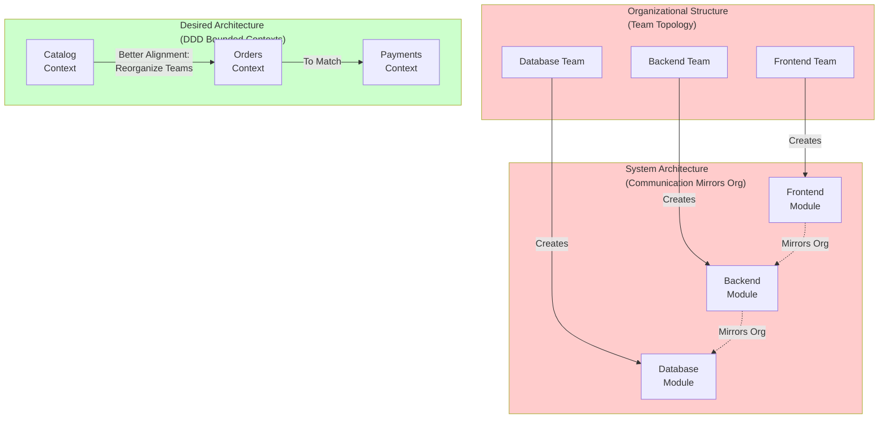

<Hero title="Team Topologies & Conway's Law Alignment" subtitle="Align organizational structure with system architecture for autonomy and efficiency" imageAlt="illustration" size="large" />

## TL;DR

Conway's Law states: "Systems reflect the communication structure of organizations that design them." Inversely, to design a desired system architecture, align organizational structure accordingly. Team topologies directly influence system coupling, autonomy, and quality. Match team ownership to bounded contexts and value streams for maximum effectiveness.

## Learning Objectives

- Understand Conway's Law and its implications
- Design team structure to enable desired architecture
- Recognize misalignment between organization and architecture
- Choose appropriate team topologies for different systems
- Evolve team structure as architecture changes

## Motivating Scenario

**Scenario 1: Monolith with Poor Alignment**

You have a monolithic application with three distinct subdomains: Catalog, Orders, and Payments. But your teams are organized by technology:

- Frontend Team (10 people)
- Backend Team (15 people)
- Database Team (5 people)

Result: Changes to Catalog touch frontend, backend, and database teams. Coordination is painful. Release cycles are long. People step on each other's toes.

**Scenario 2: Aligned to Architecture**

Reorganize into three teams:

- Catalog Team: Frontend, backend, database for catalog
- Orders Team: Frontend, backend, database for orders
- Payments Team: Backend, database for payments (no UI)

Result: Each team owns a subdomain. Changes are localized. Teams move fast independently. Coordination is minimal.

## Core Concepts

### Conway's Law
**"Any organization that designs a system will produce a design whose structure is a copy of the organization's communication structure."**

Implication: If you want a decoupled, modular system, design decoupled, modular teams.

### Team Topology
The structure of teams, their communication patterns, and responsibility boundaries.

### Inverse Conway Maneuver
Design your **desired system architecture first**. Then organize teams to match. This ensures architecture and organization are aligned.

<Figure caption="Conway's Law: Organization structure mirrors system architecture">

</Figure>

### Common Team Topologies

**Functional Teams** (Technology-based):

- Frontend Team
- Backend Team
- DevOps Team

Pros: Deep expertise. Cons: Silos, coordination overhead.

**Feature Teams** (Product/capability-based):

- Shopping Feature Team
- Checkout Feature Team
- User Profile Feature Team

Pros: Autonomy, fast delivery. Cons: Duplicated skills.

**Domain-Aligned Teams** (Bounded context-based):

- Catalog Domain Team
- Orders Domain Team
- Payments Domain Team

Pros: Autonomy, clear ownership, matches DDD. Cons: Need cross-domain coordination.

**Platform Team** (Infrastructure, shared services):

- API Platform Team
- Data Infrastructure
- Observability

Pros: Enables other teams. Cons: Can become bottleneck if not scaled.

## Practical Example

**Transformation: From Functional to Domain-Aligned**

```
BEFORE (Functional Teams):

Frontend Team (12): Mobile & Web UI
  - Works on: Navigation, Catalog UI, Shopping Cart, Checkout UI
  - Coordination: Heavy (needs Backend for data)

Backend Team (18): API & Business Logic
  - Works on: Catalog API, Order processing, Payment integration
  - Coordination: Heavy (needs Frontend for requirements, Database for schema)

Database Team (5): Data & Infrastructure
  - Works on: Schema design, migrations, optimization
  - Coordination: Heavy (reviews all schema changes)

Result: Every feature requires all three teams. Slow, expensive, risk of miscommunication.
---

AFTER (Domain-Aligned Teams):

Catalog Team (8): Catalog domain
  - Members: 3 Frontend, 3 Backend, 1 Data, 1 Product Manager
  - Owns: Product search, recommendations, catalog administration
  - Coordination: Internal to domain

Order Management Team (10): Orders domain
  - Members: 2 Frontend, 4 Backend, 2 Data, 1 QA, 1 Product Manager
  - Owns: Shopping cart, checkout, order status
  - Coordination: Internal to domain

Payments Team (6): Payments domain
  - Members: 2 Backend, 1 Data, 1 SRE, 1 Compliance, 1 Product Manager
  - Owns: Payment processing, reconciliation, compliance
  - Coordination: Internal to domain

Platform Team (7): Shared services
  - Members: Various specialties
  - Owns: API gateway, deployment pipeline, observability

Result: Teams are autonomous. Dependencies are well-defined. Fast iteration possible.
```

## When to Use / When Not to Use

<Vs highlight={[0]} items={[
{
    label: "Align Team to Domain When:",
    points: [
      "Multiple bounded contexts exist",
      "System needs autonomous, fast-moving teams",
      "Long-term scalability is important",
      "Want to reduce coordination overhead",
      "Planning microservices or modular architecture"
    ],
    highlightTone: "positive"
  },
{
    label: "Functional Teams Work When:",
    points: [
      "System is small, unified codebase",
      "Need deep specialization in specific technology",
      "Team is tiny (5-10 people total)",
      "System architecture is not yet clear"
    ]
  }
]} />

## Patterns and Pitfalls

<Showcase title="Patterns and Pitfalls" sections={[
  {
    label: "Pitfall: Misaligned Teams and Architecture",
    body: "Want independent services but have functional teams. Services are tightly coupled. Reorganize teams to match desired architecture. Use inverse Conway maneuver."
  },
  {
    label: "Pitfall: Teams Too Small to Be Independent",
    body: "Try to give teams full-stack ownership, but team of two can't cover all skills. Team should be 5-10 people ideally. Smaller teams need shared platforms for support."
  },
  {
    label: "Pitfall: Platform Team as Bottleneck",
    body: "Shared services team blocks other teams. Becomes a constraint. Platform teams should enable, not gate. Provide self-service, good documentation."
  },
  {
    label: "Pattern: Cross-Domain Committees",
    body: "Domains need to collaborate. Form cross-team working groups for shared concerns. Use community of practice for cross-domain learning. Avoid hierarchical control."
  ,
    body: "Domains need to collaborate. Form cross-team working groups for shared concerns. Use community of practice for cross-domain learning. Avoid hierarchical control."
  ,
    highlightTone: "positive"
  },
  {
    label: "Pattern: Clear Ownership with Shared Responsibility",
    body: "One team owns a domain, but others can contribute. Clear codeowners file. Domain team approves changes. Others can submit PRs. Clear decision-making authority."
  }
]} />

## Design Review Checklist

<Checklist items={[
  "Are bounded contexts and key domains clearly defined?",
  "Is team structure roughly aligned to bounded contexts?",
  "Can teams work independently without constant coordination?",
  "Are inter-team dependencies explicit and well-managed?",
  "Do teams have full-stack skills within their domain?",
  "Is there clear ownership of each domain/context?",
  "Are shared services/platforms properly scoped (not bottlenecks)?",
  "Can you draw the org chart and the system architecture and see the resemblance?",
  "Have communication patterns been intentionally designed?",
  "Is the team structure reviewed and evolved with architecture changes?"
]} />

## Self-Check

1. **If architecture doesn't match organization, which should change?** Typically, change organization. Architecture reflects desired system design. Teams should support that design. But sometimes architecture needs adjustment too.

2. **Can a person work on multiple domains?** Yes, but it should be intentional (platform support) not accidental (unclear ownership).

3. **How do you handle dependencies between domains?** Well-defined APIs, event streams, or async protocols. Avoid synchronous, blocking dependencies when possible.

:::info
**One Takeaway**: Don't treat organization as fixed. Design it to support desired architecture. Conway's Law is inevitable; use it deliberately by aligning organization to architecture. The result: faster, more autonomous teams and better systems.

:::

## Next Steps

- **Bounded Contexts**: Define clear ownership and boundaries for each domain
- **Microservices**: Align services to team and domain boundaries
- **Inter-Service Communication**: Design APIs and events between domains
- **Team Practices**: Implement team health metrics and organizational dynamics

## Team Topology Examples

### Spotify Model (Squad-Based)

```
Feature Team Structure:
  Squad (8 people): Feature team owning one capability
    - Product Manager
    - Developers (backend, frontend)
    - QA
    - Designer

  Tribe (multiple squads): Related features
    - Checkout Squad
    - Payment Squad
    - Shipping Squad

  Chapter: Cross-squad skill sharing
    - Backend Chapter (all backend engineers)
    - Security Chapter (all security-minded people)

  Guild: Community of practice
    - Kubernetes Guild
    - GraphQL Guild
```

### Three Tier Model

```
Level 1: Squads (Feature teams)
  - Own bounded context
  - Autonomous deployment
  - Full-stack capability

Level 2: Chapters (Functional communities)
  - Backend engineers across squads
  - Frontend engineers across squads
  - Ensures skill consistency

Level 3: Tribes (Product lines)
  - Group related squads
  - Shared roadmap
  - Coordination across squads
```

## Assessing Team-Architecture Alignment

### Alignment Check

```yaml
Question: Do team boundaries match bounded contexts?
Yes → Great! Teams can own services independently
No → Misalignment; coordinate across teams or reorganize

Question: Can team X deploy without team Y?
Yes → Autonomous deployment possible
No → Tight coupling; reduce dependencies

Question: How often do teams need to sync?
Daily standup → Likely too coupled
Weekly → Normal for related teams
Monthly → Well-decoupled

Question: Can a junior engineer on-board to a team and be productive in 2 weeks?
Yes → Clear ownership, good documentation
No → Team responsibility unclear or complex
```

## Communication Structure Design

### Formal Communication Paths

```
Specification review (design)
  → Architecture Review Board

Incident resolution (runtime)
  → On-call engineer → escalate to domain expert

Feature coordination (across teams)
  → Feature lead → Product steering committee

Operational decisions
  → DevOps lead → platform team
```

### Informal Communication Paths

```
Slack channels:
  #orders-squad (team communication)
  #backend-chapter (skill sharing)
  #incidents (real-time alerts)
  #architecture (big decisions)

Office hours:
  - Architect office hours (Tuesday 2pm)
  - Security office hours (Wednesday 10am)

Pairing sessions:
  - Frontend dev pairs with backend dev (knowledge sharing)
```

## Managing Bounded Context Transitions

When organization changes but boundaries remain unclear:

```python
# Unclear ownership (bad)
# Who is responsible for payment processing?
# - Payment squad says: we implement Stripe integration
# - Order squad says: we need payment processing
# - Unclear responsibility → bugs slip through cracks

# Clear ownership (good)
# Payment Squad owns:
#   - Stripe integration
#   - Payment processing service
#   - Payment notifications
#   - Refunds and disputes

# Order Squad owns:
#   - Calling payment service
#   - Reacting to payment events
#   - Storing payment status in order
```

## Self-Check

1. **If architecture doesn't match organization, which should change?** Typically organization. Architecture reflects desired system design; teams should support that design.

2. **Can a person work on multiple domains?** Yes, but intentionally (platform support) not accidentally (unclear ownership).

3. **How do you handle dependencies between domains?** Well-defined APIs, event streams, or async protocols. Avoid synchronous, blocking dependencies.

4. **Does your org chart look like your system architecture?** If yes, great! If no, either reorganize or refactor architecture.

5. **How do you prevent team silos?** Chapters and guilds for skill sharing, pairing sessions, shared repositories, good documentation.

:::info
**One Takeaway**: Don't treat organization as fixed. Design it to support desired architecture. Conway's Law is inevitable; use it deliberately by aligning organization to architecture. Result: faster, more autonomous teams and better systems. Review alignment quarterly as architecture evolves.

:::

## Next Steps

- **Define Bounded Contexts**: Identify domains and ownership
- **Design Team Topologies**: Choose squad, chapter, tribe structure
- **Map Communication**: Design both formal and informal communication
- **Establish Sync Points**: Weekly syncs for related teams, monthly all-hands
- **Monitor Alignment**: Track how often teams need to coordinate

## References

- Conway, M. E. (1968). "How Do Committees Invent?" Datamation.
- Skelton, M., & Pais, M. (2019). *Team Topologies: Organizing Business and Technology Teams for Fast Flow*. IT Revolution Press.
- Evans, E. (2003). *Domain-Driven Design: Tackling Complexity in the Heart of Software*. Addison-Wesley.
- Kniberg, H., & Ivarsson, A. (2012). "Scaling Agile at Spotify with Tribes, Squads, Chapters, and Guilds".
- Forsgren, N., Humble, J., & Kim, G. (2018). *Accelerate: The Science of Lean Software and DevOps*. IT Revolution Press.