<Hero title="Ubiquitous Language" subtitle="Shared vocabulary between business experts and developers within a bounded context" imageAlt="illustration" size="large" />

## TL;DR

Ubiquitous Language is the shared vocabulary used between domain experts and developers. It's expressed in code, documentation, conversation, and tests. Terms have precise meanings within a bounded context. When business and technical teams speak the same language, misunderstandings decrease, alignment improves, and code quality rises.

## Learning Objectives

- Build a shared vocabulary with domain experts
- Express ubiquitous language in code, not just documentation
- Recognize and resolve language ambiguities
- Use language to drive design decisions
- Maintain language consistency across teams

## Motivating Scenario

**Before Ubiquitous Language**:

- Business says: "Process an order through our workflow"
- Developer hears: "Create a workflow record in the database"
- They're talking past each other.

**With Ubiquitous Language**:

- Business and developers agree: "An order goes through multiple states: Pending, Confirmed, Shipped, Delivered. Each state transition is an event."
- Code reflects this: OrderState enum, OrderTransitioned event.
- When someone says "process," everyone knows exactly what states and transitions are involved.

## Core Concepts

### Ubiquitous Language
The vocabulary shared and consistently used by domain experts, developers, and other team members. It evolves through collaboration and is expressed everywhere: code, tests, documentation, conversations.

### Precise Terminology
Terms have single, unambiguous meanings. "Order" doesn't mean five different things.

### Language Scope
A ubiquitous language applies within a bounded context. Across contexts, terms may have different meanings.

### Language Evolution
Language is discovered and refined through discussion. It's not handed down; it emerges from collaboration.

```mermaid
graph TB
    Business["👥 Business Experts<br/>Domain Knowledge"]
    Tech["👨‍💻 Developers<br/>Technical Expertise"]

    Business -->|"Discuss &<br/>Refine"| Language["🗣️ Ubiquitous<br/>Language"]
    Tech -->|"Discuss &<br/>Refine"| Language

    Language -->|"Expressed In"| Code["Code<br/>Class Names, Methods<br/>Variable Names"]
    Language -->|"Expressed In"| Tests["Tests<br/>Behavior Specifications<br/>Test Names"]
    Language -->|"Expressed In"| Docs["Documentation<br/>Glossary<br/>Architecture Decisions"]
    Language -->|"Expressed In"| Talk["Conversation<br/>Discussions<br/>Meetings"]

    style Language fill:#99ff99
```

<Figure caption="Ubiquitous language bridges business and technical understanding">

</Figure>

### Language Implementation in Code

Code should directly reflect domain language:

```python
# Good: Language is clear
class Order:
    def confirm(self):
        """Transition order from Pending to Confirmed."""
        self.status = OrderStatus.CONFIRMED

    def ship(self):
        """Transition order from Confirmed to Shipped."""
        self.status = OrderStatus.SHIPPED

# Bad: Language is obscured
class Item:
    def update_state(self, new_state):
        """Update the item state."""
        self.s = new_state
```

## Practical Example

**Insurance Underwriting Domain**

```
Ubiquitous Language Terms:

- Policy: A contract between insurer and customer
- Premium: The price the customer pays
- Claim: A request from customer for compensation
- Underwriter: Expert who evaluates risk and approves policies
- Coverage: The specific risks insured
- Deductible: Amount customer pays before insurance covers
- Renewal: Extension of existing policy
- Lapse: Policy expires without renewal

Usage in Code:
  class Policy:
    def approve_claim(claim: Claim) -> bool:
      """Underwriter approves or denies a claim."""
      ...

  class Claim:
    def apply_deductible(self, amount: Money):
      """Reduce claim by the deductible amount."""
      ...

  class Coverage:
    def covers(self, risk: Risk) -> bool:
      """Check if this coverage applies to the risk."""
      ...
```

## When to Use / When Not to Use

<Vs items={[
{
    label: "Build Ubiquitous Language When:",
    points: [
      "Domain is complex and terminology is ambiguous",
      "Multiple teams collaborate on the system",
      "Domain experts and developers need alignment",
      "Codebase needs to reflect business concepts",
      "Knowledge transfer across teams is important"
    ]
  },
{
    label: "Language is Less Critical When:",
    points: [
      "Simple systems with clear concepts",
      "One person understands and codes everything",
      "Domain is very technical with no business nuance",
      "Still in extreme early prototyping"
    ]
  }
]} />

## Patterns and Pitfalls

<Showcase title="Patterns and Pitfalls" sections={[
  {
    label: "Pitfall: Glossary that Gathers Dust",
    body: "Document created once, never updated. Doesn't reflect how team actually talks. Glossary is living documentation. Update it when language changes. Reference it in code."
  },
  {
    label: "Pitfall: Language-Code Mismatch",
    body: "Business calls it Order. Code calls it OrderDTO or OrderModel. Language isn't reflected. Name classes, methods, variables using ubiquitous language. No prefixes or suffixes that obscure terms."
  },
  {
    label: "Pitfall: Forcing Unnatural Language",
    body: "Developer introduces a term that doesn't exist in business. Language feels artificial. Language must come from domain experts. If developers propose terms, vet with business first."
  },
  {
    label: "Pattern: Glossary in README",
    body: "Document terms and definitions. Make it a reference for new team members. Maintain a glossary. Link to code examples. Update with language evolution."
  },
  {
    label: "Pattern: Domain Events in Language",
    body: "Events reflect business concepts: OrderConfirmed, PaymentReceived, ShipmentDispatched. Use event names that domain experts recognize. Events are a clear expression of language."
  }
]} />

## Design Review Checklist

<Checklist items={[
  "Are domain terms consistently used in code?",
  "Does the codebase reflect business language?",
  "Are class names, method names, and variables using ubiquitous language?",
  "Is there a glossary or reference documenting the language?",
  "Do developers and business experts use the same terminology?",
  "Are ambiguous terms clearly defined?",
  "Have language misunderstandings been resolved?",
  "Is language scope clear (which bounded context does it apply to)?",
  "Are new team members trained on the ubiquitous language?",
  "Is language evolution captured as the domain is better understood?"
]} />

## Advanced Language Patterns

### Event Sourcing and Language

Events are pure language expression:

```python
# Domain language becomes event names
class OrderEvents:
    """Events express domain language as they happen."""

    class OrderInitiated:
        """Customer started order process."""
        def __init__(self, order_id, customer_id, timestamp):
            self.order_id = order_id
            self.customer_id = customer_id
            self.timestamp = timestamp

    class ItemAdded:
        """Customer added item to order."""
        def __init__(self, order_id, product_id, quantity, timestamp):
            self.order_id = order_id
            self.product_id = product_id
            self.quantity = quantity
            self.timestamp = timestamp

    class OrderConfirmed:
        """Customer confirmed order (committed to purchase)."""
        def __init__(self, order_id, timestamp):
            self.order_id = order_id
            self.timestamp = timestamp

    class PaymentProcessed:
        """Payment successfully charged."""
        def __init__(self, order_id, amount, timestamp):
            self.order_id = order_id
            self.amount = amount
            self.timestamp = timestamp

    class OrderShipped:
        """Order left warehouse."""
        def __init__(self, order_id, tracking_number, timestamp):
            self.order_id = order_id
            self.tracking_number = tracking_number
            self.timestamp = timestamp

# Business language is preserved in event names and fields
# Each event tells a story from domain perspective
```

### Language Boundaries and Translation

Different contexts use different language:

```python
# Sales Context
class SalesOrder:
    """Order from sales perspective: revenue, customer, fulfillment."""
    def __init__(self):
        self.customer_id = None
        self.total_revenue = None
        self.commission_rate = None

# Fulfillment Context
class Shipment:
    """Order from fulfillment perspective: items, address, schedule."""
    def __init__(self):
        self.destination_address = None
        self.items_to_ship = None
        self.estimated_delivery_date = None

# Translation Layer (Anti-Corruption Layer)
class OrderSalesAdapter:
    """Translates between Sales context and Fulfillment context."""

    @staticmethod
    def to_shipment(sales_order: SalesOrder) -> Shipment:
        """Convert SalesOrder to Fulfillment's Shipment."""
        shipment = Shipment()
        shipment.destination_address = sales_order.get_shipping_address()
        shipment.items_to_ship = [
            {
                "product_id": item.product_id,
                "quantity": item.quantity
            }
            for item in sales_order.line_items
        ]
        shipment.estimated_delivery_date = sales_order.estimate_delivery()
        return shipment
```

### Language Evolution Through Refactoring

Language changes as understanding deepens:

```
Initial Language (Shallow Understanding):
- Concept: "User"
- Problem: Too broad. Users have very different roles.

Evolved Language (Deeper Understanding):
- Customer: Buys products
- Vendor: Sells products
- Admin: Manages platform
- Support: Resolves customer issues

Later Evolution (Business Model Change):
- CustomerAccount: Tracks purchases and loyalty
- MarketplaceVendor: Manages inventory and pricing
- PlatformAdmin: Manages policies
- SupportRepresentative: Handles tickets

Result: Language now reflects business reality more precisely.
```

### Language Glossary in Code

Keep language reference accessible:

```python
# In codebase: glossary.py
UBIQUITOUS_LANGUAGE = {
    "Order": {
        "definition": "Customer's purchase intent and transaction",
        "lifecycle": ["Pending", "Confirmed", "Shipped", "Delivered"],
        "related_terms": ["Customer", "LineItem", "Payment"],
        "examples": [
            "OrderCreated event",
            "Order aggregate root",
            "OrderService"
        ]
    },
    "Customer": {
        "definition": "Individual or entity that purchases products",
        "properties": ["email", "shipping_address", "billing_address"],
        "related_terms": ["Order", "Payment", "Account"],
        "examples": [
            "Customer aggregate",
            "CustomerRepository"
        ]
    },
    "Fulfillment": {
        "definition": "Process of shipping order to customer",
        "related_terms": ["Order", "Shipment", "Tracking"],
        "examples": [
            "FulfillmentService",
            "OrderShipped event"
        ]
    }
}

# Accessible to all team members
def get_term_definition(term: str) -> dict:
    return UBIQUITOUS_LANGUAGE.get(term)
```

### Language Alignment Practices

Techniques to maintain language consistency:

**1. Code Review for Language**

```
PR Review Comment:
"This variable is named 'UserPerm' but we use 'Permission'
in our ubiquitous language. Change to 'Permission' for consistency."
```

**2. Design Review for Language**

```
Design Meeting:
Architect: "What do we call the process of returning an order?"
Business: "We say the customer 'initiates a return'"
Designer: "So we need InitiateReturn event and ReturnService?"
Everyone: "Yes, that matches our language."
```

**3. Test Names Reflect Language**

```python
class TestOrderConfirmation:
    def test_customer_can_confirm_pending_order(self):
        """Domain language in test name."""
        # Language: "customer", "confirm", "pending order"
        order = Order(status=OrderStatus.PENDING)
        order.confirm()
        assert order.status == OrderStatus.CONFIRMED

    def test_cannot_confirm_already_shipped_order(self):
        """Language: "cannot", "shipped order" (invariant)."""
        order = Order(status=OrderStatus.SHIPPED)
        with pytest.raises(InvalidOperationError):
            order.confirm()
```

## Common Language Anti-Patterns

**Anti-pattern 1: Technical Terms in Domain Code**

```python
# Bad: Technical language leaks into domain
class OrderDTO:  # DTO is technical, not domain
    def serialize(self):
        pass

# Good: Domain language only
class Order:
    def to_dict(self):  # Still technical, but clearer intent
        pass
```

**Anti-pattern 2: Inconsistent Terminology**

```python
# Bad: Same concept, different names
class Customer:
    def place_order(self):
        pass

class ShoppingCart:
    def checkout(self):  # Same action, different name
        pass

# Good: Consistent language
class Customer:
    def place_order(self):
        pass

class ShoppingCart:
    def place_order(self):  # Same name everywhere
        pass
```

**Anti-pattern 3: Language-Code Mismatch**

```python
# Bad: Domain concept named generically
class Request:
    def __init__(self):
        self.data = {}

# Good: Domain concept named clearly
class RefundRequest:
    def __init__(self, order_id, reason):
        self.order_id = order_id
        self.reason = reason
```

## Self-Check

1. **What's the difference between ubiquitous language and a glossary?** A glossary is a document. Ubiquitous language is the living vocabulary used everywhere: code, tests, conversation. The glossary documents it.

2. **Can two contexts have different meanings for the same term?** Yes. "Order" in Sales Context means a customer's purchase. In Fulfillment Context, it might mean a shipment instruction. This is why contexts need boundaries.

3. **How do you identify language misalignment?** When developers and business experts are confused, talking past each other, or using different terms for the same concept.

4. **How does event sourcing reinforce ubiquitous language?** Events are pure domain language: OrderConfirmed, PaymentProcessed, ShipmentDispatched. Event log reads like a business narrative.

5. **What's the best way to keep language consistent over time?** Maintain living glossary (updated with codebase), review code for language consistency, use language in test names, and have regular language refinement sessions.

:::info
**One Takeaway**: Ubiquitous language is the glue between business and technical understanding. Invest in building it with domain experts. Express it in code. Protect it from corruption through code review and design discussions. When language is clear and shared, everything else becomes easier. Language is your most valuable architectural asset.

:::

## Next Steps

- **Run Event Storming**: Collaborative workshop to discover domain language
- **Bounded Contexts**: Language applies within context boundaries
- **Domain Events**: Use events to reflect language concepts
- **Code Review**: Enforce language consistency in pull requests

## References

- Evans, E. (2003). *Domain-Driven Design*. Addison-Wesley.
- Braude, E. (2020). Software Architects' Handbook. Packt Publishing.
