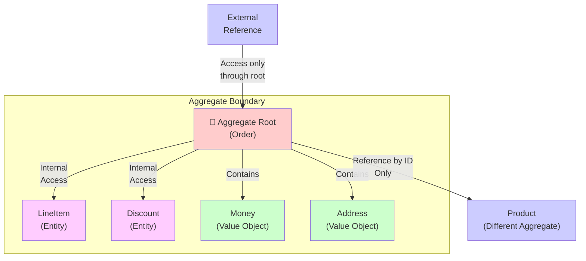

<Hero title="Aggregates and Aggregate Roots" subtitle="Clusters of entities and value objects with consistency boundaries and single root access" imageAlt="illustration" size="large" />

## TL;DR

An Aggregate is a cluster of entities and value objects treated as a single unit with a consistency boundary. The Aggregate Root is the single entry point—all external access goes through it. Aggregates define transactional boundaries and enforce invariants. Design aggregates to be as small as necessary while maintaining business rules.

## Learning Objectives

- Identify aggregate boundaries
- Design aggregate roots as entry points
- Enforce invariants within aggregates
- Understand transaction and consistency boundaries
- Recognize and fix overly large aggregates

## Motivating Scenario

An Order aggregate contains:
- Order entity (root)
- LineItems (child entities)
- Shipping address (value object)
- Payment info (value object)

All part of one aggregate. Why? Changing a line item requires updating order total; both must happen atomically. Shipping address change affects fulfillment; must be consistent. They form a cohesive unit.

A Product is NOT part of the Order aggregate. Products change independently; Orders reference them by ID only.

## Core Concepts

### Aggregate
A cluster of associated entities and value objects that function as a single unit of consistency.

### Aggregate Root
The single entity within the aggregate responsible for maintaining invariants. All external references point to the root; internal access is through the root.

### Consistency Boundary
The scope within which all invariants must be satisfied. Objects outside the boundary are referenced by identity only.

<Figure caption="Aggregate structure and access patterns">

</Figure>

### Rules for Aggregates

1. **Root Access Only**: Access aggregates only through the root. Never navigate directly to internal entities.
2. **Small Aggregates**: Keep aggregates small. Easier to understand, fewer concurrent conflicts.
3. **Reference by Identity**: Reference other aggregates by ID only, not by object reference.
4. **Transactional Consistency**: One aggregate changes atomically. Multiple aggregates change via separate transactions.
5. **Enforce Invariants**: Root is responsible for invariants within the boundary.

## Practical Example

**Order Aggregate**

```python
class LineItem:
    """Child entity, accessed only through Order."""
    def __init__(self, line_id: str, product_id: str, quantity: int, price: Money):
        self.line_id = line_id
        self.product_id = product_id  # Reference by ID, not Product object
        self.quantity = quantity
        self.price = price

    def subtotal(self) -> Money:
        return self.price.multiply(self.quantity)

class Order:
    """Aggregate Root."""
    def __init__(self, order_id: str, customer_id: str):
        self.order_id = order_id
        self.customer_id = customer_id
        self.line_items: list = []
        self.total = Money(0, "USD")
        self.status = OrderStatus.PENDING

    def add_line_item(self, product_id: str, quantity: int, price: Money):
        """Root enforces invariants: can't add to shipped orders."""
        if self.status != OrderStatus.PENDING:
            raise InvalidOperationError("Cannot modify non-pending order")

        line = LineItem(str(len(self.line_items)), product_id, quantity, price)
        self.line_items.append(line)
        self._recalculate_total()

    def remove_line_item(self, line_id: str):
        """Root enforces consistency."""
        if self.status != OrderStatus.PENDING:
            raise InvalidOperationError("Cannot modify shipped order")

        self.line_items = [item for item in self.line_items if item.line_id != line_id]
        self._recalculate_total()

    def confirm(self):
        """Transition to confirmed. Invariant: must have items."""
        if not self.line_items:
            raise InvalidOperationError("Cannot confirm empty order")
        self.status = OrderStatus.CONFIRMED

    def _recalculate_total(self):
        """Internal consistency: total matches line items."""
        self.total = sum(
            (item.subtotal() for item in self.line_items),
            Money(0, "USD")
        )
```

## When to Use / When Not to Use

<Vs highlight={[0,0]} items={[
{
    label: "Small, Focused Aggregates When:",
    points: [
      "Consistency boundary is clear",
      "Invariants are localized",
      "Few concurrent updates expected",
      "Performance matters"
    ],
    highlightTone: "positive"
  },
{
    label: "Larger Aggregates Only When:",
    points: [
      "Invariants truly span entities",
      "Concurrent conflicts unlikely",
      "Transactional consistency required across entities"
    ]
  }
]} />

## Patterns and Pitfalls

<Showcase title="Patterns and Pitfalls" sections={[
  {
    label: "Pitfall: God Aggregates",
    body: "One massive aggregate owns everything. Consistency boundary is unclear. Break into smaller aggregates. Use IDs to reference other aggregates."
  },
  {
    label: "Pitfall: Direct References Between Aggregates",
    body: "Aggregate A holds reference to Aggregate B object. Creates coupling. Reference other aggregates by ID only. Load via repository if needed."
  },
  {
    label: "Pitfall: Unclear Root Responsibility",
    body: "Multiple entities can modify state. Invariants not protected. Root controls all mutations. Child entities are passive."
  },
  {
    label: "Pattern: Transactional Saga for Multiple Aggregates",
    body: "Changes spanning multiple aggregates require coordination. Use events and sagas. Each aggregate changes atomically; saga orchestrates."
  },
  {
    label: "Pattern: Snapshot Loading",
    body: "Large aggregates with event sourcing can have many events to replay. Store snapshots of aggregate state periodically for fast loading."
  }
]} />

## Design Review Checklist

<Checklist items={[
  "Is there a clear aggregate root?",
  "Are all invariants enforced by the root?",
  "Is external access only through the root?",
  "Are child entities referenced through the root?",
  "Are other aggregates referenced by ID only?",
  "Is the aggregate small and focused?",
  "Can the aggregate state change atomically?",
  "Are invalid states impossible?",
  "Is the consistency boundary clearly documented?",
  "Can the aggregate be loaded and modified without loading unrelated data?"
]} />

## Advanced Aggregate Patterns

### Event-Sourced Aggregates

Store events instead of current state:

```python
class OrderEvent:
    """Base class for order events."""
    def __init__(self, aggregate_id: str, timestamp: str):
        self.aggregate_id = aggregate_id
        self.timestamp = timestamp

class OrderCreated(OrderEvent):
    def __init__(self, order_id: str, customer_id: str, timestamp: str):
        super().__init__(order_id, timestamp)
        self.customer_id = customer_id

class LineItemAdded(OrderEvent):
    def __init__(self, order_id: str, product_id: str, quantity: int, price: Money, timestamp: str):
        super().__init__(order_id, timestamp)
        self.product_id = product_id
        self.quantity = quantity
        self.price = price

class EventSourcedOrder:
    """Order using event sourcing."""
    def __init__(self, order_id: str):
        self.order_id = order_id
        self.events: List[OrderEvent] = []

    def create(self, customer_id: str):
        event = OrderCreated(self.order_id, customer_id, "2025-02-14T10:00:00Z")
        self.events.append(event)
        self.customer_id = customer_id
        self.line_items = []

    def add_line_item(self, product_id: str, quantity: int, price: Money):
        event = LineItemAdded(self.order_id, product_id, quantity, price, "2025-02-14T10:05:00Z")
        self.events.append(event)
        self.line_items.append({"product_id": product_id, "quantity": quantity, "price": price})

    def get_uncommitted_events(self) -> List[OrderEvent]:
        return self.events
```

### Aggregate Snapshots

For large aggregates with many events, store snapshots for fast loading:

```python
class AggregateSnapshot:
    def __init__(self, aggregate_id: str, version: int, state: dict):
        self.aggregate_id = aggregate_id
        self.version = version
        self.state = state

class SnapshotRepository:
    def save_snapshot(self, aggregate_id: str, version: int, state: dict):
        """Save snapshot at specific event version."""
        snapshot = AggregateSnapshot(aggregate_id, version, state)
        # Persist to database

    def load_aggregate(self, aggregate_id: str):
        """Load aggregate using snapshot + remaining events."""
        # Load latest snapshot
        snapshot = self.find_latest_snapshot(aggregate_id)

        if snapshot:
            # Start from snapshot, replay only events after it
            events = self.find_events_after_version(aggregate_id, snapshot.version)
            aggregate = self.reconstruct_from_snapshot(snapshot.state)
        else:
            # No snapshot, replay all events
            events = self.find_all_events(aggregate_id)
            aggregate = self.reconstruct_from_events(events)

        return aggregate

    def reconstruct_from_events(self, events):
        """Rebuild aggregate state from all events."""
        # Apply each event in order
        pass
```

### Transactional Sagas for Multi-Aggregate Operations

When changes span multiple aggregates, use sagas for coordination:

```python
class OrderSaga:
    """Saga coordinating Order, Payment, and Inventory aggregates."""

    async def execute(self, order_id: str):
        try:
            # Step 1: Create order
            order = await self.order_service.create(order_id)

            # Step 2: Reserve inventory
            try:
                await self.inventory_service.reserve(order.line_items)
            except InsufficientInventoryError:
                # Compensate: Cancel order
                await self.order_service.cancel(order_id)
                raise

            # Step 3: Process payment
            try:
                await self.payment_service.charge(order.customer_id, order.total())
            except PaymentFailedError:
                # Compensate: Release inventory reservation
                await self.inventory_service.release_reservation(order_id)
                # Compensate: Cancel order
                await self.order_service.cancel(order_id)
                raise

            # Step 4: Ship order
            await self.shipping_service.ship(order_id)

        except Exception as e:
            print(f"Saga failed at step: {e}")
            raise
```

### Aggregate Root Factories

Create complex aggregates with validation:

```python
class OrderFactory:
    """Factory for creating valid Order aggregates."""

    @staticmethod
    def create_from_cart(cart_id: str, customer_id: str) -> Order:
        """Convert shopping cart to confirmed order."""
        cart = CartRepository.find(cart_id)

        if not cart.items:
            raise ValueError("Cannot order empty cart")

        if not customer_id:
            raise ValueError("Customer required")

        order = Order(str(uuid.uuid4()), customer_id)

        for item in cart.items:
            product = ProductRepository.find(item.product_id)
            if not product.in_stock(item.quantity):
                raise ValueError(f"Product {item.product_id} insufficient stock")

            order.add_line_item(item.product_id, item.quantity, product.price)

        order.confirm()
        return order
```

## Modeling Complex Domains

### Order Management Domain

**Boundaries**: What belongs inside Order aggregate vs outside?

```
INSIDE Order Aggregate (tight consistency):
- Order (root)
- LineItems
- Shipping Address
- Billing Address
- Promotions applied

OUTSIDE Order Aggregate (referenced by ID):
- Customer (separate aggregate)
- Product (separate aggregate)
- Inventory (separate aggregate)
- Payment (separate aggregate)

Why? Changing a line item must update order total atomically.
Changing a product price should NOT affect existing orders.
```

### Multi-Aggregate Consistency

Handling complex operations:

```
Operation: Fulfill Order
Involves: Order, Inventory, Shipping, Payment aggregates

Consistency requirement: Order and Inventory must be consistent

Solution:
1. Query order
2. Reserve inventory
3. If success, update order status to "shipped"
4. If inventory fails, don't update order

Use saga pattern:
- Each aggregate changes atomically
- Saga orchestrates sequence
- Compensating transactions roll back if needed
```

## Performance Considerations

**Small aggregates**: Faster loads, fewer lock conflicts, easier testing

**Large aggregates**: Fewer round-trips, simpler sagas, but less parallelism

Choose based on:
1. **Consistency needs**: What must change together?
2. **Contention**: How often do multiple operations target the same aggregate?
3. **Scalability**: Can you shard aggregates for parallel processing?

## Self-Check

1. **How do you decide aggregate boundaries?** Ask: What invariants must be satisfied together? Objects satisfying shared invariants belong in the same aggregate.

2. **Can an aggregate span multiple tables?** Yes. Aggregates are logical, not storage-based. Persistence implementation is separate.

3. **What if aggregates are too small?** Small is usually better. If you need to change multiple aggregates together, use sagas or events.

4. **When should you use event sourcing with aggregates?** When you need full audit trail, temporal queries, or event-driven integration with other systems.

5. **How do sagas help with multi-aggregate consistency?** They orchestrate operations across aggregates and provide compensating transactions if any step fails.

:::info
**One Takeaway**: Aggregates are consistency and transactional units. Keep them small, focused, and with clear roots. Reference other aggregates by ID. This makes systems easier to understand, modify, and scale. Use sagas for multi-aggregate operations and event sourcing for auditability.

:::

## Next Steps

- **Domain Events**: Model aggregates' side effects and trigger sagas
- **Repositories**: Load and save aggregates as units
- **Event Sourcing**: Store aggregate events for auditability
- **Sagas**: Coordinate changes across multiple aggregates

## References

- Evans, E. (2003). *Domain-Driven Design*. Addison-Wesley.
- Vernon, V. (2013). *Implementing Domain-Driven Design*. Addison-Wesley.
