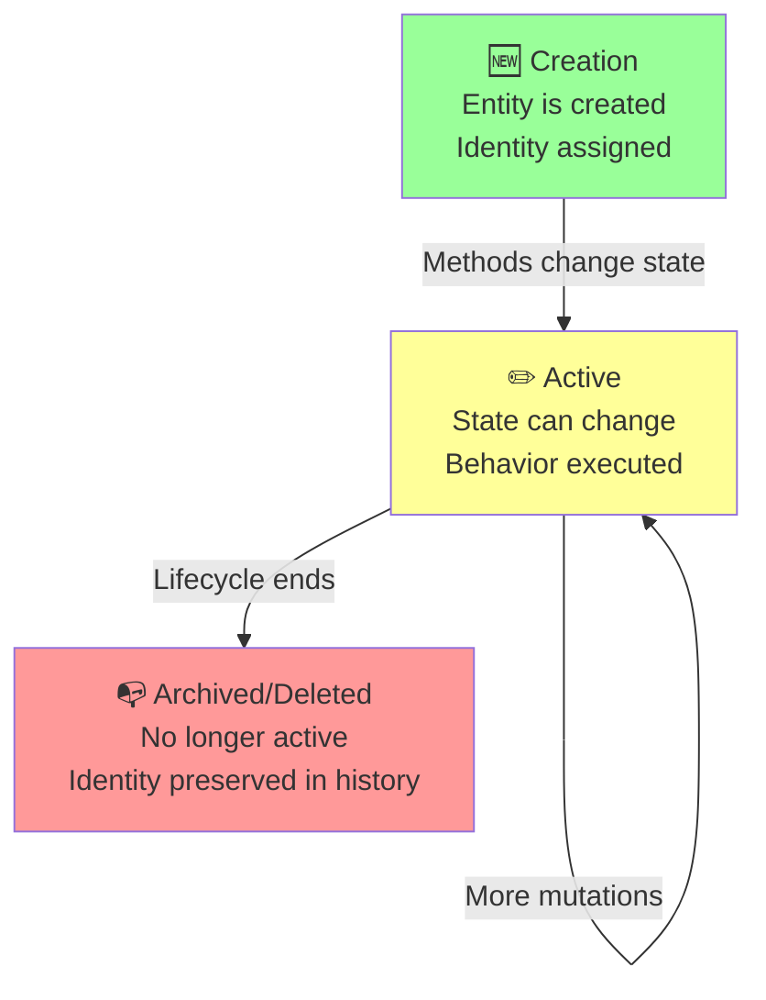

<Hero title="Entities" subtitle="Objects with unique identity that persist over time and have mutable state" imageAlt="illustration" size="large" />

## TL;DR

Entities are domain objects with unique identity that persists over time. They have mutable state and behavior. Two entities are equal if their identities match, regardless of attributes. Entities have a lifecycle: creation, state changes, deletion. Use entities for domain concepts that need to be tracked individually.

## Learning Objectives

- Distinguish entities from value objects
- Design entity identities (generated, natural, composite)
- Implement mutable state carefully with invariants
- Manage entity lifecycle
- Recognize when something should be an entity vs. value object

## Motivating Scenario

In an e-commerce system: Customer, Order, Product, ShoppingCart are likely entities. Each has unique identity that persists.

- Customer with CustomerID 123 remains the same customer even if name or address changes.
- Order #456 is always that order, regardless of whether items change (before shipping).
- ShoppingCart is tied to a specific customer session.

These need identity tracking and state mutation. They're entities.

## Core Concepts

### Identity
Every entity has a unique identifier that distinguishes it from other entities. Identity persists even as attributes change.

**Types of Identity**:
- **Generated ID** (UUID, sequence): System generates
- **Natural ID**: Derived from domain attributes (ISBN for books, SSN for people)
- **Composite ID**: Combination of values (CompanyID + EmployeeID)

### Equality
Entities are equal if their identities are equal, NOT if attributes match.

```python
# Equality by identity, not attributes
order1 = Order(id=1, total=100)
order2 = Order(id=1, total=200)
order1 == order2  # True: same ID, even though total changed
```

### Mutable State
Entities have mutable state. Methods change internal state while enforcing invariants.

```python
class Order:
    def add_item(self, item):
        """Add item to order. Can't add to shipped orders."""
        if self.status == OrderStatus.SHIPPED:
            raise InvalidOperationError("Cannot modify shipped order")
        self.items.append(item)
```

<Figure caption="Entity lifecycle and state management">

</Figure>

### Invariants
Business rules that entities must always enforce. No invalid state should ever exist.

```python
class Account:
    def __init__(self, owner: str, balance: float):
        if balance < 0:
            raise ValueError("Balance cannot be negative")
        self.owner = owner
        self.balance = balance

    def withdraw(self, amount: float):
        """Enforce invariant: balance never goes negative."""
        if amount > self.balance:
            raise InsufficientFundsError()
        self.balance -= amount
```

## Anti-Patterns to Avoid

### God Objects: Entities Too Large

```python
# Bad: Order entity owns everything
class Order:
    def __init__(self, order_id, user_id, items, ...):
        self.order_id = order_id
        self.user_id = user_id
        self.items = items
        self.shipping_address = shipping_address
        self.payment_info = payment_info
        self.notifications = notifications
        self.analytics = analytics
        self.loyalty_points = loyalty_points
        # ... 50 more attributes

    def calculate_tax(self): ...
    def calculate_shipping(self): ...
    def apply_coupon(self): ...
    def charge_payment(self): ...
    def send_confirmation(self): ...
    def update_inventory(self): ...
    def track_analytics(self): ...
    # ... 50 more methods
```

Problems:
- Hard to understand (too many responsibilities)
- Hard to test (many dependencies)
- Hard to change (changes affect everything)
- God object becomes bottleneck

Solution: Break into smaller entities and value objects.

```python
# Good: Smaller, focused entities
class Order:
    def __init__(self, order_id, customer_id, items):
        self.order_id = order_id
        self.customer_id = customer_id
        self.items = items  # List of LineItem entities
        self.status = OrderStatus.PENDING

    def confirm(self):
        # Only responsibility: order state management
        self.status = OrderStatus.CONFIRMED

class LineItem:
    # Represents individual order line
    def __init__(self, product_id, quantity, unit_price):
        self.product_id = product_id
        self.quantity = quantity
        self.unit_price = unit_price

class OrderPricingService:
    # Separate service for pricing logic
    def calculate_total(self, order):
        return sum(item.quantity * item.unit_price for item in order.items)

    def apply_coupon(self, order, coupon):
        # Complex pricing logic isolated here
        return self.calculate_total(order) * (1 - coupon.discount_percent)

class OrderNotificationService:
    # Separate service for notifications
    def send_confirmation(self, order):
        # Notification logic isolated here
        pass
```

### Entities Without Behavior

```python
# Bad: Entity is just a data container
class User:
    def __init__(self, user_id, email, password):
        self.user_id = user_id
        self.email = email
        self.password = password

# Business logic is elsewhere (anemic domain model)
def check_email_valid(user):
    return '@' in user.email

def hash_password(user):
    user.password = bcrypt.hash(user.password)

# Bad because:
# - Business rules scattered
# - Easy to violate invariants
# - Email validation might be missing somewhere

# Good: Entity enforces its own rules
class User:
    def __init__(self, user_id: str, email: str, password: str):
        if not self._is_valid_email(email):
            raise ValueError(f"Invalid email: {email}")
        if len(password) < 12:
            raise ValueError("Password must be at least 12 characters")

        self.user_id = user_id
        self.email = email
        self.password = bcrypt.hash(password)  # Hash immediately

    def _is_valid_email(self, email: str) -> bool:
        import re
        pattern = r'^[a-zA-Z0-9._%+-]+@[a-zA-Z0-9.-]+\.[a-zA-Z]{2,}$'
        return bool(re.match(pattern, email))

    def change_email(self, new_email: str):
        if not self._is_valid_email(new_email):
            raise ValueError(f"Invalid email: {new_email}")
        self.email = new_email
```

## Practical Example

**Order Entity**

```python
from enum import Enum
from datetime import datetime

class OrderStatus(Enum):
    PENDING = "pending"
    CONFIRMED = "confirmed"
    SHIPPED = "shipped"
    DELIVERED = "delivered"

class Order:
    """Entity with unique identity and mutable state."""

    def __init__(self, order_id: str, customer_id: str):
        self.order_id = order_id  # Identity
        self.customer_id = customer_id
        self.items: list = []
        self.status = OrderStatus.PENDING
        self.created_at = datetime.now()
        self.total = 0

    def add_item(self, product_id: str, quantity: int, price: float):
        """Add item to order. Enforce invariant: can't add to shipped."""
        if self.status != OrderStatus.PENDING:
            raise ValueError("Cannot modify non-pending order")

        self.items.append({
            'product_id': product_id,
            'quantity': quantity,
            'price': price,
            'subtotal': quantity * price
        })
        self.total += quantity * price

    def confirm(self):
        """Transition order to confirmed."""
        if self.status != OrderStatus.PENDING:
            raise ValueError("Can only confirm pending orders")
        if not self.items:
            raise ValueError("Cannot confirm empty order")
        self.status = OrderStatus.CONFIRMED

    def ship(self):
        """Transition order to shipped."""
        if self.status != OrderStatus.CONFIRMED:
            raise ValueError("Can only ship confirmed orders")
        self.status = OrderStatus.SHIPPED

    def __eq__(self, other):
        """Equality by identity."""
        if not isinstance(other, Order):
            return False
        return self.order_id == other.order_id

    def __hash__(self):
        """Enable use in sets/dicts."""
        return hash(self.order_id)
```

## Advanced Entity Concepts

### Aggregate Roots

Entities can be aggregate roots: entry points that protect consistency boundaries.

```python
class Order:
    """Aggregate root: manage consistency of order and items."""

    def __init__(self, order_id: str, customer_id: str):
        self.order_id = order_id
        self.customer_id = customer_id
        self.line_items = []  # Entities within aggregate
        self.status = OrderStatus.PENDING

    def add_item(self, product_id: str, quantity: int, price: float):
        """External code must call Order.add_item, not LineItem.add."""
        if self.status != OrderStatus.PENDING:
            raise ValueError("Cannot modify non-pending order")

        line_item = LineItem(
            product_id=product_id,
            quantity=quantity,
            unit_price=price
        )
        self.line_items.append(line_item)

    def calculate_total(self) -> float:
        """Only Order can calculate total; LineItems don't exist independently."""
        return sum(item.subtotal() for item in self.line_items)

    def confirm(self):
        """Enforce business rule: must have items."""
        if not self.line_items:
            raise ValueError("Cannot confirm empty order")
        self.status = OrderStatus.CONFIRMED

class LineItem:
    """Entity within Order aggregate; no independent identity outside order context."""

    def __init__(self, product_id: str, quantity: int, unit_price: float):
        self.product_id = product_id
        self.quantity = quantity
        self.unit_price = unit_price

    def subtotal(self) -> float:
        return self.quantity * self.unit_price
```

Key point: LineItem is an entity (mutable), but it's always accessed through Order. Don't allow `lineItem.quantity = 0` directly; force updates through Order.add_item().

### Transient vs Persistent Identity

Some entities have transient identity (scoped to a session), others have persistent identity (stored in database).

```python
class ShoppingCart:
    """Transient entity: exists during user session, no database persistence."""

    def __init__(self, session_id: str, user_id: str):
        self.session_id = session_id  # Transient identity
        self.user_id = user_id
        self.items = []

    def add_item(self, product_id: str, quantity: int):
        self.items.append({'product_id': product_id, 'quantity': quantity})

class Order:
    """Persistent entity: stored in database, survives server restarts."""

    def __init__(self, order_id: str, customer_id: str):
        self.order_id = order_id  # Persistent identity
        self.customer_id = customer_id
        self.items = []
        self.created_at = datetime.now()
```

## When to Use / When Not to Use

<Vs highlight={[0,1,0,0]} items={[
{
    label: "Use Entities When:",
    points: [
      "Object has unique, persisted identity",
      "Object's state changes over time",
      "Need to track continuity through changes",
      "Object represents something in the real world with identity",
      "Must enforce invariants and business rules"
    ],
    highlightTone: "positive"
  },
{
    label: "Use Value Objects Instead When:",
    points: [
      "No unique identity needed",
      "Attribute values define equality",
      "Immutability is sufficient",
      "Object is replaceable",
      "Represents a measurement or description"
    ],
    highlightTone: "positive"
  }
]} />

### Example: Order vs Money

```python
class Order:
    """Entity: unique order ID, state changes over time."""
    def __init__(self, order_id: str, amount: Money):
        self.order_id = order_id  # Identity
        self.amount = amount  # Value object (immutable)
        self.status = OrderStatus.PENDING

    def set_amount(self, new_amount: Money):
        """Amount is immutable; create new Money."""
        self.amount = new_amount

class Money:
    """Value object: no identity, equality by value."""
    def __init__(self, amount: float, currency: str):
        self.amount = amount
        self.currency = currency

    def __eq__(self, other):
        """Equality by value, not by identity."""
        return self.amount == other.amount and self.currency == other.currency

    def add(self, other: 'Money') -> 'Money':
        """Return new Money object; don't mutate."""
        if self.currency != other.currency:
            raise ValueError("Cannot add different currencies")
        return Money(self.amount + other.amount, self.currency)
```

## Patterns and Pitfalls

<Showcase title="Patterns and Pitfalls" sections={[
  {
    label: "Pitfall: Entities Without Behavior",
    body: "Entity is just a data container. Business logic is elsewhere. Move behavior into the entity. Let entities enforce invariants."
  },
  {
    label: "Pitfall: Identity Changes",
    body: "Entity ID changes (bad). Identity should be immutable. Generate ID once at creation. Never reassign."
  },
  {
    label: "Pitfall: Too Large Entities",
    body: "One entity owns everything. Becomes a god object. Break into multiple entities with clear boundaries."
  },
  {
    label: "Pattern: Value Objects Within Entities",
    body: "Entity contains immutable value objects (Money, Address). Use value objects for measurements and attributes within entities."
  },
  {
    label: "Pattern: State Machines",
    body: "Entity status follows allowed transitions (Pending -> Confirmed -> Shipped). Enforce valid state transitions. Reject invalid transitions."
  }
]} />

## Design Review Checklist

<Checklist items={[
  "Does entity have a unique, immutable identity?",
  "Is equality based on identity, not attributes?",
  "Does entity enforce critical invariants?",
  "Is mutable state justified?",
  "Does entity have meaningful behavior?",
  "Are state transitions explicit and validated?",
  "Can invalid states be prevented?",
  "Is entity lifecycle clear (creation, mutation, deletion)?",
  "Are value objects used for attributes?",
  "Is entity testable without database?"
]} />

## Self-Check

1. **How do you determine if something should be an entity?** Ask: Does it have persistent identity? Does its state change? Do we need to track it over time? If yes, it's likely an entity.

2. **Why is identity immutable?** Because the entity's identity is what makes it the same entity through changes. If ID changes, it's a different entity.

3. **When should an entity have no identity?** Never in DDD. If something needs to be tracked, it needs identity. If not tracked, it's a value object.

:::info
**One Takeaway**: Entities are the mutable, stateful domain objects. Give them meaningful behavior, enforce invariants, and track them by identity. Use them for concepts that truly need persistence and state management.

:::

## Entity Lifecycle & Persistence

### Creation: Identity Assignment

```python
# Option 1: Surrogate key (database-generated)
class Order:
    def __init__(self, customer_id, items):
        self.order_id = None  # Assigned by repository on save
        self.customer_id = customer_id
        self.items = items

order = Order(customer_id=123, items=[...])
# At this point: order.order_id is None
repository.save(order)  # Database assigns order_id=456
# Now: order.order_id is 456

# Option 2: Natural key (known at creation)
class Customer:
    def __init__(self, email: str, name: str):
        self.email = email  # Identity
        self.name = name

customer = Customer(email='alice@example.com', name='Alice')
# Identity known immediately

# Option 3: Generated (UUID)
import uuid

class Product:
    def __init__(self, name: str, price: float):
        self.product_id = str(uuid.uuid4())
        self.name = name
        self.price = price

product = Product(name='Widget', price=19.99)
# Identity assigned at creation
```

### Persistence: Loading from Database

```python
# Bad: Overfetch and hydrate
def load_order_bad(order_id):
    row = db.query("SELECT * FROM orders WHERE id = ?", order_id)
    order = Order(order_id=row.id, customer_id=row.customer_id, ...)
    # Loaded, but relationships not hydrated
    return order

order = load_order_bad(456)
order.customer  # Oops, not loaded - access error

# Good: Lazy load relationships on access
class Order:
    def __init__(self, order_id, customer_id):
        self.order_id = order_id
        self.customer_id = customer_id
        self._customer = None

    @property
    def customer(self):
        if not self._customer:
            self._customer = db.query_customer(self.customer_id)
        return self._customer

# Good alternative: Eager load when needed
def load_order_with_customer(order_id):
    order_row = db.query_order(order_id)
    customer_row = db.query_customer(order_row.customer_id)

    order = Order(order_id=order_row.id, customer_id=customer_row.id)
    order._customer = Customer(**customer_row)  # Pre-load
    return order
```

### Deletion: Soft vs Hard Delete

```python
# Hard delete: Record gone (hard to debug, hard to audit)
def delete_order_hard(order_id):
    db.execute("DELETE FROM orders WHERE id = ?", order_id)

# Problem: Lost all history of order

# Soft delete: Mark as deleted (better for auditing)
def delete_order_soft(order_id):
    db.execute(
        "UPDATE orders SET deleted_at = ? WHERE id = ?",
        datetime.now(),
        order_id
    )

# Now queries must exclude deleted
orders = db.query("SELECT * FROM orders WHERE deleted_at IS NULL")

# Archival: Move to archive table (best of both)
def archive_order(order_id):
    order = db.query_one("SELECT * FROM orders WHERE id = ?", order_id)

    # Copy to archive
    archive_db.insert_order(order)

    # Delete from live
    db.delete_order(order_id)

# Live table stays small, archive table has history
```

## Next Steps

- **Value Objects**: Learn when to use immutable, identity-less objects
- **Aggregates**: Understand how entities cluster into consistency boundaries
- **Domain Services**: Handle operations across multiple entities
- **Repositories**: Persist entities cleanly
- **Event Sourcing**: Store entity history as sequence of events

## References

- Evans, E. (2003). *Domain-Driven Design*. Addison-Wesley.
- Vernon, V. (2013). *Implementing Domain-Driven Design*. Addison-Wesley.
- Fowler, M. (2014). "Microservices" - Chapter on Domain-Driven Design.
