import { useCurrentSidebarCategory } from "@docusaurus/theme-common";

<Hero title="Tactical Design" subtitle="Patterns and building blocks for designing domain models within bounded contexts" imageAlt="Tactical DDD design patterns" size="large" />

## Overview

Tactical Design provides specific patterns and building blocks for implementing domain models. If Strategic Design partitions the domain and defines boundaries, Tactical Design shows how to implement code within those boundaries using proven patterns.

```mermaid
graph TB
    subgraph BoundedContext["Bounded Context<br/>Language: Order, LineItem, Shipment"]
        Entities["📋 Entities<br/>Identity, Mutable State"]
        VO["📦 Value Objects<br/>No Identity, Immutable"]
        Agg["🎯 Aggregates<br/>Consistency Boundary<br/>Aggregate Root"]
        Services["⚙️ Domain Services<br/>Stateless Operations"]
        Repos["🗂️ Repositories<br/>Data Access Abstraction"]
        Events["📢 Domain Events<br/>Record Important Facts"]
        Factories["🏭 Factories<br/>Complex Creation"]
    end

    Entities --- Agg
    VO --- Agg
    Services --- Agg
    Repos -->|"Persists"| Agg
    Events -->|"Emitted by"| Agg
    Factories -->|"Creates"| Agg

    style BoundedContext fill:#fffacd
```

<Figure caption="Tactical design building blocks within a bounded context">

</Figure>

## Core Building Blocks

### Entities
Objects with unique identity that persists over time. They have mutable state. Two entities are equal if their identities match, not their attributes.

**Example**: Order entity with OrderID. Two orders with same items but different OrderIDs are different.

### Value Objects
Objects without identity. Immutable. Two value objects are equal if their attributes match. Replaceable.

**Example**: Money value object. $10 and $10 are equal; it doesn't matter which $10 you have.

### Aggregates
Clusters of entities and value objects treated as a single unit. One aggregate root is responsible for invariants. Access aggregates through the root only.

**Example**: Order aggregate with OrderRoot, LineItems, Payments. All accessed through Order.

### Domain Services
Stateless operations on domain concepts that don't naturally belong to an entity or value object.

**Example**: OrderCalculationService that calculates taxes, discounts, and totals. Not part of Order itself.

### Repositories
Abstract data access behind domain-centric interfaces. The application layer doesn't know about databases.

**Example**: OrderRepository with methods like findById, save, findByCustomer (not SQL).

### Domain Events
Record significant business occurrences. They're immutable, timestamped facts about what happened.

**Example**: OrderConfirmed, PaymentReceived, ShipmentDispatched.

### Factories
Encapsulate complex object creation. When creating an object is complex, use a factory instead of constructors.

**Example**: OrderFactory with createOrder(customer, items) that handles all initialization logic.

## Tactical vs. Strategic

**Strategic Design** answers: "What are the boundaries? How do domains partition?"

**Tactical Design** answers: "Within a boundary, how do we structure code? What patterns apply?"

Strategic design without tactical patterns = vague architecture. Tactical patterns without strategic boundaries = spaghetti code.

## Key Principles

1. **Protect Invariants**: Aggregates enforce business rules. No invalid state ever exists.
2. **Express Ubiquitous Language**: Class names, method names use domain terminology.
3. **Isolate Complexity**: Hide complex domain logic in aggregates. Keep adapters simple.
4. **Immutability Over Mutability**: Value objects are immutable. Aggregates control mutation carefully.
5. **Minimize Coupling**: Repositories and domain services decouple from infrastructure.

## When to Apply Tactical Patterns

- **Inside Bounded Contexts**: Apply tactical patterns within each context.
- **When Domain is Complex**: Simple CRUD doesn't need all tactical patterns.
- **For Core Domains**: Invest in clean tactical design for core subdomains.
- **For Evolvable Systems**: Tactical patterns make systems easier to refactor.

## When Tactical Patterns Are Overkill

- **Simple CRUD applications**: If domain logic is thin, simpler architecture suffices.
- **Throwaway prototypes**: Don't over-engineer what you're discarding tomorrow.
- **Generic subdomains**: Buy or use SaaS for standard needs. Don't apply DDD patterns.

## Section Structure

<DocCardList items={useCurrentSidebarCategory().items} />

## Recommended Reading Order

1. **Entities**: Understand identity and mutable state
2. **Value Objects**: Learn immutability and equality by attributes
3. **Aggregates**: Design consistency boundaries and aggregate roots
4. **Domain Services**: Recognize when operations don't belong to entities
5. **Repositories**: Abstract data access behind domain interfaces
6. **Factories**: Encapsulate complex object creation
7. **Domain Events**: Model business occurrences and enable loose coupling
8. **Modules/Packages**: Organize code to reflect domain structure

## Applying Tactical Design: A Workflow

1. **Identify Aggregates**: What are the consistency boundaries? What's the aggregate root?
2. **Design Entities and Value Objects**: What objects belong in each aggregate?
3. **Enforce Invariants**: What business rules must never be violated?
4. **Create Repositories**: How do we load and save aggregates?
5. **Define Domain Events**: What important things happen that others should know about?
6. **Use Domain Services**: Where do stateless operations belong?
7. **Package Logically**: Organize code by domain concepts, not technical layers.

## Common Pitfalls in Tactical Design

- **Over-using Entities**: Every class is an entity with identity. Often, value objects are better.
- **Anemic Domain Models**: Entities with no behavior, just data. Put business logic in entities.
- **Leaky Abstractions**: Repository interfaces expose database details. Keep repositories domain-centric.
- **God Objects**: One aggregate owns everything. Break it into multiple aggregates.
- **Ignoring Invariants**: Objects allow invalid states. Enforce invariants at aggregate boundaries.

## Next Steps

- Explore each **Tactical Pattern** in detail
- Learn **Event Storming** to discover domain concepts
- Study **DDD in Practice** for real-world applications
- Apply patterns to your **core subdomains**

## References

- Evans, E. (2003). *Domain-Driven Design*. Addison-Wesley.
- Vernon, V. (2013). *Implementing Domain-Driven Design*. Addison-Wesley.
