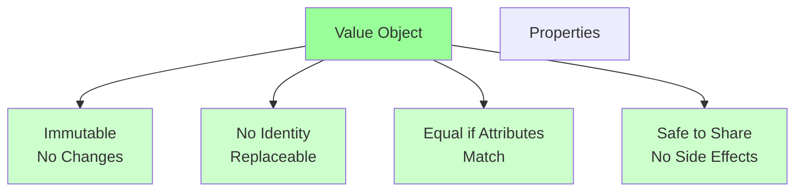

<Hero title="Value Objects" subtitle="Immutable objects without identity, equal by their attributes" imageAlt="illustration" size="large" />

## TL;DR

Value Objects are immutable objects without identity. Two value objects are equal if their attributes match. They're replaceable and safe to share. Use value objects for measurements, attributes, and concepts that don't require persistence or tracking. Money, Address, PhoneNumber are classic examples.

## Learning Objectives

- Distinguish value objects from entities
- Design immutable, side-effect-free objects
- Implement equality based on attributes
- Recognize when to use value objects
- Leverage value objects for cleaner, safer code

## Motivating Scenario

In an e-commerce system, Money is not an entity. You don't track a specific $10 bill; you just care that you have $10. Two Money objects with value 10 USD are equivalent—it doesn't matter which one you use.

Similarly, Address is not an entity. You don't track "apartment 123"; you track "123 Main St, Anytown, US". If a customer's address changes from one address object to another, you just replace the whole object.

## Core Concepts

### Immutability
Value objects never change. To change a value, you create a new object.

```python
# Instead of:
money.value = 20  # Don't do this

# Do this:
money = Money(20, "USD")  # Create new value object
```

### Equality by Attributes
Two value objects are equal if all their attributes are equal.

```python
money1 = Money(10, "USD")
money2 = Money(10, "USD")
money1 == money2  # True: same attributes
```

### No Identity
Value objects don't have unique IDs. They're replaceable.

### Operations Return New Objects

```python
class Money:
    def add(self, other: 'Money') -> 'Money':
        """Return new Money object, don't mutate."""
        return Money(self.amount + other.amount, self.currency)
```

<Figure caption="Value object characteristics">

</Figure>

## Practical Example

**Money Value Object**

```python
from decimal import Decimal

class Money:
    """Value object representing currency amount."""

    def __init__(self, amount: Decimal, currency: str):
        if amount < 0:
            raise ValueError("Amount cannot be negative")
        self.amount = amount
        self.currency = currency

    def add(self, other: 'Money') -> 'Money':
        """Return new Money object."""
        if self.currency != other.currency:
            raise ValueError("Cannot add different currencies")
        return Money(self.amount + other.amount, self.currency)

    def multiply(self, multiplier: float) -> 'Money':
        """Return new Money object."""
        return Money(self.amount * Decimal(multiplier), self.currency)

    def __eq__(self, other):
        """Equal if amount and currency match."""
        if not isinstance(other, Money):
            return False
        return self.amount == other.amount and self.currency == other.currency

    def __hash__(self):
        """Hashable for use in sets/dicts."""
        return hash((self.amount, self.currency))

    def __repr__(self):
        return f"Money({self.amount}, '{self.currency}')"

# Usage
price = Money(Decimal("9.99"), "USD")
tax = price.multiply(0.1)
total = price.add(tax)
# price, tax, total are all different immutable objects
```

**Address Value Object**

```python
class Address:
    """Value object representing a physical address."""

    def __init__(self, street: str, city: str, state: str, zip_code: str):
        self.street = street
        self.city = city
        self.state = state
        self.zip_code = zip_code

    def __eq__(self, other):
        if not isinstance(other, Address):
            return False
        return (self.street == other.street and
                self.city == other.city and
                self.state == other.state and
                self.zip_code == other.zip_code)

    def __hash__(self):
        return hash((self.street, self.city, self.state, self.zip_code))
```

## When to Use / When Not to Use

<Vs highlight={[0,1,0,0]} items={[
{
    label: "Use Value Objects When:",
    points: [
      "Object has no unique identity",
      "Immutability is sufficient",
      "Equality is based on attributes",
      "Need to express measurements or descriptions",
      "Want to prevent invalid states"
    ],
    highlightTone: "positive"
  },
{
    label: "Use Entities Instead When:",
    points: [
      "Object needs unique, persistent identity",
      "State must change over time",
      "Need to track the object through changes",
      "Object has a lifecycle"
    ],
    highlightTone: "positive"
  }
]} />

## Patterns and Pitfalls

<Showcase title="Patterns and Pitfalls" sections={[
  {
    label: "Pitfall: Mutable Value Objects",
    body: "Creating setters on value objects. Breaks immutability. Never allow mutation. All operations return new objects."
  },
  {
    label: "Pitfall: Value Objects Too Large",
    body: "Value object becomes complex with many attributes. Keep value objects focused and simple. Nest smaller value objects if needed."
  },
  {
    label: "Pitfall: Equality by Identity",
    body: "Comparing value objects with == returns false even with same attributes. Implement __eq__ based on attributes. Implement __hash__ for dict/set use."
  },
  {
    label: "Pattern: Nested Value Objects",
    body: "Value object contains other value objects. Compose value objects. Address contains City, State, etc."
  },
  {
    label: "Pattern: Domain-Centric Operations",
    body: "Value object methods express domain logic (Money.isLessThan, Address.inState). Use domain language in methods, not just getters."
  }
]} />

## Design Review Checklist

<Checklist items={[
  "Is the value object immutable?",
  "Are all operations returning new objects, not mutating?",
  "Is equality based on attributes?",
  "Are invalid states prevented (in constructor)?",
  "Is __hash__ implemented (if used in dicts/sets)?",
  "Does the value object express domain concepts?",
  "Are value objects used instead of primitives?",
  "Can value objects be safely shared?",
  "Are value object methods domain-centric?",
  "Is the value object focused and not too large?"
]} />

## Advanced Topics

### Value Object Composition

Large value objects should be decomposed into smaller, focused value objects:

```python
# Bad: One large value object with many unrelated fields
class Person:
    def __init__(self, name, street, city, state, zip, phone, email):
        self.name = name
        self.street = street
        self.city = city
        self.state = state
        self.zip = zip
        self.phone = phone
        self.email = email

# Good: Composed value objects with single responsibilities
class Address:
    def __init__(self, street: str, city: str, state: str, zip_code: str):
        self.street = street
        self.city = city
        self.state = state
        self.zip_code = zip_code

class Contact:
    def __init__(self, phone: str, email: str):
        self.phone = phone
        self.email = email

class Person:
    def __init__(self, name: str, address: Address, contact: Contact):
        self.name = name
        self.address = address
        self.contact = contact
```

### Value Objects in Collections

Value objects can be safely used in sets and dictionaries because they implement `__hash__` and `__eq__`:

```python
# Price comparison
prices = {Money(10, "USD"), Money(10, "USD"), Money(15, "USD")}
print(len(prices))  # 2: duplicates removed because Money objects are equal

# Building a price history
price_map = {
    "2025-01-01": Money(100, "USD"),
    "2025-01-02": Money(105, "USD"),
}
```

### Common Value Object Examples

Beyond Money and Address, real-world applications use:

**Email**: Validates email format, provides equality by address
**PhoneNumber**: Normalizes formats, provides international dialing
**Percentage**: Enforces 0-100 range, prevents invalid values
**Coordinates**: Latitude/longitude with validation
**Color**: RGB/Hex with conversion methods
**TimeRange**: Start and end time with invariants (start before end)
**Measurement**: Value with unit (5kg, 10 miles)

```python
class Email:
    """Value object for email addresses."""
    def __init__(self, address: str):
        if "@" not in address or "." not in address.split("@")[1]:
            raise ValueError(f"Invalid email: {address}")
        self.address = address.lower()  # Normalize

    def __eq__(self, other):
        return isinstance(other, Email) and self.address == other.address

    def __hash__(self):
        return hash(self.address)

    def __str__(self):
        return self.address

# Usage
email1 = Email("user@example.com")
email2 = Email("USER@EXAMPLE.COM")
print(email1 == email2)  # True: case-insensitive equality
```

### Performance Considerations

Value objects are typically small and allocated on the stack, but in systems with millions of them, memory usage can matter:

```python
# Flyweight pattern: share immutable value objects
# Instead of creating new Money(10, "USD") repeatedly
class MoneyFactory:
    _cache = {}

    @staticmethod
    def create(amount: Decimal, currency: str) -> Money:
        key = (amount, currency)
        if key not in MoneyFactory._cache:
            MoneyFactory._cache[key] = Money(amount, currency)
        return MoneyFactory._cache[key]

# Now Money instances are shared (still safe because immutable)
price1 = MoneyFactory.create(Decimal("10"), "USD")
price2 = MoneyFactory.create(Decimal("10"), "USD")
print(price1 is price2)  # True: same object
```

## Real-World Case Study: E-Commerce System

In a typical e-commerce system, value objects enable clean modeling:

```python
class Price(Money):
    """Price is a Money with currency validation for catalog."""
    pass

class Tax(Money):
    """Tax calculation as immutable value object."""
    pass

class Discount(Money):
    """Discount representation."""
    def apply_to(self, price: Price) -> Price:
        """Apply discount and return new price."""
        if self.amount > price.amount:
            raise ValueError("Discount exceeds price")
        return Price(price.amount - self.amount, price.currency)

class LineItem:
    """Entity representing one item in an order."""
    def __init__(self, product_id: str, quantity: int, price: Price):
        self.product_id = product_id
        self.quantity = quantity
        self.price = price

    def subtotal(self) -> Price:
        """Return line subtotal."""
        return Price(self.price.amount * self.quantity, self.price.currency)

class Order:
    """Aggregate root managing line items and totals."""
    def __init__(self, order_id: str):
        self.order_id = order_id
        self.line_items = []
        self.status = "pending"

    def add_item(self, item: LineItem):
        """Add item and recalculate total."""
        self.line_items.append(item)

    def apply_discount(self, discount: Discount):
        """Apply discount to order total."""
        current_total = self.total()
        self.discount = discount

    def total(self) -> Price:
        """Calculate order total from line items."""
        total_amount = sum(
            (item.subtotal().amount for item in self.line_items),
            Decimal("0")
        )
        return Price(total_amount, "USD")
```

## Self-Check

1. **When should you use Money instead of float?** Always. Floats lose precision; Money is explicit about currency and avoids floating-point math errors.

2. **Can you pass a value object to another context?** Yes, safely. Value objects have no identity or side effects. They're safe to share.

3. **What if you need to change a value object's attribute?** You don't. You create a new value object with the new attribute. Replace the old with the new.

4. **Why compose value objects instead of making one large one?** Smaller, focused value objects are easier to understand, test, and reuse. Composition follows the Single Responsibility Principle.

5. **When would you use flyweight pattern with value objects?** When creating millions of identical value objects (e.g., common Money instances). Since they're immutable, sharing is always safe.

:::info
**One Takeaway**: Value Objects are the building blocks of clean, safe domain models. Use them liberally for measurements, attributes, and domain concepts. Immutability and equality by attributes make them safe and easy to reason about. Compose them for clarity and reusability.

:::

## Next Steps

- **Aggregates**: Understand how entities and value objects cluster
- **Entities**: Learn about mutable, identity-bearing objects
- **Repositories**: Persist entities containing value objects
- **Immutability Patterns**: Advanced patterns for value object composition

## References

- Evans, E. (2003). *Domain-Driven Design*. Addison-Wesley.
- Vernon, V. (2013). *Implementing Domain-Driven Design*. Addison-Wesley.
