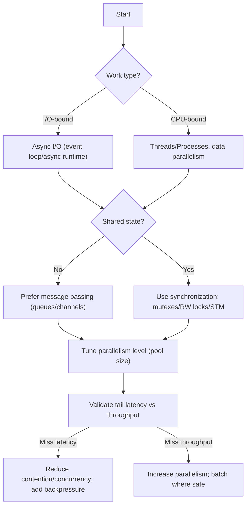
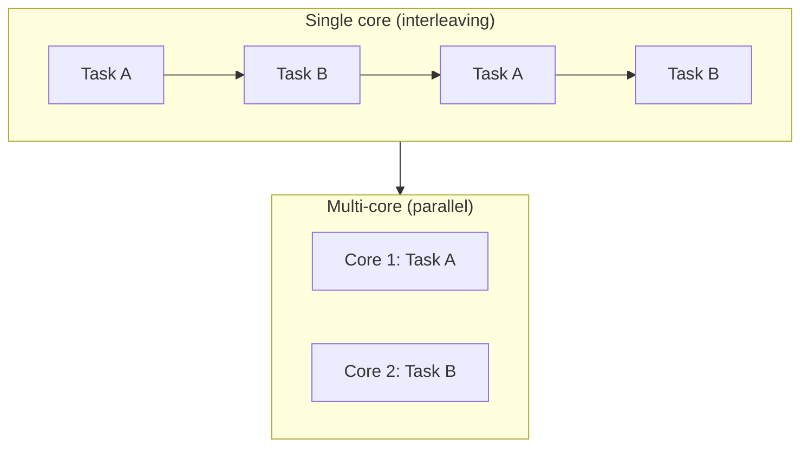
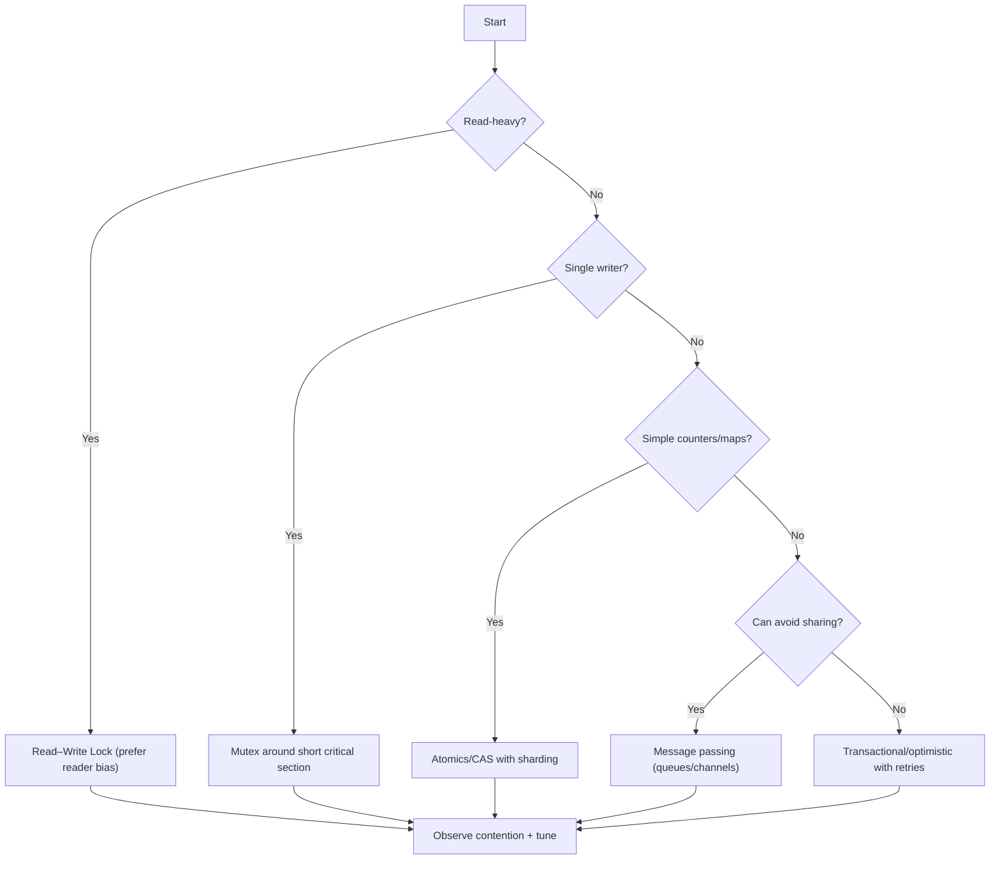
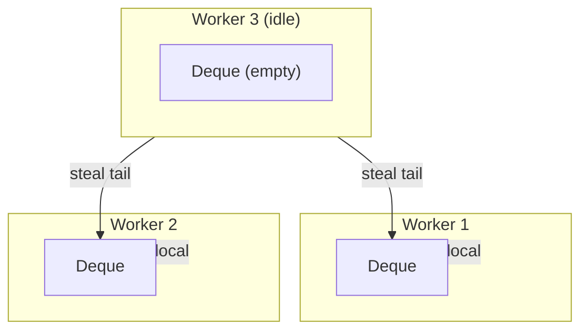
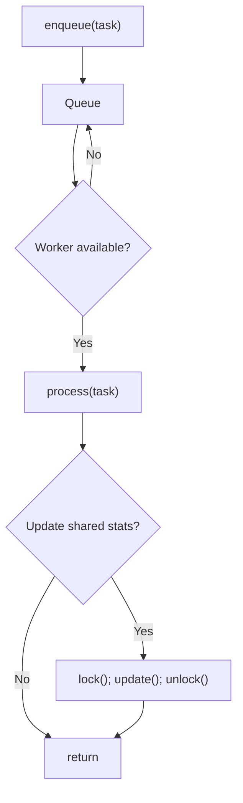
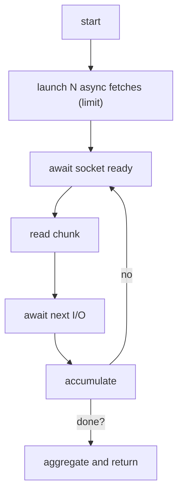
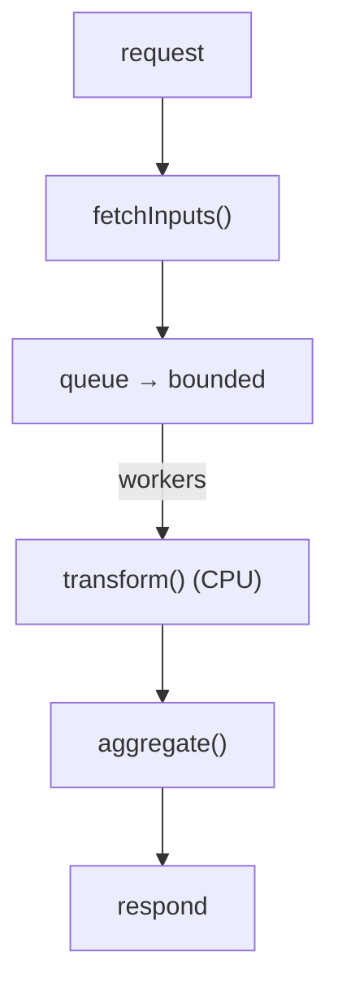

# Concurrency, Parallelism, Synchronization

import Figure from "@site/src/components/Figure";
import Checklist from "@site/src/components/Checklist";
import Vs from "@site/src/components/Vs";
import Tabs from '@theme/Tabs'
import TabItem from '@theme/TabItem'

Concurrency, parallelism, and synchronization are foundational to building responsive, scalable, and correct systems. Concurrency is about dealing with many things at once (conceptual overlap in time); parallelism is about doing many things at once (simultaneous execution on multiple cores/nodes). Synchronization coordinates access to shared resources so concurrent work remains correct.

This article clarifies the terms, shows how they interact with latency/throughput, and gives practical guidance for choosing models, primitives, and patterns.

## Mental model (decision flow)

<Figure caption="Decision flow: choose concurrency model, evaluate parallelism, and select synchronization approach.">



</Figure>

## Definitions and relationships

- **Concurrency**: Structuring a program as independently progressing tasks. Tasks may interleave on one or more execution units.
- **Parallelism**: Executing multiple tasks literally at the same time (e.g., multi-core CPU, multi-node cluster). Parallelism is a subset of concurrency.
- **Synchronization**: Techniques to preserve correctness under concurrency (locks, semaphores, atomics, transactions, barriers, optimistic concurrency control).
- **Shared-nothing vs. shared-state**: Shared-nothing favors message passing ([Producer–Consumer](../../design-patterns/concurrency-patterns/producer-consumer)) and minimizes locks. Shared-state needs careful synchronization (e.g., mutexes, read–write locks).

Related performance concepts: see [Latency, Throughput, Bandwidth](./latency-throughput-bandwidth).

## Why concurrency ≠ parallelism

You rarely choose between them—you compose them. Concurrency structures many in‑flight tasks to improve responsiveness and resource utilization (often on a single core via interleaving). Parallelism exploits multiple execution units (cores/CPUs/nodes) to shorten wall‑clock time for compute. Real systems typically need both: concurrency at the edges (I/O) and parallelism in compute‑heavy stages.

Key differences at a glance:

<Vs
  title="Concurrency vs Parallelism"
  items={[
    {
      label: 'Concurrency',
      points: [
        'Goal: Responsiveness and composition of independent tasks',
        'Unit: Tasks/coroutines/goroutines/fibers scheduled cooperatively or preemptively',
        'Hardware: Works on one core (interleaving) or many',
        'Fit: I/O-bound workloads, multiplexing connections, UI responsiveness',
        'Hazards: Races via shared state, deadlocks, priority inversion',
        'Metrics: Queue depth, in-flight tasks, P95/P99 latency',
      ],
    },
    {
      label: 'Parallelism',
      points: [
        'Goal: Throughput and wall-clock speedup',
        'Unit: Threads/processes/actors across cores or machines',
        'Hardware: Requires multiple execution units',
        'Fit: CPU-bound workloads (compute, transforms, batch analytics)',
        'Hazards: Contention, false sharing, NUMA effects; bounded by Amdahl/Gustafson',
        'Metrics: Speedup vs baseline, CPU utilization, scalability curve',
      ],
    },
  ]}
  highlight={0}
  highlightTone="info"
/>

<Figure caption="Conceptual view: concurrency interleaves on one core; parallelism runs simultaneously across cores (vertical).">



</Figure>

Implications:

- Concurrency improves utilization of a single core during I/O waits; it does not guarantee speedup of CPU-heavy tasks.
- Parallelism can reduce wall-clock time for CPU-bound work but may worsen tail latency without backpressure and correct synchronization.
- Correctness is separate: both require safe coordination when sharing state. Prefer shared‑nothing/message passing to reduce synchronization.

### Quick glossary (memory and execution)

- **Critical section**: Region that must not execute concurrently across threads.
- **Happens-before**: Ordering guarantee ensuring visibility of writes before reads.
- **Preemptive vs cooperative scheduling**: Timer-driven time-slicing vs explicit yields/awaits.
- **Blocking vs non-blocking**: Operations that park a thread vs operations that return immediately and complete via readiness events.
- **Backpressure**: Mechanism to slow producers when consumers lag (queue bounds, tokens, credits).

### Formal distinctions

- Concurrency is about composition: structuring a system as many independently progressing tasks. It is a property of the program and its design.
- Parallelism is about execution: leveraging multiple hardware execution units to run tasks at the same time. It is a property of the runtime/hardware during execution.
- You can design a highly concurrent program that cannot run in parallel (e.g., single-core device), and you can run parallel code with little concurrency (e.g., SIMD loops with one stream of work).

### Scheduling and execution models

- Single core with preemptive scheduling: the OS time-slices threads; tasks interleave. High concurrency is possible with zero parallelism.
- Cooperative scheduling/event loops: tasks yield at await points; the scheduler interleaves ready tasks. Ideal for I/O-bound work.
- Multi-core/multi-CPU: threads/processes map to cores; run truly in parallel when runnable. Requires careful placement and affinity for cache/NUMA locality.

### Workload taxonomy and fit

- I/O-bound latency-sensitive services: maximize concurrency with async I/O; parallelism adds little without CPU pressure.
- CPU-bound data transforms/analytics: maximize parallelism (data partitioning, vectorization). Concurrency alone will not reduce total time.
- Mixed workloads (API + compute): use pipelines. Concurrency at the edges (I/O), parallelism in compute stages; bound queues to protect tail latency.

### Illusions and pitfalls

- “More threads = faster”: false under contention or I/O wait; context switching and cache thrash increase latency and may reduce throughput.
- “Async is faster”: async increases concurrency and responsiveness, but total CPU work is unchanged; CPU-heavy tasks need parallelism to speed up.
- “Parallel implies correct”: parallelism magnifies race conditions; correctness still requires explicit synchronization and ownership.

### Correctness vs performance

- Correctness concerns (races, deadlocks, invariants) are orthogonal to performance. Design for safety first (clear ownership, isolation), then optimize for throughput and latency.
- Favor designs that reduce or eliminate shared mutable state to lower synchronization cost in both concurrent and parallel execution.

### Measurement: different primary signals

- Concurrency effectiveness: in-flight tasks, queue depth, time spent waiting vs running, event loop lag, success latency percentiles (P95/P99).
- Parallelism effectiveness: speedup vs baseline, CPU utilization per core, run-queue length per core, scalability curve as workers increase.

### Quick decision aids

| Goal | Choose first | Validate with |
| --- | --- | --- |
| Improve responsiveness for many I/O-bound requests | Concurrency (async I/O, bounded concurrency) | Lower P95 latency at same load; event loop lag |
| Reduce wall-clock time of CPU-heavy job | Parallelism (data/task parallel) | Speedup vs 1-core baseline; linearity until bandwidth/NUMA limits |
| Handle bursty traffic without overload | Concurrency + backpressure | Stable queue depth, no retry storms, no saturation |

### Mini case studies

- Web API handling 10k keep-alive connections: single-threaded event loop with async I/O can maintain low-latency handling of many sockets on one core (high concurrency, zero parallelism). Adding cores allows horizontal parallelism by running multiple event loops behind a load balancer.
- Image processing pipeline: splitting a 4k image set into per-core shards yields near-linear speedup until storage bandwidth saturates (high parallelism). Adding more concurrency without more cores does not reduce total completion time.

## Practical considerations

- Prefer immutable data and narrow ownership to reduce synchronization needs.
- For I/O-bound services, use async runtimes (non-blocking I/O) to increase concurrency without tying up threads.
- For CPU-bound workloads, use parallelism (threads/processes) and partition the data to minimize contention.
- Introduce backpressure when producers outpace consumers to protect tail latency and error rates.
- Make retries idempotent and jittered; pair client/server timeouts with remaining budgets. See: [Timeouts & Retries](../../distributed-systems-and-microservices/resilience-and-reliability-patterns/timeouts-retries-exponential-backoff-jitter) and [Idempotency](../../distributed-systems-and-microservices/fundamentals/idempotency).

## Concurrency models (deeper dive)

- **Shared-state with locks**: Threads share memory; coordinate with mutexes/RW locks/atomics. Pros: low copy overhead; Cons: contention, deadlocks, false sharing.
- **Message passing (actors/channels)**: Tasks do not share memory; communicate via messages. Pros: fewer data races, isolation; Cons: serialization/copy costs, backpressure needed. See: [Actor Model](../../foundational-concepts/programming-paradigms/actor-model).
- **Data parallelism**: Partition data across workers (map/reduce); minimize cross-partition communication; great for CPU-bound workloads.
- **Pipelines (producer→filters→consumer)**: Break into stages; use bounded queues; apply [backpressure & load shedding](../../distributed-systems-and-microservices/resilience-and-reliability-patterns/load-shedding-backpressure) to protect latency.

<Vs
  title="Shared-state vs Message-Passing"
  items={[
    {
      label: 'Shared-state',
      points: [
        'Low overhead for small objects; direct memory access',
        'Complex synchronization (locks, atomics, memory model)',
        'Risk: deadlocks, priority inversion, cache contention',
        'Best when partitions are coarse and contention is rare',
      ],
    },
    {
      label: 'Message-passing',
      points: [
        'Isolation by default; fewer data races',
        'Requires backpressure; messages may be copied/serialized',
        'Natural fit for distributed systems and actor runtimes',
        'Best when boundaries match ownership of state',
      ],
    },
  ]}
  highlight={1}
  highlightTone="positive"
/>

## Synchronization primitives and memory model

- **Mutex/Read–Write Lock**: Protect critical sections; RW locks optimize read-heavy paths but can starve writers.
- **Atomics/CAS**: Lock-free updates to simple values; avoid for complex invariants.
- **Barriers/Condition Variables**: Coordinate phases or waiting for conditions.
- **STM/Transactions**: Software transactional memory; optimistic updates with retries.
- **Fences/Memory Ordering**: On weakly ordered architectures, understand acquire/release semantics to avoid subtle races.

Guidelines:

- Keep critical sections short; prefer per-shard locks; avoid nested locks; document lock ordering.
- Use immutable snapshots for readers; apply copy-on-write for hot structures where feasible.
- Profile contention (lock hold time, queue lengths); consider [bulkheads and circuit breakers](../../distributed-systems-and-microservices/resilience-and-reliability-patterns/circuit-breaker) at service boundaries.

### Decision flow: choose a sync primitive

<Figure caption="Decision flow: pick synchronization based on workload characteristics.">



</Figure>

### Memory model essentials (practical)

- Prefer high-level constructs that imply ordering (channels/queues, async/await, futures). They embed safe publication.
- When using atomics, start with acquire on loads and release on stores for publishing a ready flag.
- Avoid data races: a write and a read of the same location without synchronization is undefined in many languages.
- Publication patterns: initialize fully, then publish reference once; never publish a partially constructed object.
- Beware compiler and CPU reordering; rely on language-provided fences/atomics rather than ad-hoc volatile-only tricks.

## Contention, speedup, and limits

- **Amdahl’s Law**: Speedup is limited by the serial fraction; optimize the bottleneck first.
- **Gustafson’s Law**: With larger problem sizes, parallelism can scale linearly; watch memory bandwidth and NUMA.
- **False sharing**: Independent counters on the same cache line thrash; pad to cache line size.
- **NUMA effects**: Prefer data locality; pin threads or partition data per socket where applicable.

Decision matrix (expanded):

| Workload | Recommended model | Sync strategy | Trade‑offs |
| --- | --- | --- | --- |
| I/O-bound APIs | Async I/O + bounded concurrency | Shared-nothing; idempotent retries | Needs careful backpressure; head-of-line blocking risk |
| CPU-bound batch | Data parallel worker pool | Shard data; avoid shared counters (reduce) | Memory bandwidth/NUMA limits; aggregation cost |
| Mixed (CPU + I/O) | Pipeline with queues | Backpressure; per-stage tuning | More components; end‑to‑end tracing needed |
| Shared cache updates | Threads + per-shard locks | Short critical sections; CAS for counters | Contention risk; requires profiling |
| High-contention shared maps | Sharding + striped locks | Reduce lock scope; avoid global maps | Complexity; potential skew |
| Real-time stream consumers | Actor/message-passing | Mailbox backpressure; idempotent handlers | Serialization overhead; ordering concerns |
| Batch transforms with aggregation | Map-reduce (data parallel) | Local aggregation; reduce pass | Shuffle cost; skew hotspots |

### Progress guarantees (lock-free, wait-free, obstruction-free)

- **Blocking**: Progress depends on others releasing locks. Susceptible to deadlocks and priority inversion.
- **Obstruction-free**: A thread makes progress if it runs in isolation. Simple but weak guarantee under contention.
- **Lock-free**: System-wide progress is guaranteed (some thread completes in a finite number of steps), typically via atomics/CAS and retry loops.
- **Wait-free**: Each thread completes its operation in a bounded number of steps regardless of other threads. Strongest guarantee; often higher complexity and memory overhead.

Guidance:

- Prefer blocking primitives (mutex/RW lock) for coarse, rarely contended critical sections; keep them short and well-ordered.
- Use lock-free for hot-path counters/queues where contention is likely and operations are simple; validate with stress tests and race detectors.
- True wait-free structures are rare in application code; use vetted libraries when hard bounds are required.

### Scheduling, fairness, and work stealing

- **Preemptive vs cooperative**: OS preempts threads via timers; event loops rely on tasks to `await`/yield. Long CPU work in cooperative schedulers blocks others—offload to worker pools.
- **Fairness**: Prevent starvation by bounding queue growth per source and using aging/priority adjustments.
- **Work stealing**: Each worker owns a deque; idle workers steal from others’ tails to balance load and cache locality.
- **Priority inversion**: A low-priority thread holding a lock blocks a high-priority one. Mitigate with priority inheritance or by avoiding long critical sections.

<Figure caption="Work-stealing: workers process local deques; idle workers steal from others (vertical).">



</Figure>

### Queue architectures and worker topologies

| Pattern | Concurrency topology | Properties | Use when |
| --- | --- | --- | --- |
| SPSC (Single Producer, Single Consumer) | 1 → 1 | Simple, cache-friendly; can be lock-free | Staged pipelines between two threads |
| MPSC (Multi Producer, Single Consumer) | N → 1 | Producers contend on enqueue; single consumer simplifies ordering | Event loops, actor mailboxes |
| SPMC (Single Producer, Multi Consumer) | 1 → N | Single source fans out; consumers may contend on dequeue | Work distribution from a feeder |
| MPMC (Multi Producer, Multi Consumer) | N ↔ N | Highest contention; prefer sharding/striping | General-purpose pools; shard by key to reduce contention |

Implementation tips:

- Bound queues; apply backpressure or shedding when full.
- Prefer sharded MPSC over a single hot MPMC where ordering by key is acceptable.
- For per-key ordering, hash by key into independent queues/locks (striped locks).

### Transactions, isolation, and concurrency control (brief)

- **Isolation levels**: Read Committed, Repeatable Read, Snapshot Isolation, Serializable. Higher isolation reduces anomalies but often lowers throughput via locks/validation.
- **2PL (Two-Phase Locking)**: Acquire then release locks—can serialize writes but risks deadlocks; keep transactions short.
- **OCC (Optimistic Concurrency Control)**: Read/compute without locks; validate version on write; retry on conflict. Great when conflicts are rare.
- **Sagas**: Long-lived, multi-step workflows with per-step compensations in lieu of distributed ACID transactions. See: [Transaction Boundaries & Sagas](../../distributed-systems-and-microservices/data-in-microservices/transaction-boundaries-and-sagas) and [Idempotency](../../distributed-systems-and-microservices/fundamentals/idempotency).

### Hardware considerations (NUMA, SIMD, GPU)

- **NUMA**: Keep data local to the socket; prefer per-socket pools; avoid cross-socket sharing in hot paths.
- **False sharing**: Pad frequently updated counters/maps to cache-line size to avoid thrash.
- **SIMD/vectorization**: Batch homogeneous operations; many libraries auto-vectorize; keep data contiguous.
- **GPU offload**: Throughput win for massively parallel kernels; watch PCIe transfer overhead and batching latency.

### Language/runtime primitives (quick map)

- **Python**: `asyncio` for I/O concurrency; `threading` for mixed I/O with GIL constraints; `multiprocessing/ProcessPoolExecutor` for CPU-bound parallelism.
- **Go**: Goroutines + channels (CSP); scheduler uses work stealing; cap with semaphores or buffered channels; `GOMAXPROCS` controls parallelism.
- **Node.js**: Single-threaded event loop for I/O concurrency; `worker_threads` for CPU-bound tasks; `cluster` to run multiple processes behind a balancer.

### Tooling and diagnostics

- Race detectors: Go `-race`, C/C++ TSAN. Use them in CI for concurrency-heavy code.
- Profiling: CPU profiles and flame graphs to spot contention; lock profiling (hold time, waiters) to locate bottlenecks.
- Tracing: Correlate enqueue/dequeue, lock acquire/release, and critical section timing; propagate context across threads/processes.

## Distributed synchronization (deeper)

- **Leases/locks** via leaders (e.g., etcd/ZooKeeper); tolerate clock skew; renew before expiry.
- **Idempotent, commutative updates** over eventual consistency; design for retries and reordering.
- **Consensus** (Raft/Paxos) for configuration and critical state; keep the critical section small.

Additional practices:

- **Fencing tokens**: Monotonic tokens attached to each lease; storage systems reject stale tokens to prevent split-brain writes.
- **Leader changes**: Make operations idempotent and retry-safe across leader failover; include a small critical section and externalize long work.
- **Quorums**: Use majority quorum writes/reads for stronger guarantees when latency budgets allow; prefer monotonic reads for configuration.
- **Clock considerations**: Prefer monotonic clocks for timeouts; avoid relying on wall-clock for ordering; budget for skew.

See related: [Bulkhead isolation](../../distributed-systems-and-microservices/resilience-and-reliability-patterns/bulkhead-isolation) and [Graceful degradation & load shedding](../../reliability-resilience-and-performance-engineering/reliability-patterns/graceful-degradation-load-shedding).

## Example: concurrent workers with synchronization (multi-language)

<Figure caption="Call flow: tasks enqueued, workers process with bounded concurrency; synchronization guards shared counter.">



</Figure>

<Tabs groupId="lang" queryString>
  <TabItem value="python" label="Python">

```python title="workers.py" showLineNumbers
import concurrent.futures
import queue
import threading

task_queue = queue.Queue(maxsize=100)
processed = 0
processed_lock = threading.Lock()


def process_task(task: int) -> int:
    return task * task


def worker() -> None:
    global processed
    while True:
        task = task_queue.get()
        if task is None:
            break
        result = process_task(task)
        with processed_lock:
            processed += 1
        task_queue.task_done()


def run(pool_size: int = 4) -> None:
    threads = [threading.Thread(target=worker, daemon=True) for _ in range(pool_size)]
    for t in threads:
        t.start()
    for i in range(50):
        task_queue.put(i)
    task_queue.join()
    for _ in threads:
        task_queue.put(None)
    for t in threads:
        t.join()
```

  </TabItem>
  <TabItem value="go" label="Go">

```go title="workers.go" showLineNumbers
package workers

import (
    "sync"
)

type Task int

func processTask(t Task) int { return int(t) * int(t) }

func Run(poolSize int) {
    tasks := make(chan Task, 100)
    var processed int
    var mu sync.Mutex
    var wg sync.WaitGroup

    worker := func() {
        defer wg.Done()
        for t := range tasks {
            _ = processTask(t)
            mu.Lock(); processed++; mu.Unlock()
        }
    }

    for i := 0; i < poolSize; i++ {
        wg.Add(1)
        go worker()
    }

    for i := 0; i < 50; i++ { tasks <- Task(i) }
    close(tasks)
    wg.Wait()
}
```

  </TabItem>
  <TabItem value="node" label="Node.js">

```javascript title="workers.mjs" showLineNumbers
import { Worker, isMainThread, parentPort, workerData } from 'node:worker_threads'

if (!isMainThread) {
  const result = workerData * workerData
  parentPort.postMessage(result)
} else {
  const poolSize = 4
  const tasks = Array.from({ length: 50 }, (_, i) => i)
  const run = async () => {
    const running = []
    for (const t of tasks) {
      running.push(new Promise((resolve) => {
        const w = new Worker(new URL(import.meta.url), { workerData: t })
        w.on('message', () => resolve())
      }))
      if (running.length >= poolSize) {
        await Promise.race(running)
        for (let i = running.length - 1; i >= 0; i--) {
          if (await Promise.resolve(running[i]).then(() => true, () => false)) {
            running.splice(i, 1)
          }
        }
      }
    }
    await Promise.all(running)
  }
  run()
}
```

  </TabItem>
</Tabs>

## Example: async I/O concurrency (no parallelism)

Many real-world services are I/O-bound (network/disk). Concurrency via non-blocking I/O increases throughput and responsiveness even on a single core. Contrast this with CPU-bound parallelism above.

<Figure caption="Call flow: async client with bounded concurrency; scheduler interleaves I/O-bound tasks (single core).">



</Figure>

<Tabs groupId="lang" queryString>
  <TabItem value="python" label="Python">

```python title="async_fetch.py" showLineNumbers
import asyncio

async def fetch_one(session, url: str) -> bytes:
    async with session.get(url) as resp:
        return await resp.read()

async def fetch_all(urls: list[str], limit: int = 50) -> list[bytes]:
    import aiohttp
    sem = asyncio.Semaphore(limit)

    async def bounded(u: str):
        async with sem:
            async with aiohttp.ClientSession() as s:
                return await fetch_one(s, u)

    return await asyncio.gather(*(bounded(u) for u in urls))

if __name__ == "__main__":
    asyncio.run(fetch_all(["https://example.com"] * 200))
```

  </TabItem>
  <TabItem value="go" label="Go">

```go title="async_fetch.go" showLineNumbers
package main

import (
    "net/http"
    "runtime"
    "sync"
)

func main() {
    runtime.GOMAXPROCS(1) // emphasize concurrency without parallelism
    urls := make([]string, 0)
    for i := 0; i < 200; i++ { urls = append(urls, "https://example.com") }

    sem := make(chan struct{}, 50)
    var wg sync.WaitGroup

    for _, u := range urls {
        wg.Add(1)
        sem <- struct{}{}
        go func(url string) {
            defer wg.Done(); defer func(){ <-sem }()
            req, _ := http.NewRequest(http.MethodGet, url, nil)
            _, _ = http.DefaultClient.Do(req)
        }(u)
    }
    wg.Wait()
}
```

  </TabItem>
  <TabItem value="node" label="Node.js">

```javascript title="asyncFetch.js" showLineNumbers
import fetch from 'node-fetch'

export async function fetchAll(urls, limit = 50) {
    const results = []
    const pending = new Set()
    for (const u of urls) {
        const p = fetch(u).then(r => r.text()).finally(() => pending.delete(p))
        pending.add(p)
        if (pending.size >= limit) { await Promise.race(pending) }
        results.push(p)
    }
    return Promise.all(results)
}

// Single-threaded event loop; high concurrency via async I/O
fetchAll(Array(200).fill('https://example.com'))
```

  </TabItem>
</Tabs>

## Example: mixed I/O + CPU pipeline

Pipelines combine concurrency (I/O) and parallelism (CPU) for end-to-end efficiency.

<Figure caption="Call flow: request enters, I/O fetch stage, CPU transform stage in parallel workers, aggregate and return.">



</Figure>

<Tabs groupId="lang" queryString>
  <TabItem value="python" label="Python">

```python title="pipeline.py" showLineNumbers
import asyncio
from concurrent.futures import ProcessPoolExecutor

def transform(x: bytes) -> int:
    # Simulate CPU work
    s = 0
    for b in x:
        s += b
    return s

async def fetch_one(session, url: str) -> bytes:
    async with session.get(url) as r:
        return await r.read()

async def pipeline(urls: list[str], cpu_workers: int = 4) -> int:
    import aiohttp
    sem = asyncio.Semaphore(50)
    loop = asyncio.get_running_loop()
    total = 0
    with ProcessPoolExecutor(max_workers=cpu_workers) as pool:
        async with aiohttp.ClientSession() as s:
            async def one(u: str):
                async with sem:
                    data = await fetch_one(s, u)
                    return await loop.run_in_executor(pool, transform, data)
            results = await asyncio.gather(*(one(u) for u in urls))
            total = sum(results)
    return total

if __name__ == "__main__":
    asyncio.run(pipeline(["https://example.com"] * 200))
```

  </TabItem>
  <TabItem value="go" label="Go">

```go title="pipeline.go" showLineNumbers
package main

import (
    "io"
    "net/http"
    "runtime"
    "sync"
)

func transform(b []byte) int {
    sum := 0
    for _, x := range b { sum += int(x) }
    return sum
}

func main() {
    runtime.GOMAXPROCS(runtime.NumCPU())
    urls := make([]string, 0)
    for i := 0; i < 200; i++ { urls = append(urls, "https://example.com") }

    type job struct{ u string }
    jobs := make(chan job, 100)
    results := make(chan int, 100)
    var wg sync.WaitGroup

    worker := func() {
        defer wg.Done()
        for j := range jobs {
            resp, _ := http.Get(j.u)
            body, _ := io.ReadAll(resp.Body)
            _ = resp.Body.Close()
            results <- transform(body)
        }
    }

    // start workers
    for i := 0; i < runtime.NumCPU(); i++ { wg.Add(1); go worker() }

    go func(){
        for _, u := range urls { jobs <- job{u: u} }
        close(jobs)
    }()

    go func(){ wg.Wait(); close(results) }()

    total := 0
    for r := range results { total += r }
    _ = total
}
```

  </TabItem>
  <TabItem value="node" label="Node.js">

```javascript title="pipeline.mjs" showLineNumbers
import fetch from 'node-fetch'
import os from 'node:os'
import { Worker, isMainThread, parentPort, workerData } from 'node:worker_threads'

if (!isMainThread) {
  const buf = Buffer.from(workerData)
  let sum = 0
  for (const b of buf) sum += b
  parentPort.postMessage(sum)
} else {
  const urls = Array(200).fill('https://example.com')
  const poolSize = Math.max(1, os.cpus().length - 1)

  const transform = (data) => new Promise((resolve) => {
    const w = new Worker(new URL(import.meta.url), { workerData: data })
    w.on('message', resolve)
  })

  const run = async () => {
    const pending = new Set()
    const limit = 50
    let total = 0
    for (const u of urls) {
      const p = fetch(u).then(r => r.arrayBuffer()).then(buf => transform(Buffer.from(buf))).then(v => { total += v })
      pending.add(p)
      if (pending.size >= limit) { await Promise.race(pending) }
      pending.delete(p)
    }
    await Promise.all(pending)
    return total
  }
  run().then(() => {})
}
```

  </TabItem>
</Tabs>

## Patterns and pitfalls

- Match the model to the workload: async I/O for I/O-bound; thread/process pools for CPU-bound.
- Avoid unbounded concurrency: cap workers/pool size; apply backpressure when queues grow.
- Minimize shared mutable state; prefer sharding or message passing. When sharing is necessary, use appropriate primitives (mutex, RW lock, CAS/atomics).
- Beware lock contention, priority inversion, deadlocks, and starvation. Use timeouts and diagnostics.
- Ensure idempotency with retries; coordinate with timeouts and deadlines.

## Edge cases

- Long critical sections cause queueing and tail latency spikes—split or redesign.
- Partial failures in distributed workers require retries and poison-message handling (DLQs).
- Clock skew can break lease-based coordination—prefer monotonic clocks and tolerate drift; see related topics under reliability.

## Operational considerations

- Track per-stage latency, queue depth, concurrency, and error rates. See: [Metrics (golden signals)](../../observability-and-operations/metrics/golden-signals-latency-traffic-errors-saturation) and [Tracing](../../observability-and-operations/tracing/trace-context-propagation).
- Set SLOs for throughput and P95/P99 latency; plan capacity using demand models. See: [Latency budgets, SLAs, SLOs](../../quality-attributes/performance-and-scalability/latency-budgets-slas-slos).
- Use canary rollouts when changing pool sizes or async runtimes; validate under load.

```yaml title="slo.yaml" showLineNumbers
service: image-pipeline
objectives:
  - name: p95-latency
    target: 500ms
    window: 28d
  - name: throughput
    target: 200 rps
    window: 28d
```

## Security, privacy, and compliance

- Least privilege for worker identities; avoid embedding secrets in tasks.
- Ensure PII is not placed in logs/queues; mask or tokenize where needed.

## Observability (logs, metrics, traces)

- Emit structured logs with correlation IDs for tasks.
- Metrics: queue depth, worker concurrency, processing latency percentiles, lock contention counts.
- Traces: span around queue receive → process → ack; include retry metadata.

## Testing strategy

- Unit-test task handlers (pure where possible). Use fakes for queues.
- Inject faults: timeouts, transient errors, slow consumers; verify backpressure and idempotency.
- Measure determinism: ensure no data races; use race detectors/sanitizers where available.

## FAQ

- **Is async always better than threads?** No. Async excels at I/O-bound work with high concurrency. CPU-bound workloads need parallelism (threads/processes) for speedup.
- **When are RW locks preferable to mutexes?** When reads vastly outnumber writes and read critical sections are small. Beware writer starvation.
- **How do I pick pool size?** Start with number of cores for CPU-bound tasks; for I/O-bound, tune by observing tail latency and queue depth under load.
- **What if I must share state?** Minimize scope, shard by key, and keep critical sections short; prefer atomics for simple counters and use message passing when possible.

## When to use

- I/O-heavy services needing high concurrency with bounded resources.
- CPU-bound batch or stream processing that benefits from data parallelism.
- Systems where throughput targets require parallel workers with safe coordination.

## When not to use

- Strongly consistent, simple request/response flows where sequential processing meets SLOs.
- Highly shared, mutable state with complex invariants that would suffer from contention.

## Design review checklist

<Checklist
  title="Concurrency/Parallelism/Synchronization review"
  items={[
    "Workload characterized (I/O-bound vs CPU-bound) and model chosen accordingly",
    "Concurrency is bounded; backpressure and shedding defined",
    "Shared state minimized; synchronization primitives chosen deliberately",
    "Idempotency and retry policies defined with jitter and deadlines",
    "Metrics/Traces instrumented: queue depth, P95/P99 latency, errors, contention",
    "Operational limits and rollouts planned (canary, autoscaling triggers)",
  ]}
/>

## Related topics

- [Latency, Throughput, Bandwidth](./latency-throughput-bandwidth)
- [Producer–Consumer](../../design-patterns/concurrency-patterns/producer-consumer)
- [Thread Pool](../../design-patterns/concurrency-patterns/thread-pool)

## References

1. <a href="https://www.youtube.com/watch?v=oV9rvDllKEg" target="_blank" rel="nofollow noopener noreferrer">Rob Pike, Concurrency Is Not Parallelism (Go Concurrency Patterns) ↗️</a>
2. <a href="https://dl.acm.org/doi/10.1145/1465482.1465560" target="_blank" rel="nofollow noopener noreferrer">Gustafson, Reevaluating Amdahl's Law (CACM) ↗️</a>
3. <a href="https://queue.acm.org/detail.cfm?id=1814327" target="_blank" rel="nofollow noopener noreferrer">Dean & Barroso, The Tail at Scale (ACM Queue) ↗️</a>


