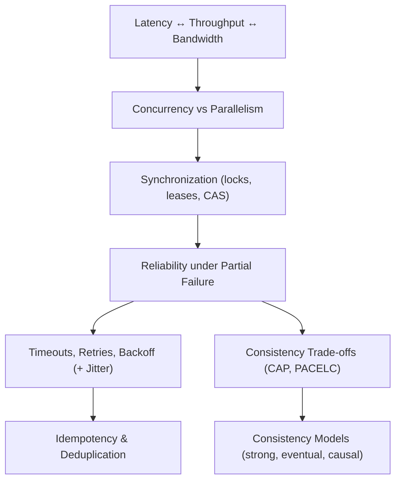

import DocCardList from "@theme/DocCardList";
import { useCurrentSidebarCategory } from "@docusaurus/theme-common";
import Figure from "@site/src/components/Figure";
import Head from "@docusaurus/Head";

<Head>
  <meta name="description" content="Overview of latency, throughput, concurrency, reliability, time, idempotency, and CAP/PACELC trade‑offs in distributed systems." />
  <meta property="og:title" content="Basic Distributed Systems Concepts" />
  <meta property="og:description" content="Overview of latency, throughput, concurrency, reliability, time, idempotency, and CAP/PACELC trade‑offs in distributed systems." />
  <meta property="og:image" content="https://archman.dev/img/archman-social-card.webp" />
  <meta name="twitter:card" content="summary_large_image" />
  <link rel="canonical" href="https://archman.dev/docs/foundational-concepts/basic-distributed-systems-concepts" />
  
  
</Head>

# Basic Distributed Systems Concepts

A concise overview of the foundational ideas you will reuse throughout the guide: latency vs throughput, concurrency and coordination, reliability under partial failures, time and clocks, idempotency, and the CAP/PACELC trade‑offs. Use this page as a mental map before diving into topic articles.

When you discuss latency budgets, queueing, or fan‑out, cross‑reference [Quality Attributes](../../quality-attributes). For coordination and connectors, pair this with [System Thinking Basics](../system-thinking-basics). For runtime hardening (timeouts, retries, jitter, circuit breakers), see [Reliability Patterns](../../reliability-resilience-and-performance-engineering/reliability-patterns/hedging-requests-timeouts-retries) and related topics in [Distributed Systems & Microservices](../../distributed-systems-and-microservices).

## What’s in scope

- Latency, throughput, and bandwidth basics with intuition for trade‑offs.
- Concurrency vs parallelism and why synchronization is required.
- Reliability under partial failure; how timeouts and backoffs shape behavior.
- Idempotency and at‑least‑once delivery realities.
- Big‑picture consistency trade‑offs (CAP, PACELC) and where to learn more.

## Mental model

<Figure caption="A vertical overview of core distributed systems concepts and how they relate.">

</Figure>

## How to use this section

- Start with the intuition for [Latency, Throughput, Bandwidth](./latency-throughput-bandwidth) and relate it to your performance budgets in [Quality Attributes](../../quality-attributes).
- Contrast [Concurrency, Parallelism, Synchronization](./concurrency-parallelism-synchronization) with your platform’s primitives (locks, semaphores, optimistic concurrency).
- Ground reliability discussions in concrete mechanisms: [timeouts, retries, backoff](../../distributed-systems-and-microservices/resilience-and-reliability-patterns/timeouts-retries-exponential-backoff-jitter). Assume at‑least‑once; design for [idempotency](../../specialized-domains-architecture-considerations/fintech-payments-idempotency-reconciliation) at boundaries.
- Use this page as a hub, then continue to deeper articles like [CAP & PACELC](../../distributed-systems-and-microservices/fundamentals/cap-and-pacelc) and [Consistency Models & Trade‑offs](../../distributed-systems-and-microservices/fundamentals/consistency-models-and-trade-offs).

## Common pitfalls

- Treating retries as harmless without idempotency or deduplication.
- Using tight timeouts everywhere; amplify cascading failures and thundering herds.
- Over‑synchronization that caps throughput; under‑synchronization that corrupts state.
- Mixing consistency assumptions across services without explicit contracts.

## Related topics

- [System Thinking Basics](../system-thinking-basics)
- [Quality Attributes](../../quality-attributes)
- [Reliability Patterns](../../reliability-resilience-and-performance-engineering/reliability-patterns/hedging-requests-timeouts-retries)
- [Distributed Systems & Microservices](../../distributed-systems-and-microservices)
- [Consistency Models & Trade‑offs](../../distributed-systems-and-microservices/fundamentals/consistency-models-and-trade-offs)

<DocCardList items={useCurrentSidebarCategory().items} />

## References

<!-- markdownlint-disable MD033 -->
1. <a href="https://www.allthingsdistributed.com/2008/12/eventually_consistent.html" target="_blank" rel="nofollow noopener noreferrer">Werner Vogels, Eventually Consistent ↗️</a>
2. <a href="https://www.bailis.org/blog/" target="_blank" rel="nofollow noopener noreferrer">Peter Bailis, Notes on Distributed Systems ↗️</a>
<!-- markdownlint-enable MD033 -->
