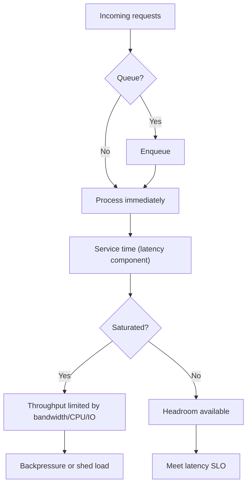
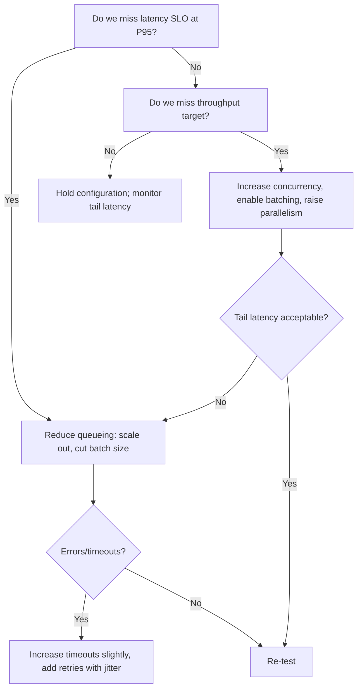
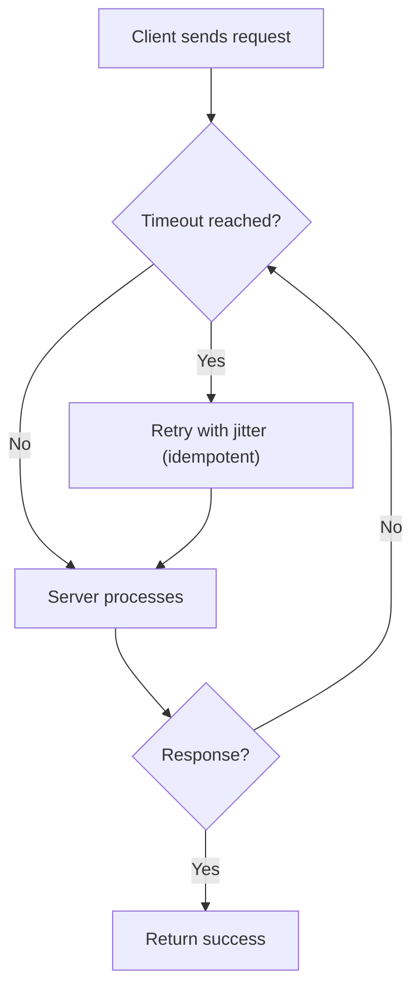
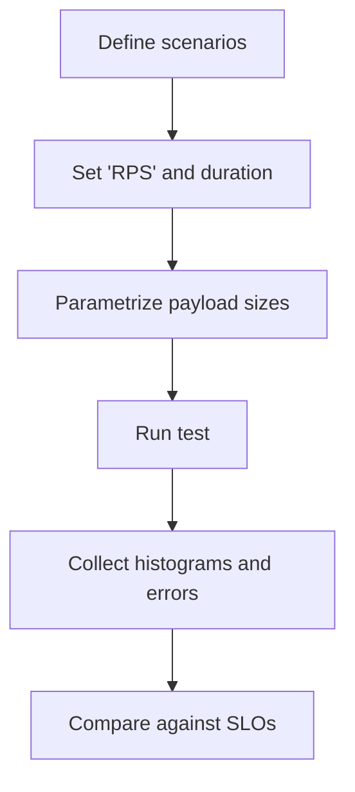

# Latency, Throughput, Bandwidth

import Figure from "@site/src/components/Figure";
import Checklist from "@site/src/components/Checklist";
import ProsCons from "@site/src/components/ProsCons";
import Tabs from '@theme/Tabs'
import TabItem from '@theme/TabItem'
import Head from '@docusaurus/Head'

<Head>
  <meta name="description" content="Clear definitions, interactions, and practical tuning to hit latency SLOs without sacrificing throughput." />
  <meta property="og:title" content="Latency, Throughput, Bandwidth" />
  <meta property="og:description" content="Clear definitions, interactions, and practical tuning to hit latency SLOs without sacrificing throughput." />
  <meta property="og:image" content="https://archman.dev/img/archman-social-card.webp" />
  <meta name="twitter:card" content="summary_large_image" />
  <link rel="canonical" href="https://archman.dev/docs/foundational-concepts/basic-distributed-systems-concepts/latency-throughput-bandwidth" />
  <script type="application/ld+json">{JSON.stringify({
    "@context": "https://schema.org",
    "@type": "Article",
    "headline": "Latency, Throughput, Bandwidth",
    "description": "Clear definitions, interactions, and practical tuning to hit latency SLOs without sacrificing throughput.",
    "image": "https://archman.dev/img/archman-social-card.webp",
    "keywords": [
      "latency","throughput","bandwidth","p95","p99","queueing","bdp","timeouts","retries","idempotency","slo","error budgets","backpressure","rate limiting","load shedding","prometheus","histograms"
    ],
    "author": {"@type":"Person","name":"Archman"},
    "dateModified": "2025-09-10"
  })}</script>
  <script type="application/ld+json">{JSON.stringify({
    "@context":"https://schema.org",
    "@type":"BreadcrumbList",
    "itemListElement":[
      {"@type":"ListItem","position":1,"name":"Foundational Concepts","item":"https://archman.dev/docs/foundational-concepts"},
      {"@type":"ListItem","position":2,"name":"Basic Distributed Systems Concepts","item":"https://archman.dev/docs/foundational-concepts/basic-distributed-systems-concepts"},
      {"@type":"ListItem","position":3,"name":"Latency, Throughput, Bandwidth","item":"https://archman.dev/docs/foundational-concepts/basic-distributed-systems-concepts/latency-throughput-bandwidth"}
    ]
  })}</script>
</Head>

Latency, throughput, and bandwidth are foundational performance concepts in distributed systems. This article clarifies definitions, shows how they interact, and provides practical guidance for designing, measuring, and operating systems with explicit performance targets. We go deeper into queueing effects, tail behavior, payload sizing, and practical measurement so you can set realistic SLOs and tune systems without trading one problem for another.

## TL;DR

Optimize for explicit P95/P99 latency and success SLOs. Batching and higher concurrency raise throughput but often worsen tail latency near saturation. Keep headroom, propagate deadlines, use bounded queues and backpressure, and validate with histogram-based metrics and load tests across realistic payload sizes.

## Learning objectives

- You will be able to define latency, throughput, and bandwidth with correct units and percentiles.
- You will be able to reason about queueing effects and tune concurrency/batching safely.
- You will be able to set and decompose latency budgets and propagate timeouts/retries.
- You will be able to measure tail latency correctly with histograms and traces.

## Motivating scenario

Your checkout API intermittently misses its P95=300 ms target during traffic bursts. A recent change batched writes to increase throughput, but tail latency spiked and error-budget burn alerts fired. You need a structured way to balance throughput gains against strict user-facing latency, with concrete signals, tactics, and safe rollback options.

A holistic approach links latency budgets to per-hop sub-budgets, limits concurrency, applies backpressure during peaks, and validates with load tests that sweep payload sizes. The goal is stable P95/P99 under realistic variability—not just a fast median.

## Executive summary

- **Latency**: Time to complete a single operation end-to-end (often measured as P50/P90/P95/P99).
- **Throughput**: Number of operations processed per unit time.
- **Bandwidth**: Maximum data transfer capacity of a link or component.
- **Key insight**: Improving one can degrade another (e.g., batching raises throughput but may increase latency). Always optimize against explicit [SLOs](../../quality-attributes/performance-and-scalability/latency-budgets-slas-slos).

## Hands-on exercise

Follow these steps to quantify the latency–throughput trade-off for your service:

1. Save the k6 script from the "Load testing example (k6)" section as `k6-script.js`.
2. Run a steady test at different payload sizes (1 KB, 64 KB) and constant arrival rates (e.g., 200–800 rps):

```bash title="run-k6.sh" showLineNumbers
k6 run k6-script.js
```

3. Record P50/P95/P99 latency and error rate; note queue depth and saturation on the service.
4. Tune batch size and concurrency limits; re-run until P95 meets the SLO with 10–20% headroom.

<Figure caption="Mental model: relating latency, throughput, and bandwidth (vertical)">



</Figure>

## Core definitions

- **Latency**: The elapsed time from request initiation to response completion. Track distribution percentiles (P50/P90/P95/P99), not just averages; medians and tails behave very differently.
- **Service time vs. waiting time**: Observed latency = queueing delay + service time. Queueing grows superlinearly as utilization approaches 1.0; small headroom prevents runaway tails.
- **Throughput**: Completed work per time unit (e.g., requests/second). In pipelines, overall throughput is bounded by the slowest stage under sustained load.
- **Bandwidth**: Data rate limit on a network/storage link (e.g., Mbps, GB/s). High bandwidth caps maximum throughput but does not guarantee low latency due to propagation and serialization delays.
- **Saturation**: Resource pressure (CPU, IOPS, NIC, locks) that triggers queueing and tail growth; watch saturation signals alongside latency.

## Why these three interact (intuition + queueing theory)

- When demand approaches capacity, even small bursts create queues; waiting time dominates service time and tail latency (P95/P99) spikes.
- Increasing concurrency raises throughput until you hit limits (CPU, IOPS, bandwidth). Past that, more concurrency adds context switching and queueing, hurting latency.
- Batching increases throughput by amortizing overhead (syscalls, TLS, serialization) but each batch waits to fill, increasing per‑request latency. Tune batch size and max wait.
- Network and storage links have finite bandwidth and non‑zero propagation/serialization delay. High bandwidth does not eliminate latency; it sets a ceiling for achievable throughput.

Approximate rule of thumb (Little’s Law): average in‑flight ≈ arrival_rate × average_latency. If you cap concurrency to C, your sustainable throughput ≈ C / P95_latency. For example, with C=200 and P95=100ms, sustainable throughput ≈ 200 / 0.1 = 2,000 rps (assuming steady-state and no burstiness).

Additional intuitions:
- Tail amplification: A single hot key or dependent call with high variance can dominate P99 even when P50 looks healthy; consider sharding and hedging for extreme tails.
- Work inflation: Retries, fan-out, and large payloads inflate effective work per request; model them when forecasting capacity.

## Latency budgets and error budgets (practical setup)

- Start with a user‑centric latency budget (e.g., “checkout ≤ 300 ms P95”). Allocate sub‑budgets across hops: frontend, API, dependent services, DB. Keep 10–20% safety margin.
- Pair SLOs with an error budget (e.g., 99.9% success). Use it to govern releases and incident response. See: [Latency budgets, SLAs, SLOs](../../quality-attributes/performance-and-scalability/latency-budgets-slas-slos) and [SLO/SLI/SLA & Error Budgets](../../distributed-systems-and-microservices/observability/slo-sli-sla-and-error-budgets).
- Propagate request deadlines across hops (timeouts < upstream remaining budget). Avoid retry storms: retries must be capped, jittered, and idempotent. See: [Timeouts & Retries](../../distributed-systems-and-microservices/resilience-and-reliability-patterns/timeouts-retries-exponential-backoff-jitter).
- Burn-rate based alerting: Pair latency SLOs with error-budget burn alerts (e.g., 2×/6× burn multi-window). This keeps tuning efforts aligned with user impact.

## Bandwidth–Delay Product (BDP) and payload sizing

- BDP ≈ bandwidth × round‑trip time (RTT). It’s the amount of data “in flight” needed to fully utilize the link. Undershooting BDP under‑utilizes the pipe; overshooting increases buffering and latency.
- Practical guidance:
  - Keep request/response payloads small; compress judiciously (CPU vs size trade‑off). Consider [caching](../../quality-attributes/performance-and-scalability/caching-batching-queueing) and partial responses (pagination, server‑driven content).
  - Prefer HTTP/2/3 multiplexing for many small objects to reduce head‑of‑line blocking; enable TLS session resumption and connection reuse.
  - For large uploads/downloads, use chunking and parallel streams where supported; throttle to protect tail latency of other traffic.

Numeric examples:
- 100 Mbps link, 40 ms RTT → BDP ≈ 100e6 bits/s × 0.04 s ≈ 4e6 bits ≈ 0.5 MB. A single TCP flow needs ~0.5 MB in-flight to fill the pipe.
- 10 Gbps link, 80 ms RTT (inter-region) → BDP ≈ 10e9 × 0.08 ≈ 0.8e9 bits ≈ 100 MB. Multiple parallel streams or larger TCP windows are required to approach bandwidth; otherwise throughput is capped and latency spikes due to buffering.

## Measurement pitfalls and techniques

- Use server‑side histogram metrics for latency; avoid client‑side pre‑aggregated percentiles which cannot be combined.
- Align scrape windows with the timescale of interest; use rolling windows for dashboard stability, but evaluate SLOs on longer windows (e.g., 7/28 days).
- Instrument all major hops: client, edge, gateway, service, datastore. Propagate trace context to correlate end‑to‑end. See: [Tracing](../../observability-and-operations/tracing/trace-context-propagation).
- Separate cold vs warm cache runs; report both. Distinguish read vs write paths. Include payload size buckets.
- Validate under fault: inject latency, partial failures, and packet loss. See: [Load/Stress/Soak/Spike Testing](../../quality-attributes/performance-and-scalability/load-stress-soak-spike-testing).

Burn-rate and histogram tips:
- Use multi-window burn rate alerts (e.g., 2h@14.4×, 6h@6×) to catch fast/slow SLO consumption while avoiding noise.
- Prefer native histograms (Prometheus) for accurate tail aggregation across shards; avoid pre-quantiled client timers.

## Optimization matrix (quick reference)

| Goal | Tactics | Trade‑offs |
| --- | --- | --- |
| Reduce tail latency | Lower batch sizes; cap concurrency; shard hot keys; add caches; precompute | Lower throughput; more memory; possible staleness |
| Increase throughput | Batch ops; raise concurrency; parallelize stages; use async pipelines | Higher tail latency; complexity; backpressure required |
| Protect during peaks | Backpressure; rate limit; load shedding; queue‑based leveling | Possible 429s/503s; increased queue wait |
| Lower payload cost | Compression; binary formats; delta encoding | CPU overhead; complexity; compatibility |

Use these in combination and re‑test against SLOs.

<ProsCons
  prosTitle="Favors latency"
  consTitle="Favors throughput"
  pros={[
    'Reduce batch sizes and queue depth',
    'Limit concurrency per worker (avoid context switch storms)',
    'Shard or replicate hot keys to reduce contention',
    <>Use <a href="../../reliability-resilience-and-performance-engineering/reliability-patterns/hedging-requests-timeouts-retries">hedged requests</a> cautiously for extreme tails</>
  ]}
  cons={[
    'Increase batch sizes to amortize overhead',
    'Raise parallelism and pipeline depth',
    'Fan-out work (map/reduce) where idempotent',
    'Overlap I/O and CPU with async processing'
  ]}
/>

## Terminology: SLI, SLO, SLA (quick guide)

- **SLI (Service Level Indicator)**: A measured metric, such as request latency or error rate. Example: P95 latency.
- **SLO (Service Level Objective)**: The target for an SLI over a period. Example: “P95 latency ≤ 200 ms over 28 days.”
- **SLA (Service Level Agreement)**: A contractual promise to users/customers, often with penalties, usually derived from SLOs.

Learn more in: [Latency budgets, SLAs, SLOs](../../quality-attributes/performance-and-scalability/latency-budgets-slas-slos) and [SLO/SLI/SLA & Error Budgets](../../distributed-systems-and-microservices/observability/slo-sli-sla-and-error-budgets).

## Percentiles (P50/P90/P95/P99): what they mean and how to measure

- **P50 (median)**: Half of requests are faster than this value; half are slower.
- **P90/P95/P99 (tail)**: 90/95/99% of requests are faster than this value. These capture “long tail” user experience.
- Measurement scope matters:
  - Choose a time window (e.g., 5m, 1h) consistent with your SLO windows.
  - Aggregate correctly across instances/regions by using histograms (not client-side quantiles that can’t be merged).
  - Measure end-to-end latency as seen by the user when possible; also break down by hop for diagnostics.

Example (Prometheus): compute P95 from request duration histograms aggregated by service over 5 minutes.

```promql title="p95-latency.promql" showLineNumbers
histogram_quantile(0.95,
  sum(rate(http_request_duration_seconds_bucket{le!="+Inf"}[5m])) by (le, service)
)
```

Burn rate example (28‑day SLO, 99.9%):

```promql title="slo-burn-rate.promql" showLineNumbers
sum(rate(http_requests_total{status=~"5.."}[5m]))
/
sum(rate(http_requests_total[5m]))
```

Related topics for context:
- See quality attributes on latency budgets and SLOs: [Latency budgets, SLAs, SLOs](../../quality-attributes/performance-and-scalability/latency-budgets-slas-slos)
- For observability of latency and saturation: [Golden signals](../../observability-and-operations/metrics/golden-signals-latency-traffic-errors-saturation)
- For rate control under load: [Rate limiting & throttling](../../distributed-systems-and-microservices/resilience-and-reliability-patterns/rate-limiting-and-throttling)

## Practical guidance

- Define explicit latency SLOs (e.g., P95 ≤ 200 ms) and throughput targets.
- Model demand versus capacity. Validate with load tests across realistic data sizes and cold/warm cache states.
- Prefer tail-aware metrics (P95/P99). Averages hide outliers that drive user experience.
- Separate read and write paths if their performance characteristics differ.
- Use backpressure, rate limiting, and load shedding to protect latency at saturation.
- Cache hot data and use batching judiciously: it improves throughput but can add latency; tune batch sizes.
- Use connection pooling and timeouts paired with retries and jitter; enforce idempotency where retries occur.

Capacity math (quick): If average payload is 50 KB and link egress is 1 Gbps, the theoretical upper bound is ~ (1e9 / 8) / 50e3 ≈ 2,500 req/s ignoring protocol overhead and think time. Apply 20–30% headroom for bursts/tails.

## Decision model: optimize for SLOs

<Figure caption="Decision flow: how to tune for latency vs throughput">



</Figure>

## Example: client timeouts and retries (multi-language)

<Figure caption="Call flow: client with timeout and retry (at-most-once semantics avoided)">



</Figure>

<Tabs groupId="lang" queryString>
  <TabItem value="python" label="Python">

```python title="client.py" showLineNumbers
import time
import random
import requests

DEFAULT_TIMEOUT_S = 0.5
MAX_RETRIES = 3


def retrying_get(url: str) -> requests.Response:
    last_exc = None
    for attempt in range(1, MAX_RETRIES + 1):
        try:
            return requests.get(url, timeout=DEFAULT_TIMEOUT_S)
        except (requests.Timeout, requests.ConnectionError) as exc:
            last_exc = exc
            sleep_s = min(0.05 * (2 ** (attempt - 1)), 0.5) + random.uniform(0, 0.05)
            time.sleep(sleep_s)
    raise last_exc
```

  </TabItem>
  <TabItem value="go" label="Go">

```go title="client.go" showLineNumbers
package client

import (
    "context"
    "net/http"
    "time"
)

const defaultTimeout = 500 * time.Millisecond
const maxRetries = 3

func RetryingGet(url string) (*http.Response, error) {
    var resp *http.Response
    var err error
    for attempt := 0; attempt < maxRetries; attempt++ {
        ctx, cancel := context.WithTimeout(context.Background(), defaultTimeout)
        req, _ := http.NewRequestWithContext(ctx, http.MethodGet, url, nil)
        resp, err = http.DefaultClient.Do(req)
        cancel()
        if err == nil {
            return resp, nil
        }
        time.Sleep(time.Duration(50*(1<<attempt))*time.Millisecond)
    }
    return resp, err
}
```

  </TabItem>
  <TabItem value="node" label="Node.js">

```javascript title="client.js" showLineNumbers
import fetch from 'node-fetch'

const DEFAULT_TIMEOUT_MS = 500
const MAX_RETRIES = 3

export async function retryingGet(url) {
    let lastErr
    for (let attempt = 1; attempt <= MAX_RETRIES; attempt++) {
        const controller = new AbortController()
        const t = setTimeout(() => controller.abort(), DEFAULT_TIMEOUT_MS)
        try {
            const res = await fetch(url, { signal: controller.signal })
            clearTimeout(t)
            return res
        } catch (err) {
            lastErr = err
            clearTimeout(t)
            const backoffMs = Math.min(50 * 2 ** (attempt - 1), 500) + Math.random() * 50
            await new Promise(r => setTimeout(r, backoffMs))
        }
    }
    throw lastErr
}
```

  </TabItem>
</Tabs>

### Load testing example (k6)

<Figure caption="Flow: generate steady 'RPS', sweep payload size, record 'P95/P99'">



</Figure>

```javascript title="k6-script.js" showLineNumbers
import http from 'k6/http'
import { sleep } from 'k6'

export const options = {
  scenarios: {
    steady: { executor: 'constant-arrival-rate', rate: 500, timeUnit: '1s', duration: '5m', preAllocatedVUs: 200 },
  },
}

export default function () {
  const size = __ITER % 2 === 0 ? 1024 : 64 * 1024
  const body = 'x'.repeat(size)
  http.post('https://api.example.test/ingest', body, { headers: { 'Content-Type': 'application/octet-stream' } })
  sleep(0.01)
}
```

## Patterns and pitfalls

- Batching increases throughput but can worsen tail latency. Tune and monitor P95/P99.
- Overly aggressive retries amplify load and inflate latency during incidents; use jitter and caps.
- Nagle-like strategies reduce small-packet overhead but may add latency; align with SLOs.
- Overconcurrency causes context switching and queueing; prefer measured increments and autoscaling.
- Large payloads hit bandwidth limits; consider compression with CPU trade-offs.
- Sticky sessions can hide hotspots; prefer even load balancing or key-aware sharding.
- Head-of-line blocking in HTTP/1.1 or single-connection DB drivers can dominate tails; upgrade protocols and drivers.

## Edge cases

- Cold start or empty caches: expect higher latency; pre-warm critical caches.
- Head-of-line blocking: isolate queues per priority or shard by key.
- Multi-tenant noisy neighbors: apply quotas and circuit breaking per tenant.
- Timeouts must be shorter than server deadlines; propagate budgets across hops.
- Cross-region calls: expect higher RTT and larger BDP; set timeouts and concurrency accordingly.
- GC/stop-the-world and JIT warmup: include warmup phases and long soaks to surface periodic latency spikes.

## Operational considerations

- Define SLOs and track error budgets alongside latency percentiles.
- Autoscale on saturation indicators (CPU, queue depth, concurrency) rather than raw throughput alone.
- Use canary releases to validate latency/throughput effects before full rollout.
- Prefer HPA signals that correlate with latency (e.g., concurrency, queue length) over CPU-only triggers.
- Keep 10–30% reserved headroom in critical tiers to absorb microbursts without tail explosions.

## Security, privacy, compliance (brief)

- TLS adds handshake and CPU overhead; enable HTTP/2/3 for multiplexing and header compression.
- Rate limiting and quotas protect shared capacity from abuse.
- Apply per-tenant quotas and isolation to prevent bandwidth exhaustion by a single tenant.

## Testing

- Create repeatable load tests that sweep RPS and payload sizes; record P50/P95/P99 and error rate.
- Include cold-start and warm-cache runs; run soak tests to reveal GC and leak effects.
- Validate timeout and retry policies under induced faults; ensure idempotency of retried operations.
- Add chaos experiments for packet loss, increased RTT, and dependency slowness to validate tail resilience.

## Observability

- Emit RED/USE and golden signals: latency, traffic, errors, saturation.
- Correlate client and server timings with distributed tracing; propagate trace context.
- Build dashboards with percentile bands (P50/P90/P95/P99), concurrency/in-flight, queue depth, and payload size buckets.

## When to use / not to use

- Use batching and async pipelines to raise throughput when tail latency SLOs allow it.
- Do not over-batch or over-retry when user-facing P95/P99 is strict.

## Design review checklist

<Checklist
  title="Latency/Throughput/Bandwidth review"
  items={[
    "Explicit latency SLOs (P95/P99) and throughput targets defined",
    "Timeouts, retries with jitter, and idempotency planned",
    "Autoscaling and backpressure protect latency under peak load",
    "Batch sizes tuned; tail latency monitored",
    "Payload sizes bounded; compression evaluated",
    "Dashboards: latency percentiles, saturation, queue depth, error rate",
  ]}
/>

## Related topics

- [Concurrency, Parallelism, Synchronization](./concurrency-parallelism-synchronization)
- [Event-driven and Reactive](../../foundational-concepts/programming-paradigms/event-driven-and-reactive)
- [Dataflow / Stream Processing](../../foundational-concepts/programming-paradigms/dataflow-stream-processing)

## Self-check

1. When does batching help throughput but harm tail latency, and how would you detect it?
2. How do you set per-hop timeouts so that end-to-end P95 meets a 300 ms budget?
3. Which histogram-based metrics and traces would you add to debug tail spikes?

## One takeaway

:::info
Protect tail latency with bounded concurrency and backpressure; raise throughput only within the error-budget guardrails of your SLOs.
:::

## Next steps

- Read: [Latency budgets, SLAs, SLOs](../../quality-attributes/performance-and-scalability/latency-budgets-slas-slos)
- Learn: [Timeouts & Retries](../../distributed-systems-and-microservices/resilience-and-reliability-patterns/timeouts-retries-exponential-backoff-jitter)
- Observe: [Golden signals](../../observability-and-operations/metrics/golden-signals-latency-traffic-errors-saturation)
- Deep dive (external): <a href="https://queue.acm.org/detail.cfm?id=1814327" target="_blank" rel="nofollow noopener noreferrer">Dean & Barroso, The Tail at Scale ↗️</a>

## References

1. <a href="https://landing.google.com/sre/sre-book/chapters/monitoring-distributed-systems/" target="_blank" rel="nofollow noopener noreferrer">Google SRE Book — Monitoring Distributed Systems ↗️</a>
2. <a href="https://queue.acm.org/detail.cfm?id=1814327" target="_blank" rel="nofollow noopener noreferrer">Dean & Barroso, The Tail at Scale (ACM Queue) ↗️</a>
