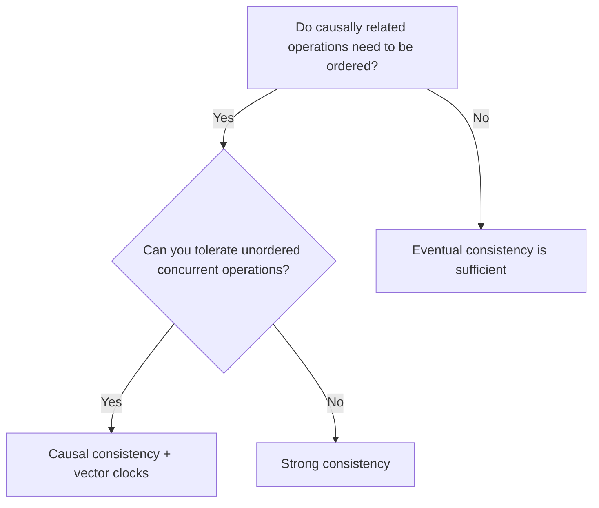

<Hero
  title="Causal Consistency"
  description="Stronger than eventual, weaker than strong—great for collaborative and social timelines"
  size="large"
/>

## TL;DR

Causal consistency guarantees that operations with a cause-effect relationship are observed in order across all replicas, while allowing concurrent operations to be seen in different orders. It's stronger than eventual consistency but weaker (and faster) than strong consistency. Ideal for collaborative systems, social feeds, and microservices where relative order matters but global synchronization is too expensive.

## Learning Objectives

After reading this article, you will be able to:

- Understand the concept of causality in distributed systems (happens-before relation).
- Distinguish causal consistency from eventual and strong consistency.
- Implement causal consistency using vector clocks or session tokens.
- Design systems that leverage causal consistency for performance and correctness.
- Identify when causal consistency is the right choice versus stronger or weaker models.

## Motivating Scenario

Your social media platform has users in different regions. Alice posts a comment on a photo. A moment later, Bob (her friend) replies to Alice's comment. Due to replication lag:

- With eventual consistency: Bob might see Alice's comment and his reply appear in any order—his reply could show up before Alice's original comment. Users are confused by the reversed conversation.

- With strong consistency: Every read would require coordinating across regions, introducing high latency and reducing availability.

- With causal consistency: The system ensures Bob's reply is never shown before Alice's comment (respecting causality), but concurrent posts from Alice and Charlie can appear in any order. The relative order is preserved where it matters (the dependency), but the system avoids expensive global coordination.

## Core Concepts

### Definition: Causality and Happens-Before

In a distributed system, operation A "happens before" operation B if:

1. **Direct causality**: A was invoked by the same client/session that later invoked B.
2. **Transitive causality**: A happens before some operation C, and C happens before B.
3. **Concurrent**: Neither A nor B happened before the other.

Causal consistency ensures that if A happens before B, all replicas observe A's effects before B's effects. Concurrent operations can be seen in any order.

Example:
```
Timeline:
  Client A: Write comment "Hello" → succeeds at t=100 (causally prior)
  Client A: Write comment "How are you?" → succeeds at t=110 (causally depends on first)
  Client B (reading from a replica): Sees "Hello" before "How are you?" ✓
  Client B (reading from another replica): Still sees same order ✓

  Concurrent (no ordering constraint):
  Client A: Write comment "Alice says..."
  Client C: Write comment "Charlie says..."
  → These can appear in any order across replicas (no causal dependency)
```

### Vector Clocks and Causal Tracking

Vector clocks are a mechanism for tracking causality. Each replica/client maintains a clock vector: a map of replica IDs to logical timestamps.

```
Initial state:
  Client1: [Client1: 0, Client2: 0]
  Client2: [Client1: 0, Client2: 0]

Client1 performs write:
  Client1: [Client1: 1, Client2: 0]

Client1 reads (sees Client1's own write):
  Client1: [Client1: 1, Client2: 0]

Client1 performs another write (carries the vector clock):
  Client1: [Client1: 2, Client2: 0]

Client2 reads from replica that has seen both of Client1's writes:
  Client2: [Client1: 2, Client2: 0]
  (Now Client2 can perform a write)
  Client2: [Client1: 2, Client2: 1]
```

The vector clock is attached to each operation and compared before applying it. An operation can be applied only after all causally prior operations are visible.

### Session Consistency and Read-Your-Writes

A practical implementation of causal consistency at the application level is session consistency:

- **Read-your-writes**: After a client writes, all subsequent reads (from the client) will see that write.
- **Monotonic reads**: If a client reads value V1, a later read returns V2 where V2 >= V1 (no rollback).
- **Write-follows-reads**: If a client reads value influenced by write W, later writes by the client are dependent on W.

These guarantees are easier to implement than full vector clocks and often sufficient for user-facing applications.

<Figure caption="Decision flow: choose causal consistency when relative order matters but global coordination is expensive.">

</Figure>

## Practical Example

Here's how to implement causal consistency using vector clocks and session tokens:

<Tabs>
  <TabItem value="python" label="Python">
```python
from typing import Dict, List, Tuple, Any, Optional
from dataclasses import dataclass
from collections import defaultdict

@dataclass
class Operation:
    op_id: str
    key: str
    value: Any
    vector_clock: Dict[str, int]
    client_id: str

class CausallyConsistentStore:
    """
    Stores data with causal consistency guarantee.
    Operations are tagged with vector clocks.
    A replica can apply an operation only when all causally prior operations are visible.
    """

    def __init__(self, replica_id: str):
        self.replica_id = replica_id
        self.data: Dict[str, Any] = {}
        self.vector_clock: Dict[str, int] = defaultdict(int)
        self.operation_log: List[Operation] = []
        self.pending_operations: List[Operation] = []

    def write(self, client_id: str, op_id: str, key: str, value: Any) -> bool:
        """
        Write a value. The operation is tagged with the current vector clock.
        In a real system, the client would send the vector clock with the write.
        """
        self.vector_clock[client_id] += 1
        vc = dict(self.vector_clock)

        op = Operation(op_id=op_id, key=key, value=value, vector_clock=vc, client_id=client_id)
        self.operation_log.append(op)

        # Apply immediately if this is the source replica
        self.data[key] = value
        print(f"[{self.replica_id}] Write by {client_id}: {key}={value}, vc={vc}")

        return True

    def read(self, key: str) -> Optional[Any]:
        """Read the current value (may have pending causally related ops)."""
        value = self.data.get(key, None)
        print(f"[{self.replica_id}] Read: {key}={value}, vc={dict(self.vector_clock)}")
        return value

    def _causal_precondition_met(self, operation: Operation) -> bool:
        """
        Check if all causally prior operations have been applied.
        An operation can be applied if our vector clock >= the operation's vector clock
        for all clients, OR if the operation's clock is strictly less for at least one client.
        (Simplified: check that we've seen all prior events from the source client)
        """
        source_client = operation.client_id
        source_vc_value = operation.vector_clock.get(source_client, 0)
        our_vc_value = self.vector_clock.get(source_client, 0)

        # We can apply if we've already seen this client's prior writes
        if our_vc_value >= source_vc_value:
            return True

        return False

    def replicate_from(self, other_store: "CausallyConsistentStore") -> int:
        """
        Pull operations from another replica and apply those that are causally safe.
        Retain operations that depend on missing prior events.
        """
        operations_applied = 0

        # Collect new operations
        new_operations = [op for op in other_store.operation_log if op not in self.operation_log]

        # Merge pending and new operations, then try to apply
        all_candidates = self.pending_operations + new_operations

        still_pending = []
        for op in all_candidates:
            # Avoid duplicate application
            if op in self.operation_log:
                continue

            if self._causal_precondition_met(op):
                # Apply the operation
                self.data[op.key] = op.value
                self.operation_log.append(op)

                # Update our vector clock to reflect the causality
                for client_id, vc_val in op.vector_clock.items():
                    self.vector_clock[client_id] = max(self.vector_clock.get(client_id, 0), vc_val)

                operations_applied += 1
                print(f"[{self.replica_id}] Applied operation from {op.client_id}: {op.key}={op.value}")
            else:
                # Keep pending for later
                still_pending.append(op)

        self.pending_operations = still_pending

        if operations_applied > 0:
            print(f"[{self.replica_id}] Replicated and applied {operations_applied} ops, {len(self.pending_operations)} pending")

        return operations_applied

    def get_session_token(self, client_id: str) -> Dict[str, int]:
        """
        Return a session token representing the causality context for the client.
        This can be used to ensure read-your-writes on other replicas.
        """
        return dict(self.vector_clock)

    def ensure_causal_consistency(self, session_token: Dict[str, int]) -> bool:
        """
        Check if this replica has seen all causally prior operations
        referenced in the session token.
        """
        for client_id, required_vc_val in session_token.items():
            current_vc_val = self.vector_clock.get(client_id, 0)
            if current_vc_val < required_vc_val:
                return False
        return True

# Example usage
def main():
    print("=== Causal Consistency with Vector Clocks ===\n")

    # Create replicas (e.g., two regions)
    replica_us = CausallyConsistentStore("US")
    replica_eu = CausallyConsistentStore("EU")

    # Client A in US writes a comment
    print("--- Client A (in US) writes comment ---")
    replica_us.write("ClientA", "op1", "comment:123", "Hello, world!")

    # Client A replies (depends on own write)
    print("\n--- Client A replies (causal dependency on first comment) ---")
    replica_us.write("ClientA", "op2", "comment:124", "How is everyone?")

    # Get session token for Client A to carry to EU
    session_token = replica_us.get_session_token("ClientA")
    print(f"\nSession token for ClientA: {session_token}")

    # Replicate US -> EU
    print("\n--- Replicate US -> EU ---")
    replica_eu.replicate_from(replica_us)

    # EU replica should now be causally consistent (both comments in order)
    print("\n--- Verify causality on EU ---")
    print(f"Comment 1: {replica_eu.read('comment:123')}")
    print(f"Comment 2: {replica_eu.read('comment:124')}")

    # Client B in EU reads and replies
    print("\n--- Client B (in EU) replies to A's comment ---")
    # Ensure EU has seen all of A's causality before B writes
    if replica_eu.ensure_causal_consistency(session_token):
        replica_eu.write("ClientB", "op3", "comment:125", "Thanks for sharing!")
        print("✓ Causal consistency maintained: B's reply depends on A's comments")
    else:
        print("✗ Missing causally prior operations; cannot write safely")

    # Concurrent operations (no causal dependency)
    print("\n--- Concurrent writes by different clients (no causal order required) ---")
    replica_us.write("ClientC", "op4", "post:200", "Random thought")
    replica_eu.write("ClientD", "op5", "post:201", "Another thought")

    # Replicate both directions
    print("\n--- Cross-replication ---")
    replica_us.replicate_from(replica_eu)
    replica_eu.replicate_from(replica_us)

    # Final state
    print("\n--- Final state (all replicas convergent) ---")
    print(f"\nUS Replica:")
    for op in replica_us.operation_log:
        print(f"  {op.key}: {op.value} (vc={op.vector_clock})")

    print(f"\nEU Replica:")
    for op in replica_eu.operation_log:
        print(f"  {op.key}: {op.value} (vc={op.vector_clock})")

if __name__ == "__main__":
    main()
```
  </TabItem>

  <TabItem value="go" label="Go">
```go
package main

import (
	"fmt"
	"sync"
)

type Operation struct {
	OpID        string
	Key         string
	Value       interface{}
	VectorClock map[string]int
	ClientID    string
}

type CausallyConsistentStore struct {
	ReplicaID        string
	Data             map[string]interface{}
	VectorClock      map[string]int
	OperationLog     []Operation
	PendingOperations []Operation
	mu               sync.RWMutex
}

func NewStore(replicaID string) *CausallyConsistentStore {
	return &CausallyConsistentStore{
		ReplicaID:        replicaID,
		Data:             make(map[string]interface{}),
		VectorClock:      make(map[string]int),
		OperationLog:     []Operation{},
		PendingOperations: []Operation{},
	}
}

func (cs *CausallyConsistentStore) Write(clientID, opID, key string, value interface{}) bool {
	cs.mu.Lock()
	defer cs.mu.Unlock()

	cs.VectorClock[clientID]++
	vcCopy := make(map[string]int)
	for k, v := range cs.VectorClock {
		vcCopy[k] = v
	}

	op := Operation{
		OpID:        opID,
		Key:         key,
		Value:       value,
		VectorClock: vcCopy,
		ClientID:    clientID,
	}
	cs.OperationLog = append(cs.OperationLog, op)
	cs.Data[key] = value

	fmt.Printf("[%s] Write by %s: %s=%v, vc=%v\n", cs.ReplicaID, clientID, key, value, vcCopy)
	return true
}

func (cs *CausallyConsistentStore) Read(key string) interface{} {
	cs.mu.RLock()
	defer cs.mu.RUnlock()

	return cs.Data[key]
}

func (cs *CausallyConsistentStore) causalPreconditionMet(op Operation) bool {
	sourceClient := op.ClientID
	sourceVCVal := op.VectorClock[sourceClient]
	ourVCVal := cs.VectorClock[sourceClient]

	return ourVCVal >= sourceVCVal
}

func (cs *CausallyConsistentStore) ReplicateFrom(other *CausallyConsistentStore) int {
	cs.mu.Lock()
	defer cs.mu.Unlock()

	other.mu.RLock()
	newOps := other.OperationLog
	other.mu.RUnlock()

	operationsApplied := 0
	var stillPending []Operation

	for _, op := range append(cs.PendingOperations, newOps...) {
		alreadyApplied := false
		for _, logOp := range cs.OperationLog {
			if logOp.OpID == op.OpID {
				alreadyApplied = true
				break
			}
		}

		if alreadyApplied {
			continue
		}

		if cs.causalPreconditionMet(op) {
			cs.Data[op.Key] = op.Value
			cs.OperationLog = append(cs.OperationLog, op)

			for clientID, vcVal := range op.VectorClock {
				if cs.VectorClock[clientID] < vcVal {
					cs.VectorClock[clientID] = vcVal
				}
			}

			operationsApplied++
			fmt.Printf("[%s] Applied operation from %s: %s=%v\n", cs.ReplicaID, op.ClientID, op.Key, op.Value)
		} else {
			stillPending = append(stillPending, op)
		}
	}

	cs.PendingOperations = stillPending

	if operationsApplied > 0 {
		fmt.Printf("[%s] Replicated and applied %d ops, %d pending\n", cs.ReplicaID, operationsApplied, len(stillPending))
	}

	return operationsApplied
}

func (cs *CausallyConsistentStore) GetSessionToken(clientID string) map[string]int {
	cs.mu.RLock()
	defer cs.mu.RUnlock()

	token := make(map[string]int)
	for k, v := range cs.VectorClock {
		token[k] = v
	}
	return token
}

func (cs *CausallyConsistentStore) EnsureCausalConsistency(sessionToken map[string]int) bool {
	cs.mu.RLock()
	defer cs.mu.RUnlock()

	for clientID, requiredVC := range sessionToken {
		if cs.VectorClock[clientID] < requiredVC {
			return false
		}
	}
	return true
}

func main() {
	fmt.Println("=== Causal Consistency with Vector Clocks ===\n")

	replicaUS := NewStore("US")
	replicaEU := NewStore("EU")

	fmt.Println("--- Client A (in US) writes comment ---")
	replicaUS.Write("ClientA", "op1", "comment:123", "Hello, world!")

	fmt.Println("\n--- Client A replies (causal dependency on first comment) ---")
	replicaUS.Write("ClientA", "op2", "comment:124", "How is everyone?")

	sessionToken := replicaUS.GetSessionToken("ClientA")
	fmt.Printf("\nSession token for ClientA: %v\n", sessionToken)

	fmt.Println("\n--- Replicate US -> EU ---")
	replicaEU.ReplicateFrom(replicaUS)

	fmt.Println("\n--- Verify causality on EU ---")
	fmt.Printf("Comment 1: %v\n", replicaEU.Read("comment:123"))
	fmt.Printf("Comment 2: %v\n", replicaEU.Read("comment:124"))

	fmt.Println("\n--- Client B (in EU) replies to A's comment ---")
	if replicaEU.EnsureCausalConsistency(sessionToken) {
		replicaEU.Write("ClientB", "op3", "comment:125", "Thanks for sharing!")
		fmt.Println("✓ Causal consistency maintained: B's reply depends on A's comments")
	}

	fmt.Println("\n--- Final state (all replicas convergent) ---")
	replicaUS.mu.RLock()
	fmt.Println("\nUS Replica:")
	for _, op := range replicaUS.OperationLog {
		fmt.Printf("  %s: %v (vc=%v)\n", op.Key, op.Value, op.VectorClock)
	}
	replicaUS.mu.RUnlock()

	replicaEU.mu.RLock()
	fmt.Println("\nEU Replica:")
	for _, op := range replicaEU.OperationLog {
		fmt.Printf("  %s: %v (vc=%v)\n", op.Key, op.Value, op.VectorClock)
	}
	replicaEU.mu.RUnlock()
}
```
  </TabItem>

  <TabItem value="nodejs" label="Node.js">
```javascript
class CausallyConsistentStore {
  constructor(replicaId) {
    this.replicaId = replicaId;
    this.data = new Map();
    this.vectorClock = new Map();
    this.operationLog = [];
    this.pendingOperations = [];
  }

  write(clientId, opId, key, value) {
    const current = this.vectorClock.get(clientId) || 0;
    this.vectorClock.set(clientId, current + 1);

    const vcCopy = new Map(this.vectorClock);
    const op = {
      opId,
      key,
      value,
      vectorClock: vcCopy,
      clientId,
    };

    this.operationLog.push(op);
    this.data.set(key, value);

    const vcObj = Object.fromEntries(this.vectorClock);
    console.log(`[${this.replicaId}] Write by ${clientId}: ${key}=${JSON.stringify(value)}, vc=${JSON.stringify(vcObj)}`);
    return true;
  }

  read(key) {
    const value = this.data.get(key);
    const vcObj = Object.fromEntries(this.vectorClock);
    console.log(`[${this.replicaId}] Read: ${key}=${JSON.stringify(value)}, vc=${JSON.stringify(vcObj)}`);
    return value;
  }

  causalPreconditionMet(op) {
    const sourceVCVal = op.vectorClock.get(op.clientId) || 0;
    const ourVCVal = this.vectorClock.get(op.clientId) || 0;
    return ourVCVal >= sourceVCVal;
  }

  replicateFrom(other) {
    const newOps = other.operationLog;
    let operationsApplied = 0;
    const stillPending = [];

    for (const op of [...this.pendingOperations, ...newOps]) {
      const alreadyApplied = this.operationLog.some((logOp) => logOp.opId === op.opId);

      if (alreadyApplied) {
        continue;
      }

      if (this.causalPreconditionMet(op)) {
        this.data.set(op.key, op.value);
        this.operationLog.push(op);

        for (const [clientId, vcVal] of op.vectorClock) {
          const current = this.vectorClock.get(clientId) || 0;
          if (current < vcVal) {
            this.vectorClock.set(clientId, vcVal);
          }
        }

        operationsApplied++;
        console.log(`[${this.replicaId}] Applied operation from ${op.clientId}: ${op.key}=${JSON.stringify(op.value)}`);
      } else {
        stillPending.push(op);
      }
    }

    this.pendingOperations = stillPending;

    if (operationsApplied > 0) {
      console.log(`[${this.replicaId}] Replicated and applied ${operationsApplied} ops, ${stillPending.length} pending`);
    }

    return operationsApplied;
  }

  getSessionToken(clientId) {
    return new Map(this.vectorClock);
  }

  ensureCausalConsistency(sessionToken) {
    for (const [clientId, requiredVC] of sessionToken) {
      const ourVC = this.vectorClock.get(clientId) || 0;
      if (ourVC < requiredVC) {
        return false;
      }
    }
    return true;
  }
}

// Main
console.log("=== Causal Consistency with Vector Clocks ===\n");

const replicaUS = new CausallyConsistentStore("US");
const replicaEU = new CausallyConsistentStore("EU");

console.log("--- Client A (in US) writes comment ---");
replicaUS.write("ClientA", "op1", "comment:123", "Hello, world!");

console.log("\n--- Client A replies (causal dependency on first comment) ---");
replicaUS.write("ClientA", "op2", "comment:124", "How is everyone?");

const sessionToken = replicaUS.getSessionToken("ClientA");
console.log(`\nSession token for ClientA:`, Object.fromEntries(sessionToken));

console.log("\n--- Replicate US -> EU ---");
replicaEU.replicateFrom(replicaUS);

console.log("\n--- Verify causality on EU ---");
console.log(`Comment 1: ${JSON.stringify(replicaEU.read("comment:123"))}`);
console.log(`Comment 2: ${JSON.stringify(replicaEU.read("comment:124"))}`);

console.log("\n--- Client B (in EU) replies to A's comment ---");
if (replicaEU.ensureCausalConsistency(sessionToken)) {
  replicaEU.write("ClientB", "op3", "comment:125", "Thanks for sharing!");
  console.log("✓ Causal consistency maintained: B's reply depends on A's comments");
}

console.log("\n--- Final state (all replicas convergent) ---");
console.log("\nUS Replica:");
for (const op of replicaUS.operationLog) {
  const vcObj = Object.fromEntries(op.vectorClock);
  console.log(`  ${op.key}: ${JSON.stringify(op.value)} (vc=${JSON.stringify(vcObj)})`);
}

console.log("\nEU Replica:");
for (const op of replicaEU.operationLog) {
  const vcObj = Object.fromEntries(op.vectorClock);
  console.log(`  ${op.key}: ${JSON.stringify(op.value)} (vc=${JSON.stringify(vcObj)})`);
}
```
  </TabItem>
</Tabs>

## When to Use / When NOT to Use

<Vs highlight={[0, 1]} items={[
{
    label: "Use Causal Consistency",
    points: [
      "Social feeds and timelines (preserve comment/reply order)",
      "Collaborative editing (preserve causality of edits)"
    ],
    highlightTone: "positive"
  },
{
    label: "Avoid Causal Consistency",
    points: [
      "Message boards and forums (preserve thread structure)",
      "Microservices with asynchronous propagation",
      "Distributed collaborative applications (Google Docs style)"
    ],
    highlightTone: "warning"
  }
]} />

## Patterns & Pitfalls

<Showcase sections={[
  {
    label: "Vector Clocks vs. Session Tokens",
    body: `Full vector clocks track causality precisely but have O(n) space per operation (n = number of replicas). Session tokens (storing per-client timestamps) are simpler for read-your-writes but don't track causality transitively. Choose based on your needs: full causality requires vector clocks; session guarantees can use lightweight tokens.`
  },
  {
    label: "Monotonic Reads and Monotonic Writes",
    body: `Implement monotonic reads by tracking the session's causal vector: return a replica's read token, then route subsequent reads to replicas that have seen all prior operations. Monotonic writes work similarly: after a write, ensure subsequent writes see the effects of prior ones.`
  },
  {
    label: "Dependency Tracking in Collaborative Systems",
    body: `In collaborative editing, each edit operation carries references to prior edits it depends on (operational transform or CRDT approach). Apply operations only when dependencies are met, then broadcast to all replicas. This naturally enforces causal order.`
  },
  {
    label: "Pitfall: Pending Operations and Memory",
    body: `Operations that can't be applied immediately (missing causally prior ops) are queued. If causality is never satisfied, these accumulate and consume memory. Mitigate with timeouts: if an operation isn't satisfiable after T seconds, log it and discard.`
  },
  {
    label: "Pitfall: Vector Clock Explosion",
    body: `In systems with many replicas, vector clocks grow large. Use interval tree clocks or other optimizations to keep size manageable. Alternatively, use pruning: discard entries for replicas that have fallen far behind.`
  },
  {
    label: "Testing Causal Consistency",
    body: `Write tests that verify: (1) operations are applied in causal order, (2) concurrent operations can be in any order, (3) session guarantees hold. Simulate network delays and replication lag to catch timing bugs.`
  ,
    body: `Write tests that verify: (1) operations are applied in causal order, (2) concurrent operations can be in any order, (3) session guarantees hold. Simulate network delays and replication lag to catch timing bugs.`
  ,
    highlightTone: "warning"
  }
]} />

## Design Review Checklist

<Checklist items={[
  "Have you identified which operations have causal dependencies (reply to comment, edit depends on read)?",
  "Is the overhead of vector clocks or session tokens acceptable for your workload?",
  "Do you have a mechanism to track and verify causality (vector clocks, dependency graphs)?",
  "Is replication ordered to respect dependencies (e.g., apply operations in causal order)?",
  "Have you implemented session guarantees (read-your-writes, monotonic reads)?",
  "Do clients understand and handle temporarily out-of-order concurrent operations?",
  "Are pending operations (waiting for causally prior ops) cleaned up if not satisfied?",
  "Have you tested under high replication lag and network partitions?",
  "Is causal consistency documented clearly for the development team?",
  "Can you detect and alert on causal consistency violations?"
]} />

## Self-Check

Before implementing causal consistency, ask yourself:

1. **Causal dependencies**: Are there operations that logically depend on others (reply depends on comment, edit depends on read)? If yes, causal consistency helps. If no, eventual consistency is simpler.

2. **Scale**: How many replicas do you have? Vector clocks scale O(n) per operation. For dozens of replicas, the overhead becomes noticeable.

3. **Latency sensitivity**: Can you tolerate the additional bookkeeping (vector clocks, dependency tracking)? If latency is critical, check if session tokens (cheaper) suffice.

4. **Operational complexity**: Can your team understand and debug vector clock issues? Causal consistency is more complex than eventual but simpler than strong.

## Next Steps

- **Map causal dependencies**: Document which operations depend on others (explicitly or implicitly).
- **Choose a tracking mechanism**: Decide between full vector clocks, session tokens, or dependency graphs.
- **Implement session guarantees**: At minimum, ensure read-your-writes for critical operations.
- **Test replication order**: Verify operations are applied in causal order; allow concurrent operations to vary.
- **Monitor replication lag**: Track how long causally dependent operations take to propagate.
- **Document for developers**: Make it clear which operations are causally dependent and what guarantees hold.

## References

1. <a href="https://jepsen.io/consistency" target="_blank" rel="nofollow noopener noreferrer">Jepsen: Consistency Models ↗️</a>
2. <a href="https://www.vldb.org/pvldb/vol7/p181-bailis.pdf" target="_blank" rel="nofollow noopener noreferrer">Bailis et al.: Highly Available Transactions, VLDB ↗️</a>
3. <a href="https://en.wikipedia.org/wiki/Vector_clock" target="_blank" rel="nofollow noopener noreferrer">Wikipedia: Vector Clocks ↗️</a>
4. <a href="https://www.infoq.com/articles/vector-clocks/" target="_blank" rel="nofollow noopener noreferrer">InfoQ: Understanding Vector Clocks ↗️</a>