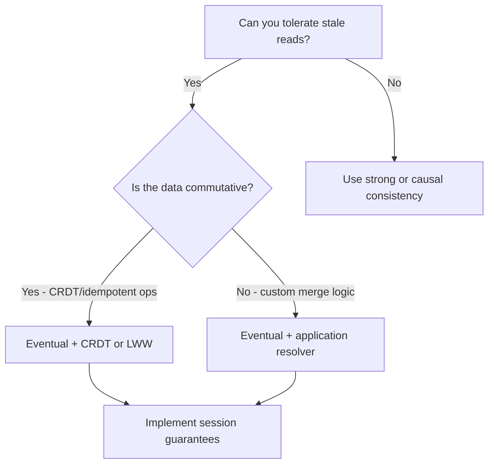

<Hero
  title="Eventual Consistency"
  description="Design for convergence: idempotency, commutativity, and repair"
  size="large"
/>

## TL;DR

Eventual consistency favors availability and partition tolerance over immediate global freshness. All replicas will eventually observe the same data when the system is quiescent, but clients must tolerate stale reads during propagation. Use idempotent, commutative operations, session guarantees, and background repair mechanisms to ensure safe convergence.

## Learning Objectives

After reading this article, you will be able to:

- Explain the fundamental trade-off between availability and consistency in distributed systems.
- Design write and read paths that gracefully handle stale replicas.
- Implement convergence mechanisms using vector clocks, CRDTs, or last-write-wins strategies.
- Apply session guarantees and application-level conflict resolution to mitigate staleness.
- Evaluate when eventual consistency is the right choice for your workload.

## Motivating Scenario

Your e-commerce platform operates globally with datacenters in three regions. A customer adds an item to their cart in EU, receives confirmation (write succeeds locally), but when they switch to their phone connected to a US datacenter moments later, their cart appears empty. The two datacenters are still synchronizing. Without eventual consistency and proper client handling, you'd need every write to block until all regions acknowledge—introducing latency and availability risks.

With eventual consistency: the write succeeds immediately in EU, the cart appears full to the user (because the application reads from the local replica), and async replication propagates the update to other regions. If the user refreshes from a different region before sync completes, they may see an empty cart—but your app detects this via session state and can re-add the item or show a warning.

## Core Concepts

### Definition and Promise

Eventual consistency guarantees that in the absence of new writes, all reads will eventually return the same value. There is no bound on "eventually"—it could be milliseconds or hours depending on your replication lag and network conditions. The system prioritizes:

- **Availability**: Writes succeed locally without waiting for remote acknowledgment.
- **Partition tolerance**: Replicas continue serving reads even if the network partitions.
- **Latency**: No coordination overhead means fast responses.

The trade-off: clients must accept stale reads until replication catches up.

### Replication and Propagation

In an eventually consistent system, writes typically follow a write-ahead log (WAL) pattern:

1. **Local write**: Data is written to the primary/local replica and immediately acknowledged to the client.
2. **Async replication**: A separate process (log streaming, message queue) propagates the change to other replicas.
3. **Remote application**: Each replica applies the change independently, potentially in a different order than other replicas.
4. **Convergence**: Once all replicas have processed the write, they contain identical data.

The challenge arises when multiple replicas receive conflicting writes before they see each other's changes—this is where conflict resolution strategies come in.

### Conflict Resolution Strategies

#### Last-Write-Wins (LWW)
Each write carries a timestamp or version number. When two replicas conflict, the write with the higher timestamp wins, and the other is discarded. Simple but can lose data silently.

```
Replica A: Write X=1 @ ts=100
Replica B: Write X=2 @ ts=200
Conflict: X=2 wins (higher timestamp)
Risk: The value 1 is permanently lost
```

#### Vector Clocks and Causal History
A vector clock associates each replica with a logical clock. Conflicting writes (concurrent, not causally ordered) are detected, and the application decides how to resolve them (merge, prompt user, etc.).

#### CRDTs (Conflict-free Replicated Data Types)
A CRDT is a data structure whose operations are designed to commute (order-independent). Examples: append-only logs, counters with increment/decrement per-replica, sets with add/remove operations. CRDTs guarantee convergence without coordination.

#### Custom Application Logic
For domain-specific conflicts (e.g., a quantity field), the application implements merge rules: take the maximum, run a deterministic function on both values, queue for manual review, etc.

<Figure caption="Decision flow: choose replication and conflict resolution based on staleness tolerance and data semantics.">

</Figure>

## Practical Example

Here's how to implement eventual consistency with idempotent writes and session-level read-your-writes:

<Tabs>
  <TabItem value="python" label="Python">
```python
import hashlib
import time
from typing import Dict, Any, Optional
from datetime import datetime
from collections import defaultdict

class EventuallyConsistentStore:
    """
    Simulates a replicated store with eventual consistency.
    Each replica has its own data, and changes propagate asynchronously.
    """

    def __init__(self, replica_id: str):
        self.replica_id = replica_id
        self.data: Dict[str, Any] = {}
        self.version_vector: Dict[str, int] = defaultdict(int)
        self.log: list = []

    def write(self, key: str, value: Any, idempotency_key: str) -> bool:
        """
        Write a value with an idempotency key.
        The same idempotency_key will not be applied twice.
        """
        # Check if we've already applied this idempotent write
        for log_entry in self.log:
            if log_entry.get("idempotency_key") == idempotency_key:
                print(f"[{self.replica_id}] Duplicate write ignored: {idempotency_key}")
                return True  # Idempotent: return success without re-applying

        # Apply the write locally
        self.data[key] = value
        self.version_vector[self.replica_id] += 1

        # Log the operation for replication
        log_entry = {
            "op": "write",
            "key": key,
            "value": value,
            "idempotency_key": idempotency_key,
            "timestamp": time.time(),
            "source_replica": self.replica_id,
            "vector_clock": dict(self.version_vector),
        }
        self.log.append(log_entry)

        print(f"[{self.replica_id}] Write: {key}={value}, vector_clock={dict(self.version_vector)}")
        return True

    def read(self, key: str) -> Optional[Any]:
        """
        Read the local replica's view of the data.
        May return stale data if replication has not yet propagated.
        """
        value = self.data.get(key, None)
        print(f"[{self.replica_id}] Read: {key}={value}, vector_clock={dict(self.version_vector)}")
        return value

    def replicate_from(self, other_store: "EventuallyConsistentStore") -> int:
        """
        Pull new log entries from another replica and apply them.
        Returns the number of entries applied.
        """
        entries_applied = 0
        for log_entry in other_store.log:
            # Check if we've already applied this entry based on source replica and idempotency
            already_applied = any(
                existing["idempotency_key"] == log_entry["idempotency_key"]
                for existing in self.log
            )

            if not already_applied:
                # Apply the entry
                self.data[log_entry["key"]] = log_entry["value"]
                # Update our vector clock based on the source
                source_replica = log_entry["source_replica"]
                self.version_vector[source_replica] = max(
                    self.version_vector[source_replica],
                    log_entry["vector_clock"].get(source_replica, 0),
                )
                self.log.append(log_entry)
                entries_applied += 1

        print(f"[{self.replica_id}] Replicated {entries_applied} entries from {other_store.replica_id}")
        return entries_applied

    def get_vector_clock(self) -> Dict[str, int]:
        """Return the current vector clock state."""
        return dict(self.version_vector)

# Example usage
def main():
    # Create three geographically distributed replicas
    eu_replica = EventuallyConsistentStore("EU")
    us_replica = EventuallyConsistentStore("US")
    asia_replica = EventuallyConsistentStore("ASIA")

    # Client adds item to cart from EU region
    print("\n=== Client writes from EU ===")
    eu_replica.write("cart:user123", {"items": [{"sku": "ABC123", "qty": 1}]}, idempotency_key="write:1")

    # Client reads from EU immediately—sees own write
    print("\n=== Client reads from EU (read-your-writes) ===")
    cart = eu_replica.read("cart:user123")

    # Replicate to US
    print("\n=== Replication: EU → US ===")
    eu_replica.replicate_from(asia_replica)  # EU pulls from ASIA (empty)
    us_replica.replicate_from(eu_replica)    # US pulls from EU (gets cart update)

    # Client switches to US region—should now see the cart
    print("\n=== Client reads from US ===")
    cart = us_replica.read("cart:user123")

    # Another write from EU while US is propagating
    print("\n=== Concurrent write from EU ===")
    eu_replica.write("cart:user123", {"items": [{"sku": "ABC123", "qty": 2}]}, idempotency_key="write:2")

    # Replicate to all
    print("\n=== Full replication ===")
    us_replica.replicate_from(eu_replica)
    asia_replica.replicate_from(eu_replica)

    # All replicas now consistent
    print("\n=== Eventual convergence ===")
    print(f"EU: {eu_replica.read('cart:user123')}")
    print(f"US: {us_replica.read('cart:user123')}")
    print(f"ASIA: {asia_replica.read('cart:user123')}")

if __name__ == "__main__":
    main()
```
  </TabItem>

  <TabItem value="go" label="Go">
```go
package main

import (
	"fmt"
	"sync"
	"time"
)

type LogEntry struct {
	Op             string
	Key            string
	Value          interface{}
	IdempotencyKey string
	Timestamp      int64
	SourceReplica  string
	VectorClock    map[string]int
}

type EventuallyConsistentStore struct {
	ReplicaID     string
	Data          map[string]interface{}
	VersionVector map[string]int
	Log           []LogEntry
	mu            sync.RWMutex
}

func NewStore(replicaID string) *EventuallyConsistentStore {
	return &EventuallyConsistentStore{
		ReplicaID:     replicaID,
		Data:          make(map[string]interface{}),
		VersionVector: make(map[string]int),
		Log:           []LogEntry{},
	}
}

func (s *EventuallyConsistentStore) Write(key string, value interface{}, idempotencyKey string) bool {
	s.mu.Lock()
	defer s.mu.Unlock()

	// Check for duplicate idempotent write
	for _, entry := range s.Log {
		if entry.IdempotencyKey == idempotencyKey {
			fmt.Printf("[%s] Duplicate write ignored: %s\n", s.ReplicaID, idempotencyKey)
			return true
		}
	}

	// Apply write
	s.Data[key] = value
	s.VersionVector[s.ReplicaID]++

	// Log entry
	vectorClockCopy := make(map[string]int)
	for k, v := range s.VersionVector {
		vectorClockCopy[k] = v
	}

	entry := LogEntry{
		Op:             "write",
		Key:            key,
		Value:          value,
		IdempotencyKey: idempotencyKey,
		Timestamp:      time.Now().Unix(),
		SourceReplica:  s.ReplicaID,
		VectorClock:    vectorClockCopy,
	}
	s.Log = append(s.Log, entry)

	fmt.Printf("[%s] Write: %s=%v, vector_clock=%v\n", s.ReplicaID, key, value, vectorClockCopy)
	return true
}

func (s *EventuallyConsistentStore) Read(key string) interface{} {
	s.mu.RLock()
	defer s.mu.RUnlock()

	value := s.Data[key]
	fmt.Printf("[%s] Read: %s=%v, vector_clock=%v\n", s.ReplicaID, key, value, s.VersionVector)
	return value
}

func (s *EventuallyConsistentStore) ReplicateFrom(other *EventuallyConsistentStore) int {
	s.mu.Lock()
	defer s.mu.Unlock()

	other.mu.RLock()
	defer other.mu.RUnlock()

	entriesApplied := 0
	for _, entry := range other.Log {
		alreadyApplied := false
		for _, existing := range s.Log {
			if existing.IdempotencyKey == entry.IdempotencyKey {
				alreadyApplied = true
				break
			}
		}

		if !alreadyApplied {
			s.Data[entry.Key] = entry.Value
			source := entry.SourceReplica
			if s.VersionVector[source] < entry.VectorClock[source] {
				s.VersionVector[source] = entry.VectorClock[source]
			}
			s.Log = append(s.Log, entry)
			entriesApplied++
		}
	}

	fmt.Printf("[%s] Replicated %d entries from %s\n", s.ReplicaID, entriesApplied, other.ReplicaID)
	return entriesApplied
}

func main() {
	eu := NewStore("EU")
	us := NewStore("US")
	asia := NewStore("ASIA")

	fmt.Println("\n=== Client writes from EU ===")
	eu.Write("cart:user123", map[string]interface{}{"items": []interface{}{map[string]interface{}{"sku": "ABC123", "qty": 1}}}, "write:1")

	fmt.Println("\n=== Client reads from EU (read-your-writes) ===")
	eu.Read("cart:user123")

	fmt.Println("\n=== Replication: EU → US ===")
	us.ReplicateFrom(eu)

	fmt.Println("\n=== Client reads from US ===")
	us.Read("cart:user123")

	fmt.Println("\n=== Concurrent write from EU ===")
	eu.Write("cart:user123", map[string]interface{}{"items": []interface{}{map[string]interface{}{"sku": "ABC123", "qty": 2}}}, "write:2")

	fmt.Println("\n=== Full replication ===")
	us.ReplicateFrom(eu)
	asia.ReplicateFrom(eu)

	fmt.Println("\n=== Eventual convergence ===")
	eu.Read("cart:user123")
	us.Read("cart:user123")
	asia.Read("cart:user123")
}
```
  </TabItem>

  <TabItem value="nodejs" label="Node.js">
```javascript
class EventuallyConsistentStore {
  constructor(replicaId) {
    this.replicaId = replicaId;
    this.data = new Map();
    this.versionVector = new Map();
    this.log = [];
  }

  write(key, value, idempotencyKey) {
    // Check for duplicate idempotent write
    for (const entry of this.log) {
      if (entry.idempotencyKey === idempotencyKey) {
        console.log(`[${this.replicaId}] Duplicate write ignored: ${idempotencyKey}`);
        return true;
      }
    }

    // Apply write
    this.data.set(key, value);
    this.versionVector.set(
      this.replicaId,
      (this.versionVector.get(this.replicaId) || 0) + 1
    );

    // Log entry
    const logEntry = {
      op: "write",
      key,
      value,
      idempotencyKey,
      timestamp: Date.now(),
      sourceReplica: this.replicaId,
      vectorClock: new Map(this.versionVector),
    };
    this.log.push(logEntry);

    const vcObj = Object.fromEntries(this.versionVector);
    console.log(`[${this.replicaId}] Write: ${key}=${JSON.stringify(value)}, vector_clock=${JSON.stringify(vcObj)}`);
    return true;
  }

  read(key) {
    const value = this.data.get(key);
    const vcObj = Object.fromEntries(this.versionVector);
    console.log(`[${this.replicaId}] Read: ${key}=${JSON.stringify(value)}, vector_clock=${JSON.stringify(vcObj)}`);
    return value;
  }

  replicateFrom(otherStore) {
    let entriesApplied = 0;
    for (const entry of otherStore.log) {
      const alreadyApplied = this.log.some(
        (existing) => existing.idempotencyKey === entry.idempotencyKey
      );

      if (!alreadyApplied) {
        this.data.set(entry.key, entry.value);
        const source = entry.sourceReplica;
        const currentVersion = this.versionVector.get(source) || 0;
        const newVersion = entry.vectorClock.get(source) || 0;
        if (currentVersion < newVersion) {
          this.versionVector.set(source, newVersion);
        }
        this.log.push(entry);
        entriesApplied++;
      }
    }

    console.log(`[${this.replicaId}] Replicated ${entriesApplied} entries from ${otherStore.replicaId}`);
    return entriesApplied;
  }
}

// Example usage
async function main() {
  const eu = new EventuallyConsistentStore("EU");
  const us = new EventuallyConsistentStore("US");
  const asia = new EventuallyConsistentStore("ASIA");

  console.log("\n=== Client writes from EU ===");
  eu.write("cart:user123", { items: [{ sku: "ABC123", qty: 1 }] }, "write:1");

  console.log("\n=== Client reads from EU (read-your-writes) ===");
  eu.read("cart:user123");

  console.log("\n=== Replication: EU → US ===");
  us.replicateFrom(eu);

  console.log("\n=== Client reads from US ===");
  us.read("cart:user123");

  console.log("\n=== Concurrent write from EU ===");
  eu.write("cart:user123", { items: [{ sku: "ABC123", qty: 2 }] }, "write:2");

  console.log("\n=== Full replication ===");
  us.replicateFrom(eu);
  asia.replicateFrom(eu);

  console.log("\n=== Eventual convergence ===");
  eu.read("cart:user123");
  us.read("cart:user123");
  asia.read("cart:user123");
}

main();
```
  </TabItem>
</Tabs>

## When to Use / When NOT to Use

<Vs highlight={[0, 1]} items={[
{
    label: "Use Eventual Consistency",
    points: [
      "High-throughput, globally distributed writes (social feeds, caches)",
      "Stale reads are acceptable (user timelines, analytics dashboards)"
    ],
    highlightTone: "positive"
  },
{
    label: "Avoid Eventual Consistency",
    points: [
      "Operations are idempotent or commutative (increments, appends)",
      "You can implement session guarantees at the application level",
      "Network partitions are likely and availability must be maintained"
    ],
    highlightTone: "warning"
  }
]} />

## Patterns & Pitfalls

<Showcase sections={[
  {
    label: "Session Guarantees",
    body: `Implement read-your-writes by storing session tokens and vector clocks. After a write, route subsequent reads to replicas that have seen that write. Example: store the user's session vector clock in a cookie or application state; route reads to a replica whose vector clock dominates (≥) the session clock.`
  },
  {
    label: "Idempotent Writes",
    body: `Every write must be safe to apply multiple times. Use a deduplication key (e.g., a UUID that the client generates). Log-based replication systems like Kafka and event stores excel here because duplicate detection is built-in.`
  },
  {
    label: "Converging Data Types (CRDTs)",
    body: `Use CRDTs (operation-based or state-based) to guarantee convergence without coordination. Examples: Last-Write-Wins registers, Grow-Only Counters, Unique Sets. Libraries like Automerge and Yjs simplify CRDT management.`
  },
  {
    label: "Pitfall: Silent Data Loss",
    body: `Last-Write-Wins naively drops older writes. If two users edit the same field concurrently, one edit vanishes. Mitigate by: detecting conflicts at the application level, using CRDTs, or applying custom merge logic (e.g., JSON Merge Patch, operational transforms).`
  },
  {
    label: "Pitfall: Hidden Stale Reads",
    body: `Users may see old data without realizing it. Communicate staleness clearly: show a timestamp on the UI, or use session guarantees to avoid cross-region reads until replication completes.`
  },
  {
    label: "Repair and Reconciliation",
    body: `Implement background jobs that detect and repair diverged replicas. Compare checksums, run anti-entropy protocols (Merkle trees), or rebuild replicas from a canonical log. Automate this so stale replicas self-heal.`
  }
]} />

## Design Review Checklist

<Checklist items={[
  "Have you identified which data can tolerate stale reads and which cannot?",
  "Are all write operations idempotent or do they use deduplication keys?",
  "Have you chosen a conflict resolution strategy (LWW, CRDT, custom logic) and documented it?",
  "Do you have session guarantees implemented (e.g., read-your-writes, monotonic reads)?",
  "Is replication lag monitored and visible to operators?",
  "Have you tested convergence under network partitions and slow replicas?",
  "Is there a background repair mechanism (anti-entropy, reconciliation job)?",
  "Can you detect and alert on diverged replicas before users discover inconsistencies?",
  "Do clients retry reads or refresh if they see unexpected stale data?",
  "Is conflict resolution logic tested with concurrent writes to the same key?"
]} />

## Self-Check

Before adopting eventual consistency, ask yourself:

1. **Staleness tolerance**: Can my users accept seeing data that's seconds or minutes old? If yes, eventual consistency is viable. If no, consider strong or causal consistency.

2. **Conflict resolution**: Can I implement idempotent/commutative operations, or do I need custom merge logic? If the latter, is the cost of implementing and testing that logic justified?

3. **Network assumptions**: Can my infrastructure handle async replication delays, or am I counting on a private, low-latency network? Eventual consistency shines over the WAN; it's overkill for a single low-latency cluster.

4. **Operational complexity**: Am I prepared to debug scenarios where replicas diverge or replication lags? This requires better monitoring and repair tooling than strong consistency.

## Next Steps

- **Implement session guarantees**: Add vector clocks or version tokens to your session layer to avoid read-your-writes violations.
- **Design idempotent operations**: Audit your write paths and ensure they're safe to apply multiple times.
- **Choose a conflict resolution strategy**: Decide on LWW, CRDTs, or application-level logic; document the choice.
- **Set up monitoring**: Track replication lag, divergence detection, and repair job success rates.
- **Test under chaos**: Use tools like Jepsen or Chaos Mesh to inject network partitions and verify convergence.
- **Document for your team**: Make it explicit which data is eventually consistent and how clients should handle stale reads.

## References

1. <a href="https://www.allthingsdistributed.com/2007/12/eventually_consistent.html" target="_blank" rel="nofollow noopener noreferrer">AWS: Eventually Consistent ↗️</a>
2. <a href="https://jepsen.io/consistency" target="_blank" rel="nofollow noopener noreferrer">Jepsen: Consistency Models ↗️</a>
3. <a href="https://crdt.tech/" target="_blank" rel="nofollow noopener noreferrer">CRDT Papers and Resources ↗️</a>
4. <a href="https://en.wikipedia.org/wiki/Vector_clock" target="_blank" rel="nofollow noopener noreferrer">Wikipedia: Vector Clocks ↗️</a>