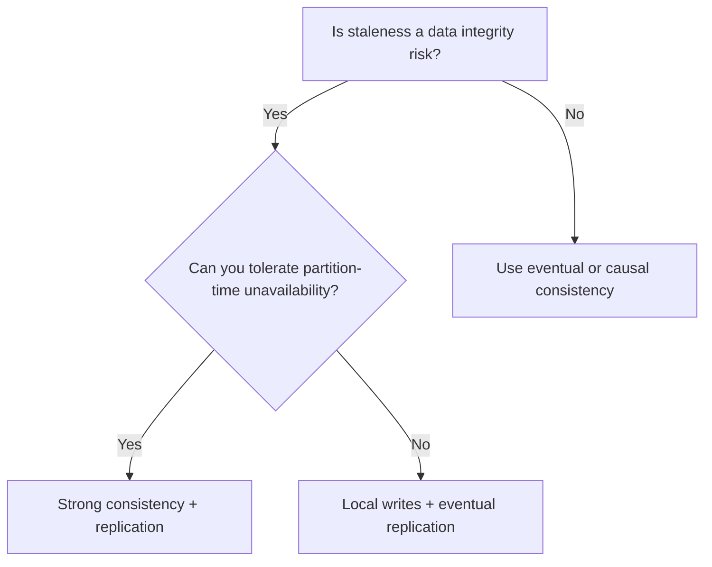

<Hero
  title="Strong Consistency"
  description="Linearizable/strict serializable semantics and when they are worth the trade‑offs"
  size="large"
/>

## TL;DR

Strong consistency (linearizability or strict serializability) ensures every read reflects the latest committed write globally. This simplifies application logic and prevents data anomalies but requires coordination overhead, reducing availability during network partitions and increasing latency. Use strong consistency only for critical invariants where stale reads are unacceptable.

## Learning Objectives

After reading this article, you will be able to:

- Define linearizability and strict serializability in plain language.
- Identify which application invariants require strong consistency.
- Explain the availability and latency trade-offs of strong consistency.
- Design systems that apply strong consistency selectively (only where needed).
- Distinguish between strong consistency and weaker models to choose the right fit.

## Motivating Scenario

Your company operates a payment platform. A customer makes a purchase of $100, and the transaction succeeds. Immediately after, they check their account balance from a different device. If weak consistency were used, the balance might still show the pre-purchase amount on the second device, causing confusion and trust issues. With strong consistency, every read globally reflects the latest write: the balance updates atomically, and the second device immediately sees the deducted amount. This eliminates anomalies and keeps financial state predictable—critical for compliance and user confidence.

The cost: every write must coordinate with distributed replicas, introducing latency (often 50–500ms in wide-area systems). If your system is partitioned and cannot reach the primary, writes must be blocked to maintain the guarantee.

## Core Concepts

### Definition: Linearizability

Linearizability is a safety property for concurrent systems. It guarantees that all operations appear to execute in a single, global total order, and each operation takes effect instantaneously between its invocation and response. In plain English:

1. Every read returns the result of the most recent write.
2. Operations don't see out-of-order effects (no time travel).
3. The order in which operations finish is the order in which they "really happened."

Example:
```
Timeline:
  Client A writes X=1 → succeeds at t=100
  Client B reads X   → returns 1 at t=150 (sees A's write)
  Client C writes X=2 → succeeds at t=200
  Client B reads X   → returns 2 at t=250 (sees C's write, not A's)
```

### Definition: Strict Serializability

Strict serializability combines linearizability with serializability of transactions. It ensures:

1. Multi-operation transactions execute atomically (all-or-nothing).
2. Transactions are ordered globally by commit time.
3. Each read in a transaction sees values committed before the transaction started.

This is the "holy grail" of consistency: the behavior users intuitively expect from a database.

### Implementation Mechanisms

#### Primary-Backup Replication
One primary replica accepts all writes and coordinates with backups (synchronously or asynchronously). Reads happen from the primary, ensuring global freshness. On primary failure, a backup is elected. This is simple but introduces a bottleneck: all traffic flows through one node.

#### Quorum-Based Systems
Writes must be acknowledged by a majority (quorum) of replicas before succeeding. Reads also consult a quorum to find the latest write. Example: Paxos, Raft, Zookeeper. This is more resilient than primary-backup but slower (require multiple round-trips).

#### Consensus Protocols
Replicas coordinate via algorithms like Raft or Paxos to agree on a total order of operations. Every replica applies operations in the same order, guaranteeing all copies are identical. Latency depends on the number of replicas and network quality.

#### Atomic Clocks and TrueTime
Google's Spanner uses atomic clocks with bounded error to assign logical timestamps to transactions. Combined with Paxos across regions, this provides strict serializability with global clock semantics.

### CAP and Trade-offs

The CAP Theorem states that in a distributed system, you can have at most two of:
- **Consistency** (strong)
- **Availability** (all requests succeed)
- **Partition tolerance** (system survives network splits)

Strong consistency sacrifices availability: if the system is partitioned and cannot reach quorum, writes are rejected to maintain the guarantee. This is the right choice for financial systems but wrong for real-time feeds.

<Figure caption="Decision flow: strong consistency is necessary only when invariants break under staleness.">

</Figure>

## Practical Example

Here's how to implement a strongly consistent counter using a replicated state machine (Raft-like consensus):

<Tabs>
  <TabItem value="python" label="Python">
```python
import time
from typing import Dict, List, Tuple
from enum import Enum

class ServerState(Enum):
    FOLLOWER = 1
    CANDIDATE = 2
    LEADER = 3

class LogEntry:
    def __init__(self, term: int, command: str, value: int):
        self.term = term
        self.command = command
        self.value = value

class RaftServer:
    """
    Simplified Raft implementation to demonstrate strong consistency.
    All servers maintain a log; the leader applies commands and replicates them.
    Reads must be served from the leader to ensure linearizability.
    """

    def __init__(self, server_id: str, peers: List["RaftServer"]):
        self.server_id = server_id
        self.peers = peers

        # Raft state
        self.current_term = 0
        self.voted_for = None
        self.log: List[LogEntry] = []
        self.state = ServerState.FOLLOWER

        # Volatile state
        self.commit_index = -1
        self.last_applied = -1
        self.state_machine = {"counter": 0}

        # Leader state
        self.next_index: Dict[str, int] = {}
        self.match_index: Dict[str, int] = {}

    def become_leader(self):
        """Become the leader and start replication."""
        self.state = ServerState.LEADER
        for peer in self.peers:
            self.next_index[peer.server_id] = len(self.log)
            self.match_index[peer.server_id] = -1
        print(f"[{self.server_id}] Became leader in term {self.current_term}")

    def append_entry(self, command: str, value: int) -> bool:
        """
        Client write request. Only the leader can accept writes.
        In real Raft, this would replicate to followers synchronously.
        """
        if self.state != ServerState.LEADER:
            print(f"[{self.server_id}] Not leader, rejecting write")
            return False

        # Append to log
        new_entry = LogEntry(self.current_term, command, value)
        self.log.append(new_entry)

        print(f"[{self.server_id}] Appended log entry: {command}={value} at index {len(self.log) - 1}")

        # In real Raft, we'd replicate to followers and await majority ACK
        # For this demo, assume successful replication to all
        self.match_index[self.server_id] = len(self.log) - 1

        # Update commit index (simple version: all entries from the leader are committed)
        old_commit = self.commit_index
        self.commit_index = len(self.log) - 1

        if old_commit != self.commit_index:
            self.apply_committed_entries()

        return True

    def apply_committed_entries(self):
        """Apply all committed entries to the state machine."""
        while self.last_applied < self.commit_index:
            self.last_applied += 1
            entry = self.log[self.last_applied]
            if entry.command == "increment":
                self.state_machine["counter"] += entry.value
            elif entry.command == "set":
                self.state_machine["counter"] = entry.value
            print(f"[{self.server_id}] Applied entry {self.last_applied}: counter={self.state_machine['counter']}")

    def read_counter(self) -> int:
        """
        Read the counter value. Only the leader can serve reads
        to guarantee linearizability (leader lease ensures staleness freedom).
        """
        if self.state != ServerState.LEADER:
            print(f"[{self.server_id}] Not leader, cannot serve linearizable read")
            return None

        # In real Raft, we'd check leader lease or issue a no-op to confirm leadership
        return self.state_machine["counter"]

    def replicate_to_peer(self, peer: "RaftServer"):
        """
        Replicate log entries to a peer (simplified).
        In real Raft, this respects next_index and match_index.
        """
        if self.state != ServerState.LEADER:
            return

        # Send all entries this peer hasn't seen
        for idx in range(self.next_index.get(peer.server_id, 0), len(self.log)):
            entry = self.log[idx]
            peer.replicate_entry(entry, idx, self.current_term)

    def replicate_entry(self, entry: LogEntry, index: int, leader_term: int):
        """Receive replicated entry from leader."""
        if leader_term >= self.current_term:
            self.current_term = leader_term
            self.state = ServerState.FOLLOWER

        # Append to log if not already present
        while len(self.log) <= index:
            self.log.append(None)
        if self.log[index] is None:
            self.log[index] = entry
            print(f"[{self.server_id}] Replicated entry at index {index}")

    def get_state(self) -> str:
        """Return the current state."""
        return f"State: {self.state.name}, Term: {self.current_term}, LogLen: {len(self.log)}, Counter: {self.state_machine['counter']}"

# Example usage: a cluster of 3 servers
def main():
    print("=== Strong Consistency with Raft ===\n")

    # Create servers (initially empty; will link peers)
    servers = [RaftServer(f"Server{i}", []) for i in range(1, 4)]

    # Link peers
    for server in servers:
        server.peers = [s for s in servers if s.server_id != server.server_id]

    # Elect Server1 as leader
    print("--- Election: Server1 becomes leader ---")
    servers[0].become_leader()
    servers[0].current_term = 1
    for server in servers:
        server.current_term = 1

    # Client writes increment counter
    print("\n--- Client writes increment=5 ---")
    servers[0].append_entry("increment", 5)

    # Replicate to followers
    print("\n--- Replication to followers ---")
    servers[0].replicate_to_peer(servers[1])
    servers[0].replicate_to_peer(servers[2])

    # Apply on followers (in real Raft, done by followers after receiving)
    for server in servers[1:]:
        if len(server.log) > 0:
            entry = server.log[0]
            server.state_machine["counter"] = entry.value

    # Leader reads
    print("\n--- Leader read ---")
    val = servers[0].read_counter()
    print(f"[Server1] Counter value: {val}")

    # Another client write
    print("\n--- Client writes increment=3 ---")
    servers[0].append_entry("increment", 3)

    # Replicate
    print("\n--- Replication to followers ---")
    servers[0].replicate_to_peer(servers[1])
    servers[0].replicate_to_peer(servers[2])

    # All servers update
    for server in servers[1:]:
        while len(server.log) <= servers[0].commit_index:
            idx = len(server.log)
            if idx < len(servers[0].log):
                server.log.append(servers[0].log[idx])
        # Apply
        if len(server.log) > 1:
            server.state_machine["counter"] = sum(e.value for e in server.log if e and e.command == "increment")

    # Final state
    print("\n--- Final state (all servers synchronized) ---")
    for server in servers:
        print(f"[{server.server_id}] {server.get_state()}")

if __name__ == "__main__":
    main()
```
  </TabItem>

  <TabItem value="go" label="Go">
```go
package main

import (
	"fmt"
	"sync"
)

type LogEntry struct {
	Term    int
	Command string
	Value   int
}

type RaftServer struct {
	ServerID     string
	Peers        []*RaftServer
	CurrentTerm  int
	VotedFor     *string
	Log          []LogEntry
	State        string // FOLLOWER, CANDIDATE, LEADER
	CommitIndex  int
	LastApplied  int
	StateMachine map[string]int
	NextIndex    map[string]int
	MatchIndex   map[string]int
	mu           sync.RWMutex
}

func NewRaftServer(id string) *RaftServer {
	return &RaftServer{
		ServerID:     id,
		Peers:        []*RaftServer{},
		CurrentTerm:  0,
		Log:          []LogEntry{},
		State:        "FOLLOWER",
		CommitIndex:  -1,
		LastApplied:  -1,
		StateMachine: map[string]int{"counter": 0},
		NextIndex:    make(map[string]int),
		MatchIndex:   make(map[string]int),
	}
}

func (rs *RaftServer) BecomeLeader() {
	rs.mu.Lock()
	defer rs.mu.Unlock()

	rs.State = "LEADER"
	for _, peer := range rs.Peers {
		rs.NextIndex[peer.ServerID] = len(rs.Log)
		rs.MatchIndex[peer.ServerID] = -1
	}
	fmt.Printf("[%s] Became leader in term %d\n", rs.ServerID, rs.CurrentTerm)
}

func (rs *RaftServer) AppendEntry(command string, value int) bool {
	rs.mu.Lock()
	defer rs.mu.Unlock()

	if rs.State != "LEADER" {
		fmt.Printf("[%s] Not leader, rejecting write\n", rs.ServerID)
		return false
	}

	newEntry := LogEntry{Term: rs.CurrentTerm, Command: command, Value: value}
	rs.Log = append(rs.Log, newEntry)
	fmt.Printf("[%s] Appended log entry: %s=%d at index %d\n", rs.ServerID, command, value, len(rs.Log)-1)

	rs.MatchIndex[rs.ServerID] = len(rs.Log) - 1

	oldCommit := rs.CommitIndex
	rs.CommitIndex = len(rs.Log) - 1
	if oldCommit != rs.CommitIndex {
		rs.applyCommittedEntries()
	}

	return true
}

func (rs *RaftServer) applyCommittedEntries() {
	for rs.LastApplied < rs.CommitIndex {
		rs.LastApplied++
		entry := rs.Log[rs.LastApplied]
		if entry.Command == "increment" {
			rs.StateMachine["counter"] += entry.Value
		} else if entry.Command == "set" {
			rs.StateMachine["counter"] = entry.Value
		}
		fmt.Printf("[%s] Applied entry %d: counter=%d\n", rs.ServerID, rs.LastApplied, rs.StateMachine["counter"])
	}
}

func (rs *RaftServer) ReadCounter() int {
	rs.mu.RLock()
	defer rs.mu.RUnlock()

	if rs.State != "LEADER" {
		fmt.Printf("[%s] Not leader, cannot serve linearizable read\n", rs.ServerID)
		return -1
	}

	return rs.StateMachine["counter"]
}

func (rs *RaftServer) ReplicateToPeer(peer *RaftServer) {
	rs.mu.RLock()
	defer rs.mu.RUnlock()

	if rs.State != "LEADER" {
		return
	}

	nextIdx := rs.NextIndex[peer.ServerID]
	for idx := nextIdx; idx < len(rs.Log); idx++ {
		entry := rs.Log[idx]
		peer.ReplicateEntry(&entry, idx, rs.CurrentTerm)
	}
}

func (rs *RaftServer) ReplicateEntry(entry *LogEntry, index int, leaderTerm int) {
	rs.mu.Lock()
	defer rs.mu.Unlock()

	if leaderTerm >= rs.CurrentTerm {
		rs.CurrentTerm = leaderTerm
		rs.State = "FOLLOWER"
	}

	for len(rs.Log) <= index {
		rs.Log = append(rs.Log, LogEntry{})
	}

	if rs.Log[index].Term == 0 {
		rs.Log[index] = *entry
		fmt.Printf("[%s] Replicated entry at index %d\n", rs.ServerID, index)
	}
}

func (rs *RaftServer) GetState() string {
	rs.mu.RLock()
	defer rs.mu.RUnlock()

	return fmt.Sprintf("State: %s, Term: %d, LogLen: %d, Counter: %d",
		rs.State, rs.CurrentTerm, len(rs.Log), rs.StateMachine["counter"])
}

func main() {
	fmt.Println("=== Strong Consistency with Raft ===\n")

	servers := make([]*RaftServer, 3)
	for i := 0; i < 3; i++ {
		servers[i] = NewRaftServer(fmt.Sprintf("Server%d", i+1))
	}

	for _, server := range servers {
		for _, s := range servers {
			if s.ServerID != server.ServerID {
				server.Peers = append(server.Peers, s)
			}
		}
	}

	fmt.Println("--- Election: Server1 becomes leader ---")
	servers[0].BecomeLeader()
	servers[0].CurrentTerm = 1
	for _, server := range servers {
		server.CurrentTerm = 1
	}

	fmt.Println("\n--- Client writes increment=5 ---")
	servers[0].AppendEntry("increment", 5)

	fmt.Println("\n--- Replication to followers ---")
	servers[0].ReplicateToPeer(servers[1])
	servers[0].ReplicateToPeer(servers[2])

	fmt.Println("\n--- Leader read ---")
	val := servers[0].ReadCounter()
	fmt.Printf("[Server1] Counter value: %d\n", val)

	fmt.Println("\n--- Client writes increment=3 ---")
	servers[0].AppendEntry("increment", 3)

	fmt.Println("\n--- Final state ---")
	for _, server := range servers {
		fmt.Printf("[%s] %s\n", server.ServerID, server.GetState())
	}
}
```
  </TabItem>

  <TabItem value="nodejs" label="Node.js">
```javascript
class RaftServer {
  constructor(serverId) {
    this.serverId = serverId;
    this.peers = [];
    this.currentTerm = 0;
    this.votedFor = null;
    this.log = [];
    this.state = "FOLLOWER";
    this.commitIndex = -1;
    this.lastApplied = -1;
    this.stateMachine = { counter: 0 };
    this.nextIndex = new Map();
    this.matchIndex = new Map();
  }

  becomeLeader() {
    this.state = "LEADER";
    for (const peer of this.peers) {
      this.nextIndex.set(peer.serverId, this.log.length);
      this.matchIndex.set(peer.serverId, -1);
    }
    console.log(`[${this.serverId}] Became leader in term ${this.currentTerm}`);
  }

  appendEntry(command, value) {
    if (this.state !== "LEADER") {
      console.log(`[${this.serverId}] Not leader, rejecting write`);
      return false;
    }

    const newEntry = { term: this.currentTerm, command, value };
    this.log.push(newEntry);
    console.log(`[${this.serverId}] Appended log entry: ${command}=${value} at index ${this.log.length - 1}`);

    this.matchIndex.set(this.serverId, this.log.length - 1);

    const oldCommit = this.commitIndex;
    this.commitIndex = this.log.length - 1;

    if (oldCommit !== this.commitIndex) {
      this.applyCommittedEntries();
    }

    return true;
  }

  applyCommittedEntries() {
    while (this.lastApplied < this.commitIndex) {
      this.lastApplied++;
      const entry = this.log[this.lastApplied];
      if (entry.command === "increment") {
        this.stateMachine.counter += entry.value;
      } else if (entry.command === "set") {
        this.stateMachine.counter = entry.value;
      }
      console.log(`[${this.serverId}] Applied entry ${this.lastApplied}: counter=${this.stateMachine.counter}`);
    }
  }

  readCounter() {
    if (this.state !== "LEADER") {
      console.log(`[${this.serverId}] Not leader, cannot serve linearizable read`);
      return -1;
    }

    return this.stateMachine.counter;
  }

  replicateToPeer(peer) {
    if (this.state !== "LEADER") {
      return;
    }

    const nextIdx = this.nextIndex.get(peer.serverId) || 0;
    for (let idx = nextIdx; idx < this.log.length; idx++) {
      const entry = this.log[idx];
      peer.replicateEntry(entry, idx, this.currentTerm);
    }
  }

  replicateEntry(entry, index, leaderTerm) {
    if (leaderTerm >= this.currentTerm) {
      this.currentTerm = leaderTerm;
      this.state = "FOLLOWER";
    }

    while (this.log.length <= index) {
      this.log.push(null);
    }

    if (this.log[index] === null) {
      this.log[index] = entry;
      console.log(`[${this.serverId}] Replicated entry at index ${index}`);
    }
  }

  getState() {
    return `State: ${this.state}, Term: ${this.currentTerm}, LogLen: ${this.log.length}, Counter: ${this.stateMachine.counter}`;
  }
}

// Main
console.log("=== Strong Consistency with Raft ===\n");

const servers = Array.from({ length: 3 }, (_, i) => new RaftServer(`Server${i + 1}`));

for (const server of servers) {
  server.peers = servers.filter(s => s.serverId !== server.serverId);
}

console.log("--- Election: Server1 becomes leader ---");
servers[0].becomeLeader();
servers[0].currentTerm = 1;
for (const server of servers) {
  server.currentTerm = 1;
}

console.log("\n--- Client writes increment=5 ---");
servers[0].appendEntry("increment", 5);

console.log("\n--- Replication to followers ---");
servers[0].replicateToPeer(servers[1]);
servers[0].replicateToPeer(servers[2]);

console.log("\n--- Leader read ---");
const val = servers[0].readCounter();
console.log(`[Server1] Counter value: ${val}`);

console.log("\n--- Client writes increment=3 ---");
servers[0].appendEntry("increment", 3);

console.log("\n--- Final state ---");
for (const server of servers) {
  console.log(`[${server.serverId}] ${server.getState()}`);
}
```
  </TabItem>
</Tabs>

## When to Use / When NOT to Use

<Vs highlight={[0, 1]} items={[
{
    label: "Use Strong Consistency",
    points: [
      "Financial transactions and money transfers (invariants on account balance)",
      "Global unique constraints (user IDs, order numbers, email addresses)"
    ],
    highlightTone: "positive"
  },
{
    label: "Avoid Strong Consistency",
    points: [
      "Consensus-critical data (configuration, permissions, role assignments)",
      "Regulatory or audit requirements (banking, healthcare, legal holds)",
      "Small, read-heavy datasets where coordination cost is acceptable"
    ],
    highlightTone: "warning"
  }
]} />

## Patterns & Pitfalls

<Showcase sections={[
  {
    label: "Hybrid Consistency: Apply Selective Coordination",
    body: `Not all data requires strong consistency. Partition your system: critical data (user identity, financial state) uses strong consistency and quorum writes; non-critical data (analytics, cache) uses eventual consistency. This reduces coordination overhead while protecting invariants.`
  ,
    body: `Not all data requires strong consistency. Partition your system: critical data (user identity, financial state) uses strong consistency and quorum writes; non-critical data (analytics, cache) uses eventual consistency. This reduces coordination overhead while protecting invariants.`
  ,
    highlightTone: "warning"
  },
  {
    label: "Read Leases and Leader Elections",
    body: `Strong consistency requires the leader to be authoritative. Use read leases: after a leader reads, it holds a lease guaranteeing no other leader is elected during that time. This avoids expensive quorum reads on every operation.`
  },
  {
    label: "Batching and Pipelining",
    body: `Coordinate multiple writes in a single consensus round. Instead of synchronizing every write individually, batch writes and commit them together. This amortizes coordination cost and improves throughput.`
  },
  {
    label: "Pitfall: Coordination Bottleneck",
    body: `If all writes funnel through a single leader, you have a performance bottleneck. Mitigation: partition data by region or sharding key, so each shard has its own leader. Then use eventual consistency between shards.`
  },
  {
    label: "Pitfall: Network Partition = Unavailability",
    body: `During a network partition, if quorum is not reachable, writes block indefinitely. This is the necessary trade-off for strong consistency. Monitor partition detection and have failover procedures ready.`
  },
  {
    label: "Testing: Chaos and Jepsen",
    body: `Strong consistency claims are easy to make, hard to verify. Use Jepsen, Chaos Mesh, or similar to inject faults (network delays, partitions, crashes) and verify invariants. Test with real workloads and fault scenarios.`
  }
]} />

## Design Review Checklist

<Checklist items={[
  "Have you identified which data truly requires strong consistency vs. eventual?",
  "Is the coordination cost (latency, reduced availability) acceptable for your SLOs?",
  "Are you using a battle-tested consensus protocol (Raft, Paxos) or building your own?",
  "Do you have read-lease or leader-election mechanisms to reduce quorum reads?",
  "Is data partitioned/sharded to avoid a single coordination bottleneck?",
  "Have you tested availability under network partitions and leader failures?",
  "Is there a clear failover plan if quorum is lost (e.g., manual intervention)?",
  "Are you monitoring replication lag, quorum round-trip time, and write latency?",
  "Have you tested invariants with Jepsen or similar fault-injection tools?",
  "Is the cost of strong consistency clearly documented for the team?"
]} />

## Self-Check

Before adopting strong consistency, ask yourself:

1. **Invariant criticality**: Will stale reads break my application's correctness or user trust? If yes, strong consistency may be necessary. If no, eventual consistency is simpler and faster.

2. **Scale and latency**: Can my users tolerate 50–500ms coordination overhead per write? If your SLO is under 100ms, strong consistency is risky unless data volume is small and co-located.

3. **Partition tolerance**: Does my deployment require partition tolerance (global regions, WAN), or is it single-region? Wide-area strong consistency is expensive; local systems can afford it more easily.

4. **Operational readiness**: Do I have the operational expertise to debug and recover from consensus failures? Strong consistency requires sophisticated tooling and deep understanding.

## Next Steps

- **Classify your data**: Audit what data truly needs strong consistency (usually 10–20% of total data).
- **Choose a consensus library**: Use a proven implementation (Raft, Paxos) rather than rolling your own.
- **Design read leases**: Implement mechanisms to reduce quorum reads and improve read latency.
- **Partition data**: Shard by region or sharding key so coordination is local, not global.
- **Monitor and test**: Track replication lag, latency, availability; use Jepsen to verify invariants.
- **Document trade-offs**: Make it explicit which data is strongly consistent and why.

## References

1. <a href="https://jepsen.io/consistency" target="_blank" rel="nofollow noopener noreferrer">Jepsen: Consistency Models ↗️</a>
2. <a href="https://martin.kleppmann.com/2015/05/07/consistency.html" target="_blank" rel="nofollow noopener noreferrer">Martin Kleppmann: Consistency and Consensus ↗️</a>
3. <a href="https://raft.github.io/" target="_blank" rel="nofollow noopener noreferrer">Raft Consensus Protocol ↗️</a>
4. <a href="https://cloud.google.com/spanner/docs/true-time" target="_blank" rel="nofollow noopener noreferrer">Google Spanner: TrueTime ↗️</a>