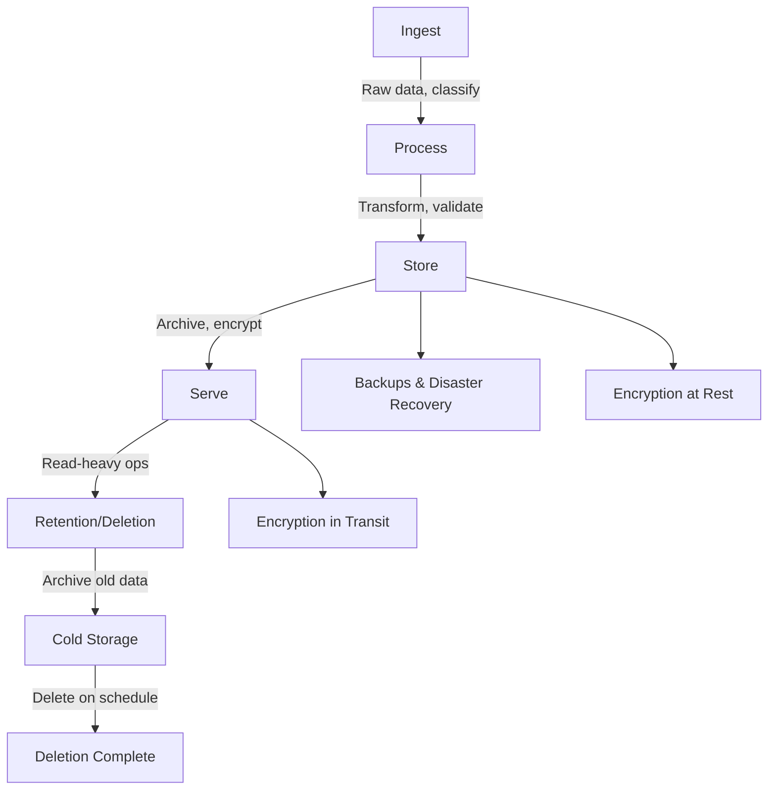

<Hero
  title="Data Lifecycle"
  description="Ingest → process → store → serve → archive—design for compliance, cost, and access patterns"
  size="large"
/>

## TL;DR

Map each stage of data (ingest, process, store, serve, archive) to clear owners, SLAs, controls, and costs. Classify data on write (PII, secrets, public); apply encryption at rest and in transit; automate retention policies and deletion; track lineage and audit access. Treat data governance as a first-class concern, not an afterthought.

## Learning Objectives

After reading this article, you will be able to:

- Design a data lifecycle strategy aligned with compliance, cost, and business requirements.
- Classify data by sensitivity and apply appropriate controls at each stage.
- Implement automated retention and deletion policies.
- Track data lineage and access for audit purposes.
- Balance data utility (freshness, availability) with privacy and cost.

## Motivating Scenario

Your e-commerce company ingests user activity, payment data, and product information daily. Some data (order history) must be kept for 7 years for tax compliance. Other data (IP addresses, session cookies) should be deleted after 30 days. Without a lifecycle strategy, you accumulate storage debt: expensive cold storage, regulatory risk, and privacy violations. With proper lifecycle management: data flows through hot (operational) → warm (analytical) → cold (archive) → deletion tiers. PII is encrypted and access is audited. Costs drop 60%, compliance improves, and users trust their data is deleted when promised.

## Core Concepts

### The Five Stages of Data Lifecycle

<Figure caption="Data lifecycle from creation through deletion, with policy gates and cost transitions at each stage.">

</Figure>

#### 1. Ingest
Data enters the system from sources: user APIs, databases, event streams, file uploads, sensors.

**Key concerns:**
- **Classification**: Mark data with sensitivity labels (public, internal, PII, secret, health).
- **Validation**: Check schema, integrity, and completeness.
- **Deduplication**: Avoid duplicate records in the pipeline.
- **Sampling**: For high-volume streams, consider sampling for cost-efficiency.

#### 2. Process
Data is transformed, enriched, and validated.

**Key concerns:**
- **Encryption in transit**: Use TLS for all data movement.
- **Access controls**: Only authorized services process sensitive data.
- **Lineage tracking**: Log which source data produced which output.
- **Error handling**: Quarantine bad data and alert.

#### 3. Store
Data is persisted to a database, data lake, or data warehouse.

**Key concerns:**
- **Encryption at rest**: All databases should encrypt data by default.
- **Backup and DR**: Regular backups with tested recovery procedures.
- **Partitioning**: Partition by retention class (hot, warm, cold) for efficient deletion.
- **Indexing**: Create indexes for common access patterns.

#### 4. Serve
Data is queried for operational or analytical use.

**Key concerns:**
- **Access controls**: Row-level security (RLS) for sensitive datasets.
- **Audit logging**: Track who accessed what, when, and why.
- **Caching**: Cache frequently accessed data to reduce query load.
- **Data residency**: Keep data in-region for compliance (GDPR, etc.).

#### 5. Retention & Deletion
Data ages out according to policy.

**Key concerns:**
- **Retention periods**: Regulatory (7 years for financial), operational (30 days for logs), privacy (right to be forgotten).
- **Automated purge**: Schedule jobs to delete expired data.
- **Compliance verification**: Prove deletion occurred via audit logs.
- **Undelete safety**: Hold deleted data in a quarantine before permanent deletion (e.g., 24h grace period).

### Data Classification and Sensitivity

Classify data at ingest time:

| Class | Examples | Retention | Encryption | Access | Risk |
|-------|----------|-----------|-----------|--------|------|
| **Public** | Product catalog, published docs | Per policy | No (optional) | Anyone | Low |
| **Internal** | Employee directory, company metrics | Per policy | Recommended | Employees | Medium |
| **PII** | Names, emails, phone numbers | Up to legal max | Required | Minimal (service) | High |
| **Secrets** | API keys, passwords, tokens | Until revoked | Required | Single service | Critical |
| **Payment Card** | Credit cards, bank accounts | Up to 7 years | Required (HSM) | Audited | Critical |
| **Health** | Medical records, diagnoses | Up to 7-10 years | Required | Minimal + audit | Critical |

### Practical Example: Tiered Data Storage

<Tabs>
  <TabItem value="python" label="Python">
```python
from enum import Enum
from datetime import datetime, timedelta
from typing import Dict, List, Optional
import json

class DataClass(Enum):
    PUBLIC = "public"
    INTERNAL = "internal"
    PII = "pii"
    PAYMENT_CARD = "payment_card"
    SECRETS = "secrets"

class RetentionPolicy:
    def __init__(self, data_class: DataClass, retention_days: int, tier_transitions: Dict[str, int]):
        self.data_class = data_class
        self.retention_days = retention_days
        self.tier_transitions = tier_transitions  # e.g., {"hot": 30, "warm": 90, "cold": 365}

    def get_tier(self, days_old: int) -> str:
        """Determine which storage tier based on age."""
        tiers = sorted(self.tier_transitions.items(), key=lambda x: x[1])
        for tier, threshold in tiers:
            if days_old <= threshold:
                return tier
        return "archive"

    def should_delete(self, days_old: int) -> bool:
        """Check if data should be deleted."""
        return days_old >= self.retention_days

class DataRecord:
    def __init__(self, record_id: str, data_class: DataClass, data: Dict, created_at: datetime):
        self.record_id = record_id
        self.data_class = data_class
        self.data = data
        self.created_at = created_at
        self.encrypted = False
        self.access_log: List[Dict] = []

    def encrypt(self) -> None:
        """Mark as encrypted (in practice, use a real encryption library)."""
        self.encrypted = True
        print(f"[DataRecord {self.record_id}] Encrypted (class={self.data_class.value})")

    def log_access(self, user_id: str, purpose: str) -> None:
        """Log access for audit trail."""
        self.access_log.append({
            "user_id": user_id,
            "purpose": purpose,
            "timestamp": datetime.utcnow().isoformat(),
            "data_class": self.data_class.value
        })

    def get_age_days(self) -> int:
        """Get age in days."""
        return (datetime.utcnow() - self.created_at).days

class DataLifecycleManager:
    def __init__(self):
        self.records: Dict[str, DataRecord] = {}
        self.policies = {
            DataClass.PUBLIC: RetentionPolicy(DataClass.PUBLIC, 730, {"hot": 90, "warm": 365}),
            DataClass.INTERNAL: RetentionPolicy(DataClass.INTERNAL, 365, {"hot": 60, "warm": 180}),
            DataClass.PII: RetentionPolicy(DataClass.PII, 180, {"hot": 30, "warm": 90}),
            DataClass.PAYMENT_CARD: RetentionPolicy(DataClass.PAYMENT_CARD, 2555, {"hot": 365, "warm": 1095}),  # 7 years
            DataClass.SECRETS: RetentionPolicy(DataClass.SECRETS, 7, {"hot": 0, "warm": 3}),
        }
        self.deleted_records: List[str] = []

    def ingest(self, record_id: str, data_class: DataClass, data: Dict) -> DataRecord:
        """Ingest data, classify, and encrypt."""
        record = DataRecord(record_id, data_class, data, datetime.utcnow())

        # Encrypt sensitive data immediately
        if data_class in [DataClass.PII, DataClass.PAYMENT_CARD, DataClass.SECRETS]:
            record.encrypt()

        self.records[record_id] = record
        print(f"[Ingest] Record {record_id} (class={data_class.value}) ingested and stored")
        return record

    def serve(self, record_id: str, user_id: str, purpose: str) -> Optional[Dict]:
        """Serve data with access logging."""
        record = self.records.get(record_id)
        if not record:
            print(f"[Serve] Record {record_id} not found")
            return None

        record.log_access(user_id, purpose)
        print(f"[Serve] Record {record_id} served to {user_id} for {purpose}")
        return record.data

    def process_lifecycle(self) -> Dict[str, int]:
        """Process all records: tier, archive, or delete."""
        stats = {"hot": 0, "warm": 0, "cold": 0, "archive": 0, "deleted": 0}

        records_to_delete = []
        for record_id, record in self.records.items():
            policy = self.policies[record.data_class]
            age_days = record.get_age_days()

            if policy.should_delete(age_days):
                records_to_delete.append(record_id)
                stats["deleted"] += 1
                print(f"[Lifecycle] Record {record_id} (age={age_days}d) scheduled for deletion")
            else:
                tier = policy.get_tier(age_days)
                stats[tier] += 1
                print(f"[Lifecycle] Record {record_id} (age={age_days}d) → {tier} tier")

        # Delete records
        for record_id in records_to_delete:
            del self.records[record_id]
            self.deleted_records.append(record_id)

        return stats

    def audit_access(self, data_class: Optional[DataClass] = None) -> List[Dict]:
        """Generate audit report of all accesses."""
        audit = []
        for record_id, record in self.records.items():
            if data_class and record.data_class != data_class:
                continue
            for access in record.access_log:
                audit.append({
                    "record_id": record_id,
                    **access
                })
        return audit

# Example usage
def main():
    print("=== Data Lifecycle Management ===\n")

    manager = DataLifecycleManager()

    # Ingest various data types
    print("--- Ingest Phase ---")
    manager.ingest("user:001", DataClass.PII, {"name": "Alice", "email": "alice@example.com"})
    manager.ingest("card:001", DataClass.PAYMENT_CARD, {"last_four": "4242", "expiry": "12/25"})
    manager.ingest("log:001", DataClass.SECRETS, {"api_key": "sk_live_***"})
    manager.ingest("product:001", DataClass.PUBLIC, {"sku": "ABC123", "price": 29.99})

    # Serve and audit
    print("\n--- Serve Phase ---")
    manager.serve("user:001", "user_service", "order_processing")
    manager.serve("user:001", "analytics_service", "user_cohort_analysis")
    manager.serve("product:001", "api", "product_detail_page")

    # Simulate aging
    print("\n--- Simulate Aging (modify created_at for demo) ---")
    # In real systems, records age naturally over time
    manager.records["log:001"].created_at = datetime.utcnow() - timedelta(days=10)
    manager.records["card:001"].created_at = datetime.utcnow() - timedelta(days=100)

    # Process lifecycle
    print("\n--- Lifecycle Processing ---")
    stats = manager.process_lifecycle()
    print(f"\nTiering Summary: {stats}")

    # Audit trail
    print("\n--- Audit Trail (PII access) ---")
    audit = manager.audit_access(DataClass.PII)
    for entry in audit:
        print(f"  {entry['record_id']}: {entry['user_id']} accessed for {entry['purpose']} @ {entry['timestamp']}")

    # Summary
    print(f"\n--- Final State ---")
    print(f"Active records: {len(manager.records)}")
    print(f"Deleted records: {len(manager.deleted_records)}")

if __name__ == "__main__":
    main()
```
  </TabItem>

  <TabItem value="go" label="Go">
```go
package main

import (
	"fmt"
	"time"
)

type DataClass int

const (
	PUBLIC DataClass = iota
	INTERNAL
	PII
	PAYMENT_CARD
	SECRETS
)

func (dc DataClass) String() string {
	switch dc {
	case PUBLIC:
		return "public"
	case INTERNAL:
		return "internal"
	case PII:
		return "pii"
	case PAYMENT_CARD:
		return "payment_card"
	case SECRETS:
		return "secrets"
	default:
		return "unknown"
	}
}

type RetentionPolicy struct {
	DataClass         DataClass
	RetentionDays     int
	TierTransitions   map[string]int // tier -> threshold (days)
}

func (rp *RetentionPolicy) GetTier(daysOld int) string {
	tiers := []string{"hot", "warm", "cold"}
	for _, tier := range tiers {
		if threshold, ok := rp.TierTransitions[tier]; ok && daysOld <= threshold {
			return tier
		}
	}
	return "archive"
}

func (rp *RetentionPolicy) ShouldDelete(daysOld int) bool {
	return daysOld >= rp.RetentionDays
}

type AccessLog struct {
	UserID    string
	Purpose   string
	Timestamp time.Time
}

type DataRecord struct {
	RecordID  string
	DataClass DataClass
	Data      map[string]interface{}
	CreatedAt time.Time
	Encrypted bool
	AccessLog []AccessLog
}

func NewDataRecord(id string, class DataClass, data map[string]interface{}) *DataRecord {
	return &DataRecord{
		RecordID:  id,
		DataClass: class,
		Data:      data,
		CreatedAt: time.Now(),
		Encrypted: false,
		AccessLog: []AccessLog{},
	}
}

func (dr *DataRecord) Encrypt() {
	dr.Encrypted = true
	fmt.Printf("[DataRecord %s] Encrypted (class=%s)\n", dr.RecordID, dr.DataClass)
}

func (dr *DataRecord) LogAccess(userID, purpose string) {
	dr.AccessLog = append(dr.AccessLog, AccessLog{
		UserID:    userID,
		Purpose:   purpose,
		Timestamp: time.Now(),
	})
}

func (dr *DataRecord) GetAgeDays() int {
	return int(time.Since(dr.CreatedAt).Hours() / 24)
}

type DataLifecycleManager struct {
	Records        map[string]*DataRecord
	Policies       map[DataClass]*RetentionPolicy
	DeletedRecords []string
}

func NewDataLifecycleManager() *DataLifecycleManager {
	policies := make(map[DataClass]*RetentionPolicy)
	policies[PUBLIC] = &RetentionPolicy{
		DataClass:     PUBLIC,
		RetentionDays: 730,
		TierTransitions: map[string]int{"hot": 90, "warm": 365},
	}
	policies[PII] = &RetentionPolicy{
		DataClass:     PII,
		RetentionDays: 180,
		TierTransitions: map[string]int{"hot": 30, "warm": 90},
	}
	policies[PAYMENT_CARD] = &RetentionPolicy{
		DataClass:     PAYMENT_CARD,
		RetentionDays: 2555,
		TierTransitions: map[string]int{"hot": 365, "warm": 1095},
	}

	return &DataLifecycleManager{
		Records:        make(map[string]*DataRecord),
		Policies:       policies,
		DeletedRecords: []string{},
	}
}

func (dlm *DataLifecycleManager) Ingest(id string, class DataClass, data map[string]interface{}) *DataRecord {
	record := NewDataRecord(id, class, data)

	if class == PII || class == PAYMENT_CARD || class == SECRETS {
		record.Encrypt()
	}

	dlm.Records[id] = record
	fmt.Printf("[Ingest] Record %s (class=%s) ingested and stored\n", id, class)
	return record
}

func (dlm *DataLifecycleManager) Serve(id, userID, purpose string) map[string]interface{} {
	record, ok := dlm.Records[id]
	if !ok {
		fmt.Printf("[Serve] Record %s not found\n", id)
		return nil
	}

	record.LogAccess(userID, purpose)
	fmt.Printf("[Serve] Record %s served to %s for %s\n", id, userID, purpose)
	return record.Data
}

func (dlm *DataLifecycleManager) ProcessLifecycle() map[string]int {
	stats := map[string]int{
		"hot":     0,
		"warm":    0,
		"cold":    0,
		"archive": 0,
		"deleted": 0,
	}

	var recordsToDelete []string

	for id, record := range dlm.Records {
		policy, ok := dlm.Policies[record.DataClass]
		if !ok {
			continue
		}

		ageDays := record.GetAgeDays()

		if policy.ShouldDelete(ageDays) {
			recordsToDelete = append(recordsToDelete, id)
			stats["deleted"]++
			fmt.Printf("[Lifecycle] Record %s (age=%dd) scheduled for deletion\n", id, ageDays)
		} else {
			tier := policy.GetTier(ageDays)
			stats[tier]++
			fmt.Printf("[Lifecycle] Record %s (age=%dd) → %s tier\n", id, ageDays, tier)
		}
	}

	for _, id := range recordsToDelete {
		delete(dlm.Records, id)
		dlm.DeletedRecords = append(dlm.DeletedRecords, id)
	}

	return stats
}

func main() {
	fmt.Println("=== Data Lifecycle Management ===\n")

	manager := NewDataLifecycleManager()

	fmt.Println("--- Ingest Phase ---")
	manager.Ingest("user:001", PII, map[string]interface{}{"name": "Alice", "email": "alice@example.com"})
	manager.Ingest("card:001", PAYMENT_CARD, map[string]interface{}{"last_four": "4242"})
	manager.Ingest("log:001", SECRETS, map[string]interface{}{"api_key": "sk_live_***"})
	manager.Ingest("product:001", PUBLIC, map[string]interface{}{"sku": "ABC123", "price": 29.99})

	fmt.Println("\n--- Serve Phase ---")
	manager.Serve("user:001", "user_service", "order_processing")
	manager.Serve("product:001", "api", "product_detail_page")

	fmt.Println("\n--- Lifecycle Processing ---")
	stats := manager.ProcessLifecycle()
	fmt.Printf("\nTiering Summary: %v\n", stats)

	fmt.Printf("\n--- Final State ---\n")
	fmt.Printf("Active records: %d\n", len(manager.Records))
	fmt.Printf("Deleted records: %d\n", len(manager.DeletedRecords))
}
```
  </TabItem>

  <TabItem value="nodejs" label="Node.js">
```javascript
const DataClass = {
  PUBLIC: "public",
  INTERNAL: "internal",
  PII: "pii",
  PAYMENT_CARD: "payment_card",
  SECRETS: "secrets",
};

class RetentionPolicy {
  constructor(dataClass, retentionDays, tierTransitions) {
    this.dataClass = dataClass;
    this.retentionDays = retentionDays;
    this.tierTransitions = tierTransitions; // { "hot": 30, "warm": 90 }
  }

  getTier(daysOld) {
    const tiers = Object.entries(this.tierTransitions)
      .sort((a, b) => a[1] - b[1]);

    for (const [tier, threshold] of tiers) {
      if (daysOld <= threshold) {
        return tier;
      }
    }
    return "archive";
  }

  shouldDelete(daysOld) {
    return daysOld >= this.retentionDays;
  }
}

class DataRecord {
  constructor(recordId, dataClass, data) {
    this.recordId = recordId;
    this.dataClass = dataClass;
    this.data = data;
    this.createdAt = new Date();
    this.encrypted = false;
    this.accessLog = [];
  }

  encrypt() {
    this.encrypted = true;
    console.log(`[DataRecord ${this.recordId}] Encrypted (class=${this.dataClass})`);
  }

  logAccess(userId, purpose) {
    this.accessLog.push({
      userId,
      purpose,
      timestamp: new Date().toISOString(),
    });
  }

  getAgeDays() {
    const now = new Date();
    const diffMs = now - this.createdAt;
    return Math.floor(diffMs / (1000 * 60 * 60 * 24));
  }
}

class DataLifecycleManager {
  constructor() {
    this.records = new Map();
    this.deletedRecords = [];
    this.policies = {
      [DataClass.PUBLIC]: new RetentionPolicy(DataClass.PUBLIC, 730, {
        hot: 90,
        warm: 365,
      }),
      [DataClass.PII]: new RetentionPolicy(DataClass.PII, 180, {
        hot: 30,
        warm: 90,
      }),
      [DataClass.PAYMENT_CARD]: new RetentionPolicy(DataClass.PAYMENT_CARD, 2555, {
        hot: 365,
        warm: 1095,
      }),
    };
  }

  ingest(recordId, dataClass, data) {
    const record = new DataRecord(recordId, dataClass, data);

    if ([DataClass.PII, DataClass.PAYMENT_CARD, DataClass.SECRETS].includes(dataClass)) {
      record.encrypt();
    }

    this.records.set(recordId, record);
    console.log(
      `[Ingest] Record ${recordId} (class=${dataClass}) ingested and stored`
    );
    return record;
  }

  serve(recordId, userId, purpose) {
    const record = this.records.get(recordId);
    if (!record) {
      console.log(`[Serve] Record ${recordId} not found`);
      return null;
    }

    record.logAccess(userId, purpose);
    console.log(`[Serve] Record ${recordId} served to ${userId} for ${purpose}`);
    return record.data;
  }

  processLifecycle() {
    const stats = { hot: 0, warm: 0, cold: 0, archive: 0, deleted: 0 };
    const recordsToDelete = [];

    for (const [recordId, record] of this.records) {
      const policy = this.policies[record.dataClass];
      if (!policy) continue;

      const ageDays = record.getAgeDays();

      if (policy.shouldDelete(ageDays)) {
        recordsToDelete.push(recordId);
        stats.deleted++;
        console.log(
          `[Lifecycle] Record ${recordId} (age=${ageDays}d) scheduled for deletion`
        );
      } else {
        const tier = policy.getTier(ageDays);
        stats[tier]++;
        console.log(`[Lifecycle] Record ${recordId} (age=${ageDays}d) → ${tier} tier`);
      }
    }

    for (const recordId of recordsToDelete) {
      this.records.delete(recordId);
      this.deletedRecords.push(recordId);
    }

    return stats;
  }
}

// Main
console.log("=== Data Lifecycle Management ===\n");

const manager = new DataLifecycleManager();

console.log("--- Ingest Phase ---");
manager.ingest("user:001", DataClass.PII, {
  name: "Alice",
  email: "alice@example.com",
});
manager.ingest("card:001", DataClass.PAYMENT_CARD, { last_four: "4242" });
manager.ingest("log:001", DataClass.SECRETS, { api_key: "sk_live_***" });
manager.ingest("product:001", DataClass.PUBLIC, { sku: "ABC123", price: 29.99 });

console.log("\n--- Serve Phase ---");
manager.serve("user:001", "user_service", "order_processing");
manager.serve("product:001", "api", "product_detail_page");

console.log("\n--- Lifecycle Processing ---");
const stats = manager.processLifecycle();
console.log(`\nTiering Summary:`, stats);

console.log(`\n--- Final State ---`);
console.log(`Active records: ${manager.records.size}`);
console.log(`Deleted records: ${manager.deletedRecords.length}`);
```
  </TabItem>
</Tabs>

## When to Use / When NOT to Use

<Vs items={[
{label: "Implement Full Lifecycle Management", points: [
      "Systems with regulatory requirements (GDPR, CCPA, HIPAA, SOX)",
      "Large-scale data systems where storage cost is significant",
      "Systems handling PII, payment data, or health information",
      "Multi-region deployments with data residency requirements",
      "Applications with explicit retention and deletion policies"
    ]},
{label: "Simpler Approach May Suffice", points: [
      "Small datasets (< 10GB) where storage cost is negligible",
      "Short-lived data (caches, sessions) with implicit expiry",
      "Single-region, single-storage-tier systems",
      "Systems without regulatory requirements or PII",
      "MVP products validating a hypothesis (lifecycle later)"
    ]}
]} highlight={[0, 1]} />

## Patterns & Pitfalls

<Showcase sections={[
  {
    label: "Tiered Storage",
    body: `Move data through hot → warm → cold → archive tiers based on age. Hot (SSD, fast): recent, frequently accessed data. Warm (disk): older but occasionally needed. Cold (tape, cloud archive): rarely accessed. Archive (offline): legally required but practically inaccessible. This reduces costs 80%+.`
  },
  {
    label: "Data Classification at Ingest",
    body: `Classify every record at creation time using metadata or schema hints. PII, secrets, and regulated data get automatic encryption and audit logging. Public data skips overhead. Misclassification is the root of many data leaks.`
  },
  {
    label: "Automated Deletion with Grace Period",
    body: `Schedule deletion but hold records in quarantine for 24-48 hours. This prevents accidental deletion from bugs or misconfigurations. After grace period, permanently delete (overwrite on disk, no recovery).`
  },
  {
    label: "Pitfall: Orphaned Data",
    body: `Data lingers in backups, caches, or old replicas long after the primary is deleted. Track all replicas and backups; apply deletion uniformly. Use immutable backups or WAL-based backup systems for easier cleanup.`
  },
  {
    label: "Pitfall: Retention Policy Blindness",
    body: `Teams forget what retention policies are in place, leading to either over-retention (cost waste) or under-retention (compliance risk). Document policies in code; automate enforcement.`
  },
  {
    label: "Audit Trail for Compliance",
    body: `Log all access to sensitive data: who, what, when, why. Store audit logs in a write-once system. Auditors will ask for this log; it also helps detect suspicious access.`
  }
]} />

## Design Review Checklist

<Checklist items={[
  "Have you classified all data types by sensitivity (public, internal, PII, secrets)?",
  "Is classification enforced at the point of ingest (not retrospectively)?",
  "Are retention periods defined and justified for each data class?",
  "Is deletion automated and verifiable (audit trail of deletions)?",
  "Are backups and replicas subject to the same retention policies?",
  "Is data encrypted at rest for PII, payment data, and secrets?",
  "Is data encrypted in transit (TLS) for all inter-service communication?",
  "Are access logs maintained and auditable for sensitive data?",
  "Have you tested data recovery and deletion procedures?",
  "Is the lifecycle strategy documented and communicated to the team?"
]} />

## Self-Check

Before finalizing your lifecycle strategy:

1. **Regulatory requirements**: What laws apply (GDPR, HIPAA, SOX)? What's the minimum retention period? What's the right-to-be-forgotten policy?

2. **Data sensitivity**: What are the most sensitive datasets? How would a breach impact users or the business?

3. **Storage tiers**: Does your infrastructure support cold storage? What's the cost difference between tiers?

4. **Deletion risk**: Can you afford to accidentally delete important data? Do you need a grace period?

## Next Steps

- **Audit current data**: Catalog what data exists, where, how old, how sensitive.
- **Classify**: Tag each dataset with retention and sensitivity labels.
- **Define policies**: Work with legal/compliance to set retention and deletion rules.
- **Implement automation**: Code lifecycle jobs; test in staging first.
- **Monitor**: Track data volumes, tier transitions, deletion success rates.
- **Document**: Write runbooks for data recovery, emergency deletion, compliance audits.

## References

1. <a href="https://cloud.google.com/architecture/framework/data-lifecycle" target="_blank" rel="nofollow noopener noreferrer">Google Cloud: Data Lifecycle ↗️</a>
2. <a href="https://learn.microsoft.com/azure/cloud-adoption-framework/ready/landing-zone/design-area/data-management" target="_blank" rel="nofollow noopener noreferrer">Azure CAF: Data Management ↗️</a>
3. <a href="https://gdpr-info.eu/" target="_blank" rel="nofollow noopener noreferrer">GDPR Information Portal ↗️</a>
4. <a href="https://blog.apptio.com/what-is-data-lineage-and-why-does-it-matter" target="_blank" rel="nofollow noopener noreferrer">Data Lineage Explained ↗️</a>
