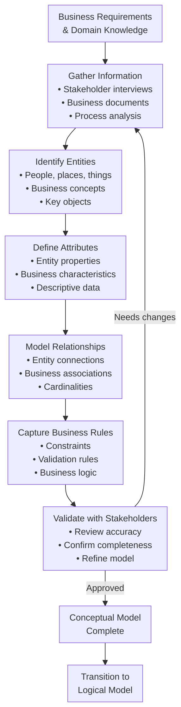
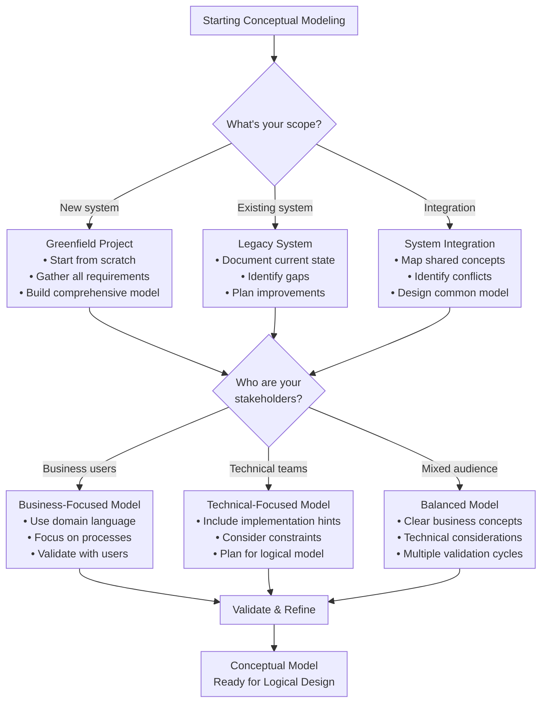
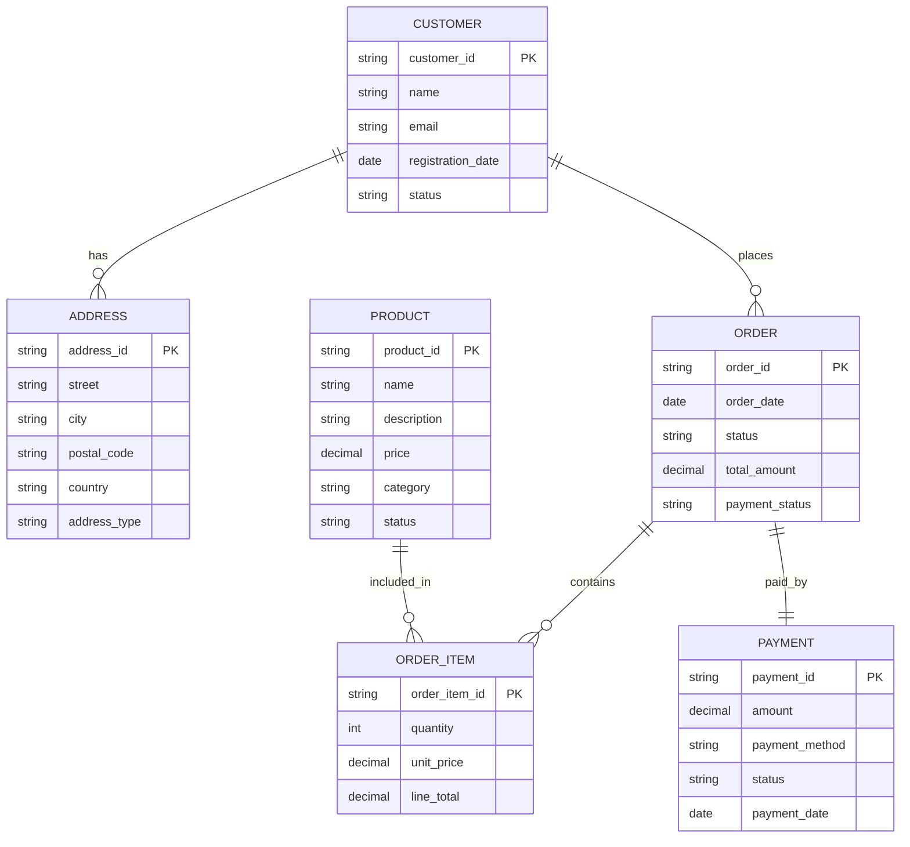

<Hero
  title="Conceptual Data Modeling"
  description="Capture entities, relationships, and rules clearly—technology-agnostic models for stakeholder alignment"
  size="large"
/>

# Conceptual Data Modeling

**TL;DR:** Conceptual data modeling captures business entities, their relationships, and rules using domain terminology without technical implementation details. It bridges the gap between business requirements and technical design, enabling stakeholder validation and clear communication across teams.

## Learning Objectives

You will be able to:
- **Identify and model business entities** using domain-specific terminology and concepts
- **Define relationships** between entities with appropriate cardinalities and constraints
- **Capture business rules** as constraints and validation requirements
- **Create entity-relationship diagrams** that communicate effectively with stakeholders
- **Validate conceptual models** through stakeholder review and domain expert feedback
- **Transition conceptual models** to logical and physical implementations

## Motivating Scenario

Imagine you're designing a new e-commerce platform. The business stakeholders describe their needs: "Customers place orders for products, which are fulfilled by warehouses, and payments are processed through various methods." Without a conceptual model, you might jump straight into database tables, missing critical business rules like "customers can have multiple addresses" or "orders can be partially fulfilled."

A conceptual model helps you capture these business concepts first, ensuring everyone—from product managers to developers—understands the same domain language and rules before any technical implementation begins.

## What Is Conceptual Data Modeling?

Conceptual data modeling is the process of creating a high-level representation of business information requirements using entities, relationships, and business rules. It answers the fundamental question: **"What exists in the business domain?"**

Unlike logical or physical models, conceptual models focus on:
- **Business concepts** rather than technical structures
- **Domain terminology** that stakeholders understand
- **Relationships** that reflect business processes
- **Rules** that govern business operations

<Figure caption="The conceptual modeling process flow from business requirements to validated domain model.">

</Figure>

## Core Components

### Entities

**Entities** represent the key business concepts or "things" that exist in the domain. They are the nouns of your business language.

**Characteristics of good entities:**
- **Business-relevant**: Represent concepts that matter to the business
- **Distinct**: Each entity represents a unique concept
- **Persistent**: Have existence beyond individual transactions
- **Identifiable**: Can be uniquely distinguished from other instances

**Examples:**
- **Person**: Customer, Employee, Supplier
- **Place**: Warehouse, Store, Office
- **Thing**: Product, Order, Invoice
- **Concept**: Account, Contract, Policy

### Attributes

**Attributes** describe the properties or characteristics of entities. They answer questions like "What do we know about this entity?"

**Types of attributes:**
- **Simple**: Single-valued (e.g., Customer Name)
- **Composite**: Made of multiple parts (e.g., Address = Street + City + Postal Code)
- **Derived**: Calculated from other attributes (e.g., Age from Birth Date)
- **Multi-valued**: Can have multiple values (e.g., Phone Numbers)

### Relationships

**Relationships** represent associations between entities that reflect business processes and rules.

**Relationship characteristics:**
- **Cardinality**: How many instances of one entity relate to instances of another
  - **One-to-One (1:1)**: Each instance relates to exactly one instance
  - **One-to-Many (1:M)**: One instance relates to many instances
  - **Many-to-Many (M:N)**: Many instances relate to many instances
- **Participation**: Whether participation is mandatory or optional
- **Business meaning**: The real-world association being modeled

### Business Rules

**Business rules** are constraints and validation requirements that govern how entities and relationships behave in the business context.

**Types of business rules:**
- **Entity constraints**: Rules that apply to individual entities
- **Relationship constraints**: Rules that govern relationships
- **Domain constraints**: Valid values for attributes
- **Operational rules**: Business process requirements

## Decision Framework

<Figure caption="Decision flow for creating effective conceptual models based on your context and requirements.">

</Figure>

## Practical Example: E-Commerce Platform

Let's model a simplified e-commerce platform to demonstrate conceptual modeling principles.

<Figure caption="Entity-relationship diagram for an e-commerce platform showing key business entities and their relationships.">

</Figure>

### Business Rules Captured

**Entity Rules:**
- Each customer must have a unique email address
- Products must have a positive price
- Orders must have at least one order item

**Relationship Rules:**
- A customer can have multiple addresses (billing, shipping)
- An order belongs to exactly one customer
- An order item references exactly one product
- Each order has exactly one payment

**Domain Rules:**
- Customer status: Active, Inactive, Suspended
- Order status: Pending, Confirmed, Shipped, Delivered, Cancelled
- Payment methods: Credit Card, PayPal, Bank Transfer

## When to Use Conceptual Modeling

<Vs title="Conceptual vs. Other Modeling Approaches"
  items={[
{ 
      label: 'Conceptual Modeling', 
      points: [
        'Business requirements gathering',
        'Stakeholder communication',
        'Domain understanding',
        'Requirements validation',
        'Cross-team alignment'
      ] 
    },
{ 
      label: 'Direct Logical Modeling', 
      points: [
        'Technical implementation focus',
        'Database design',
        'Performance optimization',
        'Developer-centric approach',
        'Implementation constraints'
      ] 
    }
]}
  highlight={0}
  highlightTone="positive"
/>

**Use conceptual modeling when:**
- **Gathering requirements** from business stakeholders
- **Communicating** with non-technical team members
- **Validating** business understanding before implementation
- **Integrating** multiple systems with different domain models
- **Training** new team members on business processes

**Skip conceptual modeling when:**
- **Technical prototyping** with known requirements
- **Simple CRUD applications** with straightforward data
- **Time-critical projects** where business rules are well-established
- **Maintenance tasks** on existing, well-documented systems

## Common Patterns and Anti-Patterns

### Effective Patterns

<Showcase
  title="Successful Conceptual Modeling Patterns"
  sections={[
    { 
      label: 'Domain-Driven Language', 
      body: 'Use business terminology that stakeholders understand. Avoid technical jargon like "tables" or "foreign keys" in conceptual discussions.' 
    },
    { 
      label: 'Iterative Refinement', 
      body: 'Start with core entities and relationships, then progressively add detail through stakeholder feedback and domain expert review.' 
    },
    { 
      label: 'Visual Communication', 
      body: 'Use entity-relationship diagrams to make abstract concepts concrete and facilitate discussion among diverse stakeholders.' 
    },
    { 
      label: 'Business Rule Documentation', 
      body: 'Explicitly capture constraints and validation rules as part of the model, not as afterthoughts.' 
    }
  ]}
/>

### Common Anti-Patterns

<Showcase
  title="Conceptual Modeling Pitfalls to Avoid"
  sections={[
    { 
      label: 'Technical Implementation Details', 
      body: 'Avoid including database-specific concepts like indexes, data types, or storage considerations in conceptual models.', 
      tone: 'warning' 
    },
    { 
      label: 'Over-Abstraction', 
      body: 'Don\'t create overly generic models that lose business meaning. Balance abstraction with domain specificity.', 
      tone: 'warning' 
    },
    { 
      label: 'Stakeholder Exclusion', 
      body: 'Failing to involve business users in model validation leads to misaligned requirements and implementation issues.', 
      tone: 'warning' 
    },
    { 
      label: 'Static Models', 
      body: 'Treating conceptual models as one-time artifacts rather than living documents that evolve with business understanding.', 
      tone: 'warning' 
    }
  ]}
/>

## Hands-On Exercise

<Admonition type="info" title="Exercise: Model a Library Management System">
Create a conceptual model for a library management system. Consider these business requirements:

- Patrons can borrow books, DVDs, and other materials
- Materials have due dates and can be renewed
- Patrons can place holds on materials that are currently checked out
- The library tracks fines for overdue materials
- Materials are organized by categories and have unique identifiers

**Steps:**
1. Identify the main entities (people, places, things, concepts)
2. Define key attributes for each entity
3. Model relationships between entities with cardinalities
4. Capture business rules as constraints
5. Create an entity-relationship diagram
6. Validate your model with a colleague or stakeholder

**Deliverables:**
- List of entities with descriptions
- Entity-relationship diagram
- Documented business rules
- Validation feedback from review
</Admonition>

## Operational Considerations

### Stakeholder Management

**Key stakeholders for conceptual modeling:**
- **Business users**: Validate domain concepts and terminology
- **Product managers**: Ensure business requirements are captured
- **Domain experts**: Provide deep knowledge of business processes
- **Development teams**: Understand implementation implications

**Communication strategies:**
- Use visual diagrams to facilitate discussion
- Conduct regular review sessions with stakeholders
- Document decisions and rationale for future reference
- Maintain a glossary of domain terms and definitions

### Change Management

**Model evolution:**
- **Version control**: Track changes to conceptual models over time
- **Impact analysis**: Assess how model changes affect downstream logical and physical models
- **Stakeholder notification**: Communicate changes to all affected parties
- **Documentation updates**: Keep related documentation synchronized

## Security and Privacy Considerations

### Data Classification

**Sensitive data identification:**
- **Personal information**: Customer details, employee records
- **Financial data**: Payment information, pricing details
- **Business confidential**: Strategic plans, proprietary processes
- **Regulatory data**: Compliance-related information

**Privacy implications:**
- **Data minimization**: Only model data that's necessary for business operations
- **Consent tracking**: Model consent and preference management
- **Retention policies**: Include data lifecycle considerations
- **Access controls**: Consider who needs access to different data elements

### Compliance Requirements

**Regulatory considerations:**
- **GDPR**: Right to erasure, data portability, consent management
- **HIPAA**: Protected health information handling
- **PCI DSS**: Payment card data security
- **SOX**: Financial reporting and audit requirements

## Observability and Monitoring

### Model Quality Metrics

**Completeness indicators:**
- **Entity coverage**: Percentage of business concepts captured
- **Relationship completeness**: All business associations modeled
- **Rule documentation**: Business constraints explicitly captured
- **Stakeholder validation**: Review completion and approval status

**Quality measures:**
- **Clarity**: Stakeholder understanding and feedback scores
- **Consistency**: Alignment with business terminology and processes
- **Completeness**: Coverage of business requirements
- **Accuracy**: Validation against actual business operations

### Documentation and Traceability

**Model documentation:**
- **Entity definitions**: Clear descriptions of each business concept
- **Relationship rationale**: Business reasons for associations
- **Rule sources**: Documentation of where business rules originate
- **Change history**: Track of model evolution and decisions

## Self-Check

1. **Entity Identification**: Can you identify the main business entities in your domain without thinking about database tables or technical implementation?

2. **Stakeholder Communication**: Would a business user understand your conceptual model using only domain terminology?

3. **Business Rule Capture**: Have you explicitly documented the constraints and validation rules that govern your business processes?

## Design Review Checklist

<Checklist
  title="Conceptual Model Review Checklist"
  items={[
    { label: 'All key business entities identified and defined' },
    { label: 'Entity relationships reflect actual business processes' },
    { label: 'Business rules explicitly captured as constraints' },
    { label: 'Model uses domain terminology, not technical jargon' },
    { label: 'Stakeholders have validated the model accuracy' },
    { label: 'Model covers all identified business requirements' },
    { label: 'Relationships have appropriate cardinalities' },
    { label: 'Model is ready for logical design transition' }
  ]}
/>

## Related Topics

- [Logical Data Modeling](./logical) - Translating conceptual models into structured database designs
- [Physical Data Modeling](./physical) - Optimizing models for specific database implementations
- [Domain-Driven Design](../../../domain-driven-design) - Strategic and tactical modeling approaches
- [Data Architecture & Persistence](../../../data-architecture-and-persistence) - Enterprise data architecture patterns

## References

1. <a href="https://www.amazon.com/Data-Modeling-Essentials-Graeme-Simsion/dp/0126445516" target="_blank" rel="nofollow noopener noreferrer">Simsion, G. & Witt, G. Data Modeling Essentials ↗️</a>
2. <a href="https://www.amazon.com/Domain-Driven-Design-Tackling-Complexity-Software/dp/0321125215" target="_blank" rel="nofollow noopener noreferrer">Evans, E. Domain-Driven Design: Tackling Complexity in the Heart of Software ↗️</a>
3. <a href="https://www.omg.org/spec/UML/2.5.1/" target="_blank" rel="nofollow noopener noreferrer">Object Management Group. Unified Modeling Language (UML) Specification ↗️</a>
