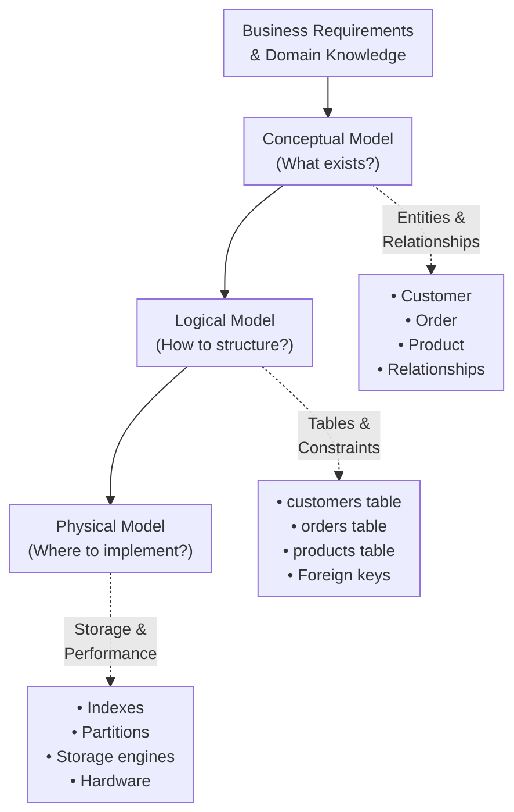
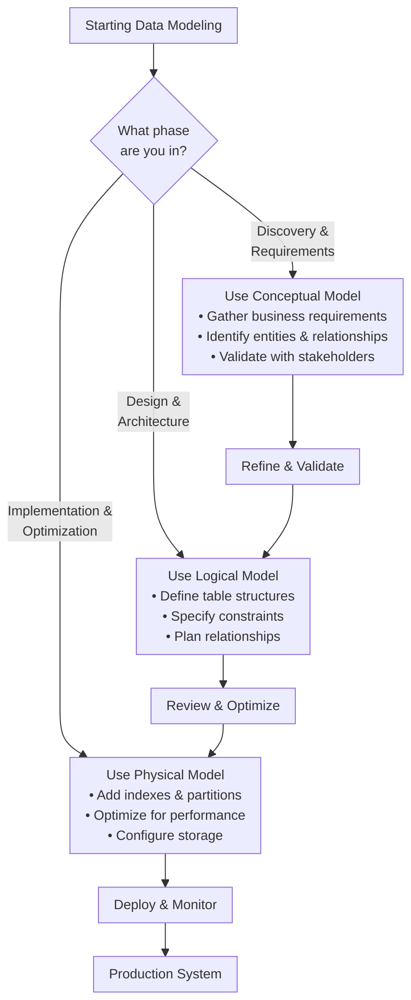

import DocCardList from "@theme/DocCardList";
import { useCurrentSidebarCategory } from "@docusaurus/theme-common";
import Figure from "@site/src/components/Figure";
import Head from "@docusaurus/Head";

<Head>
  <meta name="description" content="Master the three levels of data modeling: conceptual (what), logical (how), and physical (where) to design effective data structures." />
  <meta property="og:title" content="Data Modeling" />
  <meta property="og:description" content="Master the three levels of data modeling: conceptual (what), logical (how), and physical (where) to design effective data structures." />
  <meta property="og:image" content="https://archman.dev/img/archman-social-card.webp" />
  <meta name="twitter:card" content="summary_large_image" />
  <link rel="canonical" href="https://archman.dev/docs/foundational-concepts/data-fundamentals/data-modeling" />
  
  
</Head>

# Data Modeling

Data modeling is the process of defining and analyzing data requirements to support business processes within information systems. It bridges the gap between business needs and technical implementation through three distinct but connected levels of abstraction.

## Mental Model

<Figure caption="The three levels of data modeling progression from business concepts to technical implementation.">

</Figure>

## The Three Levels

### Conceptual Model
The **conceptual model** answers "What exists?" by capturing business entities, their attributes, and relationships without technical implementation details. It focuses on business rules and domain concepts that stakeholders can understand and validate.

**Key characteristics:**
- **Business-focused**: Uses domain terminology and concepts
- **Technology-agnostic**: Independent of specific database systems
- **Stakeholder-friendly**: Understandable by business users and developers
- **High-level**: Shows entities and relationships without implementation details

### Logical Model
The **logical model** answers "How to structure?" by translating business concepts into a structured format suitable for implementation. It defines tables, columns, data types, and constraints while remaining database-agnostic.

**Key characteristics:**
- **Structured**: Defines tables, columns, and relationships
- **Normalized**: Follows database design principles
- **Constraint-aware**: Includes business rules and data integrity rules
- **Implementation-ready**: Detailed enough for development

### Physical Model
The **physical model** answers "Where to implement?" by specifying the actual database implementation details. It considers performance, storage, and operational requirements of the target database system.

**Key characteristics:**
- **Performance-optimized**: Includes indexes, partitions, and storage strategies
- **Database-specific**: Tailored to specific DBMS capabilities
- **Operational**: Considers backup, recovery, and maintenance
- **Scalable**: Designed for expected data volumes and access patterns

## Decision Framework

<Figure caption="Decision flow for choosing the appropriate modeling level based on your current phase and audience.">

</Figure>

## When to Use Each Level

**Start with Conceptual** when:
- Gathering requirements from business stakeholders
- Understanding domain complexity
- Validating business rules and relationships
- Communicating with non-technical team members

**Move to Logical** when:
- Designing the database schema
- Planning data integrity constraints
- Preparing for implementation
- Reviewing with development teams

**Implement Physical** when:
- Optimizing for performance requirements
- Configuring database-specific features
- Planning for scale and operational needs
- Deploying to production environments

## Common Pitfalls

- **Skipping levels**: Jumping directly to physical modeling without understanding business requirements
- **Over-engineering**: Adding unnecessary complexity at the conceptual level
- **Under-optimizing**: Not considering performance implications in the physical model
- **Stakeholder misalignment**: Using technical terminology in conceptual discussions

## Related Topics

- [Conceptual Model](./conceptual) - Deep dive into business-focused modeling
- [Logical Model](./logical) - Structured design principles and normalization
- [Physical Model](./physical) - Performance optimization and implementation details
- [Transactions & Isolation Levels](../transactions-and-isolation-levels) - Data consistency and concurrency
- [Indexing & Query Optimization](../indexing-and-query-optimization) - Performance optimization strategies
- [Data Architecture & Persistence](../../../data-architecture-and-persistence) - Advanced data storage patterns

<DocCardList items={useCurrentSidebarCategory().items} />
