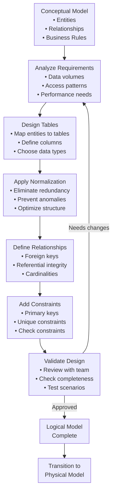
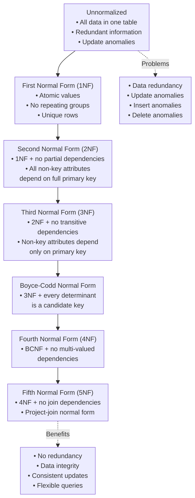
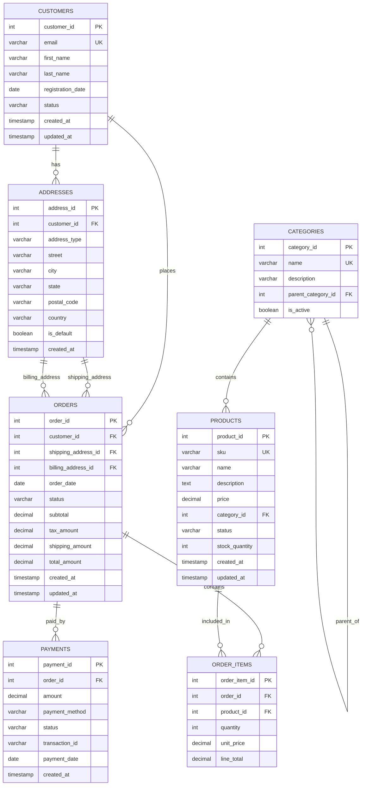

<Hero
  title="Logical Data Modeling"
  description="Translate business concepts into structured schemas—normalization, constraints, and relationships"
  size="large"
/>

# Logical Data Modeling

**TL;DR:** Logical data modeling translates business concepts from conceptual models into structured database designs using tables, columns, constraints, and relationships. It bridges the gap between business requirements and technical implementation while remaining database-agnostic.

## Learning Objectives

You will be able to:
- **Transform conceptual models** into structured table designs with proper normalization
- **Design relationships** using foreign keys and referential integrity constraints
- **Apply normalization principles** to eliminate data redundancy and anomalies
- **Define data constraints** including primary keys, unique constraints, and check constraints
- **Create logical schemas** that are implementation-ready yet database-agnostic
- **Balance normalization** with practical performance and usability considerations

## Motivating Scenario

You've completed the conceptual model for your e-commerce platform, capturing entities like Customer, Order, and Product with their business relationships. Now you need to translate this into a database design that developers can implement. 

The logical model bridges this gap by defining how these business concepts become tables, what columns each table needs, how tables relate to each other, and what rules ensure data integrity. Without a proper logical model, you might end up with denormalized tables that cause data inconsistencies or over-normalized tables that hurt performance.

## What Is Logical Data Modeling?

Logical data modeling is the process of translating conceptual business models into structured database designs using tables, columns, relationships, and constraints. It answers the question: **"How should we structure the data for implementation?"**

The logical model serves as the blueprint for database implementation, providing:

<Figure caption="The logical modeling process flow from conceptual model to implementation-ready database design.">


</Figure>

## Core Components

### Tables and Columns

**Tables** represent entities from the conceptual model, while **columns** represent entity attributes.

**Table design principles:**
- **One entity per table**: Each table represents a single business concept
- **Meaningful names**: Use clear, descriptive table and column names
- **Consistent naming**: Follow established naming conventions
- **Appropriate granularity**: Balance normalization with practical needs

**Column characteristics:**
- **Data types**: Choose appropriate types for each attribute
- **Nullability**: Define whether columns can contain null values
- **Default values**: Specify default values where appropriate
- **Business meaning**: Each column should have clear business purpose

### Primary Keys

**Primary keys** uniquely identify each row in a table and enforce entity integrity.

**Primary key requirements:**
- **Uniqueness**: No two rows can have the same primary key value
- **Non-nullability**: Primary key columns cannot contain null values
- **Stability**: Values should not change frequently
- **Simplicity**: Prefer simple, single-column keys when possible

**Primary key strategies:**
- **Natural keys**: Use existing business identifiers (e.g., customer_id)
- **Surrogate keys**: Use system-generated identifiers (e.g., auto-increment integers)
- **Composite keys**: Use multiple columns when necessary

### Foreign Keys and Relationships

**Foreign keys** establish relationships between tables and enforce referential integrity.

**Relationship types:**
- **One-to-One (1:1)**: Each row in Table A relates to exactly one row in Table B
- **One-to-Many (1:M)**: Each row in Table A can relate to many rows in Table B
- **Many-to-Many (M:N)**: Rows in Table A can relate to many rows in Table B, and vice versa

**Foreign key constraints:**
- **Referential integrity**: Ensures foreign key values exist in referenced table
- **Cascade options**: Define what happens when referenced data changes
- **Indexing**: Foreign keys should typically be indexed for performance

### Data Constraints

**Constraints** enforce business rules and data integrity at the database level.

**Types of constraints:**
- **Primary key constraints**: Enforce uniqueness and non-nullability
- **Foreign key constraints**: Enforce referential integrity
- **Unique constraints**: Ensure column values are unique
- **Check constraints**: Validate data against business rules
- **Not null constraints**: Prevent null values in required columns

## Normalization Principles

Normalization is the process of organizing data to eliminate redundancy and prevent data anomalies.

<Figure caption="Normalization levels and their benefits in logical data modeling.">


</Figure>

### First Normal Form (1NF)

**Requirements:**
- All column values are atomic (indivisible)
- No repeating groups or arrays
- Each row is unique

**Example transformation:**

<Tabs groupId="lang" queryString>
  <TabItem value="before" label="Before 1NF">

```sql title="unnormalized_orders.sql" showLineNumbers
-- Unnormalized table with repeating groups
CREATE TABLE orders (
    order_id INT,
    customer_name VARCHAR(100),
    order_date DATE,
    product1_name VARCHAR(100),
    product1_quantity INT,
    product1_price DECIMAL(10,2),
    product2_name VARCHAR(100),
    product2_quantity INT,
    product2_price DECIMAL(10,2)
    -- More product columns...
);
```

  </TabItem>
  <TabItem value="after" label="After 1NF">

```sql title="normalized_orders_1nf.sql" showLineNumbers
-- Normalized to 1NF with separate order_items table
CREATE TABLE orders (
    order_id INT PRIMARY KEY,
    customer_name VARCHAR(100),
    order_date DATE
);

CREATE TABLE order_items (
    order_id INT,
    product_name VARCHAR(100),
    quantity INT,
    price DECIMAL(10,2),
    PRIMARY KEY (order_id, product_name),
    FOREIGN KEY (order_id) REFERENCES orders(order_id)
);
```

  </TabItem>
</Tabs>

### Second Normal Form (2NF)

**Requirements:**
- Must be in 1NF
- All non-key attributes must depend on the entire primary key (no partial dependencies)

**Example transformation:**

<Tabs groupId="lang" queryString>
  <TabItem value="before" label="Before 2NF">

```sql title="before_2nf.sql" showLineNumbers
-- Violates 2NF: customer_name depends only on customer_id, not the full key
CREATE TABLE order_items (
    order_id INT,
    customer_id INT,
    customer_name VARCHAR(100),  -- Partial dependency
    product_id INT,
    product_name VARCHAR(100),   -- Partial dependency
    quantity INT,
    price DECIMAL(10,2),
    PRIMARY KEY (order_id, customer_id, product_id)
);
```

  </TabItem>
  <TabItem value="after" label="After 2NF">

```sql title="after_2nf.sql" showLineNumbers
-- Normalized to 2NF: separate tables for customers and products
CREATE TABLE customers (
    customer_id INT PRIMARY KEY,
    customer_name VARCHAR(100)
);

CREATE TABLE products (
    product_id INT PRIMARY KEY,
    product_name VARCHAR(100)
);

CREATE TABLE order_items (
    order_id INT,
    customer_id INT,
    product_id INT,
    quantity INT,
    price DECIMAL(10,2),
    PRIMARY KEY (order_id, customer_id, product_id),
    FOREIGN KEY (customer_id) REFERENCES customers(customer_id),
    FOREIGN KEY (product_id) REFERENCES products(product_id)
);
```

  </TabItem>
</Tabs>

### Third Normal Form (3NF)

**Requirements:**
- Must be in 2NF
- No transitive dependencies (non-key attributes must not depend on other non-key attributes)

**Example transformation:**

<Tabs groupId="lang" queryString>
  <TabItem value="before" label="Before 3NF">

```sql title="before_3nf.sql" showLineNumbers
-- Violates 3NF: category_description depends on category, not product_id
CREATE TABLE products (
    product_id INT PRIMARY KEY,
    product_name VARCHAR(100),
    category VARCHAR(50),
    category_description VARCHAR(200)  -- Transitive dependency
);
```

  </TabItem>
  <TabItem value="after" label="After 3NF">

```sql title="after_3nf.sql" showLineNumbers
-- Normalized to 3NF: separate categories table
CREATE TABLE categories (
    category VARCHAR(50) PRIMARY KEY,
    category_description VARCHAR(200)
);

CREATE TABLE products (
    product_id INT PRIMARY KEY,
    product_name VARCHAR(100),
    category VARCHAR(50),
    FOREIGN KEY (category) REFERENCES categories(category)
);
```

  </TabItem>
</Tabs>

## Practical Example: E-Commerce Logical Model

Let's transform the conceptual e-commerce model into a logical database design.

<Figure caption="Logical database schema for e-commerce platform showing normalized tables and relationships.">


</Figure>

### Table Definitions with Constraints

<Tabs groupId="lang" queryString>
  <TabItem value="customers" label="Customers Table">

```sql title="customers_table.sql" showLineNumbers
CREATE TABLE customers (
    customer_id INT AUTO_INCREMENT PRIMARY KEY,
    email VARCHAR(255) NOT NULL UNIQUE,
    first_name VARCHAR(100) NOT NULL,
    last_name VARCHAR(100) NOT NULL,
    registration_date DATE NOT NULL DEFAULT (CURRENT_DATE),
    status ENUM('active', 'inactive', 'suspended') NOT NULL DEFAULT 'active',
    created_at TIMESTAMP DEFAULT CURRENT_TIMESTAMP,
    updated_at TIMESTAMP DEFAULT CURRENT_TIMESTAMP ON UPDATE CURRENT_TIMESTAMP,
    
    -- Constraints
    CONSTRAINT chk_email_format CHECK (email REGEXP '^[A-Za-z0-9._%+-]+@[A-Za-z0-9.-]+\\.[A-Za-z]{2,}$'),
    CONSTRAINT chk_names_not_empty CHECK (LENGTH(TRIM(first_name)) > 0 AND LENGTH(TRIM(last_name)) > 0)
);
```

  </TabItem>
  <TabItem value="orders" label="Orders Table">

```sql title="orders_table.sql" showLineNumbers
CREATE TABLE orders (
    order_id INT AUTO_INCREMENT PRIMARY KEY,
    customer_id INT NOT NULL,
    shipping_address_id INT NOT NULL,
    billing_address_id INT NOT NULL,
    order_date DATE NOT NULL DEFAULT (CURRENT_DATE),
    status ENUM('pending', 'confirmed', 'shipped', 'delivered', 'cancelled') NOT NULL DEFAULT 'pending',
    subtotal DECIMAL(10,2) NOT NULL DEFAULT 0.00,
    tax_amount DECIMAL(10,2) NOT NULL DEFAULT 0.00,
    shipping_amount DECIMAL(10,2) NOT NULL DEFAULT 0.00,
    total_amount DECIMAL(10,2) NOT NULL DEFAULT 0.00,
    created_at TIMESTAMP DEFAULT CURRENT_TIMESTAMP,
    updated_at TIMESTAMP DEFAULT CURRENT_TIMESTAMP ON UPDATE CURRENT_TIMESTAMP,
    
    -- Foreign key constraints
    FOREIGN KEY (customer_id) REFERENCES customers(customer_id) ON DELETE RESTRICT,
    FOREIGN KEY (shipping_address_id) REFERENCES addresses(address_id) ON DELETE RESTRICT,
    FOREIGN KEY (billing_address_id) REFERENCES addresses(address_id) ON DELETE RESTRICT,
    
    -- Business rule constraints
    CONSTRAINT chk_amounts_positive CHECK (subtotal >= 0 AND tax_amount >= 0 AND shipping_amount >= 0 AND total_amount >= 0),
    CONSTRAINT chk_total_calculation CHECK (total_amount = subtotal + tax_amount + shipping_amount)
);
```

  </TabItem>
  <TabItem value="order_items" label="Order Items Table">

```sql title="order_items_table.sql" showLineNumbers
CREATE TABLE order_items (
    order_item_id INT AUTO_INCREMENT PRIMARY KEY,
    order_id INT NOT NULL,
    product_id INT NOT NULL,
    quantity INT NOT NULL,
    unit_price DECIMAL(10,2) NOT NULL,
    line_total DECIMAL(10,2) NOT NULL,
    
    -- Foreign key constraints
    FOREIGN KEY (order_id) REFERENCES orders(order_id) ON DELETE CASCADE,
    FOREIGN KEY (product_id) REFERENCES products(product_id) ON DELETE RESTRICT,
    
    -- Business rule constraints
    CONSTRAINT chk_quantity_positive CHECK (quantity > 0),
    CONSTRAINT chk_unit_price_positive CHECK (unit_price >= 0),
    CONSTRAINT chk_line_total_calculation CHECK (line_total = quantity * unit_price),
    
    -- Ensure unique product per order
    UNIQUE KEY uk_order_product (order_id, product_id)
);
```

  </TabItem>
</Tabs>

## When to Use Logical Modeling

<Vs title="Logical vs. Other Modeling Approaches"
  items={[
{ 
      label: 'Logical Modeling', 
      points: [
        'Database design and schema planning',
        'Data integrity and constraint definition',
        'Normalization and optimization',
        'Implementation preparation',
        'Cross-platform compatibility'
      ] 
    },
{ 
      label: 'Direct Physical Modeling', 
      points: [
        'Performance optimization focus',
        'Database-specific features',
        'Storage and indexing strategy',
        'Implementation constraints',
        'Platform-specific optimization'
      ] 
    }
]}
  highlight={0}
  highlightTone="positive"
/>

**Use logical modeling when:**
- **Designing database schemas** for new applications
- **Planning data migration** between systems
- **Ensuring data integrity** through proper constraints
- **Supporting multiple database platforms** with the same design
- **Training development teams** on data structure

**Skip logical modeling when:**
- **Prototyping with known schemas** that are well-established
- **Working with NoSQL databases** that don't follow relational principles
- **Time-critical implementations** where schema is already defined
- **Simple applications** with straightforward data requirements

## Normalization Trade-offs

<ProsCons
  pros={[
    'Eliminates data redundancy and storage waste',
    'Prevents update, insert, and delete anomalies',
    'Ensures data consistency and integrity',
    'Provides flexible querying capabilities',
    'Makes schema changes easier to implement'
  ]}
  cons={[
    'Increases query complexity with more joins',
    'May impact performance for read-heavy workloads',
    'Requires more careful transaction management',
    'Can make some queries more complex to write',
    'May need denormalization for performance optimization'
  ]}
/>

### When to Denormalize

**Consider denormalization when:**
- **Read performance** is critical and queries are well-defined
- **Data volumes** are large and joins are expensive
- **Reporting requirements** need aggregated or pre-computed data
- **Real-time constraints** require faster data access
- **Storage costs** are less important than query performance

**Common denormalization patterns:**
- **Duplicating frequently accessed data** across tables
- **Pre-computing aggregations** and storing results
- **Flattening hierarchical data** for simpler queries
- **Adding redundant columns** to avoid joins

## Common Patterns and Anti-Patterns

### Effective Patterns

<Showcase
  title="Successful Logical Modeling Patterns"
  sections={[
    { 
      label: 'Consistent Naming Conventions', 
      body: 'Use clear, descriptive names for tables and columns. Follow established conventions like snake_case for columns and plural nouns for table names.' 
    },
    { 
      label: 'Appropriate Normalization Level', 
      body: 'Normalize to 3NF as a baseline, then selectively denormalize based on performance requirements and access patterns.' 
    },
    { 
      label: 'Comprehensive Constraints', 
      body: 'Define all necessary constraints including primary keys, foreign keys, unique constraints, and check constraints to ensure data integrity.' 
    },
    { 
      label: 'Audit Trail Support', 
      body: 'Include created_at, updated_at, and versioning columns to support data lineage and change tracking.' 
    }
  ]}
/>

### Common Anti-Patterns

<Showcase
  title="Logical Modeling Pitfalls to Avoid"
  sections={[
    { 
      label: 'Over-Normalization', 
      body: 'Creating too many small tables that require complex joins for simple queries, hurting performance and usability.', 
      tone: 'warning' 
    },
    { 
      label: 'Under-Normalization', 
      body: 'Leaving data in unnormalized forms that cause redundancy, inconsistencies, and maintenance issues.', 
      tone: 'warning' 
    },
    { 
      label: 'Missing Constraints', 
      body: 'Failing to define proper constraints, leading to data integrity issues and inconsistent data states.', 
      tone: 'warning' 
    },
    { 
      label: 'Poor Naming', 
      body: 'Using unclear or inconsistent naming conventions that make the schema difficult to understand and maintain.', 
      tone: 'warning' 
    }
  ]}
/>

## Hands-On Exercise

<Admonition type="info" title="Exercise: Design a Library Management System">
Transform the conceptual library model from the previous exercise into a logical database design.

**Requirements:**
- Patrons can borrow multiple materials
- Materials can be books, DVDs, or other types
- Track due dates, renewals, and holds
- Manage fines for overdue materials
- Support material categories and locations

**Steps:**
1. **Identify tables** from your conceptual entities
2. **Define columns** with appropriate data types
3. **Apply normalization** to eliminate redundancy
4. **Add constraints** for data integrity
5. **Design relationships** with foreign keys
6. **Create the schema** with SQL DDL statements

**Deliverables:**
- Complete logical schema with all tables
- SQL DDL statements for table creation
- Documentation of normalization decisions
- Constraint definitions and business rules
</Admonition>

## Operational Considerations

### Performance Planning

**Query optimization considerations:**
- **Index strategy**: Plan indexes for foreign keys and frequently queried columns
- **Join patterns**: Design tables to minimize expensive join operations
- **Data volume**: Consider partitioning strategies for large tables
- **Access patterns**: Optimize for the most common query types

**Scalability planning:**
- **Horizontal scaling**: Design for potential sharding or partitioning
- **Vertical scaling**: Consider how the schema will perform with more data
- **Caching strategy**: Identify data that can be cached effectively
- **Archive strategy**: Plan for data lifecycle management

### Data Governance

**Data quality management:**
- **Validation rules**: Implement comprehensive check constraints
- **Data lineage**: Track data sources and transformations
- **Audit trails**: Maintain change history for critical data
- **Data classification**: Identify sensitive and confidential data

**Compliance considerations:**
- **Retention policies**: Design for data lifecycle requirements
- **Privacy controls**: Support data anonymization and deletion
- **Access controls**: Plan for role-based data access
- **Audit requirements**: Ensure compliance with regulatory needs

## Security and Privacy Considerations

### Data Protection

**Sensitive data handling:**
- **Encryption planning**: Identify data that needs encryption at rest
- **Access controls**: Design for fine-grained data access permissions
- **Data masking**: Plan for development and testing environments
- **Audit logging**: Track access to sensitive data

**Privacy compliance:**
- **Data minimization**: Only store necessary data elements
- **Consent tracking**: Support user consent and preference management
- **Right to erasure**: Design for data deletion requirements
- **Data portability**: Support data export capabilities

## Observability and Monitoring

### Schema Quality Metrics

**Design quality indicators:**
- **Normalization level**: Measure adherence to normalization principles
- **Constraint coverage**: Percentage of business rules enforced by constraints
- **Relationship completeness**: All conceptual relationships properly modeled
- **Naming consistency**: Adherence to established naming conventions

**Performance monitoring:**
- **Query performance**: Monitor slow queries and optimization opportunities
- **Index usage**: Track index effectiveness and unused indexes
- **Data growth**: Monitor table sizes and growth rates
- **Constraint violations**: Track failed constraint checks

### Documentation and Maintenance

**Schema documentation:**
- **Table descriptions**: Clear documentation of each table's purpose
- **Column definitions**: Business meaning and constraints for each column
- **Relationship documentation**: Business rationale for foreign key relationships
- **Change history**: Track schema evolution and migration history

## Self-Check

1. **Normalization Understanding**: Can you identify when a table violates 2NF or 3NF and explain how to fix it?

2. **Constraint Design**: Have you defined all necessary constraints to ensure data integrity and enforce business rules?

3. **Relationship Modeling**: Do your foreign key relationships accurately reflect the business relationships from the conceptual model?

## Design Review Checklist

<Checklist
  title="Logical Model Review Checklist"
  items={[
    { label: 'All conceptual entities properly mapped to tables' },
    { label: 'Tables are normalized to appropriate level (typically 3NF)' },
    { label: 'Primary keys defined for all tables' },
    { label: 'Foreign key relationships properly established' },
    { label: 'All business rules enforced through constraints' },
    { label: 'Data types appropriate for each column' },
    { label: 'Naming conventions consistently applied' },
    { label: 'Schema supports expected query patterns' },
    { label: 'Audit and versioning columns included where needed' },
    { label: 'Model is ready for physical implementation' }
  ]}
/>

## Related Topics

- [Conceptual Data Modeling](./conceptual) - Business-focused entity and relationship modeling
- [Physical Data Modeling](./physical) - Database-specific optimization and implementation
- [Transactions & Isolation Levels](../transactions-and-isolation-levels) - Data consistency and concurrency control
- [Indexing & Query Optimization](../indexing-and-query-optimization) - Performance optimization strategies
- [Data Architecture & Persistence](../../../data-architecture-and-persistence) - Enterprise data architecture patterns
- [Design Patterns](../../../design-patterns) - Advanced design patterns and techniques

## References

1. <a href="https://www.amazon.com/Database-Design-Mere-Mortals-Hands/dp/0136788041" target="_blank" rel="nofollow noopener noreferrer">Hernandez, M. Database Design for Mere Mortals: A Hands-On Guide to Relational Database Design ↗️</a>
2. <a href="https://www.amazon.com/Data-Modeling-Essentials-Graeme-Simsion/dp/0126445516" target="_blank" rel="nofollow noopener noreferrer">Simsion, G. & Witt, G. Data Modeling Essentials ↗️</a>
3. <a href="https://www.w3.org/TR/vocab-dcat-2/" target="_blank" rel="nofollow noopener noreferrer">W3C. Data Catalog Vocabulary (DCAT) - Version 2 ↗️</a>
