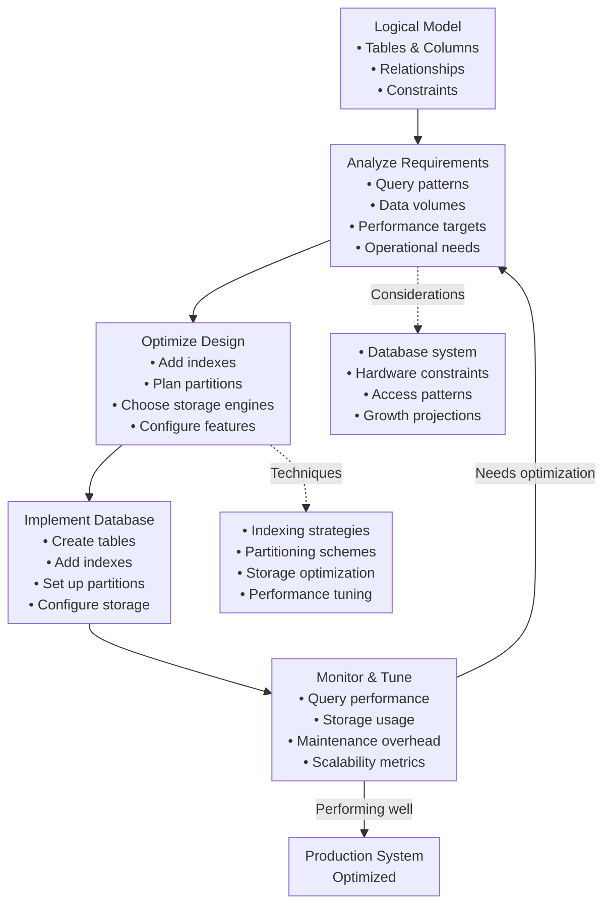
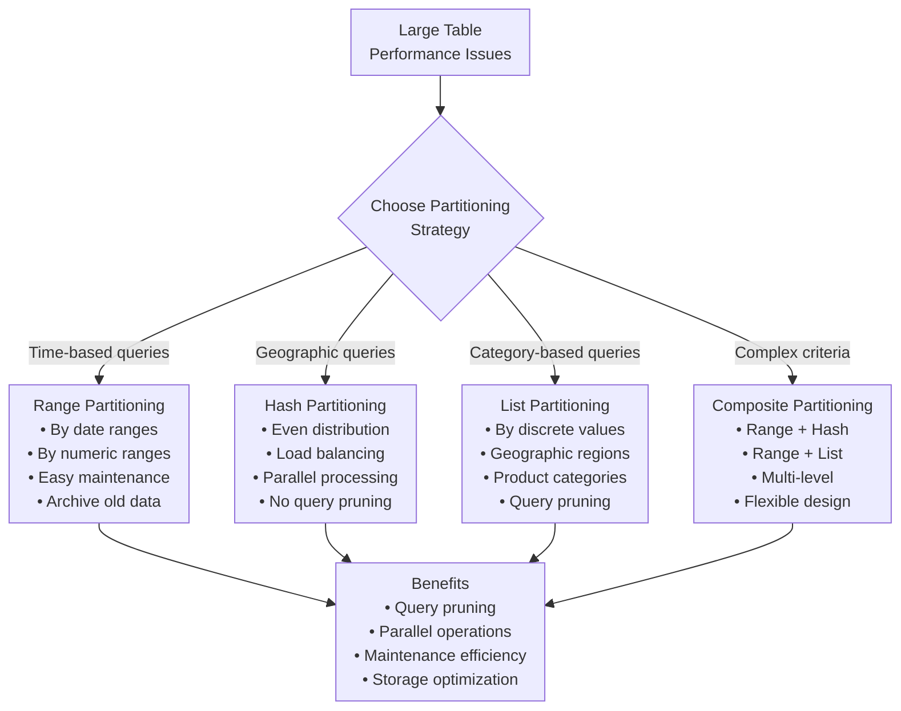
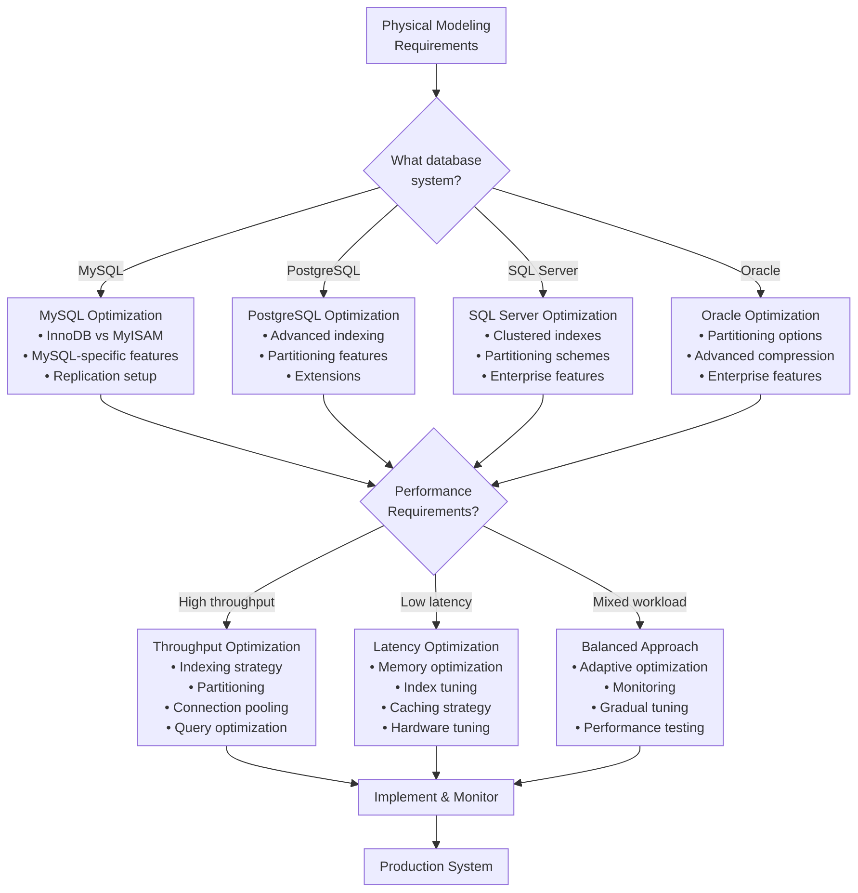
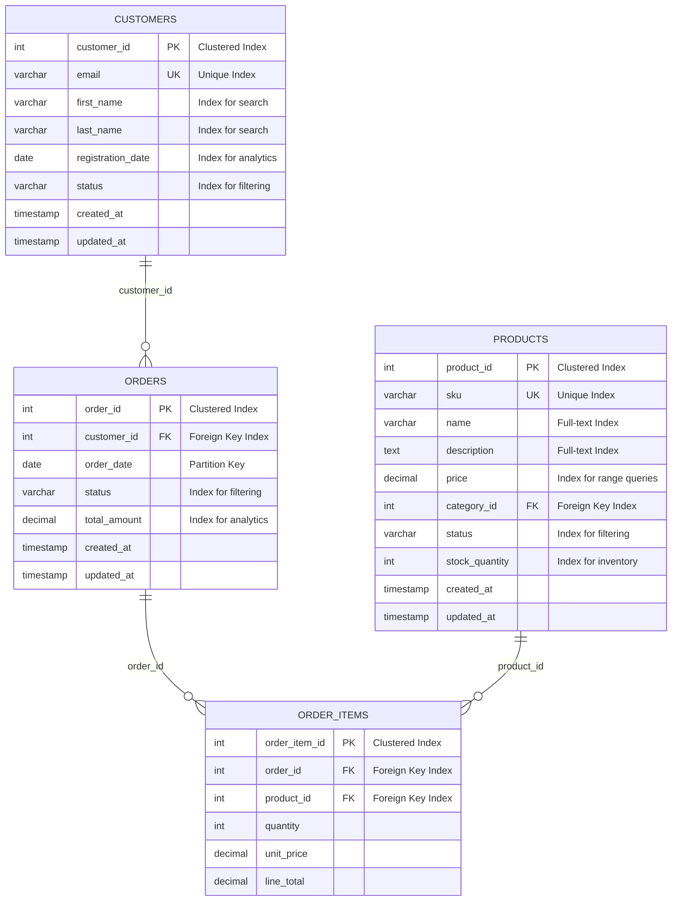
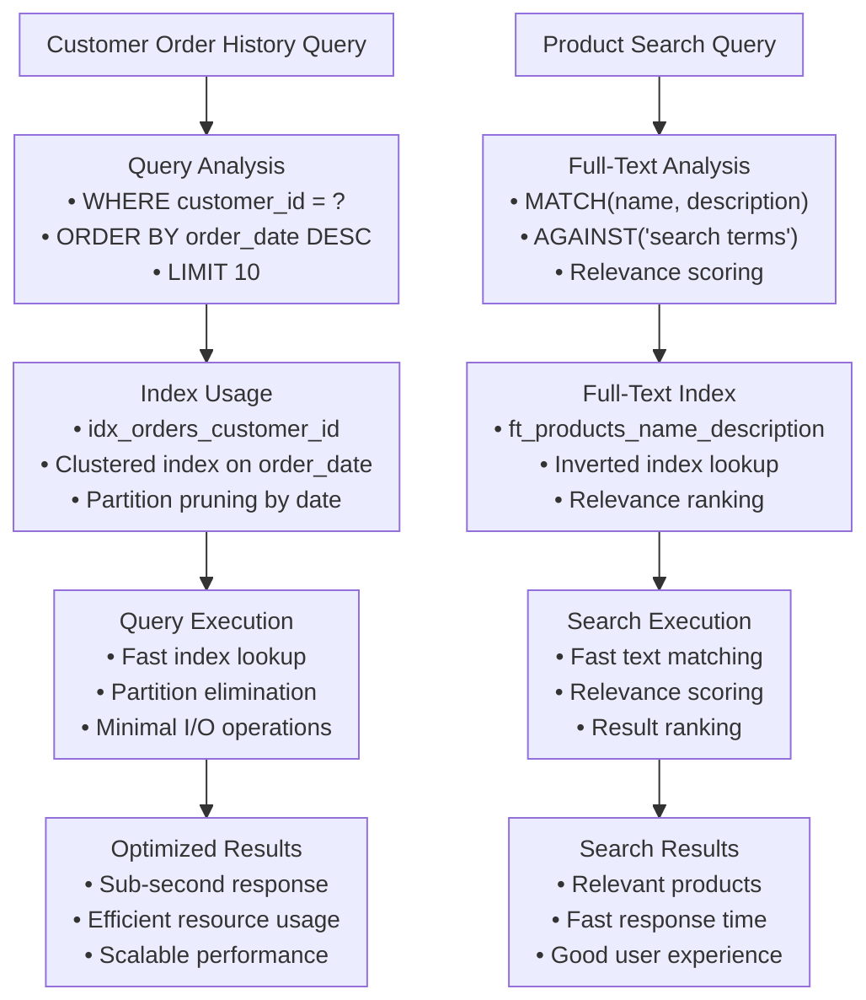

import Figure from "@site/src/components/Figure";
import Head from "@docusaurus/Head";
import Tabs from '@theme/Tabs';
import TabItem from '@theme/TabItem';
import Checklist from "@site/src/components/Checklist";
import Showcase from "@site/src/components/Showcase";
import Vs from "@site/src/components/Vs";
import Admonition from '@theme/Admonition';
import ProsCons from "@site/src/components/ProsCons";
import Hero from "@site/src/components/Hero";

<Head>
  <meta name="description" content="Master physical data modeling to optimize database implementations with indexes, partitions, storage engines, and performance tuning for specific database systems." />
  <meta property="og:title" content="Physical Data Modeling" />
  <meta property="og:description" content="Master physical data modeling to optimize database implementations with indexes, partitions, storage engines, and performance tuning for specific database systems." />
  <meta property="og:image" content="https://archman.dev/img/archman-social-card.webp" />
  <meta name="twitter:card" content="summary_large_image" />
  <link rel="canonical" href="https://archman.dev/docs/foundational-concepts/data-fundamentals/data-modeling/physical" />
  <script type="application/ld+json">{JSON.stringify({
    "@context": "https://schema.org",
    "@type": "Article",
    "headline": "Physical Data Modeling",
    "description": "Master physical data modeling to optimize database implementations with indexes, partitions, storage engines, and performance tuning for specific database systems.",
    "image": "https://archman.dev/img/archman-social-card.webp",
    "keywords": [
      "physical model", "database optimization", "indexing", "partitioning", "storage engines",
      "performance tuning", "database implementation", "query optimization", "storage strategy"
    ],
    "author": {"@type":"Person","name":"Archman"},
    "dateModified": "2025-01-27"
  })}</script>
  <script type="application/ld+json">{JSON.stringify({
    "@context":"https://schema.org",
    "@type":"BreadcrumbList",
    "itemListElement":[
      {"@type":"ListItem","position":1,"name":"Foundational Concepts","item":"https://archman.dev/docs/foundational-concepts"},
      {"@type":"ListItem","position":2,"name":"Data Fundamentals","item":"https://archman.dev/docs/foundational-concepts/data-fundamentals"},
      {"@type":"ListItem","position":3,"name":"Data Modeling","item":"https://archman.dev/docs/foundational-concepts/data-fundamentals/data-modeling"},
      {"@type":"ListItem","position":4,"name":"Physical Model","item":"https://archman.dev/docs/foundational-concepts/data-fundamentals/data-modeling/physical"}
    ]
  })}</script>
</Head>

<Hero
  title="Physical Data Modeling"
  subtitle="Optimize database implementations with indexes, partitions, storage engines, and performance tuning for specific database systems"
  image="/img/data-modeling/physical.png"
  imageAlt="Database optimization and performance tuning illustration"
  size="large"
/>

**TL;DR:** Physical data modeling optimizes logical database designs for specific database systems by adding indexes, partitions, storage engines, and performance tuning. It bridges the gap between logical design and production-ready database implementation, focusing on performance, scalability, and operational efficiency.

## Learning Objectives

You will be able to:
- **Optimize logical models** for specific database management systems and performance requirements
- **Design effective indexing strategies** including primary, secondary, composite, and specialized indexes
- **Implement partitioning schemes** for large tables to improve query performance and maintenance
- **Choose appropriate storage engines** and database-specific features for your use case
- **Plan for scalability** through sharding, replication, and performance monitoring strategies
- **Balance performance optimization** with operational complexity and maintenance overhead

## Motivating Scenario

You've designed a comprehensive logical model for your e-commerce platform with properly normalized tables and constraints. However, when you implement it in production, you discover that queries are slow, the database is consuming excessive storage, and maintenance operations are taking too long.

Physical data modeling addresses these challenges by optimizing your logical design for the specific database system you're using. You need to add indexes for frequently queried columns, partition large tables by date or region, choose appropriate storage engines for different table types, and configure database-specific features for optimal performance.

## What Is Physical Data Modeling?

Physical data modeling is the process of optimizing logical database designs for specific database management systems, focusing on performance, storage efficiency, and operational requirements. It answers the question: **"How should we implement this design in our specific database system?"**

The physical model transforms logical designs into production-ready implementations by considering:

<Figure caption="The physical modeling process flow from logical design to optimized database implementation.">


</Figure>

## Core Components

### Indexing Strategies

**Indexes** are data structures that improve query performance by providing fast access paths to data without scanning entire tables.

**Types of indexes:**

<Showcase
  title="Index Types and Their Applications"
  sections={[
    { 
      label: 'Primary Indexes', 
      body: 'Automatically created for primary keys. Provide unique, fast access to individual rows and enable efficient foreign key lookups.' 
    },
    { 
      label: 'Secondary Indexes', 
      body: 'Created on non-primary key columns to speed up WHERE clauses, ORDER BY operations, and JOIN conditions on frequently queried columns.' 
    },
    { 
      label: 'Composite Indexes', 
      body: 'Indexes on multiple columns that optimize queries filtering or sorting by multiple columns simultaneously.' 
    },
    { 
      label: 'Partial Indexes', 
      body: 'Index only a subset of rows based on a condition, reducing storage overhead while improving performance for specific queries.' 
    },
    { 
      label: 'Covering Indexes', 
      body: 'Include all columns needed for a query, allowing the database to answer queries using only the index without accessing the table.' 
    }
  ]}
/>

### Partitioning Strategies

**Partitioning** divides large tables into smaller, more manageable pieces while maintaining logical unity.

<Figure caption="Common partitioning strategies for large tables based on different access patterns.">


</Figure>

### Storage Engine Selection

**Storage engines** determine how data is stored, indexed, and accessed within the database system.

<Vs
  title="Storage Engine Comparison"
  items={[
    { 
      label: 'InnoDB (MySQL)', 
      points: [
        'ACID transactions and crash recovery',
        'Row-level locking and foreign keys',
        'Clustered indexes and MVCC',
        'Best for OLTP workloads',
        'Higher storage overhead'
      ] 
    },
    { 
      label: 'MyISAM (MySQL)', 
      points: [
        'Table-level locking only',
        'Faster for read-heavy workloads',
        'No transactions or foreign keys',
        'Lower storage overhead',
        'Good for data warehousing'
      ] 
    },
    { 
      label: 'PostgreSQL Default', 
      points: [
        'ACID compliance and MVCC',
        'Extensible with custom types',
        'Advanced indexing options',
        'Excellent for complex queries',
        'Higher memory usage'
      ] 
    }
  ]}
  highlight={0}
  highlightTone="positive"
/>

## Decision Framework

<Figure caption="Decision flow for physical data modeling optimization based on your specific requirements and constraints.">


</Figure>

## Practical Example: E-Commerce Physical Model

Let's optimize the logical e-commerce model for a MySQL production environment with high transaction volume.

<Figure caption="Physical database implementation showing indexes, partitions, and storage optimizations for the e-commerce platform.">


</Figure>

### Indexing Implementation

<Tabs groupId="lang" queryString>
  <TabItem value="customers" label="Customers Table Indexes">

```sql title="customers_indexes.sql" showLineNumbers
-- Primary table with InnoDB engine for ACID compliance
CREATE TABLE customers (
    customer_id INT AUTO_INCREMENT PRIMARY KEY,
    email VARCHAR(255) NOT NULL,
    first_name VARCHAR(100) NOT NULL,
    last_name VARCHAR(100) NOT NULL,
    registration_date DATE NOT NULL,
    status ENUM('active', 'inactive', 'suspended') NOT NULL DEFAULT 'active',
    created_at TIMESTAMP DEFAULT CURRENT_TIMESTAMP,
    updated_at TIMESTAMP DEFAULT CURRENT_TIMESTAMP ON UPDATE CURRENT_TIMESTAMP,
    
    -- Constraints
    UNIQUE KEY uk_customers_email (email),
    CONSTRAINT chk_email_format CHECK (email REGEXP '^[A-Za-z0-9._%+-]+@[A-Za-z0-9.-]+\\.[A-Za-z]{2,}$')
) ENGINE=InnoDB;

-- Indexes for common query patterns
CREATE INDEX idx_customers_status ON customers(status);
CREATE INDEX idx_customers_registration_date ON customers(registration_date);
CREATE INDEX idx_customers_name_search ON customers(first_name, last_name);
CREATE INDEX idx_customers_created_at ON customers(created_at);

-- Composite index for customer lookup by name and status
CREATE INDEX idx_customers_name_status ON customers(first_name, last_name, status);
```

  </TabItem>
  <TabItem value="orders" label="Orders Table with Partitioning">

```sql title="orders_partitioned.sql" showLineNumbers
-- Partitioned orders table for better performance and maintenance
CREATE TABLE orders (
    order_id INT AUTO_INCREMENT,
    customer_id INT NOT NULL,
    shipping_address_id INT NOT NULL,
    billing_address_id INT NOT NULL,
    order_date DATE NOT NULL,
    status ENUM('pending', 'confirmed', 'shipped', 'delivered', 'cancelled') NOT NULL DEFAULT 'pending',
    subtotal DECIMAL(10,2) NOT NULL DEFAULT 0.00,
    tax_amount DECIMAL(10,2) NOT NULL DEFAULT 0.00,
    shipping_amount DECIMAL(10,2) NOT NULL DEFAULT 0.00,
    total_amount DECIMAL(10,2) NOT NULL DEFAULT 0.00,
    created_at TIMESTAMP DEFAULT CURRENT_TIMESTAMP,
    updated_at TIMESTAMP DEFAULT CURRENT_TIMESTAMP ON UPDATE CURRENT_TIMESTAMP,
    
    PRIMARY KEY (order_id, order_date),
    KEY idx_orders_customer_id (customer_id),
    KEY idx_orders_status (status),
    KEY idx_orders_total_amount (total_amount),
    KEY idx_orders_created_at (created_at),
    
    -- Foreign key constraints
    FOREIGN KEY (customer_id) REFERENCES customers(customer_id) ON DELETE RESTRICT,
    FOREIGN KEY (shipping_address_id) REFERENCES addresses(address_id) ON DELETE RESTRICT,
    FOREIGN KEY (billing_address_id) REFERENCES addresses(address_id) ON DELETE RESTRICT
) ENGINE=InnoDB
PARTITION BY RANGE (YEAR(order_date)) (
    PARTITION p2023 VALUES LESS THAN (2024),
    PARTITION p2024 VALUES LESS THAN (2025),
    PARTITION p2025 VALUES LESS THAN (2026),
    PARTITION p_future VALUES LESS THAN MAXVALUE
);
```

  </TabItem>
  <TabItem value="products" label="Products Table with Full-Text Search">

```sql title="products_fulltext.sql" showLineNumbers
-- Products table with full-text search capabilities
CREATE TABLE products (
    product_id INT AUTO_INCREMENT PRIMARY KEY,
    sku VARCHAR(100) NOT NULL,
    name VARCHAR(255) NOT NULL,
    description TEXT,
    price DECIMAL(10,2) NOT NULL,
    category_id INT NOT NULL,
    status ENUM('active', 'inactive', 'discontinued') NOT NULL DEFAULT 'active',
    stock_quantity INT NOT NULL DEFAULT 0,
    created_at TIMESTAMP DEFAULT CURRENT_TIMESTAMP,
    updated_at TIMESTAMP DEFAULT CURRENT_TIMESTAMP ON UPDATE CURRENT_TIMESTAMP,
    
    -- Constraints
    UNIQUE KEY uk_products_sku (sku),
    FOREIGN KEY (category_id) REFERENCES categories(category_id) ON DELETE RESTRICT,
    CONSTRAINT chk_price_positive CHECK (price >= 0),
    CONSTRAINT chk_stock_non_negative CHECK (stock_quantity >= 0)
) ENGINE=InnoDB;

-- Standard indexes for common queries
CREATE INDEX idx_products_category_id ON products(category_id);
CREATE INDEX idx_products_status ON products(status);
CREATE INDEX idx_products_price ON products(price);
CREATE INDEX idx_products_stock_quantity ON products(stock_quantity);
CREATE INDEX idx_products_created_at ON products(created_at);

-- Full-text indexes for search functionality
CREATE FULLTEXT INDEX ft_products_name ON products(name);
CREATE FULLTEXT INDEX ft_products_description ON products(description);
CREATE FULLTEXT INDEX ft_products_name_description ON products(name, description);

-- Composite index for product filtering
CREATE INDEX idx_products_category_status ON products(category_id, status);
```

  </TabItem>
</Tabs>

### Query Optimization Examples

<Figure caption="Query execution flow showing how indexes and partitions improve performance for common e-commerce queries.">


</Figure>

## When to Use Physical Modeling

<Vs
  title="Physical vs. Other Modeling Approaches"
  items={[
    { 
      label: 'Physical Modeling', 
      points: [
        'Production database implementation',
        'Performance optimization',
        'Database-specific features',
        'Operational efficiency',
        'Scalability planning'
      ] 
    },
    { 
      label: 'Logical-Only Approach', 
      points: [
        'Cross-platform compatibility',
        'Database-agnostic design',
        'Conceptual understanding',
        'Initial prototyping',
        'Academic or theoretical work'
      ] 
    }
  ]}
  highlight={0}
  highlightTone="positive"
/>

**Use physical modeling when:**
- **Implementing production databases** with specific performance requirements
- **Optimizing existing systems** that are experiencing performance issues
- **Planning for scale** with large data volumes and high transaction rates
- **Leveraging database-specific features** for competitive advantage
- **Ensuring operational efficiency** for maintenance and monitoring

**Skip physical modeling when:**
- **Prototyping or proof-of-concept** work where performance isn't critical
- **Cross-platform applications** that need to support multiple database systems
- **Simple applications** with minimal performance requirements
- **Academic or learning environments** where database-agnostic design is preferred

## Performance Optimization Strategies

### Indexing Best Practices

<Showcase
  title="Effective Indexing Strategies"
  sections={[
    { 
      label: 'Query-Driven Indexing', 
      body: 'Create indexes based on actual query patterns. Monitor slow query logs and add indexes for frequently executed queries with poor performance.' 
    },
    { 
      label: 'Composite Index Order', 
      body: 'Order columns in composite indexes by selectivity (most selective first) and query usage patterns. Consider covering indexes for read-heavy queries.' 
    },
    { 
      label: 'Index Maintenance', 
      body: 'Regularly analyze index usage and remove unused indexes. Monitor index fragmentation and rebuild or reorganize as needed.' 
    },
    { 
      label: 'Storage Considerations', 
      body: 'Balance index benefits against storage overhead. Consider partial indexes for large tables with specific access patterns.' 
    }
  ]}
/>

### Partitioning Benefits and Trade-offs

<ProsCons
  pros={[
    'Improves query performance through partition pruning',
    'Enables parallel operations and maintenance',
    'Simplifies data archiving and purging',
    'Reduces lock contention for concurrent operations',
    'Allows different storage engines per partition'
  ]}
  cons={[
    'Increases complexity of schema design and maintenance',
    'May not benefit all query patterns equally',
    'Requires careful planning of partition keys',
    'Can complicate backup and recovery procedures',
    'May impact cross-partition queries negatively'
  ]}
/>

## Common Patterns and Anti-Patterns

### Effective Patterns

<Showcase
  title="Successful Physical Modeling Patterns"
  sections={[
    { 
      label: 'Performance-First Design', 
      body: 'Design indexes and partitions based on actual query patterns and performance requirements, not theoretical optimization.' 
    },
    { 
      label: 'Incremental Optimization', 
      body: 'Start with basic indexing and gradually add optimizations based on monitoring and performance testing results.' 
    },
    { 
      label: 'Monitoring Integration', 
      body: 'Implement comprehensive monitoring of query performance, index usage, and storage utilization to guide optimization decisions.' 
    },
    { 
      label: 'Maintenance Planning', 
      body: 'Plan for regular maintenance operations including index rebuilding, partition management, and statistics updates.' 
    }
  ]}
/>

### Common Anti-Patterns

<Showcase
  title="Physical Modeling Pitfalls to Avoid"
  sections={[
    { 
      label: 'Over-Indexing', 
      body: 'Creating too many indexes that slow down write operations and consume excessive storage without providing query benefits.', 
      tone: 'warning' 
    },
    { 
      label: 'Premature Optimization', 
      body: 'Adding complex optimizations before understanding actual usage patterns and performance bottlenecks.', 
      tone: 'warning' 
    },
    { 
      label: 'Ignoring Maintenance', 
      body: 'Failing to plan for ongoing maintenance of indexes, partitions, and database statistics, leading to performance degradation.', 
      tone: 'warning' 
    },
    { 
      label: 'Database Lock-in', 
      body: 'Using database-specific features that make migration difficult without considering long-term platform flexibility.', 
      tone: 'warning' 
    }
  ]}
/>

## Hands-On Exercise

<Admonition type="info" title="Exercise: Optimize a Library Management System">
Take the logical library management schema from previous exercises and optimize it for a MySQL production environment.

**Requirements:**
- 1 million+ books, 100K+ patrons, 10K+ daily transactions
- Common queries: patron lookup, book search, overdue items, popular books
- Need to support full-text search on book titles and descriptions
- Archive old circulation records annually

**Steps:**
1. **Analyze query patterns** and identify performance bottlenecks
2. **Design indexing strategy** for common queries and search operations
3. **Plan partitioning scheme** for large tables (circulation records)
4. **Choose storage engines** appropriate for different table types
5. **Create optimized schema** with indexes and partitions
6. **Document maintenance procedures** for ongoing optimization

**Deliverables:**
- Optimized physical schema with indexes and partitions
- SQL DDL statements for implementation
- Performance monitoring plan
- Maintenance procedures documentation
</Admonition>

## Operational Considerations

### Performance Monitoring

**Key metrics to monitor:**
- **Query performance**: Slow query logs, execution plans, response times
- **Index usage**: Index hit ratios, unused indexes, index fragmentation
- **Storage utilization**: Table sizes, index sizes, partition sizes
- **Concurrency**: Lock waits, deadlocks, connection pool usage

**Monitoring tools and techniques:**
- **Database-specific tools**: MySQL Performance Schema, PostgreSQL pg_stat_statements
- **Query analysis**: EXPLAIN plans, query profiling, slow query analysis
- **System monitoring**: CPU, memory, disk I/O, network utilization
- **Application monitoring**: Response times, error rates, throughput metrics

### Maintenance Procedures

**Regular maintenance tasks:**
- **Index maintenance**: Rebuild fragmented indexes, remove unused indexes
- **Statistics updates**: Refresh table and index statistics for query optimization
- **Partition management**: Add new partitions, archive old data, maintain partition pruning
- **Storage optimization**: Compress old data, reclaim unused space, optimize storage engines

**Automation strategies:**
- **Scheduled maintenance**: Automated index rebuilding and statistics updates
- **Monitoring alerts**: Automated alerts for performance degradation or storage issues
- **Backup procedures**: Automated backups with point-in-time recovery capabilities
- **Capacity planning**: Automated monitoring of growth trends and capacity limits

## Security and Privacy Considerations

### Data Protection

**Encryption strategies:**
- **Encryption at rest**: Use database encryption features for sensitive data
- **Encryption in transit**: Ensure all database connections use TLS/SSL
- **Key management**: Implement proper key rotation and management procedures
- **Access controls**: Use database-level access controls and audit logging

**Privacy compliance:**
- **Data minimization**: Only store necessary data elements in optimized structures
- **Retention policies**: Implement automated data purging based on retention requirements
- **Audit trails**: Maintain comprehensive audit logs for data access and modifications
- **Right to erasure**: Design for efficient data deletion when required by privacy regulations

### Access Control

**Database security:**
- **Principle of least privilege**: Grant minimum necessary permissions for each role
- **Role-based access**: Implement role-based access control for different user types
- **Connection security**: Use secure connection protocols and authentication methods
- **Audit logging**: Log all database access and administrative operations

## Observability and Monitoring

### Performance Metrics

**Database performance indicators:**
- **Query performance**: Average response time, 95th percentile response time, slow query count
- **Throughput**: Transactions per second, queries per second, concurrent connections
- **Resource utilization**: CPU usage, memory usage, disk I/O, network I/O
- **Availability**: Uptime percentage, planned vs. unplanned downtime

**Index effectiveness metrics:**
- **Index usage**: Percentage of queries using indexes, index hit ratios
- **Index efficiency**: Index size vs. performance benefit, unused indexes
- **Maintenance overhead**: Time spent on index maintenance, storage overhead
- **Query optimization**: Improvement in query performance after index creation

### Alerting and Incident Response

**Performance alerts:**
- **Query performance degradation**: Alert when average response time exceeds thresholds
- **Resource exhaustion**: Alert when CPU, memory, or disk usage approaches limits
- **Index issues**: Alert on index fragmentation or unused indexes
- **Connection problems**: Alert on connection pool exhaustion or timeout issues

**Incident response procedures:**
- **Performance incidents**: Procedures for identifying and resolving performance issues
- **Capacity incidents**: Procedures for handling resource exhaustion
- **Data corruption**: Procedures for detecting and recovering from data integrity issues
- **Security incidents**: Procedures for responding to unauthorized access attempts

## Self-Check

1. **Performance Analysis**: Can you identify the most critical indexes needed for your application's query patterns?

2. **Scalability Planning**: Have you considered how your physical model will perform as data volumes grow?

3. **Maintenance Planning**: Do you have procedures in place for ongoing optimization and maintenance of your physical model?

## Design Review Checklist

<Checklist
  title="Physical Model Review Checklist"
  items={[
    { label: 'Indexes created for all frequently queried columns' },
    { label: 'Composite indexes optimized for multi-column queries' },
    { label: 'Large tables partitioned appropriately for access patterns' },
    { label: 'Storage engines chosen based on table usage patterns' },
    { label: 'Query performance tested with realistic data volumes' },
    { label: 'Maintenance procedures documented and automated' },
    { label: 'Monitoring and alerting configured for key metrics' },
    { label: 'Backup and recovery procedures tested' },
    { label: 'Security controls implemented for sensitive data' },
    { label: 'Documentation updated with optimization rationale' }
  ]}
/>

## Related Topics

- [Conceptual Data Modeling](./conceptual) - Business-focused entity and relationship modeling
- [Logical Data Modeling](./logical) - Structured database design and normalization
- [Indexing & Query Optimization](../indexing-and-query-optimization) - Advanced indexing strategies and query tuning
- [Transactions & Isolation Levels](../transactions-and-isolation-levels) - Data consistency and concurrency control
- [Data Architecture & Persistence](../../../data-architecture-and-persistence) - Enterprise data architecture patterns
- [Observability & Operations](../../../observability-and-operations) - Monitoring and operational excellence

## References

1. <a href="https://www.amazon.com/High-Performance-MySQL-Optimization-Replication/dp/1449314287" target="_blank" rel="nofollow noopener noreferrer">Schwartz, B., Zaitsev, P., & Tkachenko, V. High Performance MySQL: Optimization, Backups, and Replication ↗️</a>
2. <a href="https://www.amazon.com/PostgreSQL-High-Performance-Gregory-Smith/dp/184951030X" target="_blank" rel="nofollow noopener noreferrer">Smith, G. PostgreSQL High Performance ↗️</a>
3. <a href="https://docs.oracle.com/en/database/oracle/oracle-database/19/admin/" target="_blank" rel="nofollow noopener noreferrer">Oracle Corporation. Oracle Database Administrator's Guide ↗️</a>
