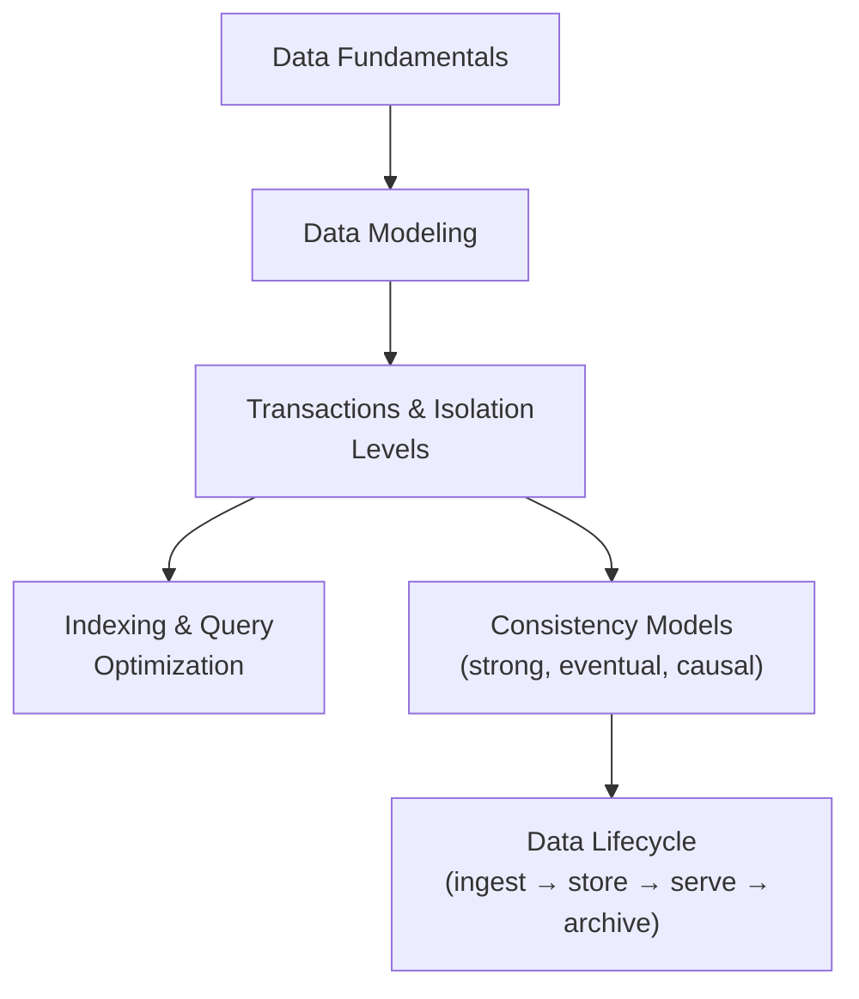

import { useCurrentSidebarCategory } from "@docusaurus/theme-common";

# Data Fundamentals

This overview orients you to the essential building blocks behind most data decisions: how you model information, enforce correctness under concurrent access, make reads fast, reason about consistency, and manage data through its lifecycle. Use this page as a map to the child articles—each one goes deeper with examples and trade‑offs.

## Mental model

<Figure caption="A vertical map of core data topics to explore in order.">

</Figure>

## What’s in scope

- **Data modeling**: choose the right abstractions and shape at the [conceptual, logical, and physical](./data-modeling) levels.
- **Transactions & isolation**: maintain invariants under concurrency—see [Transactions & Isolation Levels](./transactions-and-isolation-levels).
- **Indexing & queries**: accelerate access paths—see [Indexing & Query Optimization](./indexing-and-query-optimization).
- **Consistency models**: align semantics with system realities—see [Consistency Models](./consistency-models).
- **Lifecycle**: plan retention, archival, and deletion—see [Data Lifecycle](./data-lifecycle).

## How to use this section

- Start with [Data Modeling](./data-modeling) to frame entities, relationships, and access patterns.
- Ground concurrency guarantees in [Transactions & Isolation Levels](./transactions-and-isolation-levels); pair with budgets in [Quality Attributes](../../quality-attributes).
- Match access paths to workload using [Indexing & Query Optimization](./indexing-and-query-optimization).
- Set correct expectations across services with [Consistency Models](./consistency-models) and the sibling overview [Basic Distributed Systems Concepts](../basic-distributed-systems-concepts).
- Close the loop with [Data Lifecycle](./data-lifecycle) and deeper topics in [Data Architecture & Persistence](../../data-architecture-and-persistence).

## Related topics

- [Basic Distributed Systems Concepts](../basic-distributed-systems-concepts)
- [Quality Attributes](../../quality-attributes)
- [Data Architecture & Persistence](../../data-architecture-and-persistence)

<DocCardList items={useCurrentSidebarCategory().items} />
