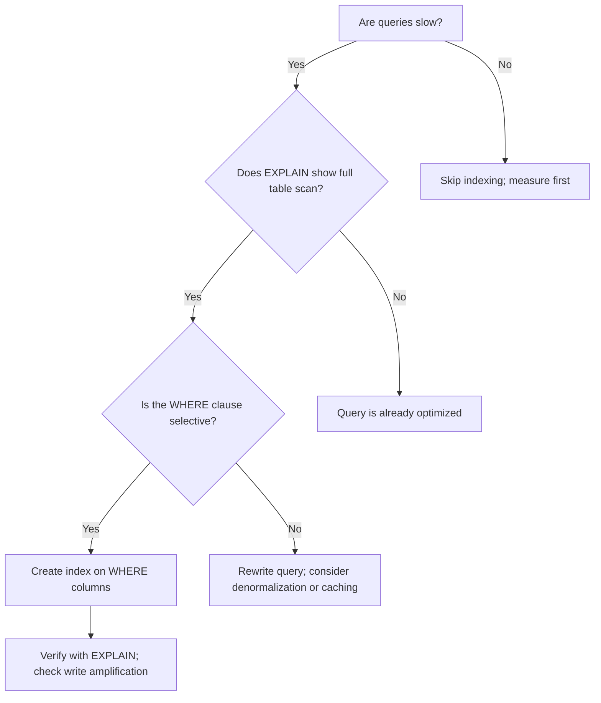

<Hero
  title="Indexing & Query Optimization"
  description="From access paths to selectivity—how to read plans and choose the right indexes"
  size="large"
/>

## TL;DR

Indexes accelerate lookups by maintaining ordered access paths; good queries leverage selective predicates and covered indexes to minimize disk IO. Measure with query execution plans, avoid wildcard prefixes and unbounded scans, and watch for write amplification and hotspotting. The key: understand your query patterns first, then add indexes strategically.

## Learning Objectives

After reading this article, you will be able to:

- Read and interpret SQL execution plans to identify index usage and bottlenecks.
- Design composite indexes aligned with common query access patterns.
- Detect and remediate anti-patterns (N+1 queries, wildcard LIKE, full table scans).
- Balance index benefit (faster reads) against cost (slower writes, storage).
- Understand and mitigate hotspot and sharding issues in distributed systems.

## Motivating Scenario

Your e-commerce platform's product search takes 5 seconds for 100 queries/second. The database is at saturation: every search does a full table scan of 10M products. After analyzing query patterns, you notice most searches filter by category and price range, then sort by rating. Adding a composite index `(category, price, rating)` reduces latency to 50ms. Write latency increases slightly (index overhead), but reads are now 100x faster. The cost: 200MB of additional index storage and a brief lock during index creation.

## Core Concepts

### What is an Index?

An index is a data structure (usually a B-tree) that maintains a sorted view of table columns, allowing the database to find rows quickly without scanning all rows.

Example: A table with 10M rows takes milliseconds to find rows by ID if an index exists, but seconds with a full scan.

### Types of Indexes

| Type | Use Case | Trade-offs |
|------|----------|-----------|
| **Primary** | Unique identifier, fast lookups | Enforced uniqueness, slower inserts |
| **B-tree** | Range queries, equality, sorting | Standard, general-purpose |
| **Hash** | Equality only, very fast | No range queries, no sorting |
| **Bitmap** | Low-cardinality columns (gender, status) | Fast for filtering, slow for updates |
| **Covering** | Includes all columns needed for a query | Larger index, faster reads |
| **Partial** | WHERE condition (e.g., is_deleted = false) | Smaller index, faster inserts if filters match |

### Composite Index Design

The order of columns in a composite index matters:

```
Index: (category, price, rating)

Good query: SELECT * FROM products WHERE category='Electronics' AND price < 100 ORDER BY rating
→ Index is used: category filter, then price filter, then rating sort

Mediocre query: SELECT * FROM products WHERE price < 100 AND category='Electronics'
→ Same result, index still used (optimizer may reorder), but less efficient if price is not the first filter

Bad query: SELECT * FROM products WHERE rating > 4.5
→ Index cannot be used for rating without first filtering by category (missing leading column)
```

**Rule: ESL**
- **Equality** columns first (exact matches).
- **Sort** columns second (ORDER BY).
- **Late** columns last (range/filter).

### Cardinality and Selectivity

Cardinality is the number of distinct values in a column. Selectivity is the fraction of rows returned.

- High cardinality (IDs, emails): Good for index leading columns; filters out many rows.
- Low cardinality (gender, status): Worse for leading columns; filters few rows.

Example:
```
Column: user_id → cardinality = 10M, selectivity = 1 row / 10M (very selective)
Column: is_active → cardinality = 2, selectivity = 50% (not selective)

Composite: (user_id, is_active)
→ user_id filters to 1 row; is_active is redundant (already unique)

Composite: (is_active, user_id)
→ is_active filters to 5M rows; user_id further filters to 1 row (better left-to-right filtering)
```

<Figure caption="Decision flow: add indexes where queries are selective and frequently run.">

</Figure>

## Practical Example: Index Design and Query Optimization

<Tabs>
  <TabItem value="sql" label="SQL">
```sql
-- Product table with 10M rows
CREATE TABLE products (
    id BIGINT PRIMARY KEY,
    category_id INT NOT NULL,
    price DECIMAL(10, 2) NOT NULL,
    rating FLOAT,
    name VARCHAR(255),
    is_active BOOLEAN DEFAULT true,
    created_at TIMESTAMP DEFAULT CURRENT_TIMESTAMP
);

-- Common query pattern: filter by category, price range, sort by rating
-- BEFORE: No index on (category_id, price)
EXPLAIN SELECT id, name, price, rating
FROM products
WHERE category_id = 5
  AND price BETWEEN 10 AND 100
ORDER BY rating DESC
LIMIT 20;
-- Result: Full table scan, 10M rows examined, ~5 seconds

-- AFTER: Composite index
CREATE INDEX idx_category_price_rating ON products(category_id, price, rating DESC);

-- EXPLAIN again:
EXPLAIN SELECT id, name, price, rating
FROM products
WHERE category_id = 5
  AND price BETWEEN 10 AND 100
ORDER BY rating DESC
LIMIT 20;
-- Result: Index seek, ~1000 rows examined, ~50ms

-- Covering index: include 'name' so database doesn't need table lookup
CREATE INDEX idx_category_price_rating_covering
ON products(category_id, price, rating DESC)
INCLUDE (name, id);

-- Now the query doesn't need a table lookup at all
EXPLAIN SELECT id, name, price, rating
FROM products
WHERE category_id = 5
  AND price BETWEEN 10 AND 100
ORDER BY rating DESC
LIMIT 20;
-- Result: Index-only scan, ~1000 rows examined, ~20ms

-- Anti-pattern: Wildcard at start (cannot use index efficiently)
EXPLAIN SELECT * FROM products WHERE name LIKE '%laptop%';
-- Result: Full table scan, cannot use name index

-- Better: Wildcard at end (can use index)
EXPLAIN SELECT * FROM products WHERE name LIKE 'laptop%';
-- Result: Index range scan, faster

-- Anti-pattern: N+1 queries (common in ORMs)
-- Pseudocode:
-- categories = db.query("SELECT * FROM categories")
-- for cat in categories:
--     products = db.query("SELECT * FROM products WHERE category_id = ?", cat.id)  # N queries
-- Total: 1 + N queries

-- Better: Join or batch query
SELECT c.id, c.name, COUNT(p.id) as product_count
FROM categories c
LEFT JOIN products p ON c.id = p.category_id
WHERE c.is_active = true
GROUP BY c.id
LIMIT 100;
-- Result: Single query, 100ms

-- Hotspot avoidance: Don't use monotonically increasing IDs as first index column
-- BAD: Data concentrated at high end of index tree
CREATE INDEX idx_id_time ON events(id, event_time);

-- BETTER: Use hash sharding or reverse keys to distribute writes
-- Partition by (id % number_of_shards) to scatter insertions
CREATE TABLE events_shard_0 PARTITION OF events FOR VALUES IN (0);
CREATE TABLE events_shard_1 PARTITION OF events FOR VALUES IN (1);
-- Then insert events('shard_' || (id % num_shards), id, event_time, ...)
```
  </TabItem>

  <TabItem value="python" label="Python">
```python
from typing import List, Dict, Tuple
from dataclasses import dataclass
from collections import defaultdict

@dataclass
class Index:
    """Represents a B-tree index on columns."""
    name: str
    columns: List[str]  # Column names in order
    covering_columns: List[str] = None  # Columns included for covering index
    unique: bool = False

    def can_satisfy_query(self, filter_columns: List[str], sort_column: str = None) -> bool:
        """
        Check if this index can satisfy a query.
        - Filter columns should be a prefix of index columns
        - Sort column should be the next index column after filters
        """
        if not filter_columns:
            return False

        # Check if filter columns match index prefix
        for i, col in enumerate(filter_columns):
            if i >= len(self.columns) or self.columns[i] != col:
                return False

        # Check if sort column is next in index
        if sort_column:
            expected_idx = len(filter_columns)
            if expected_idx >= len(self.columns) or self.columns[expected_idx] != sort_column:
                return False

        return True

    def estimate_rows_examined(self, table_size: int, selectivity: float) -> int:
        """Estimate rows examined with this index."""
        # If index is used, we examine roughly table_size * selectivity
        # If no index, we examine all rows
        return int(table_size * selectivity)

@dataclass
class QueryPattern:
    """Describes a query access pattern."""
    filter_columns: List[str]
    sort_column: str = None
    estimated_frequency: int = 1  # Queries per second

class IndexOptimizer:
    """Helps design indexes for a workload."""

    def __init__(self, table_size: int = 10_000_000):
        self.table_size = table_size
        self.indexes: List[Index] = []
        self.query_patterns: List[QueryPattern] = []

    def add_index(self, name: str, columns: List[str], covering: List[str] = None):
        """Add an index."""
        idx = Index(name, columns, covering)
        self.indexes.append(idx)
        print(f"[Index] {name} on ({', '.join(columns)})" +
              (f" covering ({', '.join(covering)})" if covering else ""))

    def add_query_pattern(self, filters: List[str], sort_col: str = None, freq: int = 1):
        """Add a query pattern."""
        pattern = QueryPattern(filters, sort_col, freq)
        self.query_patterns.append(pattern)
        print(f"[Query] filters={filters}, sort={sort_col}, freq={freq}qps")

    def analyze(self):
        """Analyze query patterns and recommend indexes."""
        print("\n=== Query Pattern Analysis ===\n")

        recommendations = []

        for pattern in self.query_patterns:
            print(f"Pattern: {pattern.filter_columns} | sort: {pattern.sort_column}")

            # Check which indexes can satisfy this query
            satisfying_indexes = [
                idx for idx in self.indexes
                if idx.can_satisfy_query(pattern.filter_columns, pattern.sort_column)
            ]

            if satisfying_indexes:
                for idx in satisfying_indexes:
                    print(f"  ✓ Index '{idx.name}' can satisfy this query")
            else:
                # Recommend a new index
                recommended_columns = pattern.filter_columns[:]
                if pattern.sort_column:
                    recommended_columns.append(pattern.sort_column)

                print(f"  ✗ No index found. Recommend: ({', '.join(recommended_columns)})")
                recommendations.append({
                    'columns': recommended_columns,
                    'frequency': pattern.estimated_frequency
                })

        return recommendations

    def estimate_cost(self):
        """Estimate read and write costs."""
        print("\n=== Cost Analysis ===\n")

        read_cost = 0
        write_cost = 0  # Write cost increases with each index

        # Cost per index maintained on write
        write_cost_per_index = 1  # Relative unit

        for pattern in self.query_patterns:
            # Find best index for this pattern
            satisfying = [idx for idx in self.indexes
                         if idx.can_satisfy_query(pattern.filter_columns, pattern.sort_column)]

            if satisfying:
                # Estimate selectivity (rough: 1% of table by default)
                selectivity = 0.01
                rows_examined = satisfying[0].estimate_rows_examined(self.table_size, selectivity)
                read_cost += rows_examined * pattern.estimated_frequency

        # Write cost: each index added increases write latency
        write_cost = len(self.indexes) * write_cost_per_index

        print(f"Estimated read cost (rows/sec): {read_cost:,}")
        print(f"Estimated write cost (relative): {write_cost}")
        print(f"Ratio (read/write): {read_cost / max(write_cost, 1):.0f}:1")

# Example usage
def main():
    print("=== Index Optimization Workload Analysis ===\n")

    optimizer = IndexOptimizer(table_size=10_000_000)

    # Define query patterns
    print("--- Define Query Patterns ---")
    optimizer.add_query_pattern(
        filters=['category_id'],
        sort_col='rating',
        freq=1000  # 1000 queries/sec
    )
    optimizer.add_query_pattern(
        filters=['category_id', 'price'],
        sort_col='rating',
        freq=500
    )
    optimizer.add_query_pattern(
        filters=['user_id'],
        sort_col='created_at',
        freq=200
    )

    # Analyze without indexes
    print("\n--- Phase 1: No Indexes ---")
    recs = optimizer.analyze()
    optimizer.estimate_cost()

    # Add recommended indexes
    print("\n--- Phase 2: Add Indexes ---")
    optimizer.add_index("idx_category_rating", ["category_id", "rating"])
    optimizer.add_index("idx_category_price_rating", ["category_id", "price", "rating"])
    optimizer.add_index("idx_user_created", ["user_id", "created_at"])

    # Re-analyze with indexes
    print("\n--- Phase 3: With Indexes ---")
    recs = optimizer.analyze()
    optimizer.estimate_cost()

    # Best practices
    print("\n--- Index Best Practices ---")
    print("1. ESL Rule: Equality → Sort → Late (range filters)")
    print("2. Cardinality: Put selective columns first")
    print("3. Covering: Include columns to avoid table lookups")
    print("4. Partial: Index only rows that match WHERE condition")
    print("5. Hotspots: Avoid monotonically increasing keys as first column")

if __name__ == "__main__":
    main()
```
  </TabItem>

  <TabItem value="nodejs" label="Node.js">
```javascript
class Index {
  constructor(name, columns, coveringColumns = []) {
    this.name = name;
    this.columns = columns; // Array of column names
    this.coveringColumns = coveringColumns;
  }

  canSatisfyQuery(filterColumns, sortColumn = null) {
    // Check if filter columns match index prefix
    for (let i = 0; i < filterColumns.length; i++) {
      if (i >= this.columns.length || this.columns[i] !== filterColumns[i]) {
        return false;
      }
    }

    // Check if sort column is next in index
    if (sortColumn) {
      const expectedIdx = filterColumns.length;
      if (expectedIdx >= this.columns.length || this.columns[expectedIdx] !== sortColumn) {
        return false;
      }
    }

    return true;
  }

  estimateRowsExamined(tableSize, selectivity) {
    return Math.floor(tableSize * selectivity);
  }
}

class QueryPattern {
  constructor(filterColumns, sortColumn = null, estimatedFrequency = 1) {
    this.filterColumns = filterColumns;
    this.sortColumn = sortColumn;
    this.estimatedFrequency = estimatedFrequency; // Queries per second
  }
}

class IndexOptimizer {
  constructor(tableSize = 10_000_000) {
    this.tableSize = tableSize;
    this.indexes = [];
    this.queryPatterns = [];
  }

  addIndex(name, columns, covering = []) {
    const idx = new Index(name, columns, covering);
    this.indexes.push(idx);
    const coveringStr = covering.length > 0 ? ` covering (${covering.join(", ")})` : "";
    console.log(`[Index] ${name} on (${columns.join(", ")})${coveringStr}`);
  }

  addQueryPattern(filters, sortCol = null, freq = 1) {
    const pattern = new QueryPattern(filters, sortCol, freq);
    this.queryPatterns.push(pattern);
    console.log(`[Query] filters=${JSON.stringify(filters)}, sort=${sortCol}, freq=${freq}qps`);
  }

  analyze() {
    console.log("\n=== Query Pattern Analysis ===\n");

    const recommendations = [];

    for (const pattern of this.queryPatterns) {
      console.log(`Pattern: ${JSON.stringify(pattern.filterColumns)} | sort: ${pattern.sortColumn}`);

      const satisfyingIndexes = this.indexes.filter(idx =>
        idx.canSatisfyQuery(pattern.filterColumns, pattern.sortColumn)
      );

      if (satisfyingIndexes.length > 0) {
        for (const idx of satisfyingIndexes) {
          console.log(`  ✓ Index '${idx.name}' can satisfy this query`);
        }
      } else {
        const recommendedColumns = [...pattern.filterColumns];
        if (pattern.sortColumn) {
          recommendedColumns.push(pattern.sortColumn);
        }
        console.log(`  ✗ No index found. Recommend: (${recommendedColumns.join(", ")})`);
        recommendations.push({
          columns: recommendedColumns,
          frequency: pattern.estimatedFrequency,
        });
      }
    }

    return recommendations;
  }

  estimateCost() {
    console.log("\n=== Cost Analysis ===\n");

    let readCost = 0;
    const writeCostPerIndex = 1;

    for (const pattern of this.queryPatterns) {
      const satisfying = this.indexes.filter(idx =>
        idx.canSatisfyQuery(pattern.filterColumns, pattern.sortColumn)
      );

      if (satisfying.length > 0) {
        const selectivity = 0.01;
        const rowsExamined = satisfying[0].estimateRowsExamined(this.tableSize, selectivity);
        readCost += rowsExamined * pattern.estimatedFrequency;
      }
    }

    const writeCost = this.indexes.length * writeCostPerIndex;

    console.log(`Estimated read cost (rows/sec): ${readCost.toLocaleString()}`);
    console.log(`Estimated write cost (relative): ${writeCost}`);
    console.log(`Ratio (read/write): ${Math.round(readCost / Math.max(writeCost, 1))}:1`);
  }
}

// Main
console.log("=== Index Optimization Workload Analysis ===\n");

const optimizer = new IndexOptimizer(10_000_000);

console.log("--- Define Query Patterns ---");
optimizer.addQueryPattern(["category_id"], "rating", 1000);
optimizer.addQueryPattern(["category_id", "price"], "rating", 500);
optimizer.addQueryPattern(["user_id"], "created_at", 200);

console.log("\n--- Phase 1: No Indexes ---");
optimizer.analyze();
optimizer.estimateCost();

console.log("\n--- Phase 2: Add Indexes ---");
optimizer.addIndex("idx_category_rating", ["category_id", "rating"]);
optimizer.addIndex("idx_category_price_rating", ["category_id", "price", "rating"]);
optimizer.addIndex("idx_user_created", ["user_id", "created_at"]);

console.log("\n--- Phase 3: With Indexes ---");
optimizer.analyze();
optimizer.estimateCost();

console.log("\n--- Index Best Practices ---");
console.log("1. ESL Rule: Equality → Sort → Late (range filters)");
console.log("2. Cardinality: Put selective columns first");
console.log("3. Covering: Include columns to avoid table lookups");
console.log("4. Partial: Index only rows that match WHERE condition");
console.log("5. Hotspots: Avoid monotonically increasing keys as first column");
```
  </TabItem>
</Tabs>

## When to Use / When NOT to Use

<Vs items={[
{label: "Invest in Indexes", points: [
      "OLTP systems with selective WHERE clauses (financial, e-commerce)",
      "Queries on columns with high cardinality (user IDs, timestamps)",
      "Queries that are slow (>100ms) and run frequently (>10qps)",
      "Sort/GROUP BY operations on large datasets",
      "Range queries (BETWEEN, <, >) on numeric/date columns"
    ]},
{label: "Defer Indexing", points: [
      "OLAP/data warehouse: denormalization and materialized views often better",
      "Low-cardinality columns (gender, status) as leading index columns",
      "Rare queries: optimize when proven slow, not speculatively",
      "Tiny tables: full scans are fast enough",
      "Write-heavy workloads where index maintenance cost dominates"
    ]}
]} highlight={[0, 1]} />

## Patterns & Pitfalls

<Showcase sections={[
  {
    label: "Use EXPLAIN to Verify Index Usage",
    body: `Always run EXPLAIN PLAN (or EXPLAIN in MySQL/PostgreSQL) before and after adding an index. Look for "Index Seek" (good) vs. "Table Scan" (bad). Measure query time with realistic data volumes.`
  },
  {
    label: "N+1 Query Anti-Pattern",
    body: `Fetching parent rows then looping to fetch children for each parent is a classic mistake. Use JOINs, subqueries, or batch fetch instead. Example: Instead of loop{ db.getOrders(user_id) }, do SELECT * FROM orders WHERE user_id IN (...).`
  },
  {
    label: "Covering Indexes for Performance",
    body: `Include all columns needed for a query in the index so the database doesn't need to look up the base table. This is especially valuable for SELECT with aggregations or projections.`
  },
  {
    label: "Pitfall: Index Bloat",
    body: `Unused indexes slow down writes without helping reads. Periodically audit indexes: run queries against the database metadata to find unused indexes and drop them.`
  },
  {
    label: "Pitfall: Hotspots from Monotonic Keys",
    body: `Inserting rows with incrementing primary keys (id AUTO_INCREMENT) concentrates writes at the right end of the B-tree. Use hashing, random UUIDs, or range sharding to distribute inserts. Or use hash indexes for the primary key.`
  },
  {
    label: "Partial Indexes for Conditional Data",
    body: `If 80% of queries filter on is_deleted = false, use a partial index ON (column) WHERE is_deleted = false. This keeps the index small and faster.`
  }
]} />

## Design Review Checklist

<Checklist items={[
  "Have you profiled queries to understand which are slow?",
  "Does EXPLAIN show index usage for top slow queries?",
  "Are index columns ordered by ESL (Equality, Sort, Late filter)?",
  "Do you have covering indexes for frequently run queries?",
  "Are partial indexes used where many rows are filtered out?",
  "Have you tested index creation time and write impact?",
  "Are unused indexes monitored and removed periodically?",
  "Have you benchmarked N+1 queries and replaced them with JOINs?",
  "Is hotspotting addressed in your sharding/partitioning strategy?",
  "Are query execution plans reviewed before deploying schema changes?"
]} />

## Self-Check

Before adding indexes:

1. **Measure first**: Does EXPLAIN show a table scan? Is the query actually slow? Don't optimize speculatively.

2. **High cardinality**: Is the leading index column high-cardinality (many distinct values)? If not, the index may not help much.

3. **Write cost**: How often are writes compared to reads? If writes dominate, the index overhead may not be worth it.

4. **Storage**: Can you afford the index size? Each index uses disk and memory for the working set.

## Next Steps

- **Audit queries**: Find top slow queries from your application logs.
- **Run EXPLAIN**: Understand why queries are slow.
- **Design indexes**: Use ESL rule and cardinality principles.
- **Test**: Create indexes in staging; measure query time and write impact.
- **Deploy**: Add indexes; monitor query latency improvement.
- **Maintain**: Periodically find and drop unused indexes.

## References

1. <a href="https://use-the-index-luke.com/" target="_blank" rel="nofollow noopener noreferrer">Use The Index, Luke! ↗️</a>
2. <a href="https://www.postgresql.org/docs/current/using-explain.html" target="_blank" rel="nofollow noopener noreferrer">PostgreSQL: Using EXPLAIN ↗️</a>
3. <a href="https://dev.mysql.com/doc/refman/8.0/en/optimization-indexes.html" target="_blank" rel="nofollow noopener noreferrer">MySQL: Optimization and Indexes ↗️</a>
4. <a href="https://sqlperformance.com/2015/03/sql-indexes" target="_blank" rel="nofollow noopener noreferrer">SQL Performance: Index Design ↗️</a>
