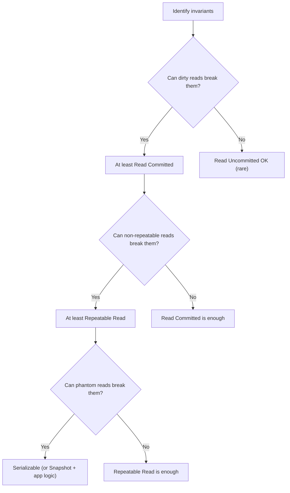

<Hero
  title="Transactions & Isolation Levels"
  description="ACID guarantees and isolation levels (RU, RC, RR, Serializable) and how to choose them for correctness and performance"
  size="large"
/>

## TL;DR

Transactions group operations into all-or-nothing units with ACID guarantees. Isolation levels control how concurrent transactions see each other's changes, preventing anomalies (dirty reads, non-repeatable reads, phantom reads, write skew). Choose the weakest isolation that preserves your invariants. Read Committed is the sweet spot for most OLTP; test under realistic load to verify correctness.

## Learning Objectives

After reading this article, you will be able to:

- Explain ACID properties and isolation anomalies in plain English.
- Choose an isolation level that prevents unacceptable anomalies while maximizing performance.
- Implement locking and MVCC strategies for efficient isolation.
- Test transactions under contention to verify invariants hold.
- Recognize when optimistic concurrency is better than pessimistic locking.

## Motivating Scenario

Your payment system transfers money between accounts. Concurrent transfers risk overselling: if two transfers happen on the same account simultaneously, one might not see the other's debit, resulting in a negative balance. With Read Uncommitted, this invariant breaks silently. With Serializable, every transfer waits for locks—high latency. With Read Committed + explicit locks on hot rows, transfers are fast and safe. The key: understand your invariants, choose the right isolation, and test under load.

## Core Concepts

### ACID Properties

| Property | Definition | Impact |
|----------|-----------|--------|
| **Atomicity** | All-or-nothing: if a transaction fails, all changes roll back | Prevents partial updates |
| **Consistency** | Database moves from one valid state to another | Application ensures invariants (DB enforces constraints) |
| **Isolation** | Concurrent transactions don't interfere with each other | Controlled by isolation level |
| **Durability** | Committed data survives crashes | Write-ahead logging (WAL) |

### Anomalies (Problems Isolation Prevents)

| Anomaly | Definition | Example |
|---------|-----------|---------|
| **Dirty Read** | Read uncommitted (rolled back) data from another transaction | Txn A writes X, Txn B reads X before A commits, A rolls back |
| **Non-repeatable Read** | A read returns different values in same transaction | Txn reads X=1, another txn changes X=2, first txn reads X=2 |
| **Phantom Read** | A range query returns different rows on repeated calls | Txn queries users with balance < 100, another inserts such a user, repeat query sees it |
| **Write Skew** | Two txns update different rows but violate an invariant | Two on-call doctors both book off the same shift without seeing each other |

### Isolation Levels

| Level | Dirty Read | Non-Repeatable | Phantom | Write Skew | Cost |
|-------|-----------|------------------|----------|-----------|------|
| **Read Uncommitted** | Yes | Yes | Yes | Yes | Low |
| **Read Committed** | No | Yes | Yes | Yes | Medium |
| **Repeatable Read** | No | No | Yes | Yes | Medium-High |
| **Serializable** | No | No | No | No | High |
| **Snapshot Isolation** | No | No | No | Yes | Medium-High |

<Figure caption="Decision flow: pick the weakest isolation that prevents unacceptable anomalies.">

</Figure>

### Implementation: Locking vs. MVCC

**Pessimistic Locking:**
- Acquire locks before reading/writing.
- Lock types: shared (read), exclusive (write).
- Deadlock risk: two txns waiting for each other's locks.
- High latency if contention is high.

**Optimistic Concurrency (MVCC):**
- Each txn gets a snapshot of data at transaction start.
- Readers never block writers (and vice versa).
- On commit, check for conflicts; if found, abort and retry.
- Better latency with low contention; higher abort rate under high contention.

PostgreSQL uses MVCC; MySQL InnoDB uses both (row-level locking + MVCC).

## Practical Example: Testing Isolation Levels

<Tabs>
  <TabItem value="sql" label="SQL (PostgreSQL)">
```sql
-- Test table: accounts with balance
CREATE TABLE accounts (
    id INT PRIMARY KEY,
    name VARCHAR(100),
    balance DECIMAL(10, 2),
    version INT DEFAULT 0  -- For optimistic locking
);

INSERT INTO accounts (id, name, balance) VALUES (1, 'Alice', 1000);
INSERT INTO accounts (id, name, balance) VALUES (2, 'Bob', 1000);

-- Test 1: Dirty Read with Read Uncommitted (rare in practice)
-- Session A:
BEGIN TRANSACTION ISOLATION LEVEL READ UNCOMMITTED;
SELECT balance FROM accounts WHERE id = 1;  -- Should see Alice's balance
-- Session B (concurrent):
BEGIN TRANSACTION ISOLATION LEVEL READ UNCOMMITTED;
UPDATE accounts SET balance = 500 WHERE id = 1;
ROLLBACK;  -- Simulate error
-- Session A:
SELECT balance FROM accounts WHERE id = 1;  -- May have seen 500 (dirty read)
COMMIT;

-- Test 2: Non-repeatable Read with Read Committed
-- Session A:
BEGIN TRANSACTION ISOLATION LEVEL READ COMMITTED;
SELECT balance FROM accounts WHERE id = 1;  -- Sees 1000
-- Session B (concurrent):
BEGIN TRANSACTION ISOLATION LEVEL READ COMMITTED;
UPDATE accounts SET balance = 800 WHERE id = 1;
COMMIT;
-- Session A:
SELECT balance FROM accounts WHERE id = 1;  -- Sees 800 (non-repeatable read)
COMMIT;

-- Test 3: Phantom Read with Repeatable Read
-- Session A:
BEGIN TRANSACTION ISOLATION LEVEL REPEATABLE READ;
SELECT COUNT(*) FROM accounts WHERE balance < 500;  -- Sees 0
-- Session B (concurrent):
BEGIN TRANSACTION ISOLATION LEVEL REPEATABLE READ;
INSERT INTO accounts (id, name, balance) VALUES (3, 'Charlie', 100);
COMMIT;
-- Session A:
SELECT COUNT(*) FROM accounts WHERE balance < 500;  -- Sees 1 (phantom read)
COMMIT;

-- Test 4: Write Skew (Serializable prevents this)
-- Invariant: At least one on-call doctor per shift
-- Session A:
BEGIN TRANSACTION ISOLATION LEVEL SERIALIZABLE;
SELECT COUNT(*) FROM doctors WHERE shift = 'A' AND on_call = true;  -- Sees 1
UPDATE doctors SET on_call = false WHERE id = 1 AND shift = 'A';
COMMIT;
-- Session B (concurrent, started before A):
BEGIN TRANSACTION ISOLATION LEVEL SERIALIZABLE;
SELECT COUNT(*) FROM doctors WHERE shift = 'A' AND on_call = true;  -- Sees 1
UPDATE doctors SET on_call = false WHERE id = 2 AND shift = 'A';
-- Attempt to COMMIT → blocked or aborted (Serializable prevents write skew)
COMMIT;

-- Test 5: Optimistic Locking (application-level)
-- SELECT version before update
BEGIN TRANSACTION;
SELECT balance, version FROM accounts WHERE id = 1;  -- balance=1000, version=0
UPDATE accounts SET balance = 950, version = version + 1 WHERE id = 1 AND version = 0;
-- If concurrent update happened, version != 0 and UPDATE affects 0 rows → abort
COMMIT;
```
  </TabItem>

  <TabItem value="python" label="Python">
```python
from typing import Dict, List, Tuple
from dataclasses import dataclass
from enum import Enum

class IsolationLevel(Enum):
    READ_UNCOMMITTED = "READ_UNCOMMITTED"
    READ_COMMITTED = "READ_COMMITTED"
    REPEATABLE_READ = "REPEATABLE_READ"
    SERIALIZABLE = "SERIALIZABLE"

@dataclass
class Account:
    id: int
    name: str
    balance: float
    version: int = 0  # For optimistic locking

class Transaction:
    def __init__(self, txn_id: int, isolation_level: IsolationLevel):
        self.txn_id = txn_id
        self.isolation_level = isolation_level
        self.snapshot: Dict[int, Account] = {}  # MVCC snapshot
        self.lock_type: Dict[int, str] = {}  # "read" or "write"
        self.written: Dict[int, Account] = {}  # Writes not yet committed
        self.is_committed = False

    def read(self, account_id: int, accounts: Dict[int, Account], all_txns: List["Transaction"]) -> float:
        """Read with isolation guarantees."""
        if self.isolation_level == IsolationLevel.READ_UNCOMMITTED:
            # Can read dirty (uncommitted) data
            return accounts[account_id].balance

        elif self.isolation_level == IsolationLevel.READ_COMMITTED:
            # Use snapshot of committed data at read time
            for txn in all_txns:
                if txn.is_committed and txn.written.get(account_id):
                    self.snapshot[account_id] = txn.written[account_id]
            return self.snapshot.get(account_id, accounts[account_id]).balance

        elif self.isolation_level in [IsolationLevel.REPEATABLE_READ, IsolationLevel.SERIALIZABLE]:
            # Snapshot isolation: consistent view from txn start
            if account_id not in self.snapshot:
                self.snapshot[account_id] = Account(
                    accounts[account_id].id,
                    accounts[account_id].name,
                    accounts[account_id].balance,
                    accounts[account_id].version
                )
            return self.snapshot[account_id].balance

    def write(self, account_id: int, new_balance: float, accounts: Dict[int, Account]):
        """Write locally; apply on commit."""
        if self.isolation_level == IsolationLevel.SERIALIZABLE:
            # Pessimistic: acquire exclusive lock
            self.lock_type[account_id] = "write"

        # Store write locally
        self.written[account_id] = Account(
            accounts[account_id].id,
            accounts[account_id].name,
            new_balance,
            accounts[account_id].version + 1
        )
        print(f"[Txn {self.txn_id}] Wrote account {account_id}: {new_balance} (version {self.written[account_id].version})")

    def commit(self, accounts: Dict[int, Account], all_txns: List["Transaction"]) -> bool:
        """Commit and check for conflicts."""
        print(f"[Txn {self.txn_id}] Attempting commit...")

        # Check for write-write conflicts (optimistic locking)
        for account_id, new_account in self.written.items():
            existing = accounts[account_id]
            if new_account.version != existing.version + 1:
                print(f"[Txn {self.txn_id}] CONFLICT on account {account_id}: version mismatch")
                return False  # Abort

        # No conflicts, apply writes
        for account_id, new_account in self.written.items():
            accounts[account_id] = new_account

        self.is_committed = True
        print(f"[Txn {self.txn_id}] COMMITTED")
        return True

    def rollback(self):
        """Abort transaction."""
        self.written.clear()
        self.lock_type.clear()
        print(f"[Txn {self.txn_id}] ROLLED BACK")

# Simulation
def simulate_concurrent_transfers():
    print("=== Transaction Isolation Test ===\n")

    accounts = {
        1: Account(1, "Alice", 1000),
        2: Account(2, "Bob", 1000),
    }

    print("--- Scenario: Concurrent transfers (transfer $100 from Alice to Bob) ---")

    # Two concurrent transactions using different isolation levels
    txn_a = Transaction(1, IsolationLevel.READ_COMMITTED)
    txn_b = Transaction(2, IsolationLevel.READ_COMMITTED)

    # Txn A: Read Alice's balance, deduct $100
    print("\nTxn A: Reads Alice's balance")
    balance_a = txn_a.read(1, accounts, [])
    print(f"  Balance: {balance_a}")

    # Txn B: Concurrently, also reads Alice's balance
    print("\nTxn B: Reads Alice's balance")
    balance_b = txn_b.read(1, accounts, [])
    print(f"  Balance: {balance_b}")

    # Txn A: Writes deduction
    print("\nTxn A: Deducts $100")
    txn_a.write(1, balance_a - 100, accounts)

    # Txn B: Also writes deduction (lost update)
    print("\nTxn B: Deducts $100")
    txn_b.write(1, balance_b - 100, accounts)

    # Try to commit both
    print("\nCommit phase:")
    success_a = txn_a.commit(accounts, [txn_b])
    success_b = txn_b.commit(accounts, [txn_a])

    if not success_b:
        print("  → Lost update prevented by optimistic locking!")
        txn_b.rollback()
    else:
        print(f"  ⚠ WARNING: Lost update! Final balance = {accounts[1].balance} (should be 800)")

    # Now test with explicit locks (pessimistic)
    print("\n--- Scenario: With explicit locks (Serializable) ---")
    accounts[1] = Account(1, "Alice", 1000)

    txn_c = Transaction(3, IsolationLevel.SERIALIZABLE)
    txn_d = Transaction(4, IsolationLevel.SERIALIZABLE)

    print("\nTxn C: Acquires lock, reads Alice, deducts $100")
    txn_c.lock_type[1] = "write"  # Acquire lock
    balance_c = txn_c.read(1, accounts, [])
    txn_c.write(1, balance_c - 100, accounts)

    print("\nTxn D: Tries to read Alice (blocked by C's lock)")
    print("  → Waiting for lock...\n")

    print("Txn C: Commits")
    txn_c.commit(accounts, [txn_d])

    print("\nTxn D: Lock released, acquires lock, reads Alice, deducts $100")
    balance_d = txn_d.read(1, accounts, [])
    txn_d.write(1, balance_d - 100, accounts)
    txn_d.commit(accounts, [txn_c])

    print(f"\nFinal balance: {accounts[1].balance} (correct!)")

if __name__ == "__main__":
    simulate_concurrent_transfers()
```
  </TabItem>

  <TabItem value="nodejs" label="Node.js">
```javascript
class Transaction {
  constructor(txnId, isolationLevel) {
    this.txnId = txnId;
    this.isolationLevel = isolationLevel; // "READ_COMMITTED", "SERIALIZABLE", etc.
    this.snapshot = {}; // MVCC snapshot
    this.lockType = {}; // "read" or "write"
    this.written = {}; // Writes not yet committed
    this.isCommitted = false;
  }

  read(accountId, accounts, allTxns) {
    if (this.isolationLevel === "READ_UNCOMMITTED") {
      return accounts[accountId].balance;
    } else if (this.isolationLevel === "READ_COMMITTED") {
      for (const txn of allTxns) {
        if (txn.isCommitted && txn.written[accountId]) {
          this.snapshot[accountId] = txn.written[accountId];
        }
      }
      const account = this.snapshot[accountId] || accounts[accountId];
      return account.balance;
    } else if (
      this.isolationLevel === "REPEATABLE_READ" ||
      this.isolationLevel === "SERIALIZABLE"
    ) {
      if (!this.snapshot[accountId]) {
        this.snapshot[accountId] = { ...accounts[accountId] };
      }
      return this.snapshot[accountId].balance;
    }
  }

  write(accountId, newBalance, accounts) {
    if (this.isolationLevel === "SERIALIZABLE") {
      this.lockType[accountId] = "write";
    }

    this.written[accountId] = {
      ...accounts[accountId],
      balance: newBalance,
      version: accounts[accountId].version + 1,
    };

    console.log(
      `[Txn ${this.txnId}] Wrote account ${accountId}: ${newBalance} (version ${this.written[accountId].version})`
    );
  }

  commit(accounts, allTxns) {
    console.log(`[Txn ${this.txnId}] Attempting commit...`);

    for (const [accountId, newAccount] of Object.entries(this.written)) {
      const existing = accounts[accountId];
      if (newAccount.version !== existing.version + 1) {
        console.log(
          `[Txn ${this.txnId}] CONFLICT on account ${accountId}: version mismatch`
        );
        return false;
      }
    }

    for (const [accountId, newAccount] of Object.entries(this.written)) {
      accounts[accountId] = newAccount;
    }

    this.isCommitted = true;
    console.log(`[Txn ${this.txnId}] COMMITTED`);
    return true;
  }

  rollback() {
    this.written = {};
    this.lockType = {};
    console.log(`[Txn ${this.txnId}] ROLLED BACK`);
  }
}

// Simulation
function simulateConcurrentTransfers() {
  console.log("=== Transaction Isolation Test ===\n");

  let accounts = {
    1: { id: 1, name: "Alice", balance: 1000, version: 0 },
    2: { id: 2, name: "Bob", balance: 1000, version: 0 },
  };

  console.log("--- Scenario: Concurrent transfers ---");

  const txnA = new Transaction(1, "READ_COMMITTED");
  const txnB = new Transaction(2, "READ_COMMITTED");

  console.log("\nTxn A: Reads Alice's balance");
  const balanceA = txnA.read(1, accounts, []);
  console.log(`  Balance: ${balanceA}`);

  console.log("\nTxn B: Reads Alice's balance");
  const balanceB = txnB.read(1, accounts, []);
  console.log(`  Balance: ${balanceB}`);

  console.log("\nTxn A: Deducts $100");
  txnA.write(1, balanceA - 100, accounts);

  console.log("\nTxn B: Deducts $100");
  txnB.write(1, balanceB - 100, accounts);

  console.log("\nCommit phase:");
  const successA = txnA.commit(accounts, [txnB]);
  const successB = txnB.commit(accounts, [txnA]);

  if (!successB) {
    console.log("  → Lost update prevented by optimistic locking!");
    txnB.rollback();
  } else {
    console.log(
      `  ⚠ WARNING: Lost update! Final balance = ${accounts[1].balance} (should be 800)`
    );
  }

  console.log(
    `\nFinal balance: ${accounts[1].balance} (correct with optimistic locking!)`
  );
}

simulateConcurrentTransfers();
```
  </TabItem>
</Tabs>

## When to Use / When NOT to Use

<Vs items={[
{label: "Stronger Isolation (Serializable)", points: [
      "Critical financial transactions (fund transfers, account updates)",
      "Inventory updates with low concurrency (can afford lock wait time)",
      "Unique constraint enforcement (email address, username) with high write rate",
      "Invariants that cannot be expressed as row-level constraints",
      "Low-concurrency systems where lock contention is rare"
    ]},
{label: "Weaker Isolation (Read Committed)", points: [
      "High-concurrency OLTP systems where lock contention is costly",
      "Analytic queries that can tolerate stale reads",
      "Invariants that can be enforced at application level (idempotent ops)",
      "Systems using MVCC where write skew is acceptable",
      "Read-heavy workloads (locking has minimal benefit)"
    ]}
]} highlight={[0, 1]} />

## Patterns & Pitfalls

<Showcase sections={[
  {
    label: "Lost Update Prevention",
    body: `Optimistic locking (version numbers) detects conflicting writes at commit time. Pessimistic locking (exclusive locks) prevents conflicts upfront. Hybrid: lock hot rows pessimistically, use optimistic for others.`
  },
  {
    label: "Deadlock Detection and Recovery",
    body: `When two txns wait for each other's locks, a deadlock occurs. Most databases detect this and abort one txn. Retry with exponential backoff and random jitter to avoid thundering herd.`
  },
  {
    label: "Snapshot Isolation for Read-Heavy Workloads",
    body: `MVCC (multi-version concurrency control) lets readers see a consistent snapshot without blocking writers. Write conflicts are detected on commit. Great for high-concurrency reads with occasional conflicts.`
  },
  {
    label: "Pitfall: Long-Running Transactions",
    body: `Long txns hold locks and bloat MVCC storage. Keep transactions short: batch operations, minimize round-trips. Use connection pools to prevent txn hoarding.`
  },
  {
    label: "Pitfall: Transaction Size",
    body: `Txns that modify too many rows risk lock contention and timeouts. Break large updates into batches, commit frequently, and monitor lock wait times.`
  },
  {
    label: "Testing Under Contention",
    body: `Test critical txns with realistic concurrency: many clients, concurrent updates to same rows, network delays. Jepsen or similar tools help find isolation bugs under failure scenarios.`
  }
]} />

## Design Review Checklist

<Checklist items={[
  "Have you documented all invariants that transactions must preserve?",
  "Have you identified which anomalies (dirty read, phantom, write skew) would break invariants?",
  "Have you chosen an isolation level and justified the choice?",
  "Are critical hot rows locked pessimistically to avoid contention?",
  "Are long-running transactions broken into smaller, faster txns?",
  "Have you tested under realistic concurrency (load test)?",
  "Is deadlock detection enabled and retries implemented?",
  "Are transaction logs and monitoring configured to detect anomalies?",
  "Have you tested recovery after a crash (durability)?",
  "Is the isolation level clearly documented in code and runbooks?"
]} />

## Self-Check

Before choosing an isolation level:

1. **Invariants**: What invariants must hold? Can weak isolation preserve them with application-level checks?

2. **Contention**: How many concurrent transactions update the same rows? High contention favors weaker isolation (less lock wait).

3. **Latency SLO**: Can txns tolerate 50-500ms lock waits? If not, use Read Committed with optimistic locking.

4. **Write rate**: High write rate with weak isolation risks conflicts and retries. Test to find the sweet spot.

## Next Steps

- **Document invariants**: List all critical business rules that transactions must preserve.
- **Profile access patterns**: Identify hot rows and high-concurrency areas.
- **Choose isolation level**: Start with Read Committed; upgrade to Serializable if anomalies occur.
- **Implement retries**: Handle transaction aborts (deadlocks, conflicts) with exponential backoff.
- **Load test**: Verify behavior under realistic concurrency before deploying.
- **Monitor**: Track lock waits, transaction aborts, and anomaly detection metrics.

## References

1. <a href="https://www.postgresql.org/docs/current/transaction-iso.html" target="_blank" rel="nofollow noopener noreferrer">PostgreSQL: Transaction Isolation Levels ↗️</a>
2. <a href="https://dev.mysql.com/doc/refman/8.0/en/innodb-transaction-isolation-levels.html" target="_blank" rel="nofollow noopener noreferrer">MySQL InnoDB: Isolation Levels ↗️</a>
3. <a href="https://jepsen.io/analyses" target="_blank" rel="nofollow noopener noreferrer">Jepsen: Database Consistency Analyses ↗️</a>
4. <a href="https://www.microsoft.com/en-us/research/publication/serializable-isolation-for-snapshot-databases/" target="_blank" rel="nofollow noopener noreferrer">Serializable Isolation for Snapshot Databases ↗️</a>
