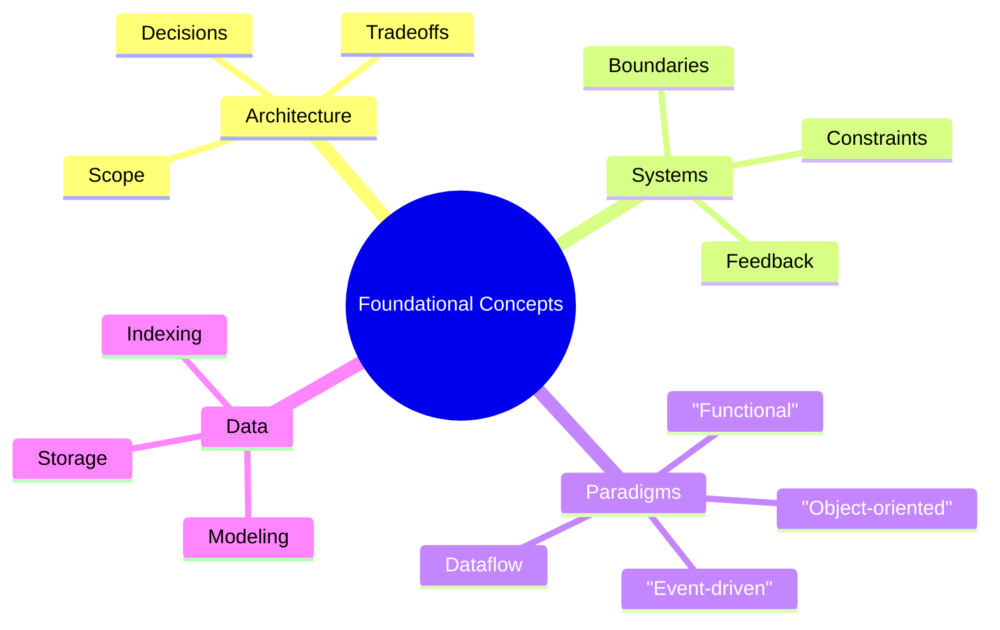

import Head from "@docusaurus/Head";
import DocCardList from "@theme/DocCardList";
import { useCurrentSidebarCategory } from "@docusaurus/theme-common";
import Figure from "@site/src/components/Figure";

# Foundational Concepts

<Head>
  
  
</Head>

Start here to ground yourself in the essentials every architect and senior engineer should internalize before diving into patterns and scale. This section builds a shared vocabulary and a set of mental models that the rest of the manual assumes. It frames what we mean by <a href="./what-is-software-architecture/" >software architecture</a>, how to think in <a href="./system-thinking-basics/" >systems</a>, and which <a href="./programming-paradigms/" >programming paradigms</a> and <a href="./data-fundamentals/" >data foundations</a> shape day‑to‑day design decisions.

> “Form follows function.” — Louis Sullivan

What you’ll get:

- Architecture vs. design: scope, time horizons, and trade‑offs (see <a href="./what-is-software-architecture/architecture-vs-design-vs-implementation/" >comparison</a>)
- Systems thinking: boundaries, feedback loops, constraints (start with <a href="./system-thinking-basics/" >basics</a>)
- Programming paradigms: object‑oriented, functional, event‑driven/reactive, and dataflow (overview: <a href="./programming-paradigms/" >paradigms</a>)
- Distributed systems basics: failure modes, coordination, and <a href="./basic-distributed-systems-concepts/" >consistency & resiliency</a>
- Data fundamentals: modeling, storage, indexing, and access patterns (see <a href="./data-fundamentals/" >data fundamentals</a>)

How to use this section:

- Start with a grounding of what software architecture is and is not (see <a href="./what-is-software-architecture/" >overview</a>) so your decisions have crisp scope and intent.
- Practice systems thinking to draw boundaries, identify feedback loops, and reason about constraints, capacity, and change (<a href="./system-thinking-basics/" >learn more</a>).
- Rehearse multiple programming paradigms to expand your solution space and choose the right mental model for a problem (<a href="./programming-paradigms/" >guide</a>).
- Revisit data fundamentals early—data shape and evolution often dominate architectural trade‑offs later (<a href="./data-fundamentals/" >guide</a>).

<Figure caption="A mind map overview of foundational concepts: architecture, systems thinking, paradigms, and data.">

</Figure>

Related topics:

- [What is software architecture](./what-is-software-architecture/)
- [System thinking basics](./system-thinking-basics/)
- [Programming paradigms](./programming-paradigms/)
- [Basic distributed systems concepts](./basic-distributed-systems-concepts/)
- [Data fundamentals](./data-fundamentals/)

<DocCardList items={useCurrentSidebarCategory().items} />

## References

<!-- markdownlint-disable MD033 -->

1. <a
     href="https://martinfowler.com/architecture/"
     target="_blank"
     rel="nofollow noopener noreferrer"
   >
     Martin Fowler, Architecture ↗️
   </a>
2. <a href="https://12factor.net/" target="_blank" rel="nofollow noopener noreferrer">The Twelve‑Factor App ↗️</a>
   <!-- markdownlint-enable MD033 -->
