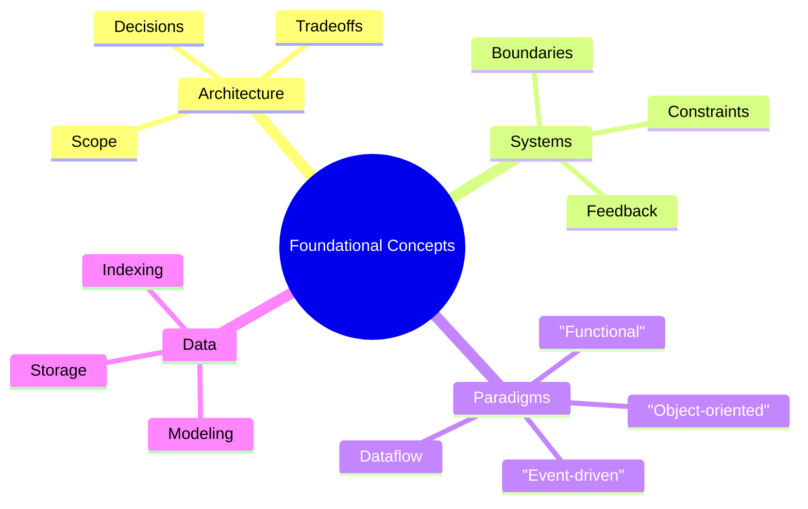

import DocCardList from "@theme/DocCardList";
import { useCurrentSidebarCategory } from "@docusaurus/theme-common";
import Figure from "@site/src/components/Figure";

# Foundational Concepts

Start here to ground yourself in the essentials every architect and senior engineer should internalize before diving into patterns and scale. This section builds a shared vocabulary and a set of mental models that the rest of the manual assumes. It frames what we mean by software architecture, how to think in systems, and which programming paradigms and data foundations shape day‑to‑day design decisions.

> “Form follows function.” — Louis Sullivan

What you’ll get:

- Architecture vs. design: scope, time horizons, and trade‑offs
- Systems thinking: boundaries, feedback loops, constraints
- Programming paradigms: object‑oriented, functional, event‑driven/reactive, and dataflow
- Distributed systems basics: failure modes, consistency, coordination, resiliency
- Data fundamentals: modeling, storage, indexing, and access patterns

How to use this section:

- Start with a grounding of what software architecture is and is not, so your decisions have crisp scope and intent.
- Practice system thinking to draw boundaries, identify feedback loops, and reason about constraints, capacity, and change.
- Rehearse multiple programming paradigms to expand your solution space and choose the right mental model for a problem.
- Revisit data fundamentals early—data shape and evolution often dominate architectural trade‑offs later.

<Figure caption="A mind map overview of foundational concepts: architecture, systems thinking, paradigms, and data.">

</Figure>

Related topics:

- [What is software architecture](./what-is-software-architecture/)
- [System thinking basics](./system-thinking-basics/)
- [Programming paradigms](./programming-paradigms/)

<DocCardList items={useCurrentSidebarCategory().items} />

## References

<!-- markdownlint-disable MD033 -->

1. <a
     href="https://martinfowler.com/architecture/"
     target="_blank"
     rel="nofollow noopener noreferrer"
   >
     Martin Fowler, Architecture ↗️
   </a>
2. <a href="https://12factor.net/" target="_blank" rel="nofollow noopener noreferrer">The Twelve‑Factor App ↗️</a>
   <!-- markdownlint-enable MD033 -->
