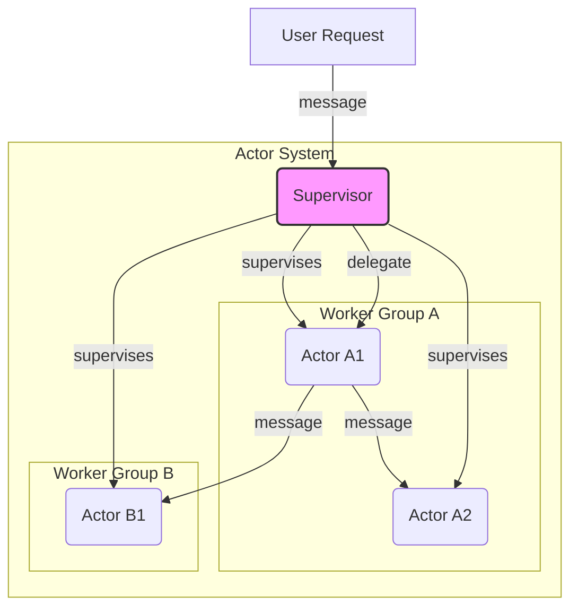
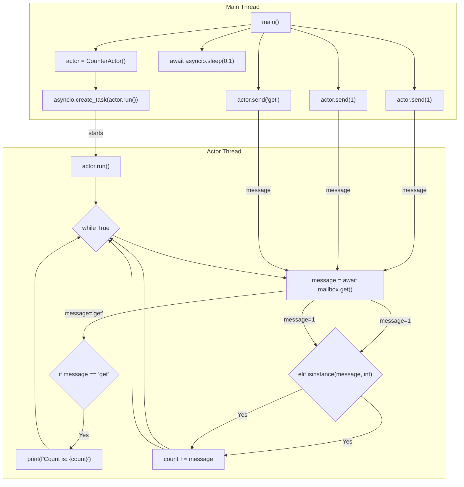

title: "Actor Model"
description: "Isolated actors communicating via async messages—building blocks for concurrent, resilient systems."
sidebar_position: 7
hide_title: true
---

<Hero
  title="Actor Model"
  description="Isolated actors with message passing, supervision, and backpressure for concurrency and resilience"
  size="large"
/>

<Head>
  <meta name="description" content="Isolated actors communicating via async messages—building blocks for concurrent, resilient systems." />
  <meta property="og:title" content="Actor Model" />
  <meta property="og:description" content="Isolated actors communicating via async messages—building blocks for concurrent, resilient systems." />
  <meta property="og:image" content="https://archman.dev/img/archman-social-card.webp" />
  <meta name="twitter:card" content="summary_large_image" />
  
  
</Head>

The Actor Model is a mathematical model of concurrent computation that treats "actors" as the universal primitives of a system. An actor is an independent computational entity that communicates with other actors exclusively by exchanging messages. Each actor has a private state, which it can modify only in response to a message, and a mailbox to buffer incoming messages. This model provides a powerful foundation for building highly concurrent, distributed, and fault-tolerant systems.

> "Everything is an actor. An actor is a computational entity that, in response to a message it receives, can concurrently: send a finite number of messages to other actors; create a finite number of new actors; designate the behavior to be used for the next message it receives."
> — Carl Hewitt

<Figure caption="Actor System Hierarchy: A supervisor manages worker actors, delegating tasks and handling failures.">

</Figure>

## Core ideas

- **Isolation (No Shared State)**: Actors do not share memory. The internal state of an actor is completely encapsulated and can only be modified by the actor itself. This eliminates the need for locks and other complex synchronization mechanisms.
- **Asynchronous Messaging**: Communication is done by sending immutable messages to an actor's unique address. Message passing is asynchronous and non-blocking.
- **Mailbox**: Each actor has a mailbox (a queue) where incoming messages are stored until the actor is ready to process them. This provides a natural mechanism for backpressure.
- **Behavior**: An actor processes one message at a time, and can change its behavior for the next message it processes. This allows for stateful, finite-state-machine-like logic.
- **Supervision**: Actors form hierarchies. A parent actor can supervise its children, deciding how to handle their failures (e.g., restart, stop, or escalate). This "let it crash" philosophy is key to building resilient systems.

## Examples

These examples demonstrate the basic concept of an actor as an isolated process with a message queue, not a full-fledged, fault-tolerant implementation like Akka or Erlang/OTP.

<Figure caption="Sequential call flow for the counter actor example.">

</Figure>

<Tabs groupId="lang" queryString>
  <TabItem value="python" label="Python (asyncio)">
```python title="actor.py" showLineNumbers
import asyncio

class CounterActor:
    def __init__(self):
        self._count = 0
        self._mailbox = asyncio.Queue()

    async def run(self):
        """The actor's main processing loop."""
        while True:
            message = await self._mailbox.get()
            if message == "get":
                print(f"Count is: {self._count}")
            elif isinstance(message, int):
                self._count += message
            self._mailbox.task_done()

    def send(self, message):
        """Send a message to the actor's mailbox."""
        self._mailbox.put_nowait(message)

async def main():
    actor = CounterActor()
    # Start the actor's processing loop in the background
    asyncio.create_task(actor.run())

    actor.send(1)
    actor.send(1)
    actor.send("get")
    await asyncio.sleep(0.1) # Allow time for processing

if __name__ == "__main__":
    asyncio.run(main())
```
  </TabItem>
  <TabItem value="go" label="Go (Goroutine)">
```go title="actor.go" showLineNumbers
package main

import (
    "fmt"
    "sync"
)

// An Actor is a goroutine that processes messages from a channel.
type Actor struct {
    mailbox chan interface{}
    wg      *sync.WaitGroup
    state   int
}

func NewActor(wg *sync.WaitGroup) *Actor {
    return &Actor{
        mailbox: make(chan interface{}, 100), // Bounded mailbox
        wg:      wg,
        state:   0,
    }
}

// Run starts the actor's message processing loop.
func (a *Actor) Run() {
    defer a.wg.Done()
    for msg := range a.mailbox {
        switch m := msg.(type) {
        case int:
            a.state += m
        case string:
            if m == "get" {
                fmt.Printf("State is: %d\n", a.state)
            }
        }
    }
}

// Send posts a message to the actor's mailbox.
func (a *Actor) Send(msg interface{}) {
    a.mailbox <- msg
}

func main() {
    var wg sync.WaitGroup
    actor := NewActor(&wg)

    wg.Add(1)
    go actor.Run()

    actor.Send(1)
    actor.Send(1)
    actor.Send("get")

    close(actor.mailbox) // Signal actor to terminate
    wg.Wait()            // Wait for actor to finish
}
```
  </TabItem>
  <TabItem value="node" label="Node.js (Worker Threads)">
```javascript title="main.mjs" showLineNumbers
// main.mjs - The main thread that creates and communicates with the actor.
import { Worker } from 'node:worker_threads';

const actor = new Worker(new URL('./actor.mjs', import.meta.url));

actor.on('message', (msg) => console.log(`Actor state: ${msg.count}`));

// Send messages to the actor
actor.postMessage({ type: 'increment', payload: 5 });
actor.postMessage({ type: 'get' });

setTimeout(() => actor.terminate(), 500);
```
```javascript title="actor.mjs" showLineNumbers
// actor.mjs - The worker thread acting as an actor.
import { parentPort } from 'node:worker_threads';

let state = { count: 0 };

parentPort.on('message', (msg) => {
    switch (msg.type) {
        case 'increment':
            state.count += msg.payload;
            break;
        case 'get':
            parentPort.postMessage(state);
            break;
        default:
            console.log('Unknown message type');
    }
});
```
  </TabItem>
</Tabs>

<Vs highlight={[0,1,0,0]} title="When to Use vs. When to Reconsider"
  items={[
{
    label: "When to Use",
    points: [
"**Highly concurrent systems**: Ideal for applications with thousands or millions of concurrent activities, like chat servers, IoT platforms, or gaming backends.",
        "**Fault-tolerant, resilient applications**: The supervision hierarchy allows for robust, self-healing systems that can gracefully handle failures.",
        "**Distributed state management**: When you need to manage distributed, mutable state without the complexity of distributed locks or transactions.",
    ],
    highlightTone: "warning"
  },
{
    label: "Location Transparency",
    points: [
"**Highly concurrent systems**: Ideal for applications with thousands or millions of concurrent activities, like chat servers, IoT platforms, or gaming backends.",
        "**Fault-tolerant, resilient applications**: The supervision hierarchy allows for robust, self-healing systems that can gracefully handle failures.",
        "**Distributed state management**: When you need to manage distributed, mutable state without the complexity of distributed locks or transactions.",
    ],
    highlightTone: "info"
  },
{
    label: "Mailbox Configuration",
    points: [
"**Highly concurrent systems**: Ideal for applications with thousands or millions of concurrent activities, like chat servers, IoT platforms, or gaming backends.",
        "**Fault-tolerant, resilient applications**: The supervision hierarchy allows for robust, self-healing systems that can gracefully handle failures.",
        "**Distributed state management**: When you need to manage distributed, mutable state without the complexity of distributed locks or transactions.",
    ],
    highlightTone: "info"
  },
{
    label: "Supervision Strategy",
    points: [
"**Highly concurrent systems**: Ideal for applications with thousands or millions of concurrent activities, like chat servers, IoT platforms, or gaming backends.",
        "**Fault-tolerant, resilient applications**: The supervision hierarchy allows for robust, self-healing systems that can gracefully handle failures.",
        "**Distributed state management**: When you need to manage distributed, mutable state without the complexity of distributed locks or transactions.",
    ],
    highlightTone: "info"
  },
{
    label: "Message Serialization",
    points: [
"**Highly concurrent systems**: Ideal for applications with thousands or millions of concurrent activities, like chat servers, IoT platforms, or gaming backends.",
        "**Fault-tolerant, resilient applications**: The supervision hierarchy allows for robust, self-healing systems that can gracefully handle failures.",
        "**Distributed state management**: When you need to manage distributed, mutable state without the complexity of distributed locks or transactions.",
    ],
    highlightTone: "info"
  },
{
    label: "Observability",
    points: [
"**Highly concurrent systems**: Ideal for applications with thousands or millions of concurrent activities, like chat servers, IoT platforms, or gaming backends.",
        "**Fault-tolerant, resilient applications**: The supervision hierarchy allows for robust, self-healing systems that can gracefully handle failures.",
        "**Distributed state management**: When you need to manage distributed, mutable state without the complexity of distributed locks or transactions.",
    ],
    highlightTone: "info"
  },
{
    label: "Security",
    points: [
"**Highly concurrent systems**: Ideal for applications with thousands or millions of concurrent activities, like chat servers, IoT platforms, or gaming backends.",
        "**Fault-tolerant, resilient applications**: The supervision hierarchy allows for robust, self-healing systems that can gracefully handle failures.",
        "**Distributed state management**: When you need to manage distributed, mutable state without the complexity of distributed locks or transactions.",
    ],
    highlightTone: "info"
  }
]} />

<Checklist
  title="Design Review Checklist"
  items={[
    "Is state truly isolated within actors? Is there any 'backdoor' access to shared mutable state?",
    "Are all messages immutable?",
    "Is the supervision hierarchy clearly defined and tested for various failure scenarios?",
    "Is the mailbox strategy (bounded/unbounded, priority) appropriate for the workload?",
    "How are message delivery guarantees (at-most-once, at-least-once) handled if required?",
    "Is there a plan for observing and debugging actor interactions in a distributed environment?",
  ]}
/>

## Related topics

- [Event-Driven & Reactive](/docs/foundational-concepts/programming-paradigms/event-driven-and-reactive)
- [Distributed Systems & Microservices](/docs/distributed-systems-and-microservices)
- [Reliability, Resilience & Performance Engineering](/docs/reliability-resilience-and-performance-engineering)

## References

1.  <a
      href="https://doc.akka.io/docs/akka/current/typed/guide/introduction.html"
      target="_blank"
      rel="nofollow noopener noreferrer"
    >
      Introduction to Akka (A popular Actor System toolkit) ↗️
    </a>
2.  <a
      href="https://www.erlang.org/doc/design_principles/des_princ.html"
      target="_blank"
      rel="nofollow noopener noreferrer"
    >
      Erlang/OTP Design Principles ↗️
    </a>
3.  <a
      href="https://www.brianstorti.com/the-actor-model/"
      target="_blank"
      rel="nofollow noopener noreferrer"
    >
      The Actor Model in 10 Minutes by Brian Storti ↗️
    </a>
4. Hewitt, Meijer and Szyperski: The Actor Model (everything you wanted to know, but were afraid to ask) - A conversation with Carl Hewitt, Erik Meijer, and Clemens Szyperski on the history and impact of the Actor model. Available on YouTube and other platforms.
